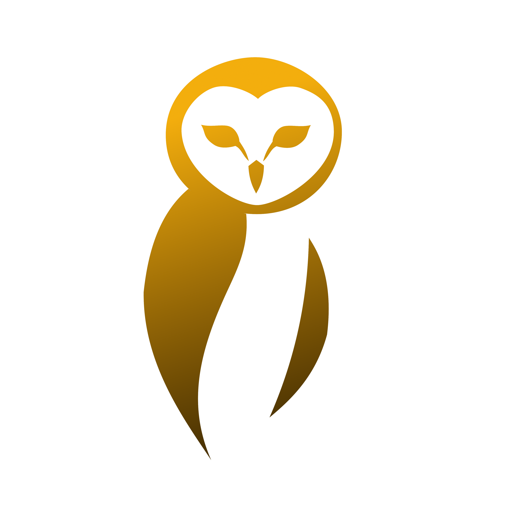

# Owl




Owl is a C++23 game engine built for learning game engine development. It features multiple
graphics, input, and sound backends, an Entity-Component-System architecture, and a scene
editor.

The full generated documentation is available online:
[](https://owl.argawaen.net)

**Documentation pages** ([browse on GitHub](doc/pages)):

- \subpage architecture -- Engine modules, backends, and shader pipeline
- \subpage building -- Prerequisites, presets, testing, and CMake options
- \subpage roadmap -- Planned and completed features by version
- \subpage contributing -- Code style, conventions, and workflow

## Features

-  
  **Rendering** with Slang shaders compiled to SPIR-V
-  **Entity-Component-System** architecture
-  2D physics simulation
-  Sound playback backend
-  Owl Nest scene editor with project management
-  3D model loading
-  
  Cross-platform

## Supported Platforms


| OS      | Architecture | Compilers                      |
|---------|--------------|--------------------------------|
| Linux   | x64, arm64   | GCC 13+, Clang 18+             |
| Windows | x64          | MinGW GCC 14+, MinGW Clang 19+ |

## Backends


| Category | Backends                      |
|----------|-------------------------------|
| Graphics | OpenGL 4.5, Vulkan 1.4+, Null |
| Input    | GLFW, Null                    |
| Sound    | OpenAL, Null                  |

## Quick Start

```bash
# Install Python dependencies (for DepManager and CI tools)
poetry sync --no-root

# Configure and build
cmake --preset linux-gcc-release -S .
cmake --build output/build/linux-gcc-release

# Run tests
ctest --test-dir output/build/linux-gcc-release --output-on-failure
```

See @ref building for the full build guide and all available presets.

## Dependencies

Dependencies are managed by [DepManager](https://github.com/Silmaen/DepManager)

and declared in [depmanager.yml](depmanager.yml). They are automatically downloaded
during CMake configure.

Dependency recipes are maintained in a separate repository:
[OwlDependencies](https://github.com/Silmaen/OwlDependencies).
