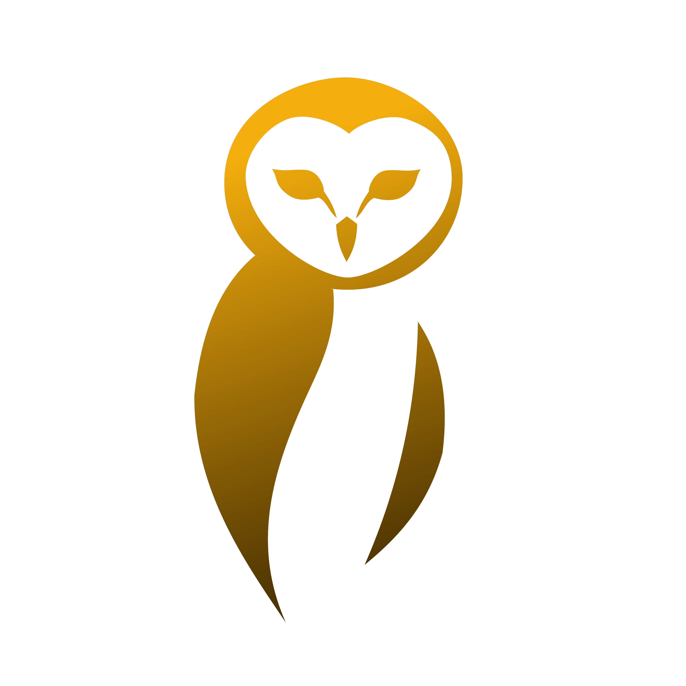

# Owl

Owl aims to be a simple game engine. The main goal of this engine is learning game engine
development.

## Documentation

The full documentation is available on the dedicated
website .

## Platform

We try to be multiplatform and using different compilers:

* Windows `x64`
    * mingw `g++ 14` (and above)
    * mingw `clang++ 19` (and above)
* Linux `x64` & `arm64`
    * Ubuntu `22.04` (glibc 2.35) g++ 12 (and above)
    * Ubuntu `22.04` (glibc 2.35) clang++ 15 (and above)

### backends API

#### inputs

Different inputs backend are available:

* `Null` - for no windowing nor mouse/keyboard/gamepad managed input (for server use)
* `GLFW` - for windowing and user input management using glfw library.

#### graphics

This engine requires a graphic card that supports one of the following renderer:

* `Null` - for no graphic rendering (Server for example)
* `OpenGL` - Use OpenGL 4.5 (you must have Graphics device that supports it. Known that most arm644 device does not
  support it)
* `Vulkan` - Use Vulkan 1.3 (you must have Graphics device that supports it)

#### sound

This engine supports different sound device for either input stream or sound play:

* `Null` - for no sound (Server for example)
* `OpenAL` - Use OpenAL (you must have Sound device that supports it, and the required lib/drivers installed)

## Dependencies

### Dependencies manager

Dependencies are managed by my dependency tool: [DepManger](https://github.com/Silmaen/DepManager)
.

As we are using file based dependency definition in [depmanager.yml](depmanager.yml), the dependency will be
automatically downloaded with the right version during cmake configure step (the depmanager client should be
configured to use a repository that contains the right packages).

Dependencies are hosted by my dependency server [DepManagerServer](https://github.com/Silmaen/DepManagerServer).

Dependencies in the configuration file have explicit version number, that is done on purpose: it then requires
a commit to upgrade (so keep a track of upgrades and keep stable the potential build of old revisions
of this code).

### Dependencies sources

All the dependencies and their recipes for DepManager are available in a separate
repository [OwlDependencies](https://github.com/Silmaen/OwlDependencies).

Most are configured as git submodules.

## Build

To build the engine Cmake (>3.24) is required.

Most user will use one of the cmake's preset defined.

## RoadMap

* [ ] v0.1.0 -- Future -- unordered Ideas & thoughts
    * [ ] sound
        * [ ] moving sound
    * [ ] graphics
        * [ ] HUD display
        * [ ] animated textures.
        * [ ] advanced materials.
        * [ ] simple lighting.
    * [ ] Gameplay
        * [ ] inventory
            * [ ] collectible objets
            * [ ] switches 'key-locked'
        * [ ] enemies
    * [ ] Misc
        * [ ] Different Scene types
            * [ ] Games
            * [ ] Menus
        * [ ] Configurable keymap
        * [ ] asset packing
            * [ ] support for unpack in game runner
    * [ ] Game designer (Owl Map)
        * [ ] menu edition
        * [ ] Node editing
* [ ] v0.0.2
    * [ ] Developers
        * [ ] Public Engine projects should be 3rd party independent
            * [ ] Remove EnTT public dependency
            * [ ] Remove fmt public dependency
            * [ ] Remove ImGui public dependency
        * [ ] Reduce needed public binaries
            * [ ] Work on 3rd party builds for dependencies reduction (more static link)
    * [ ] graphics
        * [ ] backgrounds/skyboxes
    * [ ] Misc
        * [ ] Pausing games
        * [ ] General settings management
    * [ ] Gameplay
        * [ ] Possibility to jump between scenes.
    * [ ] Game designer (Owl Map)
        * [ ] Global game settings
        * [ ] Export 'game' for the game runner (everything needed for the runner to become standalone).
* [X] v0.0.1 -- 2025-02-06 -- First basic Release
    * Minimal Vital: possibility to run very simple games defined in scenes
