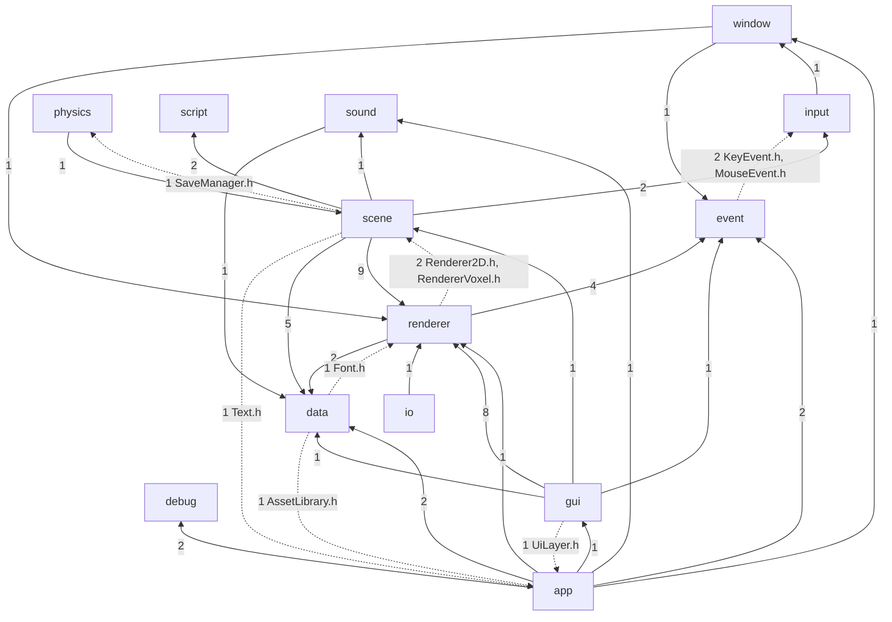

# Audit Owl — constats de l'axe A : architecture du moteur

> Périmètre : `source/owl/public` (196 fichiers, ~28,9 kLOC) et `source/owl/private` (296 fichiers, ~42,4 kLOC),
> branche `Feature/Bench` au commit `45e27892`, 2026-10-05. Lecture seule. Outils lancés via `docker/run.sh`
> (Python 3, clang++, ninja, nm de l'image CI) sur l'arbre `output/build/linux-clang-release` déjà construit.
> Le statut « confirmé » signifie ici « vérifié dans le code ou mesuré par l'auteur ». La contre-vérification
> par un second agent (§7.3 du cadrage) a été faite le 2026-10-05 : voir les lignes « Vérification ».

## Résumé

1. Les 16 modules publics ne forment pas une pile en couches : 10 d'entre eux forment **une seule composante
   fortement connexe** d'includes (mesuré). Supprimer 9 includes suffirait à obtenir un graphe acyclique.
2. `Scene` est l'objet « dieu » du moteur : 2 595 lignes, 61 méthodes, 30 includes vers 9 modules. Il porte en dur
   le gameplay (victoire, mort, joueur, portes de raycast). Il est touché par 42 des 75 commits moteur de 2026.
3. La physique et le script sont des états **globaux statiques liés à « la » scène active**. On ne peut donc
   faire tourner qu'un seul monde à la fois. Hazel, l'ancêtre probable d'Owl, gardait au moins le `b2World` dans la scène.
4. L'ensemble des composants ECS est **fermé à la compilation** : quatre listes tenues à la main, ~10 à 14
   fichiers à modifier par composant. Un jeu tiers ne peut pas déclarer de composant sérialisable.
5. Frontière publique/privée : c'est la grande force du moteur. Box2D, Lua, Taskflow, spdlog, Vulkan, GL, GLFW et OpenAL
   sont invisibles depuis les headers publics (pimpl, façades). Il y a deux exceptions : yaml-cpp fuit dans `Scene.h`
   sans être déclaré au paquet, et ~10 600 symboles tiers sont exportés par `libOwlEngine.so`.
6. `Application` sert de hub de service : 66 appels `Application::get()` dans le moteur, dont 45 servent à trouver
   des dossiers d'assets, la fenêtre ou les polices. Des modules bas (`data`, `renderer`) dépendent donc de `app`.
7. On compte ~25 singletons ou classes à état statique. Leur cycle de vie est réparti entre `main()`, `Application`,
   `Scene::onStartRuntime` et personne.
8. Le style d'API privilégie `shared<>` par défaut (152 contre 20 `uniq<>` dans le public), sans règle sur l'ownership.
   Les factories reposent sur des `switch` de backend et le polymorphisme virtuel est classique (coût négligeable, opinion).
9. Les règles du dépôt sont bien suivies : 482 fichiers sur 489 respectent dossier == namespace et les fonctions
   restent courtes. En revanche, ces règles ne disent rien de la **direction des dépendances**, d'où le point 1.
10. Pistes prioritaires : une pile de couches vérifiée en CI, `Scene` réduit aux données avec des systèmes enregistrés,
    des services par monde, un registre de composants ouvert et une frontière ABI propre (visibilité, pas de YAML public).

## Graphe des dépendances entre modules publics

Mesure : script `deps.py` (scratchpad `axeA/`) lancé par `docker/run.sh python3 -c …`. Il analyse les
`#include` de `source/owl/public/<module>/` vers `public/<autre module>/`. Le nombre sur chaque arête compte
les directives d'include. Les arêtes vers `core` (16 modules sur 16) et `math` (8 modules) sont omises
pour la lisibilité. Les arêtes en pointillés sont celles dont la suppression rend le graphe acyclique (simulation `scc2.py`).



| Indicateur                                | Valeur                                                                      |
|-------------------------------------------|-----------------------------------------------------------------------------|
| Composantes fortement connexes (> 1 nœud) | 1 : {app, data, event, gui, input, physics, renderer, scene, sound, window} |
| Modules hors cycle                        | core, math, debug, io, platform, script                                     |
| Fan-out le plus élevé                     | scene (9 modules), app (8), gui (7)                                         |
| Fan-in le plus élevé (hors core/math)     | renderer (7), event (5), data (5)                                           |
| Includes à retirer pour un DAG            | 9 directives réparties sur 7 arêtes (pointillés ci-dessus)                  |

## Constats

### Gravité haute

```text
ID             : A-01
Axe            : Architecture
Nature         : faiblesse
Gravité        : moyenne (haute avant vérification)
Preuve         : script deps.py (docker/run.sh) → une SCC de 10 modules ; arêtes retour
                 source/owl/public/data/assets/AssetLibrary.h:13 (→ app/Application.h),
                 source/owl/public/scene/component/Text.h:11 (→ app/Application.h, include inutilisé : seul
                 data::fonts::Font est employé, l.25), source/owl/public/renderer/Renderer2D.h:17
                 (→ scene/component/SpriteRenderer.h), source/owl/public/renderer/RendererVoxel.h:14
                 (→ scene/component/VoxelWorld.h), source/owl/public/physics/PhysicCommand.h:12 ↔
                 source/owl/public/scene/SaveManager.h:12, source/owl/public/data/fonts/Font.h:12
                 (→ renderer/gpu/Texture.h), source/owl/public/gui/UiLayer.h:11 (→ app/layer/Layer.h),
                 source/owl/public/event/KeyEvent.h:11 et MouseEvent.h:11 (→ input/*Code.h).
Constat        : Le découpage en modules est nominal, pas structurel. 10 des 16 modules dépendent
                 transitivement les uns des autres : le renderer connaît les composants ECS, `data` connaît
                 l'Application, la physique et la scène s'incluent mutuellement. Retirer 9 includes suffit à
                 obtenir un DAG (simulation scc2.py) : le coût de correction est faible, mais rien n'empêche la
                 régression, faute de règle ou de contrôle CI sur la direction des dépendances.
Comparaison    : Godot impose core → servers → scene → editor (le core n'inclut jamais scene). Bevy rend les
                 cycles impossibles par construction (crates Cargo). Wicked Engine garde wiGraphics sous
                 wiRenderer, lui-même sous wiScene. Hazel n'impose rien non plus (même ADN).
Recommandation : corriger, effort S (casser les 9 includes) + S (contrôle CI de la pile de couches dans CodeStyle)
Statut         : confirmé
Vérification   : arêtes recalculées par grep des includes de public/ : même SCC, les 9 includes retour existent
                 (Text.h:11 inclut bien app/Application.h sans l'utiliser). Gravité ramenée à moyenne : 9 directives
                 suffisent à rompre le cycle, ce qui contredit « nominal, pas structurel » ; c'est une dérive locale.
```

```text
ID             : A-02
Axe            : Architecture
Nature         : faiblesse
Gravité        : haute
Preuve         : source/owl/private/scene/Scene.cpp (2 595 lignes, plus gros fichier du moteur, `wc -l`) ;
                 30 includes vers 9 modules (Scene.cpp:10-46) ; 61 méthodes déclarées dans
                 source/owl/public/scene/Scene.h ; gameplay en dur : Scene.h:391-396 (Status Victory/Death),
                 Scene.cpp:535-566 (texte "Victory!" dessiné par le moteur), Scene.h:150/601 (portes raycast),
                 Scene.h:620-662 (voxel streaming, joueur voxel, toast, HUD) ; Scene::onUpdateRuntime = 211
                 lignes (Scene.cpp:510, fnlen.py) ; churn : 42 des 75 commits touchant source/owl depuis
                 2026-01-01 modifient Scene.cpp (`git log --since=2026-01-01 --name-only -- source/owl`).
Constat        : Scene cumule le conteneur ECS, la hiérarchie, l'ordonnancement des sous-systèmes (scripts,
                 physique, son, triggers, animation) et le rendu de 6 renderers. Elle contient aussi des règles
                 de jeu (victoire/mort, Player, portes, VoxelPlayer). Chaque fonctionnalité passe par ce fichier,
                 qui sert de point de contention : plus de la moitié des commits moteur de l'année y passent.
Comparaison    : Hazel a le même `Scene::OnUpdateRuntime` monolithique (Owl en hérite). Bevy et flecs organisent
                 la frame en systèmes enregistrés par plugin. Godot délègue aux nœuds et aux servers. Wicked
                 découpe `Scene::Update` en fonctions `Run*UpdateSystem` parallélisées par son job system.
Recommandation : corriger, effort L (Scene = données + hiérarchie ; systèmes enregistrés avec phases ;
                 gameplay sorti du moteur vers un module ou le sample)
Statut         : confirmé
Vérification   : `wc -l` = 2 595 ; Status Victory/Death en Scene.h:391-396 ; texte « Victory! » en Scene.cpp:548 et
                 :755 ; `git log --since=2026-01-01` : 42 des 75 commits sur source/owl touchent Scene.cpp. Aucun
                 mécanisme de systèmes enregistrés trouvé.
```

```text
ID             : A-03
Axe            : Architecture
Nature         : risque
Gravité        : moyenne (haute avant vérification)
Preuve         : source/owl/public/scene/Scene.h:16 → renderer/RenderStack.h:11 → renderer/RenderLayer.h:16
                 `#include <yaml-cpp/yaml.h>` ; YAML::Node comme membre (RenderStack.h:35, :116) et dans une
                 virtuelle publique (RenderLayer.h:127 `applyConfig(const YAML::Node&)`) ; AssetScanner.h:87 ;
                 yaml-cpp lié PRIVATE (source/owl/CMakeLists.txt, bloc « PRIVATE third party ») et absent de
                 cmake/config/OwlEngineConfig.cmake.in (seuls EnTT et imgui) et de owl_engine.py:17-19 ;
                 mesure clang++ -E -H : `#include "scene/Scene.h"` tire 31 headers yaml-cpp (hdr.py).
Constat        : Un consommateur du paquet (OwlDrone) qui inclut Scene.h a besoin des headers yaml-cpp, que le
                 paquet ne déclare pas. Pire, il compile du code inline YAML contre sa propre version, alors
                 que libOwlEngine.so exporte celle d'Owl (voir A-10), ce qui ouvre un risque d'ODR. Le moteur
                 possède pourtant déjà une abstraction pimpl `core::Serializer` (Serializer.h:10-18) que
                 RenderStack contourne.
Comparaison    : Les moteurs distribués en SDK (O3DE, Godot GDExtension) n'exposent aucun type de leur
                 parseur de config dans l'API publique.
Recommandation : corriger, effort S/M (RenderLayer::applyConfig sur core::Serializer ; config de pile en pimpl)
Statut         : confirmé (chaîne d'include) / plausible (échec de build chez un consommateur, non reproduit)
Vérification   : chaîne Scene.h:16 → RenderStack.h:11 → RenderLayer.h:16 vérifiée ; yaml-cpp passe par OwlEnginePrivate
                 (CMakeLists.txt:123), lié PRIVATE (:59), absent de OwlEngineConfig.cmake.in. Gravité ramenée à
                 moyenne, alignée sur G-07 (même fuite) : le contournement est trivial (OwlDrone déclare déjà
                 yaml-cpp 0.8.0, la même version) et le risque ODR suppose une version divergente.
```

```text
ID             : A-04
Axe            : Architecture
Nature         : faiblesse
Gravité        : haute
Preuve         : source/owl/public/physics/PhysicCommand.h:146-150 (`static shared<Impl> m_impl;`,
                 `static scene::Scene* m_scene;`) ; source/owl/private/physics/PhysicCommand.cpp:48,60 ;
                 source/owl/private/script/ScriptEngine.cpp:23-32 (`s_impl->activeScene = iScene`) ;
                 liaison faite par Scene.cpp:366 (`PhysicCommand::init(this)`), :417 (`ScriptEngine::init(this)`),
                 :504-506 (shutdown/destroy) ; idem ScreenTransition.h:214-228, UiInputSystem.h:51-53 (statiques).
Constat        : Le monde physique Box2D et la VM Lua sont des singletons statiques pointant vers une scène
                 active unique, par pointeur brut. Deux scènes ne peuvent pas tourner en même temps : aperçu de
                 prefab en jeu, scène de menu au-dessus du niveau, tests parallèles dans un même process,
                 serveur qui simule plusieurs instances. Si une scène est détruite sans `onEndRuntime`, le
                 pointeur reste pendant.
Comparaison    : Hazel garde `b2World* m_PhysicsWorld` comme membre de Scene, donc Owl a régressé sur ce point.
                 Godot attache un « space » physique à chaque World2D/3D via des RID. Bevy et Unity DOTS
                 rangent la physique dans les ressources du World.
Recommandation : corriger, effort M (contexte par scène : PhysicsWorld, ScriptContext, état UI/transition
                 portés par Scene ou un `SceneRuntime`)
Statut         : confirmé
Vérification   : PhysicCommand.h:148-150 et ScriptEngine.cpp:23,32 vérifiés ; `Scene::~Scene() = default` (Scene.cpp:273)
                 ne remet rien à zéro. Nuance : chaque ScriptInstance a son propre lua_State (ScriptInstance.cpp:18-20) ;
                 l'unicité porte sur le pointeur `activeScene` utilisé par tous les bindings (LuaBindings.cpp:30,241).
```

```text
ID             : A-05
Axe            : Architecture
Nature         : faiblesse
Gravité        : haute
Preuve         : source/owl/public/scene/component/components.h : concept `isComponent` (35 `is_same_v`) et
                 tuples `CopiableComponents`, `SerializableComponents`, `OptionalComponents` tenus à la main ;
                 fichiers citant un composant (`grep -rl`) : UiSlider 10, SoundSource 11, RaycastDoor 14 ;
                 components.h modifié dans 16 commits depuis 2026-01-01, gui/component/render.cpp dans 30.
Constat        : Ajouter un composant demande de synchroniser à la main quatre listes, l'inspecteur, les
                 bindings Lua, le scanner d'assets et l'éditeur. Un jeu ou un projet aval ne peut pas
                 enregistrer de composant sérialisable, copiable ou inspectable : il n'a que `NativeScript`.
                 Pour un moteur que l'on veut distribuer en paquet, c'est le principal verrou d'extensibilité.
Comparaison    : Bevy (`#[derive(Component, Reflect)]` + registre de types), flecs (réflexion runtime),
                 EnTT lui-même (`entt::meta`, déjà disponible) et Godot (ClassDB) ont tous un registre ouvert.
Recommandation : corriger, effort M/L (registre runtime : clé, (dé)sérialisation, copie, inspecteur, binding Lua)
Statut         : confirmé
Vérification   : components.h:53-71 (35 `is_same_v`) et trois tuples (:108-136) tenus à la main. Nuance : `Scene::registry`
                 est public, un jeu peut donc poser un composant EnTT arbitraire, mais sans sérialisation, copie ni
                 inspecteur ; « il n'a que NativeScript » est un peu fort, le verrou reste réel.
```

```text
ID             : A-06
Axe            : Architecture
Nature         : force
Gravité        : haute
Preuve         : grep des includes tiers dans source/owl/public : seuls entt, imgui (déclarés publics), yaml-cpp
                 (A-03), debugbreak (Assert.h:18, uniquement si OWL_ENGINE_BUILD) et zeus (expected.h:29, repli)
                 y figurent ; aucun include box2d, lua, taskflow, spdlog, vulkan, glad, GLFW, AL/ ; pimpl :
                 PhysicCommand.h:146, ScriptEngine.h:139, Serializer.h:18, Scheduler (SchedulerImpl privé) ;
                 Log.h:12 n'utilise que <format> (spdlog confiné à private/core/Log.cpp:11) ; enrobages
                 d'en-têtes tiers dans source/owl/private/core/external/.
Constat        : La frontière publique/privée est tenue avec rigueur pour 20 des 22 dépendances. Les backends
                 GPU, son et fenêtre sont entièrement privés. Une application ne voit que des façades Owl, ce
                 qui rend crédible le remplacement de Box2D, Lua ou Taskflow sans casser l'API.
Comparaison    : Mieux que Hazel, dont Log.h expose spdlog et Scene.h Box2D. Comparable à la discipline de Godot.
Recommandation : garder (et étendre à yaml-cpp)
Statut         : confirmé
```

### Gravité moyenne

```text
ID             : A-07
Axe            : Architecture
Nature         : faiblesse
Gravité        : moyenne
Preuve         : `grep -rn "Application::get()" source/owl` → 66 appels dans 22 fichiers ; cibles :
                 getWindow 17, getAssetDirectories 17, getFontLibrary 11, packs 7 ; Application.h:130 (`get()`
                 déréférence s_instance sans contrôle) ; 30 gardes `Application::instanced()` ;
                 source/owl/public/data/assets/AssetLibrary.h:197-266 (template public qui interroge
                 l'Application puis parcourt récursivement le disque à chaque `find`/`list`).
Constat        : L'Application sert de localisateur de services implicite : système de fichiers d'assets,
                 polices, fenêtre, pack et scheduler. Les modules bas en dépendent, d'où une partie de A-01. La
                 résolution d'asset se fait par nom, avec un parcours récursif sans cache, « premier trouvé
                 gagne » entre sous-dossiers. Les 30 gardes `instanced()` montrent que le code compose déjà
                 avec l'absence d'Application (tests).
Comparaison    : Hazel a le même `Application::Get()`. Godot passe par des singletons dédiés (ResourceLoader,
                 FileAccess/PackedData). Bevy injecte `Res<AssetServer>`. Les moteurs récents référencent les
                 assets par GUID, pas par chemin.
Recommandation : corriger, effort M (service AssetFileSystem dédié, pack + dossiers, avec index ; injection
                 explicite) ; à coordonner avec la piste « références d'assets par GUID » (axe K)
Statut         : confirmé
Vérification   : recompté : 66 appels dans 22 fichiers, 30 gardes `instanced()`, `get()` sans contrôle (Application.h:130).
                 Nuance : AssetLibrary met en cache par nom les assets chargés (`m_assets`, `exists()`) ; le parcours
                 récursif n'a lieu qu'au premier chargement d'un nom ou dans `list()`.
```

```text
ID             : A-08
Axe            : Architecture
Nature         : faiblesse
Gravité        : moyenne
Preuve         : états statiques publics : Log.h:149-153, Application.h:420, Input.h:122-124,
                 RenderCommand.h:283, Renderer.h:194-198, SoundCommand.h:222, SoundSystem.h:96,
                 PhysicCommand.h:148, ScriptEngine.h:139, SettingsManager.h:201-205, SaveManager.h:117,
                 ScreenTransition.h:214-228, UiInputSystem.h:51-53, Profiler.h:78, IconBank.h:113,
                 FontPreviewCache.h:47, io/{serial,video}/Manager.h, IFactory::getInstance ; état global
                 privé `g_Data`/`g_state` dans Renderer2D.cpp:117, Renderer3D.cpp:38, RendererVoxel.cpp:43,
                 RendererRaycast.cpp:83, RendererTilemap.cpp:59, BackgroundRenderer.cpp:39 ;
                 cycle de vie : EntryPoint.h (Log), Application.cpp:128-258 et :275-312 (rendu, son, input),
                 Scene.cpp:366/417/504 (physique, script), aucun propriétaire pour SettingsManager,
                 ScreenTransition, UiInputSystem, registre RenderLayerFactory.
Constat        : On compte ~25 singletons ou classes entièrement statiques. L'ordre d'initialisation et de
                 destruction n'est explicite que pour le trio rendu/son/fenêtre (A-20). Les autres vivent jusqu'à
                 la destruction statique, ou d'une scène à l'autre, avec les risques classiques : état qui fuit
                 d'un test à l'autre, ordre de destruction statique, réentrance. Le nommage déroge à la règle
                 maison (`s_` pour les statiques, .claude/rules/cpp-style.md:68) : 10 membres statiques nommés `m_`.
Comparaison    : Hazel et Wicked Engine assument aussi des renderers statiques (`s_Data`, `wi::renderer`).
                 Godot centralise l'enregistrement et la destruction des singletons (`register_*_types` /
                 `unregister_*_types`) ; Bevy n'a aucun état global.
Recommandation : corriger, effort M (un `EngineContext` qui possède et ordonne les sous-systèmes, l'init et le
                 shutdown se lisent en un seul endroit ; les statiques restants deviennent des membres)
Statut         : confirmé
Vérification   : règle `s_` confirmée (.claude/rules/cpp-style.md:68) ; un grep trouve 13 membres statiques nommés `m_`
                 dans public/ (10 annoncés), ce qui renforce le constat. Aucun contre-exemple d'ordonnancement centralisé.
```

```text
ID             : A-09
Axe            : Architecture
Nature         : faiblesse
Gravité        : moyenne
Preuve         : correction clip-space Vulkan copiée dans source/owl/private/renderer/CameraOrtho.cpp:30-37,
                 source/owl/private/scene/SceneCamera.cpp:50-56, source/owl/private/renderer/CameraEditor.cpp:84-90 ;
                 seule CameraOrtho inverse aussi la translation `m_projection(1, 3)` (l.36) ;
                 source/owl/private/gui/UiLayer.cpp:19 inclut `renderer/gpu/vulkan/internal/VulkanHandler.h`
                 et teste le backend 6 fois (l.115-209) ; 9 `switch` de backend dans les factories
                 private/renderer/gpu/*.cpp.
Constat        : L'abstraction GPU fuit hors de `renderer/gpu` : les caméras de la scène et la couche ImGui
                 connaissent Vulkan. La même correction (Y inversé, profondeur [0,1]) existe en trois copies,
                 et l'une diffère des deux autres. Ce n'est pas forcément un bug, mais cela ne se justifie nulle
                 part. Les factories par `switch` restent lisibles pour 3 backends, mais demandent N retouches
                 par backend ajouté.
Comparaison    : bgfx, Diligent et SDL_GPU exposent la convention de l'API (`homogeneousDepth`, `originBottomLeft`)
                 et laissent la projection unique ; Godot applique une matrice de correction centralisée dans le
                 RenderingDevice.
Recommandation : corriger, effort S (une `RenderAPI::clipSpaceCorrection()` ; interface `GuiBackend` par
                 backend) — à croiser avec l'axe B
Statut         : confirmé
Vérification   : les trois copies (CameraOrtho.cpp:29-36, SceneCamera.cpp:50-55, CameraEditor.cpp:84-89) sont identiques
                 sauf l'inversion de (1,3) propre à CameraOrtho, sans effet pour une ortho symétrique (« pas forcément
                 un bug » tient) ; UiLayer.cpp:19 inclut bien VulkanHandler.h.
```

```text
ID             : A-10
Axe            : Architecture
Nature         : risque
Gravité        : moyenne
Preuve         : `docker/run.sh nm -D --defined-only -C output/build/linux-clang-release/bin/libOwlEngine.so` :
                 13 744 symboles exportés, dont 3 129 `owl::` ; tiers privés exportés : YAML 968, spdlog 860,
                 msdf 502, zstd 359, ufbx 217, tinygltf 187, lua ~152, tf:: 83, ImGui 67 ; aucun
                 `-fvisibility=hidden` dans cmake/ ni source/owl/CMakeLists.txt (`grep -rn visibility`) ;
                 source/owl/public/core/Core.h:23-24 (`OWL_API` vide sous Linux).
Constat        : Sous Linux, la bibliothèque exporte tout, y compris les dépendances privées liées
                 statiquement. Côté consommateur, cela expose à l'interposition de symboles ou à des collisions
                 ODR s'il lie son propre yaml-cpp ou spdlog. La discipline `OWL_API` n'est vérifiée que par le
                 build MinGW, et seulement en avertissement par l'audit structurel (ci/actions/code_style.py:1052-1053).
Comparaison    : Godot et O3DE compilent avec `-fvisibility=hidden` ; c'est la pratique recommandée par GCC
                 (« Visibility » wiki) pour toute bibliothèque partagée.
Recommandation : corriger, effort S/M (`CXX_VISIBILITY_PRESET hidden` + `VISIBILITY_INLINES_HIDDEN` ;
                 `OWL_API` → `__attribute__((visibility("default")))` ; le build Linux détecte alors les oublis)
Statut         : confirmé (mesure) / plausible (incident chez un consommateur, non observé)
Vérification   : `docker/run.sh nm -D --defined-only -C` relancé : 13 744 symboles, 968 `YAML::`, 860 `spdlog::` ; la seule
                 occurrence de « visibility » (OwlUtils.cmake:302) est une liste de propriétés affichées par
                 print_target_properties ; Core.h:24 laisse `OWL_API` vide sous Linux.
```

```text
ID             : A-11
Axe            : Architecture
Nature         : faiblesse
Gravité        : basse (moyenne avant vérification)
Preuve         : `grep -rF` dans source/owl/public : 152 `shared<` contre 20 `uniq<` et 1 `weak<` ; dans le privé :
                 95 `mkShared` contre 25 `mkUniq` ; état interne exclusif tenu en shared : Renderer2D.cpp:117,
                 Renderer3D.cpp:38, RendererRaycast.cpp:83 ; couches en shared : Application.h (pushLayer(shared&&)),
                 RenderLayerFactory.h:14 ; `createApplication` → `shared<Application>` (Application.h, fin) ;
                 la règle .claude/rules/cpp-style.md:173-181 impose l'alias, sans dire quand choisir shared ou uniq.
Constat        : `shared<>` est le mode d'ownership par défaut, y compris pour des objets à propriétaire unique
                 évident (état interne d'un renderer, application, couches). Le partage reste légitime pour
                 les textures, polices et sons référencés par plusieurs composants. Le résultat : un ownership
                 illisible dans l'API, des comptages atomiques inutiles, et aucune référence faible là où des
                 composants pointent vers des assets (pas de cycle constaté, mais aucune garde).
Comparaison    : Hazel a fait le même choix (`Ref<T>` partout, puis un refcount intrusif maison). Godot utilise
                 `Ref<>` intrusif pour les ressources seulement ; Bevy des `Handle<T>` vers un stockage central.
Recommandation : corriger progressivement, effort M (règle : uniq par défaut, shared pour les assets, handles
                 à terme) ; surveiller l'impact perf avant de toucher aux chemins chauds
Statut         : confirmé (comptage) / opinion (diagnostic)
Vérification   : comptages exacts (152/20 public, 95/25 privé). Gravité ramenée à basse : aucun défaut fonctionnel ni coût
                 mesuré (comptages atomiques hors chemins chauds) ; le diagnostic relève de l'opinion.
```

```text
ID             : A-12
Axe            : Architecture
Nature         : faiblesse
Gravité        : moyenne
Preuve         : hdr.py (docker/run.sh, clang++ -E -H, drapeaux de SceneHierarchy.cpp, preset linux-clang-release) :
                 core/Core.h → 276 headers, 77 953 lignes prétraitées (Core.h:128 → Assert.h:11 → Log.h:12 <format>) ;
                 math/math.h → 93 094 ; renderer/Renderer2D.h → 113 557 ; app/Application.h → 136 404 (31 headers Owl) ;
                 scene/Scene.h → 168 483 (480 headers, dont 74 EnTT et 31 yaml-cpp) ; owl.h → 197 543 (643 headers) ;
                 rayon de recompilation (`ninja -t deps`, 429 objets) : Core.h 409, math/vectors.h 408,
                 renderer/gpu/Texture.h 166, Application.h 125, RenderLayer.h 122, Scene.h 87, components.h 65 ;
                 owlpch.h (source/owl/private/owlpch.h) appliqué à 367 objets, désactivé sous clang-tidy.
Constat        : Tout header Owl paie ~78 k lignes, parce que la macro d'assert tire le logger, qui tire
                 `<format>`. Un include typique de jeu (`Scene.h`) coûte ~170 k lignes. Modifier `Application.h`
                 ou `RenderLayer.h` recompile environ 30 % de l'arbre. La PCH compense dans le moteur mais pas
                 chez les consommateurs du paquet.
Comparaison    : Godot et O3DE séparent les headers « fwd » des définitions et bannissent les en-têtes STL
                 lourds des headers de base ; Wicked compile en unity build.
Recommandation : surveiller / corriger à faible coût, effort S (Assert.h sans Log.h complet ; `Application.h` et
                 `Scene.h` en déclarations anticipées) ; mesure de build à faire par l'axe G
Statut         : confirmé
Vérification   : chaîne Core.h:128 → Assert.h:11 → Log.h:12 `<format>` vérifiée ; `ninja -t deps` relancé via docker/run.sh :
                 Application.h figure dans 125 objets sur 393 (~32 %).
```

```text
ID             : A-13
Axe            : Architecture
Nature         : faiblesse
Gravité        : moyenne
Preuve         : .claude/rules/module-layout.md (règle de placement par module, aucune règle de direction de
                 dépendance) ; « no exceptions » contredit par source/owl/public/data/geometry/MeshLoader.h
                 (namespace owl::data au lieu de owl::data::geometry, ns.py) ; doc/pages/architecture.md:15
                 (tableau des modules, pas de pile de couches) ; MEMORY.md (« FileDialog→io ») contredit
                 module-layout.md et public/platform/FileDialog.h.
Constat        : Les règles du dépôt sont précises sur le *où* et muettes sur le *qui dépend de qui*. Le
                 cycle de A-01 a donc pu grandir sans violer aucune règle écrite. La règle « dossier ==
                 namespace » est bonne et presque respectée (A-14), mais l'exception MeshLoader et la
                 mémoire IA obsolète montrent qu'aucun contrôle automatique n'existe.
Comparaison    : Godot documente l'interdiction pour `core/` d'inclure `scene/` et la vérifie en revue ;
                 des outils comme include-what-you-use ou cppdepend / un script de graphe en CI la mécanisent.
Recommandation : corriger, effort S (ajouter la pile de couches autorisée à module-layout.md et l'appliquer
                 dans CodeStyle ; corriger MeshLoader ; purger la mémoire — signalé à l'axe J)
Statut         : confirmé
Vérification   : module-layout.md n'a aucune règle de direction ; MeshLoader.h:14 et MeshLoader.cpp:31 sont en `owl::data`.
                 Fait périmé : « FileDialog→io » a disparu de MEMORY.md depuis (purge faite) ; seul ce volet tombe.
```

```text
ID             : A-14
Axe            : Architecture
Nature         : force
Gravité        : moyenne
Preuve         : ns.py (docker/run.sh) : 489 fichiers sous public/ et private/ vérifiés, 7 écarts : Core.h et
                 expected.h (namespace racine `owl`, voulu), io/video/linux/Device.{h,cpp} (`linux64`, contourne
                 la macro `linux` de GCC), MeshLoader.{h,cpp} (vrai écart) ; 234 classes publiques marquées
                 OWL_API, les 39 non marquées étant des templates ou des POD (grep).
Constat        : La convention dossier == namespace est respectée à 99 %, ce qui rend la base très navigable :
                 un symbole se retrouve à partir de son nom qualifié. Le marquage d'export est systématique
                 sur les classes non templates.
Comparaison    : Plus strict que Hazel (namespace unique `Hazel`) ; comparable à Bevy (crate == module).
Recommandation : garder
Statut         : confirmé
```

```text
ID             : A-15
Axe            : Architecture
Nature         : force
Gravité        : moyenne
Preuve         : source/owl/public/renderer/RenderLayerFactory.h (registre clé → `CreateFn`,
                 register/unregister/create) ; source/owl/public/renderer/RenderStack.h (pile de couches
                 configurable par scène) ; couches privées Renderer2DLayer.h, RendererVoxelLayer.h, RendererRaycastLayer.h.
Constat        : La pile de rendu est le seul vrai point d'extension ouvert du moteur : une couche se déclare
                 par clé, se configure par scène et s'ordonne. C'est l'embryon d'un render graph. Limite :
                 Scene.cpp contourne encore partiellement la pile (include de RendererRaycastLayer.h,
                 Scene.cpp:19, et rendus appelés en dur, Scene.h:572-609).
Comparaison    : Équivalent d'un « render feature » d'Unity URP ; plus simple que le RenderGraph de Wicked ou
                 d'O3DE (pas de ressources transitoires déclarées).
Recommandation : garder et généraliser (modèle à reprendre pour les systèmes ECS, A-02)
Statut         : confirmé
```

```text
ID             : A-16
Axe            : Architecture
Nature         : force
Gravité        : moyenne
Preuve         : fnlen.py (heuristique d'accolades, docker/run.sh) : 1 762 fonctions dans source/owl/*.cpp,
                 19 de plus de 100 lignes, 2 de plus de 200 (LuaBindings.cpp:771 registerBindings 220 lignes,
                 Scene.cpp:510 onUpdateRuntime 211) ; plus gros fichiers : Scene.cpp 2 595, RendererRaycast.cpp
                 1 187, gui/component/render.cpp 1 133, LuaBindings.cpp 992 (`wc -l`).
Constat        : Hors Scene et quelques chargeurs (MeshLoader::loadGltf 178, VulkanHandler::pushPipeline 191),
                 le code est découpé en fonctions courtes. La dette de taille se concentre dans 4 fichiers,
                 tous des points d'agrégation (scène, inspecteur, bindings, raycaster), ce qui confirme A-02 et
                 A-05 plutôt qu'un laisser-aller général.
Comparaison    : —
Recommandation : garder ; traiter les 4 agrégateurs avec A-02 et A-05
Statut         : confirmé (mesure heuristique, ±quelques lignes)
```

### Gravité basse

```text
ID             : A-17
Axe            : Architecture
Nature         : faiblesse
Gravité        : basse
Preuve         : source/owl/public/core/Log.h:125-127 : le template `logClient(...)` appelle
                 `logCore(iLevel, std::format(...))` ; source/owl/private/core/Log.cpp:153-157 (logger client distinct).
Constat        : Les messages client formatés (`OWL_INFO("x {}", v)`) partent dans le logger *core*. Les
                 messages client sans argument partent dans le logger client, car la résolution de surcharge
                 préfère la version non template. La séparation core/client est donc incohérente. Le bug est
                 trivial, mais il montre que cette séparation n'est pas testée.
Comparaison    : Hazel sépare les deux loggers de la même façon, mais correctement.
Recommandation : corriger, effort S (+ un test unitaire du routage)
Statut         : confirmé
```

```text
ID             : A-18
Axe            : Architecture
Nature         : étrangeté
Gravité        : basse
Preuve         : source/owl/public/core/IFactory.h (factory générique, `FactoryProduct*` brut, `getInstance()`)
                 utilisée seulement par source/owl/private/data/extradata/ExtraDataContainer.cpp:40,63 ;
                 RenderLayerFactory (registre de `std::function`) ; components.h (tuples à la compilation).
Constat        : Le moteur a trois mécanismes d'enregistrement de types sans rapport entre eux. Le plus
                 générique (IFactory, pointeurs bruts, PID entiers) ne sert qu'à un usage marginal, alors que
                 le besoin réel (composants ouverts, A-05) n'est couvert par aucun.
Comparaison    : Godot n'a qu'un ClassDB ; Bevy qu'un TypeRegistry.
Recommandation : remplacer, effort M (un seul registre de types, cf. A-05 ; supprimer IFactory)
Statut         : confirmé
```

```text
ID             : A-19
Axe            : Architecture
Nature         : étrangeté
Gravité        : basse
Preuve         : source/owl/public/core/external/spdlog.h (dans le FILE_SET HEADERS installé) n'est inclus que par
                 source/owl/private/core/Log.cpp:11 ; spdlog est une dépendance PRIVATE.
Constat        : Un enrobage d'en-tête tiers privé est rangé et installé comme header public. Tout consommateur
                 qui l'inclurait échouerait à la compilation. Les autres enrobages sont bien dans
                 private/core/external/.
Comparaison    : —
Recommandation : corriger, effort S (déplacer dans private/core/external/)
Statut         : confirmé
```

```text
ID             : A-20
Axe            : Architecture
Nature         : force
Gravité        : basse
Preuve         : source/owl/private/app/Application.cpp:275-312 (attente GPU, puis couches, input, renderer,
                 RenderCommand, fenêtre, son, chacun commenté) ; :157-253 (contexte de rendu séparé de la
                 compilation des shaders, rappel de progression) ; :195-213 (repli automatique sur le son Null).
Constat        : Pour les sous-systèmes qu'elle possède, l'Application a un ordre de démarrage et d'arrêt
                 explicite et justifié, avec des replis gracieux (son Null). C'est la bonne base pour l'`EngineContext`
                 recommandé en A-08.
Comparaison    : Plus soigné que Hazel (pas de repli) ; analogue à `Main::setup`/`Main::cleanup` de Godot.
Recommandation : garder et étendre aux sous-systèmes orphelins (A-08)
Statut         : confirmé
```

```text
ID             : A-21
Axe            : Architecture
Nature         : étrangeté
Gravité        : basse
Preuve         : noms et structures identiques à Hazel (TheCherno/Hazel, GitHub) : `Application::get()` +
                 `createApplication` + `main` dans EntryPoint.h, `Layer`/`LayerStack`, `ImGuiLayer` (`mp_imGuiLayer`),
                 `RenderCommand`/`RenderAPI`/`Renderer2D` statiques, `SceneCamera`, `ScriptableEntity`
                 (scene/component/NativeScript.h:20), `Timestep`, `OWL_CORE_ASSERT`, `EditorLayer`.
Constat        : Owl dérive visiblement de l'architecture Hazel (série « Game Engine » 2019-2021). Il en a
                 hérité les forces (simplicité, lisibilité) et les limites connues (Scene monolithique,
                 singletons statiques, `Ref` partout). Il s'en est ensuite écarté dans le bon sens (pimpl, A-06)
                 comme dans le mauvais (physique globale, A-04).
Comparaison    : Hazel lui-même a été réécrit en interne (Hazel 2D → Hazel « Dev ») pour sortir de ces limites.
                 Source : connaissance générale, non revérifiée en ligne le 2026-10-05.
Recommandation : surveiller (contexte utile pour la synthèse ; pas d'action en soi)
Statut         : plausible (filiation déduite des noms, non déclarée dans le dépôt)
```

### Récapitulatif

| Gravité | Force | Faiblesse | Risque | Étrangeté | Total |
|---------|-------|-----------|--------|-----------|-------|
| haute   | 1     | 3         | 0      | 0         | 4     |
| moyenne | 3     | 6         | 2      | 0         | 11    |
| basse   | 1     | 2         | 0      | 3         | 6     |

Gravités après contre-vérification : A-01 et A-03 passent de haute à moyenne, A-11 de moyenne à basse (les
constats restent rangés dans leur section d'origine).
| total   | 5     | 11        | 2      | 3         | 21    |

## Pistes pour l'avenir (matière pour l'axe K)

| Piste                             | Contenu                                                                                                                                                                                  | Débloque                                                                                                                                   | Prérequis     | Effort |
|-----------------------------------|------------------------------------------------------------------------------------------------------------------------------------------------------------------------------------------|--------------------------------------------------------------------------------------------------------------------------------------------|---------------|--------|
| K-A1 Pile de couches vérifiée     | Ordre `core < math < platform/debug < event/input < window < renderer < data < sound/physics/script < scene < gui < app`, script de graphe dans CodeStyle                                | Tout le reste ; modules C++20 plus tard ; découpage en bibliothèques séparées (OwlCore, OwlRender…)                                        | aucun         | S      |
| K-A2 Contexte moteur explicite    | `EngineContext` qui possède et ordonne Log, rendu, son, input, assets, scheduler ; fin des `Application::get()` dans les modules bas                                                     | Moteur embarquable (outil, serveur sans fenêtre, tests isolés), hot reload de sous-système                                                 | K-A1          | M      |
| K-A3 Monde par scène              | Physique, VM Lua, transitions et état UI portés par la scène (ou un `SceneRuntime`)                                                                                                      | Plusieurs mondes simultanés : menus, aperçus de prefab, serveur dédié multi-instances, rollback réseau (cloner un monde), tests parallèles | K-A2          | M      |
| K-A4 Scene = données + systèmes   | Scene réduite au registre et à la hiérarchie ; systèmes enregistrés par phase (input, script, physique, animation, rendu) sur le modèle de RenderLayerFactory ; gameplay sorti du moteur | Job system au niveau frame (systèmes parallèles via Taskflow), jeux tiers qui ajoutent leurs systèmes, fin du goulet de churn de Scene.cpp | K-A3          | L      |
| K-A5 Registre de types ouvert     | Un registre runtime (EnTT `meta` ou maison) : clé, sérialisation, copie, inspecteur, binding Lua ; remplace les 4 listes de components.h et IFactory                                     | Composants de jeux tiers, éditeur générique, sérialisation binaire, réplication réseau, undo par diff plutôt que par YAML                  | K-A1          | M/L    |
| K-A6 Frontière ABI propre         | Visibilité cachée par défaut, zéro type tiers privé dans l'API (YAML via `core::Serializer`), versionnage de l'API publique                                                              | Paquet fiable pour OwlDrone, modding par bibliothèques dynamiques, semver réel                                                             | aucun         | S/M    |
| K-A7 Assets par service et GUID   | Service AssetFileSystem (pack + dossiers, index en mémoire) puis références par GUID                                                                                                     | Pipeline de cook hors ligne, hot reload, cache dérivé, renommage d'assets sans casser les scènes                                           | K-A2          | M/L    |
| K-A8 Conventions GPU centralisées | Correction clip-space et backend ImGui derrière `RenderAPI`                                                                                                                              | Ajout d'un backend (WebGPU, SDL_GPU, Metal via MoltenVK) sans toucher scène ni GUI                                                         | aucun (axe B) | S      |
| K-A9 Hygiène des headers          | Assert sans `<format>`, headers de déclarations anticipées pour Scene, Application et Texture                                                                                            | Itérations de build plus rapides, consommateurs du paquet moins pénalisés, transition vers les modules C++20                               | K-A1          | S/M    |

Ordre conseillé (opinion) : K-A1, K-A6 et K-A8 tout de suite (petits, sans risque) ; puis K-A2 → K-A3 → K-A5 ;
K-A4 et K-A7 en chantiers de version (v0.3–v0.4), parce qu'ils conditionnent le multithreading, le réseau et
le pipeline d'assets de l'axe K.

## Protocole et reproductibilité

| Script / commande                                      | Ce qu'il mesure                                       | Exécution                                        |
|--------------------------------------------------------|-------------------------------------------------------|--------------------------------------------------|
| `axeA/deps.py`                                         | Arêtes d'include public → public, SCC, fan-in/fan-out | `docker/run.sh python3 -c "$(cat deps.py)"`      |
| `axeA/scc2.py`                                         | SCC après suppression des arêtes retour               | idem (entrée : sortie de deps.py)                |
| `axeA/hdr.py`                                          | Headers transitifs et lignes prétraitées par header   | idem, clang++ de l'image, flags compile_commands |
| `axeA/ns.py`                                           | Conformité dossier == namespace                       | idem                                             |
| `axeA/fnlen.py`                                        | Longueur des fonctions (heuristique d'accolades)      | idem                                             |
| `ninja -t deps` (linux-clang-release)                  | Nombre d'objets dépendant d'un header                 | `docker/run.sh bash -c '…'`                      |
| `nm -D --defined-only -C bin/libOwlEngine.so`          | Symboles exportés par origine                         | `docker/run.sh bash -c '…'`                      |
| `git log --since=2026-01-01 --name-only -- source/owl` | Churn récent par fichier                              | git sur l'hôte (lecture seule)                   |

Les scripts sont dans le scratchpad de session (`…/scratchpad/axeA/`). `docker/run.sh` ne monte pas ce
dossier et ne transmet pas stdin hors TTY, d'où le passage par `python3 -c "$(cat …)"` (à consigner dans
`01-environnement.md`).
