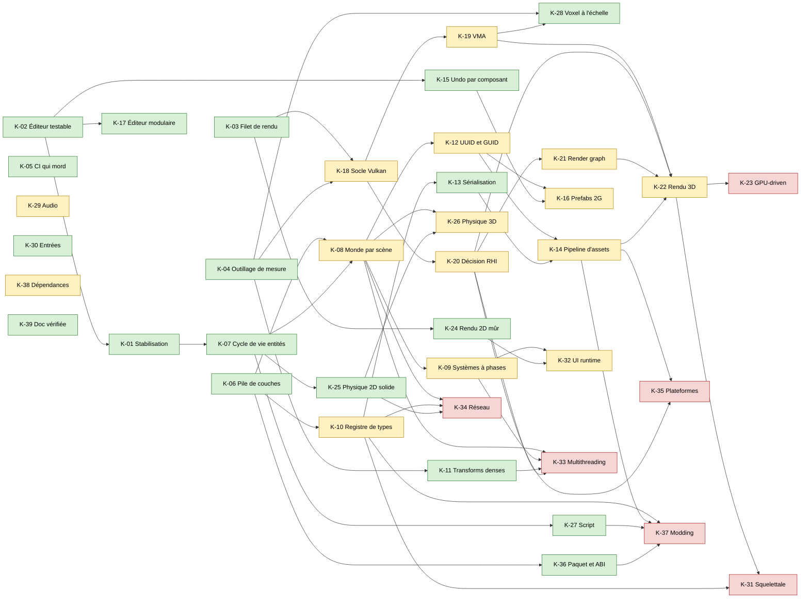
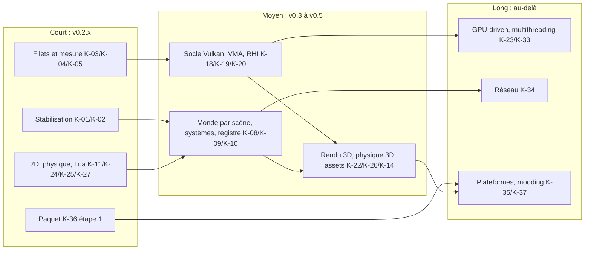

# Audit Owl — avenir du moteur (axe K)

> **Statut : v1, 2026-10-05.** Livrable du §5 de [`00-cadrage.md`](00-cadrage.md). Ce fichier n'ajoute aucun
> constat : il assemble les « Pistes pour l'avenir » des fichiers `10-constats-*.md`, le §7 de
> [`20-mesures.md`](20-mesures.md), les verdicts de [`30-etat-de-l-art.md`](30-etat-de-l-art.md) et les pistes du §5
> du cadrage. Chaque chantier renvoie aux constats **après vérification** (gravité et statut des lignes
> `Vérification`). Point de départ, pas contrainte : `doc/pages/roadmap.md` (versions jusqu'à v0.5.0).
>
> **Effort**, pour un mainteneur seul : **S** quelques jours, **M** quelques semaines, **L** quelques mois, **XL** un
> trimestre ou plus. Les jugements marqués **[O]** sont des opinions de l'auditeur.

[TOC]

## 1. Lecture d'ensemble

Owl a beaucoup de fonctionnalités et peu de fondations. Trois verrous conditionnent presque tous les grands
chantiers de la roadmap :

1. **Les filets de sécurité manquent là où sont les défauts.** Aucun test n'exécute un backend GPU (F-01, B-06),
   l'éditeur est couvert à 2,5 % et l'undo à 0 % (F-02, E-03). Les six défauts de correction reproduits par l'audit
   (C-01, C-02, C-03, C-04, E-01, E-02) sont tous passés en release 0.2.1 faute de ces filets.
2. **Le backend Vulkan est correct par accident de synchronisation.** Il vide la file GPU une dizaine de fois par
   frame (B-01), ne versionne ni UBO ni SSBO (B-03, B-04) et déclare indéfini le contenu des cibles entre deux
   passes (B-02). Un rendu 3D, un rendu piloté par GPU, macOS ou Android bâtis dessus hériteraient de ces défauts.
3. **L'architecture héritée de Hazel ne passe pas à l'échelle.** `Scene` est un objet dieu qui porte le gameplay
   (A-02, C-14), la physique et le script sont des singletons liés à « la » scène active (A-04, D-15), et le jeu de
   composants est fermé à la compilation (A-05). Réseau, modding, ECS parallèle et éditeur générique butent tous
   sur l'un de ces trois points.

À l'inverse, plusieurs briques sont déjà de bonnes fondations : la frontière publique/privée (A-06), la pile de
rendu pilotée par les données (A-15, B-22), le Renderer2D instancié (B-08, P-05), le contrat du `Scheduler`
(D-21), le modèle de commandes de l'éditeur (E-09) et les choix tiers (EnTT, Box2D v3, Slang, Lua 5.5 :
fiches 1, 3, 4 et 6 de `30-etat-de-l-art.md`). La trajectoire proposée consiste à stabiliser, puis à refaire les
fondations sur ces briques, et seulement ensuite à élargir.

## 2. Carte des chantiers

| ID   | Chantier                                                       | Effort | Horizon     | Prérequis                 | Constats principaux                      |
|------|----------------------------------------------------------------|--------|-------------|---------------------------|------------------------------------------|
| K-01 | Stabilisation : défauts de correction reproduits               | M      | court       | K-02 (en partie)          | C-01, C-02, C-03, C-04, E-01, E-02, D-03 |
| K-02 | Éditeur testable (`OwlNestCore` + `owlnest_tests`)             | S      | court       | aucun                     | E-03, F-02, C-07                         |
| K-03 | Filet de rendu headless (lavapipe, llvmpipe)                   | M      | court       | aucun                     | F-01, B-06, B-20                         |
| K-04 | Outillage de mesure (Tracy, frame bench, image Docker)         | S-M    | court       | aucun                     | D-11, D-12, B-12, P-02                   |
| K-05 | CI qui mord et coûte moins                                     | S      | court       | aucun                     | F-03, F-04, F-05, H-03, H-05, H-06       |
| K-06 | Pile de couches vérifiée en CI                                 | S      | court       | aucun                     | A-01, A-13                               |
| K-07 | Cycle de vie des entités (commandes différées, hooks EnTT)     | M      | court-moyen | K-01                      | C-01, C-08, D-01, D-04, C-17             |
| K-08 | Contexte moteur et monde par scène                             | M-L    | moyen       | K-06, K-07                | A-04, A-07, A-08, D-15, F-05             |
| K-09 | `Scene` = données + systèmes à phases, gameplay hors moteur    | L      | moyen       | K-07, K-08                | A-02, C-14, A-15, A-16                   |
| K-10 | Registre de types ouvert                                       | M-L    | moyen       | K-06                      | A-05, A-18                               |
| K-11 | Transforms et visibilité denses, sans plafond                  | M      | court       | K-04                      | P-01, P-02, P-03, P-04, P-06, C-09, B-12 |
| K-12 | Références d'entité par UUID, assets par GUID                  | M-L    | moyen       | K-08                      | C-12, A-07, E-11                         |
| K-13 | Sérialisation : version, écriture atomique, rapidyaml, binaire | M-L    | court-moyen | K-10 (pour le binaire)    | C-10, C-13, C-06, P-07                   |
| K-14 | Pipeline d'assets : cook, pack lu en place, shaders hors ligne | L      | moyen       | K-12, K-13                | D-02, D-10, D-18, B-05                   |
| K-15 | Undo par composant, sélection multiple, opérations de groupe   | M      | court-moyen | K-02                      | E-01, E-05, E-06, E-09, E-04             |
| K-16 | Prefabs de seconde génération                                  | L      | moyen       | K-12, K-15                | C-02, C-11, E-11                         |
| K-17 | Éditeur modulaire (découpage d'`EditorLayer`)                  | M      | court-moyen | K-02                      | E-07, E-12                               |
| K-18 | Socle Vulkan : frames en vol, synchro, anneau d'uniformes      | L      | moyen       | K-03, K-04                | B-01, B-02, B-03, B-04, B-19             |
| K-19 | Mémoire GPU (VMA, staging, mapping persistant)                 | M      | moyen       | K-18                      | B-11, B-23                               |
| K-20 | Décision RHI et sort d'OpenGL                                  | M-L    | moyen       | K-03, K-18                | B-07, B-16, A-09                         |
| K-21 | Render graph                                                   | L      | moyen-long  | K-18, K-20                | B-02, B-22, A-15                         |
| K-22 | Rendu 3D moderne (static meshes, PBR, ombres, HDR)             | XL     | moyen       | K-18, K-19, K-20          | B-03, B-18, B-15                         |
| K-23 | Rendu piloté par GPU (indirect, culling GPU, bindless)         | L      | long        | K-03, K-19, K-22          | B-20, B-14, B-15                         |
| K-24 | Rendu 2D mûr (tri, texte UTF-8, tilemap persistante)           | M      | court       | K-03                      | B-09, B-10, B-13, D-18                   |
| K-25 | Physique 2D solide (pas fixe, contacts, chaînes, multi-thread) | M      | court       | K-07                      | D-05, D-14, P-12, D-07                   |
| K-26 | Physique 3D (Jolt, ou Box3D s'il mûrit)                        | M      | moyen       | K-08, K-25                | D-19, D-14                               |
| K-27 | Script : sandbox réel, sûreté, outillage, langage              | M      | court-moyen | K-07                      | D-06, D-16, D-07, D-26, P-11, D-22       |
| K-28 | Voxel à l'échelle (maillage asynchrone, mémoire, LOD)          | M-L    | court-moyen | K-04, K-19 (grand buffer) | D-03, D-08, P-09, P-10, D-27, B-15       |
| K-29 | Audio (miniaudio, bus, streaming)                              | M      | moyen       | aucun                     | D-13, D-07                               |
| K-30 | Entrées (actions, fronts, manettes)                            | M      | court-moyen | aucun                     | D-25, I-03                               |
| K-31 | Animation squelettale                                          | L      | long        | K-10, K-22                | aucun constat direct                     |
| K-32 | UI de jeu runtime (HUD dédié)                                  | L      | moyen       | K-09, K-24                | C-14, B-10                               |
| K-33 | Multithreading de frame, rendu sur thread dédié                | XL     | long        | K-08, K-09, K-11, K-20    | A-08, D-24, B-07                         |
| K-34 | Réseau et rollback                                             | XL     | long        | K-08, K-10, K-25          | A-04, D-05, A-05                         |
| K-35 | Plateformes : Web (WebGPU), macOS (MoltenVK), Android          | XL     | long        | K-14, K-18, K-20          | B-02, B-16, B-01                         |
| K-36 | Paquet moteur consommable et ABI propre                        | M      | court-moyen | K-06                      | G-01, G-02, G-03, G-06, G-07, A-03, A-10 |
| K-37 | Modding                                                        | L      | long        | K-10, K-14, K-27, K-36    | D-02, D-06, A-05, A-10                   |
| K-38 | Dépendances traçables, chaîne ouverte aux contributeurs        | M-L    | moyen       | aucun                     | G-04, G-08, G-13, H-09                   |
| K-39 | Documentation vérifiée par la CI                               | S-M    | court       | aucun                     | I-01, I-02, I-06, I-09                   |

## 3. Fiches des chantiers

### Fondations et filets

#### K-01 — Stabilisation : défauts de correction reproduits

- **Intérêt** : supprimer les comportements indéfinis et les pertes de données sur les chemins les plus courants :
  la pièce `coin.lua` du sample (C-01, D-01), l'undo d'un déplacement au gizmo (E-01), le drapeau « modifié » (E-02),
  « Update from Prefab » (C-02), le Play d'un monde voxel (C-03), un `EntityLink` mal nommé (C-04), le voxel
  invisible dans le jeu exporté (D-03), la hiérarchie au-delà de 64 niveaux (P-01, C-18).
- **Difficulté** : faible. Chaque correctif tient en quelques dizaines de lignes, et les sondes de l'audit sont déjà
  des tests de non-régression (10-constats-CE, piste 1).
- **Briques préalables** : la catégorie `owlnest_tests` (K-02) pour E-01, E-02 et C-02. **Manquante aujourd'hui.**
- **Risques** : corriger E-01 par une restauration « en place » change le contrat de `EntitySnapshot` ; il faut le
  faire sous tests (E-03).
- **Effort** : M au total (une dizaine de PR de taille S).
- **Constats** : C-01, D-01, C-02, C-03, C-04, C-05, C-06, E-01, E-02, E-08, E-12, D-03, D-04, P-01, C-18.

#### K-02 — Éditeur testable

- **Intérêt** : rendre exécutable par la CI la pièce la plus délicate de l'éditeur (undo, fusion, dirty, snapshots),
  aujourd'hui à 0 % de couverture.
- **Difficulté** : faible. `UndoManager`, les commandes et `EntitySnapshot` ne dépendent pas d'ImGui ; les sondes de
  l'audit les compilent déjà en incluant les `.cpp` (E-03).
- **Briques préalables** : une bibliothèque statique `OwlNestCore` (ou une catégorie de tests liant ces sources).
- **Risques** : aucun ; au mieux, des tests révèlent d'autres défauts.
- **Effort** : S.
- **Constats** : E-03, F-02 (doublon), C-07 et P-14 (assertions `0 == 0` à réécrire en même temps).

#### K-03 — Filet de rendu headless

- **Intérêt** : premier test qui exécute Vulkan et OpenGL. Prérequis de tout chantier rendu (K-18 à K-24) : sans lui,
  une refonte de la synchronisation Vulkan se fait à l'aveugle.
- **Difficulté** : moyenne. Rendu offscreen de scènes fixes, relecture du framebuffer, comparaison à une image de
  référence avec tolérance ; tests compute à oracle CPU ; validation layers et « zéro message » comme critère.
- **Briques préalables** : lavapipe et llvmpipe sont dans l'image locale (01-environnement §1), **à vérifier dans
  l'image CI** (H-09) ; une lecture de framebuffer fiable, qui suppose de lever B-02 sur les cibles lues.
- **Risques** : instabilité des images entre versions de Mesa ; tolérance à régler.
- **Effort** : M.
- **Constats** : F-01, B-06, B-20 (garder les briques GPU-driven seulement si ce filet les couvre).

#### K-04 — Outillage de mesure

- **Intérêt** : rendre possible la règle « mesurer avant d'optimiser ». Le profiler maison fausse ce qu'il mesure
  (D-12), le tracker mémoire coûte un verrou global par allocation (D-11), et aucune mesure GPU n'existe (20-mesures §7).
- **Difficulté** : faible pour Tracy derrière les macros `OWL_PROFILE_*` (fiche 11) ; moyenne pour un mode
  `--frame-bench` du runner avec requêtes de timestamp GPU.
- **Briques préalables** : paquet DepManager Tracy ; `perf`, `heaptrack`, `renderdoccmd`, `hyperfine` dans l'image
  (01-environnement §3) ; Google Benchmark absent du serveur DepManager (20-mesures §6). **Toutes manquantes.**
- **Risques** : faibles ; Tracy reste désactivé par défaut.
- **Effort** : S (Tracy) + M (frame bench).
- **Constats** : D-11, D-12, B-12, P-02, P-04 ; demandes PM-01 à PM-12 de l'axe B restées sans réponse.

#### K-05 — CI qui mord et coûte moins

- **Intérêt** : des gates qui échouent vraiment, moins de minutes perdues. UBSan ne peut pas échouer (F-03), les tests
  dépendent de leur ordre (F-05), ClangTidy tourne sur un processus (H-03), aucun check n'est requis pour fusionner
  (H-06, plausible), LSan double ASan et arm64 émulé tourne sur chaque PR (H-05).
- **Difficulté** : faible.
- **Briques préalables** : aucune ; la durée des builds TeamCity n'est pas exportée (H-05) et devrait l'être pour
  élaguer sur chiffres.
- **Risques** : un gate durci révèle des défauts latents (c'est le but).
- **Effort** : S.
- **Constats** : F-03, F-04, F-05, F-07, F-08, F-12, H-03, H-04, H-05, H-06, H-07.

#### K-06 — Pile de couches vérifiée

- **Intérêt** : rompre la composante fortement connexe de 10 modules (9 includes suffisent) et empêcher la
  régression. C'est le préalable bon marché de K-08, K-10 et K-36, et d'un futur découpage en bibliothèques.
- **Difficulté** : faible ; ordre proposé `core < math < platform/debug < event/input < window < renderer < data <
  sound/physics/script < scene < gui < app` (10-constats-A, K-A1).
- **Briques préalables** : un script de graphe d'includes dans `CodeStyle`.
- **Risques** : aucun.
- **Effort** : S.
- **Constats** : A-01, A-13, A-12 (hygiène des headers, même PR possible).

### Cœur du moteur

#### K-07 — Cycle de vie des entités

- **Intérêt** : une destruction et une création différées (file de commandes vidée entre phases) plus des hooks EnTT
  `on_construct` / `on_destroy` vers la physique, le son et Lua. Corrige la classe de défauts de C-01 et C-08, les corps
  Box2D fantômes (D-04) et prépare l'ECS parallèle.
- **Difficulté** : moyenne ; le patron « requête différée » existe déjà pour la téléportation et le chargement (D-22).
- **Briques préalables** : K-01 (file minimale pour `destroy_entity`).
- **Risques** : changement d'ordre observable par les scripts ; à documenter.
- **Effort** : M.
- **Constats** : C-01, D-01, C-08, D-04, C-17, C-09 (EnTT sous-exploité : 0 signal).

#### K-08 — Contexte moteur et monde par scène

- **Intérêt** : un `EngineContext` qui possède et ordonne les ~25 singletons (A-08), la fin des 66
  `Application::get()` dans les modules bas (A-07), et une physique, une VM et un état UI portés par chaque scène
  (A-04, D-15). Débloque plusieurs mondes simultanés (menu sur niveau, aperçu de prefab en Play), les tests
  parallèles (F-05), un serveur multi-instances et le rollback (cloner un monde).
- **Difficulté** : moyenne à élevée ; refactorisation transversale, sans changement de fonctionnalité.
- **Briques préalables** : K-06 (direction des dépendances), K-07 (hooks de cycle de vie). La séquence d'arrêt de
  l'`Application` (A-20) est la bonne base.
- **Risques** : régressions d'initialisation ; à couvrir par K-02 et K-03.
- **Effort** : M-L.
- **Constats** : A-04, A-07, A-08, A-20, D-15, F-05, C-13 (statiques de sauvegarde).

#### K-09 — `Scene` = données + systèmes à phases

- **Intérêt** : `Scene.cpp` (2 595 lignes, 42 des 75 commits moteur de 2026) cesse d'être le point de contention ; la
  boucle devient une liste de systèmes enregistrés par phase, sur le modèle de `RenderLayerFactory` (A-15) ; le
  gameplay (Victory/Death, `VoxelPlayer`, portes raycast) sort du moteur.
- **Difficulté** : élevée ; l'ordre actuel est implicite (10-constats-CE, « Ordre de mise à jour »).
- **Briques préalables** : K-07, K-08.
- **Risques** : régressions de comportement du sample ; il faut d'abord une batterie de tests de frame.
- **Effort** : L.
- **Constats** : A-02, C-14, A-15, A-16.

#### K-10 — Registre de types ouvert

- **Intérêt** : un registre runtime (EnTT `meta` ou maison) remplace les quatre listes de `components.h` et
  `IFactory` : composants de jeux tiers sérialisables, inspectables et liés à Lua, éditeur générique, sérialisation
  binaire, réplication réseau.
- **Difficulté** : moyenne à élevée ; 31 composants et l'inspecteur à migrer.
- **Briques préalables** : K-06. **Attention** : EnTT v4 (2026-07-23) refond `meta` (fiche 1) ; migrer vers v4 avant
  d'adopter `meta`.
- **Risques** : coût de compilation, perte de typage statique dans l'inspecteur.
- **Effort** : M-L.
- **Constats** : A-05, A-18.

#### K-11 — Transforms et visibilité denses

- **Intérêt** : la préparation des transforms prend 72 % de la frame CPU (P-02) ; trois `unordered_map` à nœuds
  sont reconstruites à chaque frame (C-09) ; le monde est calculé deux fois, CPU puis GPU (B-12, P-04), faux au-delà
  de 64 niveaux (P-01) ; la visibilité héritée remonte la chaîne par recherche UUID (P-03) ; la composition TRS coûte
  76 ns (P-06). Gain attendu [O] : un facteur 3 à 5 sur la frame.
- **Difficulté** : moyenne.
- **Briques préalables** : K-04 pour mesurer ; un cache `entt::entity` du parent dans `Hierarchy`.
- **Risques** : invalidation des caches (C-17) ; le cache TRS sert encore au texte, aux tilemaps et au raycast (P-02,
  vérification).
- **Effort** : M (S pour la seule correction de P-01).
- **Constats** : P-01, P-02, P-03, P-04, P-06, C-09, C-15, C-18, B-12.

#### K-12 — Références par UUID, assets par GUID

- **Intérêt** : les liens entre entités passent par des noms non uniques (C-12) et cassent à la duplication ; les
  assets sont résolus par nom avec parcours disque (A-07), parfois via la bibliothèque de textures (E-11). Un service
  d'assets indexé puis des GUID rendent possibles le renommage sans casse, le cook et le hot reload.
- **Difficulté** : moyenne ; migration des scènes existantes.
- **Briques préalables** : K-08 (service hors `Application`), version de format de scène (K-13).
- **Risques** : migration de `sample_project/` et des projets utilisateurs.
- **Effort** : M (UUID d'entité) + L (GUID d'asset).
- **Constats** : C-12, C-04, A-07, E-11, D-13 (scan disque répété pour un son absent).

### Données et éditeur

#### K-13 — Sérialisation

- **Intérêt** : aucune version de format de scène (C-10), écritures non atomiques (C-10, C-13), chargement à
  117-134 µs par entité (P-07), parseur yaml-cpp lent d'un facteur 30 annoncé face à rapidyaml (fiche 5), fichiers
  corrompus acceptés (C-06).
- **Difficulté** : faible pour version + écriture atomique + validation ; moyenne pour rapidyaml (56 fichiers) ;
  moyenne à élevée pour un format binaire cuit.
- **Briques préalables** : K-10 pour un format binaire générique.
- **Risques** : double maintenance texte et binaire.
- **Effort** : S, puis M, puis M-L.
- **Constats** : C-10, C-13, C-06, P-07, E-05.

#### K-14 — Pipeline d'assets

- **Intérêt** : `.owlpack` lu en place au lieu d'être extrait en clair au démarrage (D-10), validé en taille et en
  chemin (D-02), shaders compilés au build pour le runner (fiche 3, B-05), atlas de police précalculé avec charset
  configurable (D-18), cook incrémental. Préalable du Web (K-35) et du modding (K-37).
- **Difficulté** : élevée ; touche tous les chargeurs.
- **Briques préalables** : K-12 (GUID), K-13 (format cuit).
- **Risques** : le coût mesuré de Slang (74 ms à froid, P-13) rend la compilation hors ligne moins urgente qu'annoncé ;
  la prioriser pour la taille et la robustesse du runner, pas pour le temps de démarrage.
- **Effort** : L.
- **Constats** : D-02, D-10, D-09, D-18, B-05, P-13.

#### K-15 — Undo par composant et opérations de groupe

- **Intérêt** : restaurer en place au lieu de détruire et recréer (E-01, E-05), snapshot du seul composant modifié,
  détection de modification sans sérialiser l'entité deux fois par frame (E-04), sélection multiple, copier-coller,
  commandes groupées (E-06). C'est aussi ce qu'exige la règle « Editor Coverage » du projet.
- **Difficulté** : moyenne ; le modèle de commandes est sain (E-09).
- **Briques préalables** : K-02.
- **Risques** : faibles sous tests.
- **Effort** : M.
- **Constats** : E-01, E-04, E-05, E-06, E-09, E-10.

#### K-16 — Prefabs de seconde génération

- **Intérêt** : passer d'un « copier depuis un fichier » (C-11) à des prefabs imbriqués, avec variants, surcharges
  par propriété détectées par le diff de l'inspecteur, document d'édition isolé.
- **Difficulté** : élevée.
- **Briques préalables** : K-12 (référence par GUID), K-15 (diff par composant), correction préalable de C-02.
- **Risques** : format de fichier à migrer.
- **Effort** : L.
- **Constats** : C-02, C-11, E-11, P-07 (instanciation à 256 µs par entité).

#### K-17 — Éditeur modulaire

- **Intérêt** : `EditorLayer.cpp` (2 904 lignes, 71 commits) se découpe en blocs nets : packaging (~540 lignes),
  ruban (~680), ouverture par type (~430), icônes (~150). Le packaging pourrait devenir un outil en ligne de commande
  réutilisable par la CI.
- **Difficulté** : moyenne, peu de dépendances croisées (E-07).
- **Briques préalables** : K-02.
- **Risques** : faibles.
- **Effort** : M.
- **Constats** : E-07, E-12 (téléportation dupliquée éditeur et runner, à déplacer dans le moteur).

### Rendu

#### K-18 — Socle Vulkan

- **Intérêt** : vraies frames en vol, transitions et clears enregistrés dans le command buffer de la frame, anneau de
  staging, suivi des layouts, `loadOp LOAD` entre batchs, sémaphores par image de swapchain, anneau d'uniformes par
  frame (UBO dynamiques ou push constants). Rend `drawMesh` multiple et plusieurs caméras par frame corrects.
- **Difficulté** : élevée ; B-04 rend la correction de B-01 seule dangereuse (courses en écriture après lecture) :
  les deux vont dans la même PR.
- **Briques préalables** : K-03 (filet), K-04 (mesure PM-01, PM-09 sous sync validation).
- **Risques** : régressions visuelles sur NVIDIA, qui masque aujourd'hui B-02 ; c'est pourquoi K-03 doit précéder.
- **Effort** : L.
- **Constats** : B-01, B-02, B-03, B-04, B-19, B-21 (invariants récents à garder), B-25.

#### K-19 — Mémoire GPU

- **Intérêt** : VMA (norme de fait), sous-allocation, buffers mappés en permanence ; lève le plafond
  `maxMemoryAllocationCount` (4 allocations par chunk voxel, B-11) et les allocations par draw des descripteurs (B-23).
- **Difficulté** : moyenne.
- **Briques préalables** : K-18 ; paquet VMA dans DepManager (**manquant**).
- **Risques** : faibles.
- **Effort** : M.
- **Constats** : B-11, B-23, B-15.

#### K-20 — Décision RHI et sort d'OpenGL

- **Intérêt** : l'abstraction actuelle est un plus petit dénominateur qui fuit Vulkan (B-07, A-09) ; OpenGL exige en
  fait 4.6 (B-16), n'existe pas en 4.x sur macOS et ne mène pas au Web (fiche 2). Deux voies : refonte maison
  (`PipelineDesc`, `BindGroup`, `CommandList`) ou adoption de SDL_GPU, NVRHI ou wgpu-native/Dawn.
- **Difficulté** : la décision est rapide, sa mise en œuvre ne l'est pas.
- **Briques préalables** : K-03 et K-18 pour comparer sur pièces ; Slang cible déjà WGSL et Metal (B-17).
- **Risques** : [O] investir dans le rendu 3D (K-22) avant de trancher fait hériter B-03 et B-07 au nouveau code
  (10-constats-B, piste P-04).
- **Effort** : M (geler OpenGL en repli) à L (RHI tierce).
- **Constats** : B-07, B-16, A-09, B-17.

#### K-21 — Render graph

- **Intérêt** : passes déclarant lectures et écritures, `loadOp`, barrières et ressources transitoires déduits ;
  base du post-process et des ombres. `RenderStack` (B-22) en est le bon front-end.
- **Difficulté** : élevée.
- **Briques préalables** : K-18, K-20 ; plusieurs formats de cible (une seule disposition d'attachements aujourd'hui).
- **Risques** : sur-ingénierie pour un moteur 2D [O] ; à ne lancer qu'avec K-22.
- **Effort** : L.
- **Constats** : B-02, B-22, A-15.

#### K-22 — Rendu 3D moderne

- **Intérêt** : objectif affiché de v0.3.0 (static meshes, éclairage, PBR, ombres, post-process).
- **Difficulté** : très élevée.
- **Briques préalables** : matrice modèle par draw (K-18, B-03), mipmaps et samplers explicites (B-18), cibles HDR
  (RGBA16F absent), profondeur échantillonnable, culling activé (B-07 : cull NONE partout), VMA (K-19), décision RHI
  (K-20), pipeline d'assets pour les matériaux (K-14). **Presque toutes manquantes.**
- **Risques** : le plus gros chantier de la roadmap repose aujourd'hui sur le socle le plus fragile.
- **Effort** : XL.
- **Constats** : B-03, B-07, B-18, B-15, B-11.

#### K-23 — Rendu piloté par GPU

- **Intérêt** : voxel et scènes denses en quelques draws ; les briques existent (culling GPU, tri bitonique, draw
  indirect) mais sans appelant ni test (B-20).
- **Difficulté** : élevée.
- **Briques préalables** : K-03 (tests GPU), K-19 (grand buffer sous-alloué), bindless (`runtimeDescriptorArray`,
  `descriptorBindingPartiallyBound` non activés).
- **Risques** : code mort qui vieillit en attendant ; [O] le retirer si K-03 ne le couvre pas.
- **Effort** : L.
- **Constats** : B-20, B-14, B-15, D-17.

#### K-24 — Rendu 2D mûr

- **Intérêt** : le cœur de métier actuel d'Owl. Ordre d'affichage garanti (aucun tri : B-10), texte au-delà du
  Latin-1 (B-09, D-18), transitoires dimensionnés par frame (B-09), tilemap persistante et cullée au lieu d'une
  reconstruction tronquée à 16 384 cellules (B-13), relectures raycast différées (B-14, D-17).
- **Difficulté** : moyenne.
- **Briques préalables** : K-03.
- **Risques** : le tri change l'ordre visible des scènes existantes ; à exposer comme réglage (couche, z).
- **Effort** : M.
- **Constats** : B-09, B-10, B-13, B-14, D-17, D-18, B-08 (base à garder).

### Sous-systèmes

#### K-25 — Physique 2D solide

- **Intérêt** : pas fixe avec accumulateur et interpolation (D-05, prérequis du déterminisme et du réseau),
  événements de contact pour honorer `on_collision` documenté (D-07), capteurs à la place des AABB maison, chaînes
  pour les tilemaps, solveur parallèle branché sur Taskflow (P-12 : 4,9 ms pour 5 000 corps en série).
- **Difficulté** : moyenne ; Box2D v3 fournit tout (D-14, D-19).
- **Briques préalables** : K-07 (hooks de création et destruction des corps). Vérifier que le paquet Box2D est
  compilé en AVX2 (fiche 6).
- **Risques** : le pas fixe change le ressenti du sample ; à régler.
- **Effort** : M (S pour le seul pas fixe).
- **Constats** : D-04, D-05, D-07, D-14, D-19, P-12.

#### K-26 — Physique 3D

- **Intérêt** : prévue en v0.3.0 ; remplacerait aussi la collision AABB maison de `VoxelPlayer` (D-14).
- **Difficulté** : moyenne (nouveau module, synchronisation des transforms).
- **Briques préalables** : K-08 (monde par scène, sinon un second singleton physique), K-25 (même patron
  d'intégration).
- **Risques** : [O] Box3D (0.1, 2026-06-30) est séduisant mais immature ; Jolt est le choix sûr (fiche 6).
- **Effort** : M.
- **Constats** : D-19, D-14, D-15.

#### K-27 — Script

- **Intérêt** : sandbox réel (mode texte, pas de `string.dump`, quota mémoire, hook d'instructions : D-06), sûreté
  des exceptions entre C++ et Lua compilé en C (D-16), `on_collision` et `other_id` réellement appelés (D-07),
  nettoyage de l'état mort (D-26), puis hot reload et débogueur. Option : Luau si le modding devient un objectif
  (fiche 4).
- **Difficulté** : faible pour la sûreté, moyenne pour l'outillage.
- **Briques préalables** : K-07 (handles d'entité en userdata, destruction différée).
- **Risques** : le modèle « un `lua_State` par entité » coûte ~9 Ko et 30 µs par instance (P-11) ; une VM partagée
  avec `_ENV` par script change l'isolation (décision).
- **Effort** : M.
- **Constats** : D-06, D-07, D-16, D-22, D-26, P-11, I-02.

#### K-28 — Voxel à l'échelle

- **Intérêt** : d'abord un runner qui maille (D-03) ; puis maillage pur sur workers avec budget d'upload, voisins
  invalidés, drapeau « vide » tenu à jour, raccourci pour les chunks uniformes (D-08, P-09) ; puis sommets compactés,
  palette, LOD (P-10, D-27).
- **Difficulté** : moyenne ; les algorithmes sont bons (D-20), seul l'ordonnancement pèche.
- **Briques préalables** : K-04 (mesures M5-M6 par frame, non faites) ; K-19 pour un grand buffer de sommets.
- **Risques** : faibles.
- **Effort** : S (D-03) puis M, puis L pour le LOD.
- **Constats** : D-03, D-08, D-20, D-27, P-09, P-10, B-15.

#### K-29 — Audio

- **Intérêt** : bus par catégorie (les volumes `music` et `sfx` sont annoncés mais jamais appliqués : D-07),
  préchargement, pool de sources, streaming de la musique (D-13). miniaudio remplacerait OpenAL Soft (LGPL) et
  libsndfile (fiche 10).
- **Difficulté** : moyenne ; le backend est isolé et a un pendant Null.
- **Briques préalables** : aucune.
- **Risques** : spatialisation 3D à revalider.
- **Effort** : M.
- **Constats** : D-07, D-13.

#### K-30 — Entrées

- **Intérêt** : états de front par frame, table d'actions sérialisée, manettes (GLFW fournit l'API). Le README promet
  une manette qui n'existe pas (I-03) et chaque gameplay recode la détection de front (D-25).
- **Difficulté** : moyenne.
- **Briques préalables** : aucune.
- **Risques** : codes GLFW bruts exposés aux scripts aujourd'hui : migration de l'API Lua.
- **Effort** : M.
- **Constats** : D-25, I-03.

#### K-31 — Animation squelettale

- **Intérêt** : prévue en v0.3.0 ; aucun constat ne la concerne directement.
- **Difficulté** : élevée (skinning, clips, blend, machine à états).
- **Briques préalables** : K-22 (pipeline 3D), K-10 (composants d'animation inspectables), K-14 (import et cook des
  clips).
- **Risques** : [O] chantier sans fondations à ce jour ; le placer après le rendu 3D.
- **Effort** : L.
- **Constats** : aucun constat direct (dépend de B-03, B-18 via K-22).

#### K-32 — UI de jeu runtime

- **Intérêt** : couche HUD dédiée (roadmap v0.2.3), tri explicite (B-10), sortie du HUD et du rendu UI de `Scene`
  (C-14).
- **Difficulté** : moyenne à élevée.
- **Briques préalables** : K-09 (UI comme système), K-24 (tri, texte).
- **Risques** : faire la couche HUD dans `Scene.cpp` aggraverait A-02.
- **Effort** : L.
- **Constats** : C-14, B-10, A-02.

### Long terme

#### K-33 — Multithreading de frame

- **Intérêt** : systèmes parallèles sur Taskflow, préparation du rendu sur un thread dédié. Taskflow est réduit à une
  file FIFO de lambdas (D-24).
- **Difficulté** : très élevée.
- **Briques préalables** : K-08 (fin des singletons), K-09 (systèmes déclarés), K-11 (données denses), K-20 (command
  lists ; aujourd'hui état `thread_local` des descripteurs, B-07).
- **Risques** : courses de données ; TSan existe en CI (F-13) mais sans test de stress du `Scheduler`.
- **Effort** : XL.
- **Constats** : A-08, D-24, D-21, B-07.

#### K-34 — Réseau et rollback

- **Intérêt** : prévu en v0.4.0 (transport, réplication, RPC, lobby).
- **Difficulté** : très élevée.
- **Briques préalables** : pas fixe et déterminisme (K-25, D-05), plusieurs mondes et clonage de monde (K-08, A-04),
  composants marqués répliqués (K-10, A-05), destruction différée (K-07). **Toutes manquantes.**
- **Risques** : [O] le plus mal placé des chantiers de la roadmap au regard de ses prérequis.
- **Effort** : XL.
- **Constats** : A-04, A-05, D-05, D-15.

#### K-35 — Plateformes

- **Intérêt** : Web (prévu en v0.5.0), Android (v0.5.0), macOS (jamais planifié).
- **Difficulté** : très élevée. Le Web interdit les vidages synchrones (B-01) et n'offre ni GL 4.6 ni Vulkan ; Android
  et MoltenVK utilisent des GPU à tuiles qui révèlent B-02.
- **Briques préalables** : K-18, K-20 (WebGPU ou RHI tierce), K-14 (assets cuits, lecture asynchrone), build wasm.
- **Risques** : [O] trois plateformes ensemble dépassent les moyens d'un mainteneur seul ; en choisir une.
- **Effort** : XL.
- **Constats** : B-01, B-02, B-16, B-17, fiche 2.

#### K-36 — Paquet moteur consommable et ABI propre

- **Intérêt** : le paquet publié est inutilisable (headers sous `include/public/` : G-02 ; `-Werror -Weverything`
  imposés : G-01 ; préfixe d'installation ignoré : G-06), personne ne le consomme depuis la 0.0.3 (G-03), yaml-cpp
  fuit dans `Scene.h` (A-03, G-07), `libOwlEngine.so` exporte ~10 600 symboles tiers (A-10). Préalable de tout
  « écosystème » et d'un semver réel.
- **Difficulté** : faible pour G-01, G-02 et G-06, moyenne pour la frontière ABI.
- **Briques préalables** : un `test_package` en CI (**manquant**) ; K-06.
- **Risques** : [O] si OwlDrone n'est plus visé, ce chantier peut se réduire à supprimer la recette.
- **Effort** : M.
- **Constats** : G-01, G-02, G-03, G-06, G-07, G-19, A-03, A-10, A-12, A-19.

#### K-37 — Modding

- **Intérêt** : objectif de v0.5.0 (mods `.owlmod`, API Lua de mod, gestionnaire en jeu).
- **Difficulté** : élevée.
- **Briques préalables** : pack sûr (D-02 : zip-slip et allocations non bornées), sandbox Lua réel (D-06),
  composants enregistrables depuis Lua (K-10, A-05), ABI propre si mods natifs (K-36, A-10), pipeline d'assets (K-14).
- **Risques** : sécurité ; [O] Luau est conçu pour du code non fiable (fiche 4).
- **Effort** : L.
- **Constats** : D-02, D-06, D-10, A-05, A-10.

#### K-38 — Dépendances traçables, chaîne ouverte

- **Intérêt** : lockfile (version + hash), `pull-newer: false` en CI, compilateur enregistré (G-04) ; veille de versions
  automatisée (10 paquets en retard sur le serveur du projet lui-même, dont libpng : G-08) ; un chemin de build public
  pour un contributeur externe (fiche 8) et un workflow GitHub Actions minimal pour la visibilité (fiche 9).
- **Difficulté** : moyenne ; une part se fait dans DepManager lui-même.
- **Briques préalables** : aucune.
- **Risques** : [O] une migration vcpkg ne se décide que sur un prototype chiffré (10-constats-GI, piste 5).
- **Effort** : M (traçabilité) à L (prototype vcpkg).
- **Constats** : G-04, G-08, G-13, G-17, H-09, fiches 8 et 9.

#### K-39 — Documentation vérifiée

- **Intérêt** : 34 % des affirmations contrôlées sont fausses ou périmées (I-01) ; la référence Lua promet
  `on_collision` (I-02) ; l'exigence Doxygen produit au moins 300 commentaires de remplissage (I-06). Vérifier par
  script les identifiants cités, générer la référence Lua depuis `LuaBindings.cpp`, générer le tableau des options
  CMake, alléger Doxygen sur les membres triviaux.
- **Difficulté** : faible à moyenne.
- **Briques préalables** : aucune.
- **Risques** : faibles.
- **Effort** : S-M.
- **Constats** : I-01, I-02, I-03, I-04, I-06, I-09, D-07, B-18.

## 4. Graphe de dépendances

Une flèche `A --> B` signifie « A est un prérequis de B ». Les couleurs donnent l'horizon proposé.

Trois nœuds portent l'essentiel du graphe : **K-08** (monde par scène), **K-18** (socle Vulkan) et **K-20**
(décision RHI). Ce sont eux qu'il faut séquencer en premier dans le moyen terme ; tout ce qui est en aval
(3D, réseau, multithreading, plateformes, modding) est bloqué tant qu'ils ne sont pas faits.

## 5. Trajectoire en trois horizons

### 5.1 Court terme : v0.2.x (v0.2.2 attendue 2026-12, v0.2.3 attendue 2027-01)

Objectif : **stabiliser, outiller, rendre consommable**. Aucun de ces chantiers ne demande de décision
d'architecture.

| Ordre | Chantier                                  | Pourquoi maintenant                                           |
|-------|-------------------------------------------|---------------------------------------------------------------|
| 1     | K-02 Éditeur testable                     | Filet de K-01 ; effort S                                      |
| 2     | K-01 Stabilisation                        | Crash du sample (C-01), pertes de données (E-01, E-02, C-03)  |
| 3     | K-05 CI qui mord, K-06 pile de couches    | Gates réels ; coût S chacun                                   |
| 4     | K-04 Tracy et frame bench                 | Toute optimisation ultérieure en dépend (D-12, 20-mesures §7) |
| 5     | K-36 étape 1 : paquet consommable         | G-01, G-02, G-06 en S ; `test_package`                        |
| 6     | K-03 Filet de rendu headless              | Prérequis du socle Vulkan de v0.3                             |
| 7     | K-11 Transforms denses (P-01 d'abord)     | 72 % de la frame CPU (P-02)                                   |
| 8     | K-25 pas fixe + contacts, K-27 sûreté Lua | `on_collision` documenté, sandbox poreux (D-06, D-07)         |
| 9     | K-24 Rendu 2D mûr, K-28 étapes 1-2        | Cœur de métier 2D ; voxel du runner (D-03)                    |
| 10    | K-13 étape 1, K-39, K-15, K-17            | Version de format, doc fidèle, undo en place, `EditorLayer`   |

### 5.2 Moyen terme : v0.3 à v0.5

Objectif : **refaire les fondations, puis bâtir la 3D dessus**.

| Version | Thème proposé | Chantiers                                                                  |
|---------|---------------|----------------------------------------------------------------------------|
| v0.3    | Fondations    | K-18, K-19, K-20 (décision), K-07, K-08, K-12 (UUID), K-13 (binaire), K-30 |
| v0.4    | 3D et contenu | K-09, K-10, K-21, K-22 (meshes, éclairage, PBR), K-26, K-29, K-14          |
| v0.5    | Ouverture     | K-16, K-27 (outillage), K-28 (LOD), K-32, K-36 étape 2 (ABI, semver)       |

### 5.3 Long terme : au-delà de v0.5

K-23 (GPU-driven), K-31 (animation squelettale), K-33 (multithreading de frame), K-34 (réseau et rollback),
K-35 (une plateforme parmi Web, macOS, Android), K-37 (modding). [O] Chacun est un projet en soi pour un
mainteneur seul ; en choisir un à la fois, dans l'ordre de leurs prérequis.

## 6. Confrontation avec la roadmap actuelle

### 6.1 Ce qui manque

| Absent de la roadmap                                     | Chantier    | Constats                                 |
|----------------------------------------------------------|-------------|------------------------------------------|
| Lot de stabilisation des défauts reproduits              | K-01        | C-01, C-02, C-03, C-04, E-01, E-02, D-03 |
| Tests de l'éditeur et de l'undo                          | K-02        | E-03, F-02                               |
| Tests GPU réels (images, compute)                        | K-03        | F-01, B-06                               |
| Socle de synchronisation Vulkan, anneau d'uniformes, VMA | K-18, K-19  | B-01, B-02, B-03, B-04, B-11             |
| Décision RHI et sort d'OpenGL                            | K-20        | B-07, B-16, fiche 2                      |
| Profiler de frame utilisable (Tracy), sans version       | K-04        | D-11, D-12                               |
| Paquet moteur pour tiers, ABI, semver                    | K-36        | G-01, G-02, G-03, A-10                   |
| Cycle de vie des entités, monde par scène, systèmes      | K-07 à K-09 | A-02, A-04, C-08                         |
| Registre de composants ouvert                            | K-10        | A-05                                     |
| Version de format de scène, écriture atomique            | K-13        | C-10, C-13                               |
| Références par UUID et GUID                              | K-12        | C-12, A-07                               |
| Entrées par actions et support manette de base           | K-30        | D-25, I-03                               |
| Montées de version : EnTT v4, Taskflow 4.1, yaml-cpp     | K-38        | G-08, fiches 1, 5 et 7                   |
| Sécurité du `.owlpack` et du sandbox Lua                 | K-14, K-27  | D-02, D-06                               |
| Documentation vérifiée par la CI                         | K-39        | I-01, I-02                               |

### 6.2 Ce qui est mal ordonné

- **v0.3.0 « 3D render pipeline, Lighting, Material, Mesh rendering »** arrive avant tout socle : la matrice modèle
  par draw n'est pas correcte sous Vulkan (B-03), aucune mipmap n'est générée (B-18), le culling est désactivé
  partout (B-07) et aucun test GPU n'existe (B-06). [O] Placer K-18, K-19 et la décision K-20 en v0.3, la 3D en v0.4.
- **v0.3.0 « Compute-driven culling » et « BitonicSortPass adoption »** s'appuient sur des briques jamais exécutées
  sur un vrai GPU (B-20, F-01) : elles doivent suivre K-03.
- **v0.4.0 « Collision callbacks »** : `on_collision` est documenté depuis v0.1 sans être appelé (D-07, I-02). La doc
  doit être corrigée tout de suite, et les événements de contact Box2D (K-25) avancés en v0.2.x.
- **v0.4.0 « Audio mixer »** : `volume_music` et `volume_sfx` sont déjà annoncés comme appliqués (D-07). Un bus minimal
  ou une correction de doc relève du court terme.
- **v0.4.0 « Networking »** précède le pas fixe (D-05), le monde par scène (A-04) et le registre de composants (A-05),
  qui en sont les prérequis (K-34). [O] À repousser au long terme.
- **v0.5.0 « Asset pipeline (cooking) »** vient après la 3D de v0.3, qui en a besoin pour ses matériaux et meshes
  (K-14 en amont de K-22). À avancer en v0.4.
- **v0.5.0 « Web export »** suppose un backend que le Web ne peut pas exécuter (GL 4.6 : B-16 ; vidages synchrones :
  B-01). Il dépend de la décision K-20.
- **v0.5.0 « Gamepad improvements »** (remappage, vibrations) améliore une manette qui n'existe pas (I-03, D-25).
- **v0.3.0 « Binary scene format »** doit être précédé d'une version de format (C-10), sans quoi aucune migration
  n'est possible.
- **v0.2.2 « RendererIsometric »** : [O] légitime, mais à faire précéder par le lot de stabilisation dans la même
  version, et à écrire hors de `Scene.cpp` (A-02).

### 6.3 Ce qui devrait en sortir (ou changer de nature)

- **Fonctions de jeu dans le moteur** : « Inventory system » et « Enemies » (v0.2.3), « Weather » (v0.3.0),
  « Dialogue system », « Behaviour trees », « Steering behaviours » (v0.4.0). [O] Ce sont des fonctions de jeu ;
  les mettre dans `Scene` aggrave A-02 et C-14. Elles relèvent du `sample_project/` ou de modules optionnels, une fois
  les systèmes enregistrables disponibles (K-09).
- **Android** (v0.5.0), **lobby et outils réseau** (v0.4.0) : à déplacer au long terme, avec K-34 et K-35.
- **Section « Ongoing »** : ses engagements permanents portent le badge `Planned` (I-07) ; un badge « Ongoing » dédié
  et des renvois à `.claude/rules/ongoing-quality.md` suffisent. Les items « Profiling tools » et « Rendering
  optimizations » sans version deviennent K-04 et K-24.
- **Spécifications détaillées** (éditeur de tileset, aide V2, `RendererIsometric`) : à déplacer dans des pages de
  design ; la roadmap ne garde qu'une ligne par élément (I-07).

### 6.4 Roadmap proposée

[O] Proposition à arbitrer par le mainteneur (voir `90-synthese.md`, décisions ouvertes).

| Version | Thème                       | Contenu principal                                                      | Sorti ou déplacé               |
|---------|-----------------------------|------------------------------------------------------------------------|--------------------------------|
| v0.2.2  | Stabilisation + isométrique | K-01, K-02, K-05, K-06, K-36 étape 1, D-02, D-06 ; `RendererIsometric` | —                              |
| v0.2.3  | Filets et 2D                | K-03, K-04, K-11, K-24, K-25, K-27 sûreté, 2D lighting                 | Inventory, Enemies → sample    |
| v0.3.0  | Fondations                  | K-18, K-19, K-20, K-07, K-08, K-12, K-13, K-30, static meshes simples  | PBR, ombres, particules → v0.4 |
| v0.4.0  | 3D et contenu               | K-09, K-10, K-21, K-22, K-26, K-29, K-14, physics queries, joints      | Réseau → long terme            |
| v0.5.0  | Ouverture                   | K-16, K-28 LOD, K-32, K-36 étape 2, K-37 (mods de données seulement)   | Web, Android → long terme      |
| > v0.5  | Long terme                  | K-23, K-31, K-33, K-34, K-35                                           | —                              |
