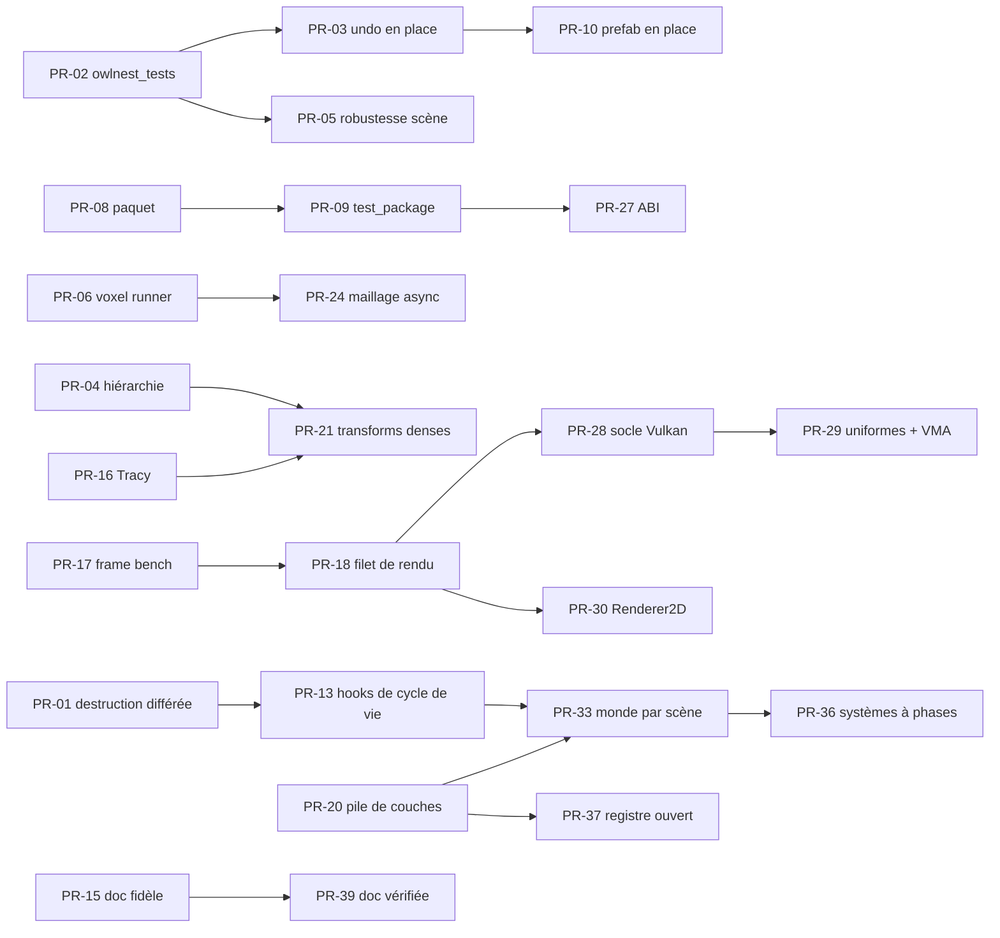

# Audit Owl — synthèse

> **Statut : v1, 2026-10-05.** Synthèse finale de l'audit du dépôt Owl (branche `Feature/Bench`, commit `45e27892`).
> Sources : [`00-cadrage.md`](00-cadrage.md), les six fichiers `10-constats-*.md`, [`20-mesures.md`](20-mesures.md),
> [`30-etat-de-l-art.md`](30-etat-de-l-art.md), [`40-avenir.md`](40-avenir.md), [`01-environnement.md`](01-environnement.md)
> et [`02-config-ia.md`](02-config-ia.md). Les gravités et statuts sont ceux **après contre-vérification** (lignes
> `Vérification`). Aucun constat nouveau n'est introduit ici ; chaque affirmation renvoie à un ID.
> Effort : **S** jours, **M** semaines, **L** mois, pour un mainteneur seul. **[O]** = opinion de l'auditeur.

[TOC]

## 1. En une page

### Verdict

Owl est un moteur solo d'une ampleur rare (2D, tilemap, raycast, voxel, éditeur avec undo, prefabs et documents),
aux choix tiers bons et à jour, avec une frontière publique/privée et un outillage plus rigoureux que son ancêtre
Hazel (A-06, A-21, H-11, fiche 12). La largeur a été achetée au prix de la profondeur : six défauts de correction
reproduits sur des chemins courants (C-01, C-02, C-03, C-04, E-01, E-02), un backend Vulkan correct par accident de
synchronisation (B-01 à B-04), un paquet moteur inutilisable (G-01, G-02) et une documentation fausse au tiers (I-01).
Les filets manquent exactement là où sont les défauts : 0 test GPU, 2,5 % de couverture éditeur, 0 test d'undo
(F-01, F-02, E-03). Il faut stabiliser et outiller en v0.2.x, refaire les fondations en v0.3, et seulement ensuite
bâtir la 3D, le réseau et le modding de la roadmap (40-avenir §6).

### Les 5 forces

1. **Frontière publique/privée tenue** : Box2D, Lua, Taskflow, spdlog, Vulkan, GL, GLFW et OpenAL sont invisibles
   des headers publics (pimpl, façades) ; seule yaml-cpp fuit (A-06, A-03). Mieux que Hazel ; rend crédible le
   remplacement d'une brique sans casser l'API.
2. **Cœur ECS et rendu 2D efficaces** : itération EnTT à 2,6 ns par entité, `Scene::copy` à 3 ms pour 10 000 entités
   sans YAML (P-08, C-16) ; Renderer2D instancié par SSBO, un draw call pour 20 000 quads à 10,5 ns par quad (B-08,
   P-05) ; pile de rendu pilotée par les données (A-15, B-22).
3. **Choix tiers solides et à jour, bien intégrés côté algorithmes** : Box2D 3.1.1, Lua 5.5, Taskflow 4.0, Slang en
   source unique pour deux backends, greedy meshing voxel avec AO (D-19, D-22, D-21, B-17, D-20 ; fiches 1, 3, 4, 6).
4. **Discipline d'outillage rare pour un projet solo** : 1 127 tests de logique avec assertions de comportement en
   3,4 s, clang-tidy à 0 constat, `-Weverything -Werror` tenu, ciblage clang-tidy par fermeture d'includes correct par
   construction, CI reproductible en local par un point d'entrée unique, CMake moderne (F-13, F-07, G-11, H-11,
   H-10, G-10).
5. **Éditeur au modèle sain** : chaque propriété des 31 composants est inspectable, éditable et annulable ;
   `UndoManager<Target>` générique partagé par tous les documents ; documentation abondante et accessible depuis
   l'éditeur (E-10, E-09, I-10).

### Les 5 faiblesses

1. **Défauts de correction sur les chemins les plus démontrés, sans filet** : use-after-free de la VM Lua par la
   pièce du sample (C-01, D-01), undo qui détache les enfants (E-01), fermeture sans demande de sauvegarde (E-02),
   prefab aplati (C-02), Play qui modifie le monde voxel de l'éditeur (C-03), segfault sur `EntityLink` (C-04), voxel
   jamais maillé dans le jeu exporté (D-03). L'undo n'a aucun test (E-03, F-02).
2. **Socle Vulkan fragile et jamais testé** : dix vidages de file par frame (B-01), `loadOp DONT_CARE` entre batchs
   (B-02), UBO et SSBO non versionnés (B-03, B-04), image de swapchain écrite avant son acquisition (B-19), aucune
   sous-allocation (B-11) ; aucun test n'exécute Vulkan ou OpenGL (F-01, B-06).
3. **Architecture héritée qui ne passe pas à l'échelle** : `Scene` objet dieu qui porte le gameplay (A-02, C-14),
   physique et VM Lua globales liées à une scène unique par pointeur brut (A-04, D-15, F-05), ~25 singletons au cycle
   de vie dispersé (A-08), composants fermés à la compilation (A-05), modules en cycle (A-01).
4. **Paquet moteur inutilisable et jamais consommé** : headers installés au mauvais endroit (G-02), `-Werror
   -Weverything` imposés aux consommateurs (G-01), préfixe d'installation ignoré (G-06), yaml-cpp exigé sans être
   déclaré (G-07, A-03), toutes les dépendances privées exportées (A-10), aucun `test_package` (G-03).
5. **Écart entre ce qui est annoncé et ce qui existe** : `on_collision`, `other_id`, volumes par catégorie et joints
   documentés mais absents (D-07, I-02) ; manette au README (I-03) ; mipmaps annoncées jamais générées (B-18) ; OpenGL
   « 4.5 » qui exige 4.6 (B-16) ; 34 % d'affirmations fausses ou périmées dans les pages contrôlées (I-01) ; consigne
   IA « Slang ~50 s » fausse d'un facteur ~700 (P-13).

### Les 5 bizarreries

1. **Les transforms monde sont calculées deux fois par frame**, sur CPU puis sur GPU, et la version GPU (comme les
   chemins hors frame) tronque silencieusement au-delà de 64 ancêtres ; `setParent` y corrompt la position de façon
   permanente (B-12, P-04, P-01, C-18).
2. **Du code écrit pour un futur qui n'est pas venu** : culling GPU, tri bitonique et draw indirect branchés aux deux
   backends sans appelant (B-20), `parallelForEach` sans appelant (D-24), `IFactory` générique pour un seul usage
   (A-18), une `LuaEngine` partagée que personne n'utilise (D-26).
3. **Le `.owlpack` est obfusqué par XOR puis extrait intégralement en clair au démarrage**, puis une seconde fois dans
   `/tmp/owl_pack_cache` partagé entre utilisateurs ; un pack modifié sans changement de taille laisse des assets
   périmés (D-10), et l'extraction écrit hors du dossier sur un chemin forgé (D-02).
4. **Des tests qui figent les défauts** : `getEntityCount()` renvoie toujours 0 et un test le verrouille, rendant
   cinq assertions d'aller-retour vides (C-07, P-14) ; un test vérifie que le tri bitonique ne trie *pas* sur Null
   (B-06) ; le test de version recopie un littéral (F-06).
5. **Beaucoup de documentation, mais pas la bonne** : 66 % des lignes des headers publics sont de la doc, dont au
   moins 300 `@brief` de remplissage (« Default constructor. »), sous `WARN_AS_ERROR` ; pendant ce temps la doc
   d'usage a décroché (I-06, I-01, I-02).

### Défauts de correction à corriger en priorité

Tous confirmés (reproduits ou lus sans ambiguïté). Ordre : exposition × gravité, puis coût.

| Rang | Constats   | Symptôme                                                                           | Exposition                          | Effort | PR    |
|------|------------|------------------------------------------------------------------------------------|-------------------------------------|--------|-------|
| 1    | C-01, D-01 | `destroy_entity(self)` libère la VM Lua en cours d'exécution, corrompt un Trigger  | chaque pièce ramassée du sample     | S      | PR-01 |
| 2    | E-01, C-05 | Undo d'une entité parente : enfants détachés et déplacés                           | chaque gizmo ou édition d'un parent | S-M    | PR-03 |
| 3    | E-02       | Drapeau « modifié » faux : fermeture sans demande, modifications perdues           | sauver, annuler, modifier           | S      | PR-03 |
| 4    | C-04       | `EntityLink` vers une cible absente : SIGSEGV dans `onUpdateRuntime`               | faute de frappe, cible détruite     | S      | PR-05 |
| 5    | C-03       | Le Play partage les chunks voxel : l'état de jeu est sauvé dans la scène           | tout Play d'une scène voxel         | S      | PR-05 |
| 6    | D-03       | Le runner ne maille jamais le voxel : rien ne s'affiche dans le jeu exporté        | toute scène voxel exportée          | S      | PR-06 |
| 7    | C-02, E-11 | « Update/Revert to Prefab » aplatit l'instance et écrase position et surcharges    | toute instance à plusieurs entités  | M      | PR-10 |
| 8    | P-01, C-18 | Monde faux au-delà de 64 niveaux ; `setParent` corrompt la position                | hiérarchies générées                | S      | PR-04 |
| 9    | D-02       | `.owlpack` forgé : écriture hors dossier (zip-slip), `bad_alloc` non rattrapé      | pack tiers, mod                     | S      | PR-07 |
| 10   | E-08       | SceneFlow : double `addComponent<Transform>`, corruption du storage en Release     | création de lien de téléportation   | S      | PR-05 |
| 11   | D-04, C-08 | Corps Box2D jamais détruits (collider fantôme), `on_destroy` jamais appelé         | destruction en Play                 | S-M    | PR-13 |
| 12   | G-02, G-01 | Paquet moteur : `#include <owl.h>` échoue, `-Weverything` imposé                   | tout consommateur du paquet         | S      | PR-08 |
| 13   | G-06       | `CMAKE_INSTALL_PREFIX` ignoré ; la recette DepManager importe un dossier vide      | `depmanager build .`                | S      | PR-08 |
| 14   | B-19       | Image de swapchain effacée avant son sémaphore d'acquisition (runner, Vulkan)      | chaque frame du runner Vulkan       | S      | PR-28 |
| 15   | C-06       | Cycle de hiérarchie ou UUID dupliqué acceptés ; 1 048 577 entités à la duplication | fichier fusionné à la main          | S      | PR-05 |
| 16   | F-05       | `PhysicCommand` garde un `Scene*` pendant (tests dépendants de l'ordre)            | tests ; scène détruite en Play      | S      | PR-11 |
| 17   | E-12, C-17 | Téléportation ratée qui laisse un Play démonté ; caches armés trop tôt             | niveau manquant ; trigger           | S      | PR-05 |
| 18   | A-17, D-23 | Logs client formatés envoyés au logger moteur                                      | tout `OWL_INFO` avec argument       | S      | PR-16 |

## 2. Comptes par axe

Après contre-vérification. « Plausible » compte les constats dont le statut principal n'est pas « confirmé ».
L'axe P regroupe les constats de `20-mesures.md` ; l'axe J (configuration IA) est traité dans `02-config-ia.md`, sans ID.

| Axe                | Constats | Forces | Faiblesses | Risques | Étrangetés | Haute  | Moyenne | Basse  | Plausibles |
|--------------------|----------|--------|------------|---------|------------|--------|---------|--------|------------|
| A Architecture     | 21       | 5      | 11         | 2       | 3          | 4      | 11      | 6      | 1          |
| B Rendu            | 25       | 4      | 14         | 3       | 4          | 4      | 13      | 8      | 0          |
| C Scène, ECS       | 18       | 2      | 12         | 1       | 3          | 4      | 11      | 3      | 0          |
| D Sous-systèmes    | 29       | 6      | 14         | 5       | 4          | 4      | 17      | 8      | 2          |
| E Éditeur          | 12       | 2      | 9          | 1       | 0          | 3      | 7       | 2      | 0          |
| F Qualité          | 13       | 1      | 7          | 2       | 3          | 2      | 5       | 6      | 1          |
| G Build, packaging | 19       | 1      | 7          | 5       | 6          | 4      | 7       | 8      | 2          |
| H CI               | 12       | 3      | 4          | 3       | 2          | 0      | 8       | 4      | 1          |
| I Documentation    | 10       | 1      | 7          | 0       | 2          | 0      | 6       | 4      | 0          |
| P Mesures          | 14       | 3      | 7          | 1       | 3          | 0      | 8       | 6      | 0          |
| **Total**          | **173**  | **28** | **92**     | **23**  | **30**     | **25** | **93**  | **55** | **7**      |

Lecture :

- Les 25 constats de gravité haute se répartissent sur sept axes ; les axes H, I et P n'en ont aucun après
  vérification. Seize gravités ont baissé à la contre-vérification (dont A-01, A-03, B-04, B-05, P-02,
  P-07), une seule a monté (G-06).
- Aucun constat n'a été réfuté. Les plausibles sont A-21, D-09, D-17, F-10, G-16, G-17 et H-06 ; plusieurs autres sont
  confirmés sur le code avec un symptôme seulement plausible (B-01, B-02, B-19, A-03, A-10, G-06).
- G-12 (clé privée et identifiants dans `output/`) est **résolu** depuis la rédaction.
- **Doublons à traiter ensemble** : C-01 = D-01 ; E-03 = F-02 ; C-07 = P-14 ; C-18 ⊂ P-01 ; B-12 = P-04 ;
  A-04 ≈ D-15 ; A-03 ≈ G-07 ; A-17 ≈ D-23 ; B-14 ≈ D-17 ; D-08 ≈ P-09 ; D-14 ⊃ P-12 ; D-07 ≈ I-02 ; A-02 ≈ C-14 ;
  B-05 ≈ F-11 ≈ P-13. Une fois fusionnés, il reste environ 158 constats distincts.

## 3. Plan d'action priorisé

Chaque ligne est une PR candidate, sur une branche dédiée. La colonne « Ordre » donne une séquence globale
recommandée ; « Dépend de » liste les PR à fusionner avant. Les chantiers de long terme (3D, réseau, modding,
plateformes) sont dans `40-avenir.md` et ne figurent pas ici.

### Lot 1 — Correction

| Ordre | PR    | Titre                                                    | Constats couverts                  | Gain                                                   | Effort | Dépend de    |
|-------|-------|----------------------------------------------------------|------------------------------------|--------------------------------------------------------|--------|--------------|
| 1     | PR-01 | Destruction d'entité différée et test « coin »           | C-01, D-01                         | Fin du use-after-free du sample                        | S      | —            |
| 2     | PR-02 | Catégorie `owlnest_tests` (undo, commandes, snapshots)   | E-03, F-02, C-07, P-14             | Premier filet de l'éditeur ; assertions vides réparées | S      | —            |
| 3     | PR-03 | Undo restauré en place, dirty par compteur de génération | E-01, E-02, C-05, E-05             | Plus d'enfants détachés ni de pertes à la fermeture    | S-M    | PR-02        |
| 4     | PR-05 | Robustesse de la scène au runtime                        | C-03, C-04, E-08, C-06, C-17, E-12 | Plus de segfault, Play isolé, chargement validé        | S-M    | PR-02        |
| 5     | PR-06 | Préparer le voxel dans le pipeline de rendu de la scène  | D-03                               | Voxel visible dans le jeu exporté                      | S      | —            |
| 6     | PR-04 | Hiérarchie sans plafond, monde CPU envoyé au GPU         | P-01, C-18, P-03, P-04, B-12       | Monde juste à toute profondeur ; une passe en moins    | S      | —            |
| 10    | PR-10 | Prefab : mise à jour en place, surcharges détectées      | C-02, E-11                         | « Update from Prefab » utilisable                      | M      | PR-02, PR-03 |
| 13    | PR-13 | Cycle de vie physique, son et script par hooks EnTT      | C-08, D-04                         | Plus de collider fantôme ; `on_destroy` appelé         | M      | PR-01        |
| 25    | PR-25 | Version de format de scène, écritures atomiques          | C-10, C-13                         | Migrations possibles ; plus de fichier tronqué         | S      | —            |

### Lot 2 — Sécurité

| Ordre | PR    | Titre                                                       | Constats couverts      | Gain                                                           | Effort | Dépend de |
|-------|-------|-------------------------------------------------------------|------------------------|----------------------------------------------------------------|--------|-----------|
| 7     | PR-07 | `.owlpack` : chemins et tailles validés, exceptions, fuzzer | D-02, D-28             | Plus d'écriture hors dossier ni de crash à l'ouverture         | S      | —         |
| 12    | PR-12 | Secrets CI hors argv et hors logs, `api.py` épinglé         | H-01, H-02, G-09, H-12 | Identifiants non journalisés ; pas de code distant non vérifié | S      | —         |
| 14    | PR-14 | Lua : mode texte, quotas, trampoline d'exceptions           | D-06, D-16             | Sandbox réel ; pas de `longjmp` à travers du C++               | S      | —         |

### Lot 3 — Performance et mesure

| Ordre | PR    | Titre                                                        | Constats couverts           | Gain                                                  | Effort | Dépend de    |
|-------|-------|--------------------------------------------------------------|-----------------------------|-------------------------------------------------------|--------|--------------|
| 16    | PR-16 | Tracy derrière `OWL_PROFILE_*`, tracker coupé en Debug, logs | D-12, D-11, D-23, A-17      | Profiler de frame utilisable ; Debug non faussé       | S      | —            |
| 17    | PR-17 | Mode `--frame-bench` du runner, timestamps GPU               | 20-mesures §7, B-01 (PM-01) | Premières mesures GPU, OpenGL contre Vulkan           | M      | —            |
| 21    | PR-21 | Transforms denses par frame, composition TRS directe         | P-02, P-06, C-09            | Facteur 3 à 5 attendu sur la frame CPU [O]            | M      | PR-04, PR-16 |
| 22    | PR-22 | Physique à pas fixe, solveur Box2D multi-thread              | D-05, P-12, D-14            | Déterminisme ; 5 000 corps hors du tiers de frame     | S-M    | —            |
| 23    | PR-23 | Inspecteur : sérialiser le seul composant, sur édition       | E-04                        | Plus de sérialisation d'entité par frame              | S      | —            |
| 24    | PR-24 | Maillage voxel sur workers, budget, voisins invalidés        | D-08, P-09, B-15            | Plus de pics de 5 à 9 ms au streaming                 | M      | PR-06        |
| 30    | PR-30 | Renderer2D : transitoires par frame, tri 2D, texte UTF-8     | B-09, B-10, D-18            | Ordre garanti ; plus de « ? » ; moins de flush        | M      | PR-18        |
| 31    | PR-31 | Tilemap persistante, découpée et cullée                      | B-13                        | Plus de cellules tronquées ; upload à la modification | M      | PR-18        |

### Lot 4 — Packaging

| Ordre | PR    | Titre                                                      | Constats couverts                        | Gain                                                 | Effort | Dépend de |
|-------|-------|------------------------------------------------------------|------------------------------------------|------------------------------------------------------|--------|-----------|
| 8     | PR-08 | Paquet moteur consommable, source unique de version        | G-01, G-02, G-06, A-19, G-19, F-06       | `find_package(OwlEngine)` utilisable                 | S      | —         |
| 9     | PR-09 | `test_package` dans l'action Package, nom de paquet unique | G-03                                     | La régression G-01 / G-02 ne peut plus se reproduire | M      | PR-08     |
| 26    | PR-26 | Configure hermétique, ménage CMake et dépendances          | G-05, G-09, G-13, G-14, G-15, I-09, G-08 | Configure sans Doxygen ni réseau ; libpng à jour     | S      | —         |
| 27    | PR-27 | ABI : YAML hors API publique, visibilité cachée par défaut | A-03, G-07, A-10, A-12                   | Plus de risque ODR ; symboles tiers non exportés     | M      | PR-09     |

### Lot 5 — Qualité et CI

| Ordre | PR    | Titre                                                   | Constats couverts                  | Gain                                                    | Effort | Dépend de |
|-------|-------|---------------------------------------------------------|------------------------------------|---------------------------------------------------------|--------|-----------|
| 11    | PR-11 | Sanitizers qui échouent, `--gtest_shuffle`, LSan retiré | F-03, F-05, F-12, H-05             | UB et dépendances d'ordre détectés ; un job de moins    | S      | —         |
| 18    | PR-18 | Filet de rendu headless sur lavapipe et llvmpipe        | F-01, B-06, B-20                   | Premier test qui exécute Vulkan et OpenGL               | M      | PR-17     |
| 19    | PR-19 | ClangTidy multi-processus, analyzer, couverture honnête | H-03, F-07, F-04, F-08, F-09, H-07 | Analyse ~10 fois plus rapide ; couverture vraie publiée | S-M    | —         |
| 20    | PR-20 | Pile de couches vérifiée dans CodeStyle                 | A-01, A-13                         | Cycle de 10 modules rompu, régression bloquée           | S      | —         |
| 34    | PR-34 | Tests de l'outillage CI (pytest, ruff, mypy)            | H-04, H-08                         | Gates CI eux-mêmes testés                               | M      | —         |

### Lot 6 — Dette d'architecture

| Ordre | PR    | Titre                                                           | Constats couverts            | Gain                                                   | Effort | Dépend de    |
|-------|-------|-----------------------------------------------------------------|------------------------------|--------------------------------------------------------|--------|--------------|
| 28    | PR-28 | Socle Vulkan : frames en vol, transitions dans la frame, loadOp | B-01, B-02, B-04, B-19       | CPU et GPU en parallèle ; correct hors NVIDIA          | L      | PR-17, PR-18 |
| 29    | PR-29 | Anneau d'uniformes par frame, VMA                               | B-03, B-11, B-23             | `drawMesh` multiple et plusieurs caméras corrects      | M      | PR-28        |
| 32    | PR-32 | Découpage d'`EditorLayer` (packager, ruban, ouverture)          | E-07, E-12                   | `EditorLayer` sous 1 000 lignes                        | M      | PR-02        |
| 33    | PR-33 | Contexte moteur et monde par scène                              | A-04, D-15, A-08, A-07, F-05 | Plusieurs mondes ; tests parallèles                    | M-L    | PR-13, PR-20 |
| 35    | PR-35 | Références d'entité par UUID, remap à la duplication            | C-12, C-04                   | Liens robustes au renommage et à la duplication        | M      | PR-25        |
| 36    | PR-36 | Systèmes à phases, gameplay sorti de `Scene`                    | A-02, C-14                   | Fin du goulet de `Scene.cpp`                           | L      | PR-33        |
| 37    | PR-37 | Registre de composants ouvert (après EnTT v4)                   | A-05, A-18                   | Composants de jeux tiers sérialisables et inspectables | M-L    | PR-20        |

### Lot 7 — Documentation

| Ordre | PR    | Titre                                                   | Constats couverts                              | Gain                                                 | Effort | Dépend de |
|-------|-------|---------------------------------------------------------|------------------------------------------------|------------------------------------------------------|--------|-----------|
| 15    | PR-15 | Doc fidèle au code (Lua, renderer, README, guides)      | I-01, I-02, I-03, I-04, I-05, D-07, B-16, B-18 | Plus de fonction promise et absente                  | S-M    | —         |
| 38    | PR-38 | Doxygen proportionné, badge « Ongoing » dans la roadmap | I-06, I-07                                     | Headers lisibles ; effort reporté sur la doc d'usage | S      | —         |
| 39    | PR-39 | Contrôle des identifiants cités dans `doc/pages` en CI  | I-01, I-09                                     | La dérive I-01 ne peut plus revenir en silence       | S      | PR-15     |

### Séquence recommandée

[O] Les lots 1, 2 et l'essentiel des lots 4, 5 et 7 tiennent en v0.2.2 et v0.2.3 (environ 25 PR de taille S ou M).
Les PR-28 à PR-37 sont des chantiers de v0.3, à ouvrir seulement une fois PR-17 et PR-18 en place.

## 4. Décisions qui reviennent au mainteneur

| #   | Question                                                                                                    | Options                                                                                       | Constats                  |
|-----|-------------------------------------------------------------------------------------------------------------|-----------------------------------------------------------------------------------------------|---------------------------|
| 1   | Ouvrir v0.2.2 par un lot de stabilisation avant l'isométrique ?                                             | lot 1 en tête de v0.2.2 ; patch 0.2.1.x ; statu quo                                           | C-01, E-01, E-02, D-03    |
| 2   | Que faire du socle de rendu avant la 3D de v0.3 ?                                                           | refonte maison du socle Vulkan ; RHI tierce (SDL_GPU, NVRHI, wgpu) ; geler OpenGL en repli    | B-01, B-07, B-16, fiche 2 |
| 3   | Le paquet moteur pour des tiers (OwlDrone) est-il un objectif réel ?                                        | oui : PR-08, PR-09, PR-27 ; non : retirer `owl_engine.py` et les mentions                     | G-01, G-02, G-03          |
| 4   | Le gameplay (Victory/Death, `VoxelPlayer`, inventaire, ennemis) a-t-il sa place dans le moteur ?            | sortir vers le sample ou des modules ; garder                                                 | A-02, C-14                |
| 5   | Contributions externes visées ?                                                                             | si oui : chaîne de dépendances publique, GitHub Actions minimal ; sinon DepManager + lockfile | G-04, fiches 8 et 9       |
| 6   | Le modding de v0.5 vise-t-il du code non fiable ?                                                           | Lua 5.5 durci ; Luau ; mods de données seulement                                              | D-06, D-02, fiche 4       |
| 7   | Modèle Lua : un `lua_State` par entité ou une VM partagée avec `_ENV` par script ?                          | isolation actuelle (~9 Ko, 30 µs par instance) ; VM partagée                                  | P-11, D-22                |
| 8   | YAML comme format interne (undo, prefab, copie) ?                                                           | rapidyaml ; binaire cuit pour runtime et undo ; statu quo                                     | P-07, C-10, fiche 5       |
| 9   | Exigence Doxygen : documenter le privé et les membres triviaux sous `WARN_AS_ERROR` ?                       | alléger (API publique seulement) ; garder                                                     | I-06                      |
| 10  | Protection de branche : quels checks requis pour fusionner sur `main` ? arm64 émulé sur chaque PR ?         | Build Linux Clang + CodeStyle + ASan requis ; arm64 en nightly                                | H-06, H-05                |
| 11  | Emplacement de la roadmap : `doc/pages/roadmap.md` publiée, ou `ROADMAP.md` racine (règle globale) ?        | garder et amender la règle globale ; déplacer                                                 | I-07, 02-config-ia §2     |
| 12  | Valider les décisions prises en ton nom lors de la reconfiguration IA                                       | commits locaux autorisés, `ask` sur push, Docker sans `--privileged`                          | 02-config-ia §2           |
| 13  | La montée en 0.2.2 est arrivée dans un commit d'outillage CI : la garder sur `Feature/Bench` ou la sortir ? | kickoff dédié (règle du projet) ; garder                                                      | F-06, G-19                |

## 5. L'IA dans ce dépôt

### Ce qui a été fait

La première passe (02-config-ia §2) a réduit le contexte chargé à chaque session de ~55 Ko à ~14,5 Ko, levé trois
contradictions bloquantes (build natif contre Docker, commits, format du changelog), créé `docker/run.sh` et la skill
`check`, et réduit la mémoire de 39 à 8 fichiers. La vague de huit agents d'axe (02-config-ia §4) a fonctionné sur
cette base : 130 k à 360 k tokens et 7 à 60 min par agent, l'orchestrateur ne recevant qu'un résumé.

### Ce que l'audit a révélé sur la configuration

- **Des consignes fausses orientent le travail.** « Slang ~50 s » (P-13, F-11, B-05) a fait classer B-05 en haute
  avant mesure ; « une caméra 2D par frame » présente un défaut (B-03) comme une règle ; « atlas avec mipmaps »
  décrit une fonction inexistante (B-18) ; `FORCE_RELEASE` est présenté comme fonctionnel (G-14) ; une commande
  DepManager invalide est prescrite (I-04).
- **Les agents ont besoin d'être relus.** La contre-vérification a baissé seize gravités et n'en a monté qu'une : sans
  elle, la synthèse aurait surévalué plusieurs constats (A-01, B-04, B-05, P-02, P-07). Les comparaisons aux autres
  moteurs venaient de la mémoire des modèles tant que `30-etat-de-l-art.md` ne les a pas sourcées.
- **Le harnais injecte l'instantané de début de session.** Ce sous-agent de synthèse a encore reçu l'ancien index
  mémoire de 117 lignes (« Don't Docker-build », « User commits manually », « ~50s »), alors que le fichier sur disque
  n'en compte plus que 12. Une consigne corrigée ne prend effet qu'à la session suivante.

### Ce qui reste à faire

| Action                                                                                                          | Source                      | Effort |
|-----------------------------------------------------------------------------------------------------------------|-----------------------------|--------|
| Corriger `renderer.md` (« une caméra 2D par frame ») au moment de traiter B-03                                  | 02-config-ia §4, B-03       | S      |
| Corriger `editor.md:37` (« mipmapped atlas »), `cmake.md:33` (`FORCE_RELEASE`), `dependencies.md:27` (CLI)      | B-18, G-14, I-04            | S      |
| Tester un hook `PostToolUse` lançant `clang-format` en Docker sur chaque fichier C++ édité                      | 02-config-ia §3.1           | S      |
| Évaluer le MCP CLion (`get_file_problems`, `search_symbol`) face à grep + clang-tidy                            | 02-config-ia §3.2           | S      |
| Reformater les entrées `[Unreleased]` du `CHANGELOG.md` en une ligne par changement                             | 02-config-ia §3.3, I-08     | S      |
| Déplacer la doc utilisateur (undo, sauvegarde, réglages) dans `doc/pages/`, les règles y renvoyant              | 02-config-ia §3.4           | M      |
| Citer `docker/run.sh` comme convention de lanceur dans la règle globale                                         | 02-config-ia §3.5           | S      |
| Relever les règles réellement chargées par les agents et élaguer celles qui n'ont pas servi                     | 02-config-ia §3.6           | S      |
| Ajouter à l'image les outils manquants : `perf`, Tracy, `heaptrack`, `renderdoccmd`, `hyperfine`, `spirv-tools` | 01-environnement §3         | S      |
| Aligner l'image locale et l'image CI (ou un tag commun)                                                         | H-09                        | S      |
| Faire de la contre-vérification adverse une étape standard de toute campagne d'agents                           | §7.3 du cadrage, ce fichier | S      |
| Exiger la mention « non revérifié » sur toute comparaison externe non sourcée                                   | 02-config-ia §4             | S      |
