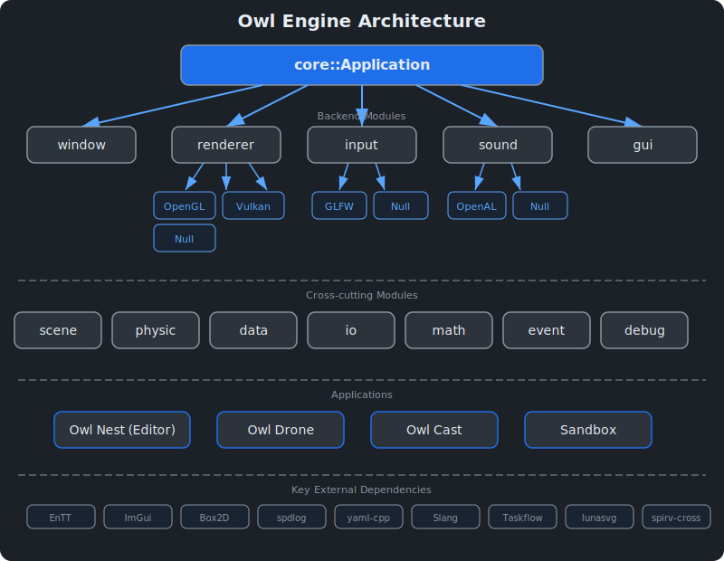
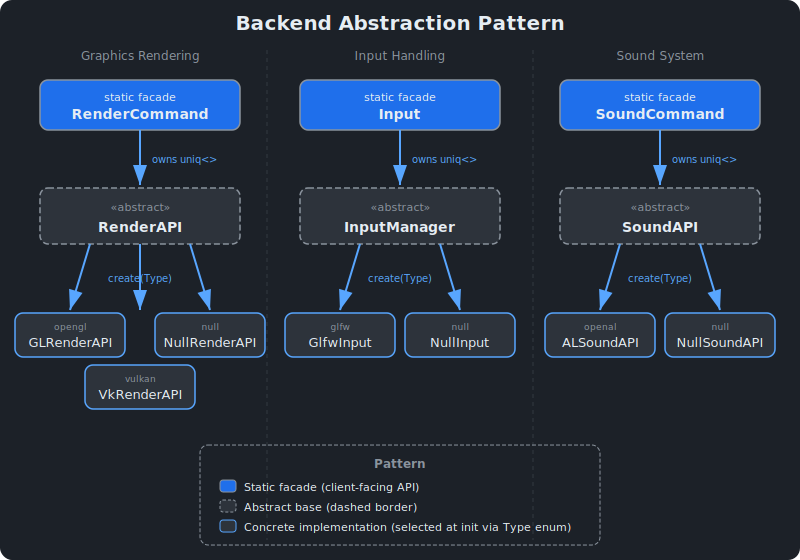
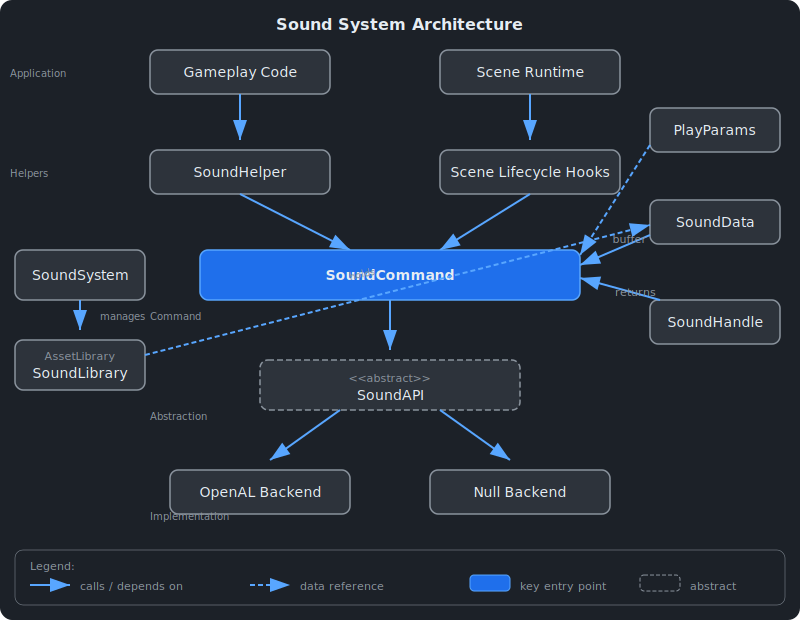
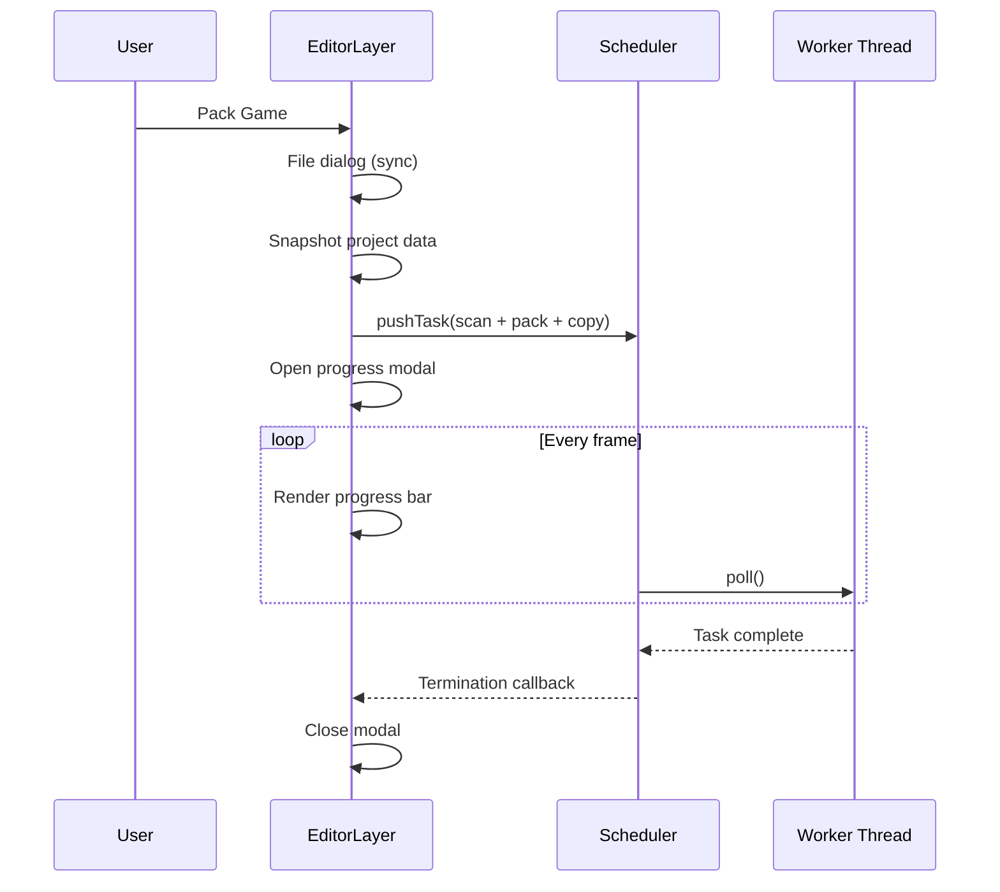
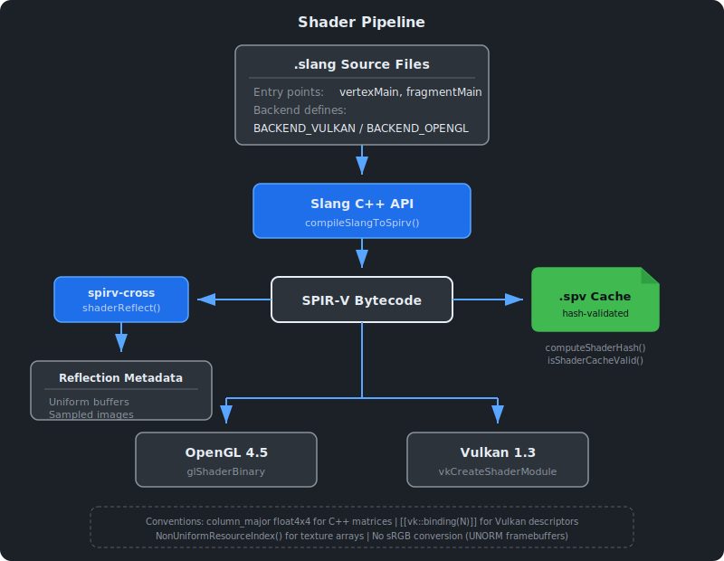
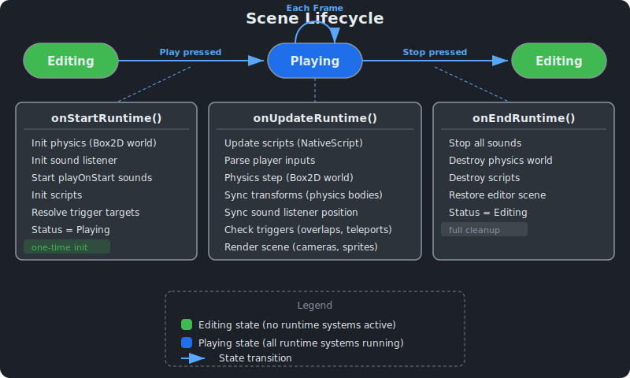
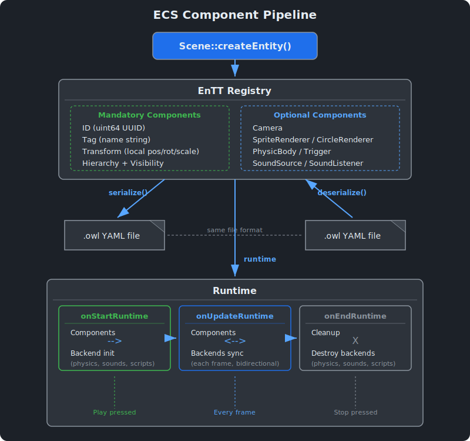
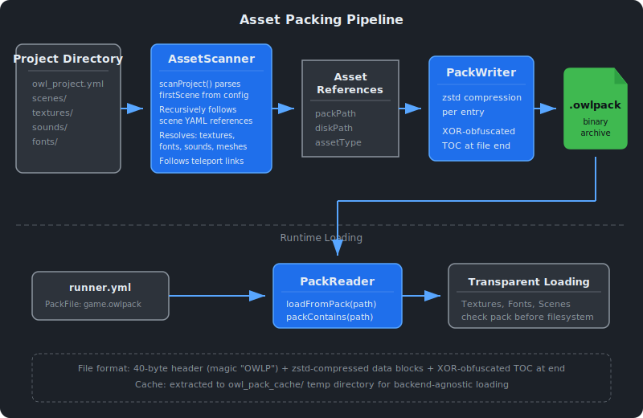

# Architecture Overview {#page-architecture}

[TOC]

This page describes the high-level architecture of the Owl engine.

## Engine Modules



The engine library (`source/owl/`) is organized into the following modules:

| Module     | Description                                                        |
|------------|--------------------------------------------------------------------|
| `core`     | Application lifecycle, logging, assertions, smart pointers, tasks  |
| `renderer` | Rendering abstraction, buffers, shaders, framebuffers              |
| `scene`    | Entity-Component-System (EnTT), scene graph, components, save/load |
| `script`   | Lua 5.5 embedded scripting (sandboxed `LuaEngine` per entity)      |
| `physic`   | 2D physics (Box2D integration)                                     |
| `sound`    | Audio playback and device management                               |
| `input`    | Keyboard, mouse, and gamepad input abstraction                     |
| `window`   | Window creation and management                                     |
| `gui`      | ImGui/ImGuizmo integration for editor UI                           |
| `data`     | Geometry, mesh loading (OBJ, glTF, FBX), data structures           |
| `math`     | Math utilities (zeus library)                                      |
| `debug`    | Profiling, memory tracking, stack traces (cpptrace)                |
| `event`    | Event system (application, input, window events)                   |
| `io`       | File I/O, serialization (YAML, XML, asset packing)                 |

Public headers live in `source/owl/public/` and implementation files in `source/owl/private/`, both mirroring the module
structure.

**Dedicated guides:** [Renderer](renderer.md) · [Scene & Components](scene.md) ·
[Events & Input](event_input.md) · [Physics](physics.md) · [Sound](sound.md) ·
[Lua Scripting](scripting.md) · [Editor (Owl Nest)](editor.md) ·
[Node Graph Framework](node_graph.md)

## Backend System

Owl uses a backend abstraction so that different platform APIs can be swapped at runtime.



### Graphics Backends

| Backend  | API         | Notes                                         |
|----------|-------------|-----------------------------------------------|
| `OpenGL` | OpenGL 4.5  | Widely supported on desktop; limited on ARM64 |
| `Vulkan` | Vulkan 1.4+ | Modern low-level API; full desktop support    |
| `Null`   | None        | Headless mode for servers or testing          |

See [Renderer](renderer.md) for the full rendering pipeline, batch system, and camera details.

### Input Backends

| Backend | Library | Notes                               |
|---------|---------|-------------------------------------|
| `GLFW`  | GLFW    | Windowing, keyboard, mouse, gamepad |
| `Null`  | None    | Headless mode                       |

### Sound Backends

| Backend  | Library | Notes                            |
|----------|---------|----------------------------------|
| `OpenAL` | OpenAL  | Audio playback and spatial sound |
| `Null`   | None    | Silent mode                      |

## Sound System

The sound module provides audio playback through a backend-agnostic API.



The system follows the same abstraction pattern as graphics and input:
`SoundCommand` delegates to a `SoundAPI` implementation (OpenAL or Null), selected at application startup.

At the scene level, **SoundSource** and **SoundListener** ECS components drive spatial audio during runtime. The OpenAL
backend uses the inverse-distance-clamped attenuation model for 3D positional sound.

See [Sound System](sound.md) for the full user guide covering components, spatial audio, and gameplay triggers.

## Applications

The project produces several executables built on top of the `OwlEngine` shared library:

| Application | Directory         | Description                                                        |
|-------------|-------------------|--------------------------------------------------------------------|
| Owl Nest    | `source/owlnest/` | Scene editor with project management (editor + runner executables) |

## Project System

Owl Nest supports a project-based workflow. A project is a directory containing an
`owl_project.yml` configuration file:

```yaml
OwlProject:
  name: "My Project"
  firstScene: "scenes/Example.owl"
```

When a project is opened, its directory is added as a high-priority asset directory, making its contents visible in the
content browser. The editor window title reflects the active project name. Scenes can be imported into the project via
the **Project >
Import Scene** menu item.

### Async Packaging Flow

Long-running operations (game packaging, scene packing) are executed asynchronously via the engine's task scheduler,
with modal progress overlay in the editor:



## Shader Pipeline



Shaders are written in **Slang** (`.slang` files), a single-source shading language:

1. **Source**: `engine_assets/shaders/<renderer>/slang/<name>.slang`
2. **Compilation**: `compileSlangToSpirv()` compiles Slang to SPIR-V at runtime using the Slang C++ API, with
   `BACKEND_VULKAN` or `BACKEND_OPENGL` preprocessor defines
3. **Reflection**: `shaderReflect()` uses spirv-cross to extract uniform buffers and sampled images from the SPIR-V
   bytecode
4. **Caching**: SPIR-V binaries are cached as `.spv` files with hash-based validation

See [Renderer > Shader System](renderer.md) for the shader class API.

Key conventions:

- Entry points: `[shader("vertex")] vertexMain` and `[shader("fragment")] fragmentMain`
- Matrices: `column_major float4x4` for C++ interop (Slang defaults to row-major)
- Vulkan bindings: `[[vk::binding(N)]]` for explicit descriptor bindings
- Backend branching: `#ifdef BACKEND_VULKAN` for texture binding differences

## Scene Hierarchy





Entities support parent-child relationships via the **Hierarchy** component (mandatory on every entity).
See [Scene & Components](scene.md) for the full component reference and entity lifecycle.

### Transform Inheritance

Each entity's `Transform` component stores a **local** transform (relative to its parent). The world-space transform is
computed on demand by walking the parent chain:

```
worldTransform = parentWorldTransform * localTransform
```

For root entities (`parentId == 0`), local equals world (zero overhead).

### Visibility Inheritance

If any ancestor is hidden (editor or game mode), the entity is effectively hidden.
`Scene::isEffectivelyVisible()` walks the parent chain to check; results are memoised per pass in `m_visibilityCache` so
sibling entities sharing the same root chain only pay the walk once per tick.

### Hierarchy Operations

| Operation                | Behaviour                                                                       |
|--------------------------|---------------------------------------------------------------------------------|
| **Set parent**           | Circular reference check, local transform recomputed to preserve world position |
| **Unparent**             | Entity becomes root, world transform stored as new local                        |
| **Delete entity**        | Children reparented to grandparent (or root); world position preserved          |
| **Delete with children** | Cascade delete of entire subtree                                                |
| **Duplicate entity**     | Duplicate is a root entity with no children                                     |
| **Duplicate subtree**    | Recursive duplicate with new UUIDs and correct parent references                |

### Physics and Hierarchy

Physics bodies (Box2D) operate in **world space** independently of the scene hierarchy. The hierarchy does **not**
create physical constraints between entities.

| Situation                                | Behaviour                                                                                                                                   |
|------------------------------------------|---------------------------------------------------------------------------------------------------------------------------------------------|
| Non-physics parent moves → physics child | Child **stays in place** (Box2D controls its world position). Its local transform is recalculated each frame relative to the moving parent. |
| Physics parent falls → physics child     | Each body moves **independently** according to Box2D simulation. No physical link.                                                          |
| Physics parent moves → non-physics child | Child **follows** the parent via transform inheritance (normal hierarchy behaviour).                                                        |

To physically attach a child body to a parent body (e.g., an object welded to a platform), use Box2D joints (weld,
revolute, etc.) — this is separate from the hierarchy system.

### Serialization

The `Hierarchy` component serializes the `parentId` (UUID). Children lists are rebuilt from parent references after
deserialization (`Scene::rebuildHierarchyChildren()`). Old scenes without hierarchy data load correctly (all entities
default to root).

### Editor (Owl Nest)

The Scene Hierarchy panel displays entities as a tree. Drag-and-drop reparents entities. Right-click context menu
provides: Create Root/Child Entity, Duplicate/Duplicate Subtree, Unparent, Delete Entity Only, Delete with Children.

## Icon System

Editor icons are **SVG files loaded and rasterized at runtime** via
[lunasvg](https://github.com/nicbarker/lunasvg), with dynamic theme colour substitution.

### Directory Structure

SVG sources are organized by usage in `source/owlnest/assets_sources/icons/`:

| Directory     | Content                                                             |
|---------------|---------------------------------------------------------------------|
| `toolbar/`    | Playback buttons (play, pause, stop, step), gizmo controls (ctrl_*) |
| `browser/`    | Content browser file type icons (folder, glsl, png, ...)            |
| `visibility/` | Eye/camera visibility toggles                                       |
| `triggers/`   | Trigger type overlay icons (victory, death, ...)                    |
| `components/` | Component display icons (transform, camera, ...)                    |
| `panels/`     | Panel icons (scene_hierarchy, properties, ...)                      |
| `actions/`    | Menu/action icons (save, delete, duplicate, ...)                    |
| `templates/`  | SVG base templates (not rendered)                                   |

### Runtime Rendering and Theming

At startup, `IconBank::build()` loads SVG files via lunasvg, applies colour substitution in memory, rasterize to pixel
buffers, and packs into a GPU texture atlas (64px cell, mipmaps).

**Colour convention** (SVG files are never modified on disk):

- White (`#ffffff`) → substituted with theme primary text colour
- Fuchsia (`#ff00ff`) → substituted with theme accent colour
- All other colours (R/G/B gizmo axes, etc.) → kept as-is

When the theme changes, `IconBank::rebuild()` re-rasterize all SVGs with the new colours.

### Scene-Rendered Icons (Triggers)

Trigger overlay icons are also rendered in the viewport via `Renderer2D` and require PNG textures at 512x512. These are
pre-rasterized from the same SVG sources:

```bash
poetry run python source/owlnest/assets/icons/generate_icons.py
```

This script only rasterize the `triggers/` category using `cairosvg`.

## Task System

The engine includes a task scheduler backed by [Taskflow](https://github.com/taskflow/taskflow) 4.0:

- **Public API** (`core/task/`): `Task`, `Scheduler`, `Timer`
- **Private implementation**: `SchedulerImpl` owns a `tf::Executor` (thread pool sized to `hardware_concurrency`)
- **Parallel utilities**: `parallelForEach` / `parallelForIndex` templates
- Taskflow is a PRIVATE dependency — not exposed in public headers

## Game Settings

The `SettingsManager` provides a persistent two-layer key-value store for game configuration:

- **Game defaults** — loaded from `game_settings.yml` in the project assets (packed with the game)
- **User overrides** — loaded from `settings.yml` in the user directory (`~/.local/share/<game>/`
  on Linux, `%APPDATA%/<game>/` on Windows)

Built-in keys (`resolution_width`, `resolution_height`, `fullscreen`, `resizable`,
`volume_master`, `volume_music`, `volume_sfx`) are auto-applied to the Window and SoundCommand via
`SettingsManager::applyBuiltins()`. Custom keys (e.g., `player_speed`)
are stored and accessible from Lua but not automatically applied.

See [Lua Scripting > settings](scripting.md) for the Lua API.

## Asset Packing



Owl Nest can export a standalone game package via **Project > Pack Game**. The `AssetScanner`
recursively parses scene files starting from the project's first scene, discovers all referenced assets (textures,
fonts, sounds, scripts, meshes), follows teleport trigger links to other scenes, and scans Lua scripts for
`scene.load_scene()` calls to discover dynamically referenced scenes.

Discovered assets are compressed with **zstd** and written to a `.owlpack` binary archive with an XOR-obfuscated table
of contents. At runtime, the game runner transparently loads assets from the pack file via `PackReader`.

## Dependency Management

Dependencies are managed by [DepManager](https://github.com/Silmaen/DepManager) and declared in `depmanager.yml` at the
project root. During CMake configure, the `cmake/Depmanager.cmake`
module automatically downloads missing packages from the configured remote server.

See [Building](building.md) for instructions on configuring and building with dependencies.
