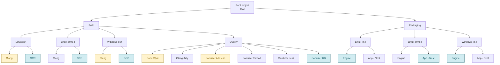
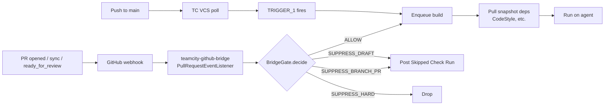

# Continuous Integration {#page-ci}

[TOC]

This page documents the Owl Continuous Integration pipeline: how TeamCity is
configured, how builds get triggered, how the Kotlin DSL is structured, and
how to extend or validate it. For local build instructions see
[Building Owl](building.md); for contribution conventions see
[Contributing](contributing.md).

## Overview

Owl is built and tested by a self-hosted **TeamCity 2026.1+** server at
[builder.argawaen.net](https://builder.argawaen.net). The full server
configuration lives in the repository under [`.teamcity/`](../../.teamcity)
as a **Kotlin DSL** — every project, build configuration, template, trigger,
parameter and snapshot dependency is code, reviewed in PRs, and applied to
the server when `main` advances.

The CI surface covers:

| Area               | Coverage                                                                    |
|--------------------|-----------------------------------------------------------------------------|
| Build / Test       | Linux x64, Linux ARM64 (Docker-emulated), Windows x64 — Clang + GCC each    |
| Quality            | clang-tidy, 4 sanitizers (Address, Thread, Leak, UB), Code Style aggregator |
| Packaging          | Engine + Owl Nest, per platform — only on `main`                            |
| GitHub integration | Draft PR suppression, Check Runs, ready_for_review retrigger                |

## Project tree



Legend:
- **Yellow**: draft-friendly — auto-run on draft PRs too (fast feedback subset).
- **Blue**: main-only — auto-run on `main` pushes only; PRs get a "Skipped:
  branch out of scope" GitHub Check Run; manual triggers always allowed.
- Uncoloured: standard — auto-run on `main` pushes and on non-draft PRs.

Source files:
- `.teamcity/settings.kts` — entry point, registers `_Self.Project`.
- `.teamcity/_Self/Project.kt` — root project, VCS root, project-level params.
- `.teamcity/_Self/Github.kt` — GitHub App connection ID constant.
- `.teamcity/_Self/BridgeHelpers.kt` — per-BT trigger overrides (see
  [Per-BT trigger helpers](#per-bt-trigger-helpers)).
- `.teamcity/_Self/buildTypes/GlobalBuild.kt` — main build/test template.
- `.teamcity/_Self/buildTypes/CodeStylingCheck.kt` — code style template.
- `.teamcity/_Self/vcsRoots/HttpsGithubComSilmaenOwlGitRefsHeadsMain.kt` — VCS root.
- `.teamcity/Build/Build.kt` — Build sub-project + 12 BTs.
- `.teamcity/Packaging/Packaging.kt` — Packaging sub-project + 6 BTs.

## VCS root

A single Git VCS root (`HttpsGithubComSilmaenOwlGitRefsHeadsMain`) points at
[Silmaen/Owl](https://github.com/Silmaen/Owl). The default branch is
parameterised via `owl_git_branch` (default `main`). The root pulls a
restricted set of refs only:

```
+:refs/heads/(%owl_git_branch%)
+:refs/(pull/*)/head
```

Concretely: TC sees only `main` and open-PR head refs. A push to a feature
branch **without an open PR** is invisible to TC — no builds run. This is
intentional: gating CI behind a PR avoids burning CI minutes on
work-in-progress branches.

## Templates

Two templates carry the per-BT-shared configuration.

### GlobalBuild (`_Self.buildTypes.GlobalBuild`)

The canonical build-and-test template used by every BT in `Build/` (except
Code Style) and every BT in `Packaging/`.

Pipeline (each step is a `ci_action.py` sub-action invoked through Docker
except the first, which sets `docker_image` from the preset metadata):

| Step                      | Condition                                      |
|---------------------------|------------------------------------------------|
| Determine docker (native) | always                                         |
| Define Remote             | always — configures DepManager remote          |
| Clean output              | always                                         |
| Clean release             | `release_preset` non-empty                     |
| Build                     | always                                         |
| Test                      | `run_tests == true`                            |
| Code Coverage             | `run_coverage == true`                         |
| Build Release             | `release_preset` non-empty                     |
| Test Release              | `release_preset` non-empty + `run_tests`       |
| Documentation             | `run_documentation == true`                    |
| Package                   | `run_package == true`                          |
| Publish Package           | `run_package` + on default branch              |
| Publish Documentation     | `run_package` + default branch + `publish_doc` |

Each Dockerised step uses the image set by step 1 (`%docker_image%`, derived
from the CMake preset's `vendor.silmaen` block).

Key inherited properties:
- **Trigger**: a single VCS trigger (`TRIGGER_1`) on `+:main`.
- **Snapshot dependency on `QualityCodeStyle`** with `FAIL_TO_START` —
  every dependent waits for Code Style and fails fast if it fails.
- **Build feature** `BRIDGE_GITHUB` (`type = github-bridge`) — opts the BT
  into the [teamcity-github-bridge plugin](#teamcity-github-bridge-plugin)
  with `triggerOnPrDraft = false`.
- **Failure conditions**: Google Test XML report ingestion, performance
  monitor.
- **Requirement**: `teamcity.agent.jvm.os.name contains %platform%`.

### CodeStylingCheck (`_Self.buildTypes.CodeStylingCheck`)

Lightweight template for the Code Style aggregator only. It runs
`ci_action.py CodeStyle` which bundles clang-format dry-run + codespell +
comment-quality + private-member doc audit + cpp-style audit + structural
audit. Inherits the same VCS root, runs in a single Docker step, and
participates in the github-bridge feature with `triggerOnPrDraft = true`.

## Build matrix

| BT                              | Template         | Preset                                | Trigger profile  |
|---------------------------------|------------------|---------------------------------------|------------------|
| Build/LinuxX64/Clang            | GlobalBuild      | `linux-clang-debug`                   | draft + ready    |
| Build/LinuxX64/GCC              | GlobalBuild      | `linux-gcc-debug`                     | main only        |
| Build/LinuxArm64/Clang          | GlobalBuild      | `linux-clang-debug` (ARM64 emulation) | ready (no draft) |
| Build/LinuxArm64/GCC            | GlobalBuild      | `linux-gcc-debug` (ARM64 emulation)   | main only        |
| Build/WindowsX64/Clang          | GlobalBuild      | `windows-clang-debug`                 | draft + ready    |
| Build/WindowsX64/GCC            | GlobalBuild      | `windows-gcc-debug`                   | main only        |
| Build/Quality/Code Style        | CodeStylingCheck | `linux-clang-debug`                   | draft + ready    |
| Build/Quality/Clang-Tidy        | GlobalBuild      | `linux-clang-tidy`                    | ready (no draft) |
| Build/Quality/Sanitizer Address | GlobalBuild      | `linux-sanitizer-address`             | draft + ready    |
| Build/Quality/Sanitizer thread  | GlobalBuild      | `linux-sanitizer-thread`              | ready (no draft) |
| Build/Quality/Sanitizer leak    | GlobalBuild      | `linux-sanitizer-leak`                | ready (no draft) |
| Build/Quality/Sanitizer UB      | GlobalBuild      | `linux-sanitizer-undefined-behavior`  | main only        |
| Packaging/LinuxX64/Engine       | GlobalBuild      | `package-engine-linux`                | main only        |
| Packaging/LinuxX64/AppNest      | GlobalBuild      | `package-app-nest-linux`              | ready (no draft) |
| Packaging/LinuxArm64/Engine     | GlobalBuild      | `package-engine-linux` (arm64)        | ready (no draft) |
| Packaging/LinuxArm64/AppNest    | GlobalBuild      | `package-app-nest-linux` (arm64)      | main only        |
| Packaging/WindowsX64/Engine     | GlobalBuild      | `package-engine-windows`              | main only        |
| Packaging/WindowsX64/AppNest    | GlobalBuild      | `package-app-nest-windows`            | ready (no draft) |

**Trigger profiles** above map to:

| Profile          | Helper           | Auto on `main` push | Auto on ready PR | Auto on draft PR |
|------------------|------------------|---------------------|------------------|------------------|
| draft + ready    | `allowDraftPR()` | ✅                   | ✅                | ✅                |
| ready (no draft) | _(default)_      | ✅                   | ✅                | ❌ (Skipped CR)   |
| main only        | `skipAutoPRs()`  | ✅                   | ❌ (Skipped CR)   | ❌ (Skipped CR)   |

Manual triggers from the TeamCity UI **always** run regardless of profile —
the gate short-circuits to `ALLOW` for any operator-initiated build.

## Triggering

Two trigger paths coexist by design. Each owns a disjoint event class.



**Path A — VCS trigger** (`TRIGGER_1` on GlobalBuild, `TRIGGER_4` on
CodeStylingCheck): fires only on pushes to `main`. Every BT inheriting a
template gets this trigger automatically. There is **no** VCS trigger for
feature-branch or PR-ref pushes — the second path handles those.

**Path B — GitHub webhook**: GitHub posts to the plugin's `/webhook`
endpoint on `pull_request` events (`opened`, `synchronize`,
`ready_for_review`). The plugin iterates every BT that carries the
`github-bridge` build feature, calls `BridgeGate.decide` with the BT's
config and the PR's draft state, and enqueues the matching ones. The smart
skip (`findExistingBuildReason`) prevents duplicates when the same
`(branch, head SHA)` already has a build queued, running, or recently
finished.

Why two paths? The plugin only handles `pull_request` events — it does not
react to `push` events. Conversely, the VCS trigger has no way to suppress
draft PRs (TeamCity's built-in `pullRequests { ignoreDrafts = true }` is
silently ignored under GitHub App auth, which is the safety bug that
motivated the plugin). Splitting the responsibility eliminates duplication
and gives each kind of event its purpose-built handler.

### Per-BT trigger helpers

Two extension helpers (in `.teamcity/_Self/BridgeHelpers.kt`) tune the
inherited `BRIDGE_GITHUB` feature per BT. Both work by disabling the
inherited feature (`disableSettings("BRIDGE_GITHUB")`) and re-attaching a
fresh feature under a distinct id.

| Helper           | Re-attached id            | Effect                                                                                              |
|------------------|---------------------------|-----------------------------------------------------------------------------------------------------|
| `allowDraftPR()` | `BRIDGE_GITHUB_DRAFT`     | Sets `triggerOnPrDraft = true` — BT runs on draft PRs (fast-feedback subset)                        |
| `skipAutoPRs()`  | `BRIDGE_GITHUB_MAIN_ONLY` | Sets `prTriggerBranchesOverride = -:*` — BT auto-runs on `main` only, PR events post a "Skipped" CR |

The helpers are **mutually exclusive** on the same BT —
`BridgeFeatureReader` only honours the first `github-bridge` feature it
finds, so calling both yields undefined behaviour. The current matrix
keeps `allowDraftPR()` for the lightest BTs (fast feedback for draft work)
and `skipAutoPRs()` for the heaviest (GCC variants, UB sanitizer, Engine
packagers).

## Code Style serialisation

Code Style sits in the snapshot-dependency chain of every other BT. When
multiple downstream BTs queue at the same time (e.g. three idle agents
each grab a different BT), they each request a Code Style execution. To
avoid running it three times in parallel:

1. **`maxRunningBuilds = 1`** on `QualityCodeStyle` — TC caps concurrent
   executions to one. Subsequent requests wait in the queue.
2. **Default `reuseBuilds = ReuseBuilds.SUCCESSFUL`** on the snapshot
   dependency — once the running Code Style finishes successfully, the
   waiting dependents reuse its result instead of spawning a new
   execution.

Combined, the worst-case three-agents-idle-at-once scenario produces
exactly one Code Style execution serving all three dependents.

## teamcity-github-bridge plugin

The pipeline relies on a custom server-side plugin —
[teamcity-github-bridge](https://github.com/dlachouette/teamcity-github-bridge)
— that closes the gaps between TeamCity 2026.1's bundled GitHub
integration and what a real pipeline needs.

What it provides, in roles relevant to Owl:

| Role                 | Mechanism                                                                                  |
|----------------------|--------------------------------------------------------------------------------------------|
| Draft PR suppression | `DraftAwareBuildFilter` (StartBuildPrecondition) — holds builds with a visible wait reason |
| Draft cancellation   | `DraftBuildQueueCleaner` — removes inappropriate queued builds                             |
| Auto-trigger on PR   | `PullRequestEventListener` reacts to `opened`/`synchronize`/`ready_for_review`             |
| Check Run publishing | `BuildStatusCheckRunPublisher` — rich GitHub Check Runs at every lifecycle transition      |
| Visual pill tagging  | `PrPromotionTagger` + `SimplePageExtension` — `draft` / `ready` pills in TC UI             |
| Webhook endpoint     | `/app/teamcity-github-bridge/webhook` with HMAC-SHA256 verification                        |

Project-level params consumed by the plugin (set in `Project.kt`):

| Parameter                             | Value          | Purpose                                        |
|---------------------------------------|----------------|------------------------------------------------|
| `teamcity.github.bridge.repo`         | `Silmaen/Owl`  | Webhook → BT routing (case-insensitive match)  |
| `teamcity.github.bridge.connectionId` | (CID constant) | Used by the plugin to mint installation tokens |

The four optional trigger toggles
(`branchTrigger.enabled` / `branches`, `prTrigger.enabled` / `branches`)
are left unset, defaulting to enabled and all branches respectively. The
per-BT overrides described above carry the constraints.

## Project parameters

Set on the root project (`Project.kt`) and inherited by every BT:

| Parameter                             | Type  | Default       | Purpose                                                     |
|---------------------------------------|-------|---------------|-------------------------------------------------------------|
| `owl_git_branch`                      | param | `main`        | Default branch name used in branch_specification + VCS root |
| `branch_specification`                | param | (multi-line)  | Refs TC pulls (main + open PR heads only)                   |
| `teamcity.github.bridge.repo`         | param | `Silmaen/Owl` | Plugin: webhook → BT routing                                |
| `teamcity.github.bridge.connectionId` | param | CID constant  | Plugin: GitHub App installation token mint                  |

Template-level parameters live on `GlobalBuild` and `CodeStylingCheck`:
preset name (`cmake_preset`), checkboxes (`run_tests`, `run_coverage`,
`run_documentation`, `run_package`, `publish_doc`), Docker plumbing
(`docker_image`, `docker_parameters`, `extra_tc_vars`), publishing
credentials (`deploy_url`, `deploy_login`, `deploy_passwd`). Most are
populated at runtime by the first build step
(`ci_action.py DefineTeamCityVariables`) from the CMake preset's
`vendor.silmaen` block, so they need no manual upkeep when a preset
changes.

## DSL development workflow

### Edit

Open `.teamcity/` in any Kotlin-aware IDE (IntelliJ IDEA picks up the
`pom.xml` and offers full completion against the TeamCity DSL APIs).
The file layout is described in [Project tree](#project-tree); every
build configuration lives in either `Build/` or `Packaging/`. To add a
new BT, follow one of the existing patterns:

- **Cross-platform standard build**: extend `Build.kt`'s `StdVariant`
  list, or call `stdPlatform(...)` for a brand-new platform.
- **Quality / sanitizer-style one-off**: add to the `sanitizers` list
  in `Build.kt`.
- **Packaging build**: extend the `kinds` list in `Packaging.kt`, or
  call `packagePlatform(...)` for a new platform.

### Validate locally

`mvn` is not installed on most workstations but is available via Docker.
A throw-away cache directory avoids permission conflicts with the host
`~/.m2`:

```bash
mkdir -p /tmp/m2-claude
docker run --rm -u "$(id -u):$(id -g)" \
  -v "$PWD/.teamcity:/work" \
  -v "/tmp/m2-claude:/var/maven/.m2" \
  -e MAVEN_CONFIG=/var/maven/.m2 \
  -w /work \
  maven:3.9.9-eclipse-temurin-21 \
  mvn -Duser.home=/var/maven -B teamcity-configs:generate
```

A successful run prints `BUILD SUCCESS` and writes the generated XML
config tree to `.teamcity/target/generated-configs/`. That directory is
gitignored — feel free to inspect, but never commit. The generated
project-config.xml files mirror what TeamCity will produce server-side,
so spot-checking them after a non-trivial DSL change is a fast
sanity check.

The first run from a cold cache takes ~2–3 minutes (Maven downloads
~150 MB of JetBrains DSL jars). Subsequent runs complete in ~9 seconds.

### Sync to server

The TeamCity server tracks `.teamcity/` from the VCS root. Pushing to
`main` triggers a server-side reload that applies the new configuration
within seconds. Failed DSL compiles surface in the server's
"Administration → Versioned settings" page and as a notification on the
affected project's main page.

For draft / WIP DSL changes that aren't ready to merge, the server can
optionally apply the DSL from a feature branch via the "Use settings
from VCS" override, but the default workflow is push-to-`main`.

## Cross-references

- [Building Owl](building.md) — local CMake invocations and CI action wrappers
- [Contributing](contributing.md) — coding conventions and PR workflow
- [Roadmap](roadmap.md) — ongoing-quality priorities and per-release goals
- [teamcity-github-bridge](https://github.com/dlachouette/teamcity-github-bridge)
  — upstream plugin source and architecture documentation
