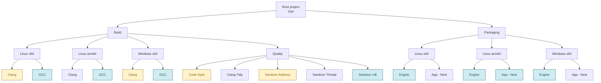
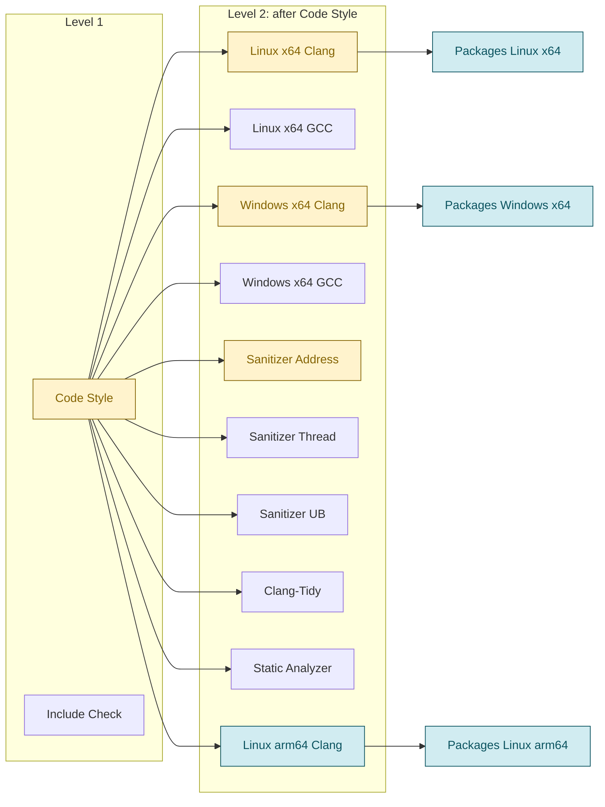

# Continuous Integration {#page-ci}

[TOC]

This page documents the Owl Continuous Integration pipeline: how TeamCity is
configured, how builds get triggered, how the Kotlin DSL is structured, and
how to extend or validate it. For local build instructions see
[Building Owl](building.md); for contribution conventions see
[Contributing](contributing.md).

## Overview

Owl is built and tested by a self-hosted **TeamCity 2026.1+** server at
[builder.argawaen.net](https://builder.argawaen.net). The full server
configuration lives in the repository under `.teamcity/`
as a **Kotlin DSL** — every project, build configuration, template, trigger,
parameter and snapshot dependency is code, reviewed in PRs, and applied to
the server when `main` advances.

The CI surface covers:

| Area               | Coverage                                                                                    |
|--------------------|---------------------------------------------------------------------------------------------|
| Build / Test       | Linux x64 and Windows x64 — Clang + GCC each; Linux ARM64 (Docker-emulated) — Clang only    |
| Quality            | clang-tidy, 3 blocking sanitizers (Address + Leak, Thread, UB), Code Style aggregator       |
| Packaging          | Engine + Owl Nest, per platform — only on `main`                                            |
| GitHub integration | Draft PR suppression, Check Runs (tests, timings, diff annotations), ready_for_review reuse |

## Project tree

The DSL (`.teamcity/`) is laid out like EvenementLoto's: one entry point, a `common/` folder, one file per
sub-project. The chain has two levels, as parallel as the agents allow: Code Style and Include Check wait for
nothing; every build, sanitizer and analysis waits for Code Style only (each one builds its own preset, none consumes
another's output). A broken commit therefore fails several configurations at once instead of stopping at the first.
Code Style, Include Check and PR Ready sit side by side at the root of the project; the builds, sanitizers, analyses
and packages each have their sub-project.

```mermaid
flowchart TD
    Root[Root project<br/>Owl] --> Build[Build]
    Root --> Pkg[Packaging]
    Build --> Lx[Linux x64]
    Build --> La[Linux arm64]
    Build --> Wx[Windows x64]
    Build --> Q[Quality]
    Lx --> LxC[Clang]
    Lx --> LxG[GCC]
    La --> LaC[Clang]
    La --> LaG[GCC]
    Wx --> WxC[Clang]
    Wx --> WxG[GCC]
    Q --> CS[Code Style]
    Q --> CT[Clang-Tidy]
    Q --> SA[Sanitizer Address]
    Q --> ST[Sanitizer Thread]
    Q --> SU[Sanitizer UB]
    Pkg --> PLx[Linux x64]
    Pkg --> PLa[Linux arm64]
    Pkg --> PWx[Windows x64]
    PLx --> PLxE[Engine]
    PLx --> PLxN[App - Nest]
    PLa --> PLaE[Engine]
    PLa --> PLaN[App - Nest]
    PWx --> PWxE[Engine]
    PWx --> PWxN[App - Nest]
    classDef draft fill:#fff3cd,stroke:#856404,color:#856404
    classDef mainOnly fill:#d1ecf1,stroke:#0c5460,color:#0c5460
    class LxC,WxC,CS,SA draft
    class LxG,LaG,WxG,SU,PLxE,PLaE,PLaN,PWxE mainOnly
```
Legend:
- **Yellow**: draft-friendly — auto-run on draft PRs too (fast feedback subset).
- **Blue**: main-only — auto-run on `main` pushes only; PRs get a "Skipped:
  branch out of scope" GitHub Check Run; a reviewer can still ask for them with
  the `/ci full` comment, and manual triggers always work.
- Uncoloured: standard — auto-run on `main` pushes and on non-draft PRs.
Orthogonal to the colours, a PR that changes **only** documentation
(`doc/`, `*.md`, `.claude/`, `LICENSE`) runs just Code Style and Linux x64
Clang — see [Doc-only pull requests](#doc-only-pull-requests).
Source files:
- `.teamcity/settings.kts` — entry point: root project, sub-projects and build order.
- `.teamcity/common/Vcs.kt` — the GitHub VCS root.
- `.teamcity/common/Templates.kt` — `globalBuild` (build, test, coverage, docs, package steps) and `toolBuild`.
- `.teamcity/common/Helpers.kt` — `ciAction` steps in the build image, the `githubBridge` feature, snapshot helpers.
- `.teamcity/common/Factories.kt` — `presetBuild`, `analysisBuild` and `packageBuild` builders.
- `.teamcity/quality/` — Code Style, Include Check, sanitizers, Clang-Tidy, Static Analyzer and the PR Ready composite.
- `.teamcity/build/` — Linux x64, Linux arm64 and Windows x64 builds.
- `.teamcity/packaging/Package.kt` — the nightly packages.
## VCS root
A single Git VCS root (`HttpsGithubComSilmaenOwlGitRefsHeadsMain`) points at
[Silmaen/Owl](https://github.com/Silmaen/Owl). The default branch is
parameterised via `owl_git_branch` (default `main`). The root pulls a
restricted set of refs only:
+:refs/heads/(%owl_git_branch%)
+:refs/(pull/*)/head
Concretely: TC sees only `main` and open-PR head refs. A push to a feature
branch **without an open PR** is invisible to TC — no builds run. This is
intentional: gating CI behind a PR avoids burning CI minutes on
work-in-progress branches.
## Templates
Two templates carry the per-BT-shared configuration.
### GlobalBuild (`_Self.buildTypes.GlobalBuild`)
The canonical build-and-test template used by every BT in `Build/` (except
Code Style) and every BT in `Packaging/`.
Pipeline (each step is a `ci_action.py` sub-action invoked through Docker
except the first, which sets `docker_image` from the preset metadata):
| Step                      | Condition                                                      |
|---------------------------|----------------------------------------------------------------|
| Determine docker (native) | always                                                         |
| Clean output              | always                                                         |
| Clean release             | `release_preset` non-empty + default branch                    |
| Build                     | always                                                         |
| Test                      | `run_tests == true`                                            |
| Code Coverage             | `run_coverage == true`; on Windows, default branch only        |
| Build Release             | `release_preset` non-empty + default branch                    |
| Build Release (docs)      | `release_preset` + `run_documentation`, off the default branch |
| Test Release              | `release_preset` non-empty + default branch + `run_tests`      |

The Code Coverage step publishes the line and branch coverage of `gcovr.cfg`'s scope (the engine without its
platform backends, which headless tests cannot reach) as TeamCity coverage statistics (`CodeCoverageL`,
`CodeCoverageB` and their absolute counts). Linux x64 / Clang fails when the line coverage drops more than one point
below its last successful build (`COVERAGE_DROP`).
| Documentation             | `run_documentation == true`                                    |
| Package                   | `run_package == true`                                          |
| Publish Package           | `run_package` + on default branch                              |
| Publish Documentation     | `run_package` + default branch + `publish_doc`                 |
Each Dockerised step uses the image set by step 1 (`%docker_image%`, derived
from the CMake preset's `vendor.silmaen` block).
**Secrets.** The steps that need a password (Publish Package, Publish Documentation) read it from
`OWL_DEPLOY_PASSWORD`, which the Global Build template sets as an `env.*` parameter from the `%deploy_passwd%`
password parameter of the server: the secret never appears on a command line,
and TeamCity masks its value in the log. This works the same on the Linux (Docker) and Windows agents.


```mermaid
flowchart LR
    subgraph L1[Level 1]
        CS[Code Style]
        IC[Include Check]
    end
    subgraph L2[Level 2: after Code Style]
        LxC[Linux x64 Clang] & LxG[Linux x64 GCC] & WxC[Windows x64 Clang] & WxG[Windows x64 GCC]
        SA[Sanitizer Address] & ST[Sanitizer Thread] & SU[Sanitizer UB]
        CT[Clang-Tidy] & AN[Static Analyzer]
        LaC[Linux arm64 Clang]
    end
    CS --> LxC & LxG & WxC & WxG & SA & ST & SU & CT & AN & LaC
    LxC --> PL[Packages Linux x64]
    WxC --> PW[Packages Windows x64]
    LaC --> PA[Packages Linux arm64]
    classDef draft fill:#fff3cd,stroke:#856404,color:#856404
    classDef mainOnly fill:#d1ecf1,stroke:#0c5460,color:#0c5460
    class CS,LxC,WxC,SA draft
    class LaC,LaG,PL,PW,PA mainOnly
```

- **Yellow**: also run on draft pull requests (fast feedback subset).
- **Blue**: nightly on `main` only: arm64 is emulated and slow, packages publish to the site.
- arm64 builds the `linux-emulated` preset: Debug without coverage, benchmarks or image tests
  (`OWL_RENDER_TESTS=OFF`), since QEMU makes them hours long and lavapipe's output depends on the CPU.
- Uncoloured: run on every ready pull request and on `main`.

| File                      | Content                                                                              |
|---------------------------|--------------------------------------------------------------------------------------|
| `settings.kts`            | The project: parameters, VCS root, templates, sub-projects and their order           |
| `common/Vcs.kt`           | The git VCS root, the GitHub App connection id                                       |
| `common/Templates.kt`     | Global Build (configure → package steps) and Tool Build (Code Style)                 |
| `common/Helpers.kt`       | `mainBranchOnly()`, `githubBridge()`, `after()`, `ciAction()`, `CODE_ONLY_PATHS`     |
| `common/Factories.kt`     | `presetBuild()`, `analysisBuild()`, `packageBuild()`                                 |
| `quality/CodeStyle.kt`    | The gate every other configuration waits for (root project)                          |
| `quality/IncludeCheck.kt` | Every file compiled alone, level 1 beside Code Style (root project)                  |
| `build/*.kt`              | Build Linux x64, Build Windows x64, Build Linux arm64                                |
| `quality/Sanitizers.kt`   | The three sanitizers, after Code Style                                               |
| `quality/PrReady.kt`      | The `PR Ready` merge gate (root project): red when any ready-PR configuration is red |
| `quality/Analysis.kt`     | Clang-Tidy and Static Analyzer, after Code Style                                     |
| `quality/Fuzz.kt`         | Nightly fuzzing: `Fuzz` action on `linux-fuzz`, failing inputs published             |
| `packaging/Package.kt`    | Engine and Owl Nest packages, after the build that tested their platform             |

The configuration ids are the ones the server already knew (`Build_LinuxX64_Clang`, `Build_Quality_ClangTidy`, …),
so the build history is kept. Everything a build does lives in `ci/` (`ci_action.py <Action> <preset>`); the DSL only
says which presets exist, where they run and in which order.

## What runs when

| Configuration                              | `main` push | Nightly (`main`) | Draft PR | Ready PR | `Experiment/*` PR | Doc-only PR | `[skip ci]` |
|--------------------------------------------|-------------|------------------|----------|----------|-------------------|-------------|-------------|
| Code Style                                 | ✅           | —                | ✅        | ✅        | ✅                 | ✅           | ❌           |
| Build Linux x64 / Clang (Doxygen)          | ✅           | —                | ✅        | ✅        | ✅                 | ✅           | ❌           |
| Build Windows x64 / Clang                  | ✅           | —                | ✅        | ✅        | ✅                 | ⏭           | ❌           |
| Build Linux x64 / GCC, Windows x64 / GCC   | ✅           | —                | ❌        | ✅        | ⏭                 | ⏭           | ❌           |
| Build Linux arm64 / Clang, GCC (emulated)  | ❌           | ✅                | ❌        | ❌        | ❌                 | ❌           | ❌           |
| Benchmarks (`linux-bench`)                 | ❌           | ✅                | ❌        | ❌        | ❌                 | ❌           | ❌           |
| Fuzzing (`linux-fuzz`)                     | ❌           | ✅                | ❌        | ❌        | ❌                 | ❌           | ❌           |
| Sanitizer Address (+ LSan)                 | ✅           | —                | ✅        | ✅        | ✅                 | ⏭           | ❌           |
| Sanitizer Thread, Sanitizer UB             | ✅           | —                | ❌        | ✅        | ⏭                 | ⏭           | ❌           |
| Clang-Tidy, Static Analyzer, Include Check | ✅           | —                | ❌        | ✅        | ⏭                 | ⏭           | ❌           |
| PR Ready (merge gate, no agent)            | ✅           | —                | ❌        | ✅        | ⏭                 | ⏭           | ❌           |
| Packages (Engine, Nest × 3 platforms)      | ❌           | ✅                | ❌        | ❌        | ❌                 | ❌           | ❌           |

✅ runs · ❌ not run · ⏭ a "Skipped" check is published, which GitHub counts as passing. A manual run, and *Re-run* in
GitHub, always run a configuration.

- **Draft → ready**: only what the draft did not run is built. `skipIfCommitPassed` drops an automatic build whose
  commit already passed in that configuration and republishes the earlier success (`Build passed (reused #N)`), and
  the snapshot dependencies reuse a build already green for the revision (`reuseBuilds = SUCCESSFUL`). A new commit
  runs everything again.
- **`Experiment/*` pull requests** run the fast subset only (the draft one): the full-matrix configurations carry
  `prTriggerBranchesOverride = EXCLUDE_EXPERIMENT`. Their required checks are therefore *Skipped*: an experiment is not
  meant to be merged as such; move the work to a `Feature/*` branch to get the full verdict.
- **`main` push**: every configuration but arm64 and the packages, through the templates' VCS trigger; the release
  build and its tests (the `release_preset` steps) run only there, a pull request gets its verdict from the debug
  build in half the time.
- **Nightly** (02:00, `main`, only when it changed): the emulated arm64 builds (50 to 90 minutes each) and every
  package, which publishes to the site.

## Triggering

- **`main`**: the templates' VCS trigger (`mainBranchOnly()`); the bridge plugin ignores `push` events.
- **Pull requests**: the GitHub App bridge, on the PR's **head branch** (`prBuildRef = branch`): TeamCity shows the
  real branch name (`Feature/…`), never `pull/N`. The branch specification is `main`, `Feature/*` and `Experiment/*`,
  the only branch names allowed.
- **Manual runs** always run, whatever the configuration's pull request settings; so does *Re-run* in GitHub.

### The `github-bridge` feature

`githubBridge()` (`common/Helpers.kt`) sets every parameter explicitly. Each configuration declares the feature
itself, with the same id as its template's, which replaces the inherited one:

| Argument           | Default           | Effect                                               |
|--------------------|-------------------|------------------------------------------------------|
| `triggerOnPrDraft` | `false`           | `true` puts the configuration in the draft subset    |
| `triggerOnPrReady` | `true`            | `false`: never runs for a pull request (`main` only) |
| `annotateDiff`     | `true`            | findings pinned to the lines of the PR diff          |
| `pathFilter`       | `CODE_ONLY_PATHS` | `""` runs on documentation-only pull requests too    |

Always set: `publishChecks`, `runOnApproval`, `triggerOnBranch` to `true`, `skipIfCommitPassed = true` (a draft's
verdict is republished when the PR turns ready) and `skipPhrase = [skip ci]`.

### Required checks

Require **one** check in the branch protection of `main`: **`PR Ready`**. It is a composite configuration
(`quality/PrReady.kt`): it uses no agent, depends on every configuration a ready pull request runs (Code Style,
Include Check, the four builds, the three sanitizers, Clang-Tidy, Static Analyzer) and turns red, naming the failed
dependency, as soon as one of them is red. Like them it is not run for drafts nor `Experiment/…` pull requests (the PR
cannot be merged until it is ready), and it skips documentation-only pull requests rather than pulling the whole
matrix in. GitHub shows a check by the tail of its name (`checkName.stripPrefix = "TeamCity / Owl / "`).

### Doc-only pull requests

Every BT on `GlobalBuild` carries a `pathFilter` excluding `doc/*`, `*.md`,
`.claude/*` and `LICENSE`. The plugin keeps a BT as soon as **one** file changed
by the PR matches, so a PR touching only those paths matches nothing and is
dropped with a *"Skipped: paths out of scope"* Check Run instead of running the
whole matrix.

Two configurations deliberately have **no** filter, because those paths are
their input:

- **Code Style** — codespell and the markdown checks read `doc/` and the root
  markdown files.
- **Linux x64 Clang** — the only BT whose preset sets `OWL_ENABLE_DOCUMENTATION=ON`; it builds the release
  everywhere (its tests stay on `main`) and Doxygen documents it, with `WARN_AS_ERROR=YES`
  over `doc/`, `README.md`, `CHANGELOG.md`, `ROADMAP.md` and `CONTRIBUTING.md`.

A doc-only PR is therefore still gated — by the two configurations that can
actually fail on it.

## Fuzzing

`linux-fuzz` builds every `fuzz/*_fuzzer.cpp` (libFuzzer, `OWL_FUZZING=ON`) with AddressSanitizer. The `Fuzz` action
runs each `owl_*_fuzzer` for five minutes (`-- --time=<seconds>`, `-- --fuzzer=<name>` for one) on
`output/fuzz/<fuzzer>/corpus`, seeded from `fuzz/corpus/<name>/` when that folder exists. A crash, a leak or a
timeout fails the build; its input lands in `output/fuzz/<fuzzer>/artifacts/`, published as `fuzz-artifacts`, and
replays with `bin/<fuzzer> <input>`.

```bash
docker/run.sh poetry run python ci_action.py Build linux-fuzz
docker/run.sh poetry run python ci_action.py Fuzz linux-fuzz -- --time=60
```

## Include check

A recent libstdc++ (MSYS2 MinGW) no longer includes `<cstdint>`, `<mutex>`, … transitively, so a file that
names `uint32_t` or `std::mutex` without including the header breaks the Windows build while every Linux
configuration stays green — the precompiled header `owlpch.h` hides the gap. Two complementary gates catch it
on Linux:

- **`std-includes` (Code Style)** — a lexical audit (`ci/utils/std_includes.py`): every file under `source/`,
  `test/` and `bench/` must include the standard header of each `std::` symbol, `uint*_t` and `size_t` it names.
  A `.cpp` may rely on its own header and on `owlpch.h`. Fast, runs on every PR, any platform.
- **Include Check (`linux-include-check`)** — `ci_action.py IncludeCheck` configures the preset (it sets
  `OWL_INCLUDE_CHECK=ON`) and builds `owl_include_check`, defined in `cmake/IncludeCheck.cmake`:
  - `owl_header_check` compiles every header of `source/owl/{public,private}`, `source/owlnest/{sources,runner}`,
    `test/test_helper` and `bench/` alone in a generated translation unit;
  - `owl_source_check` compiles every `.cpp` of the engine, the editor, the runner, the tests and the bench again;
  - both with the flags of the real target, **without the PCH**, against libc++ with
    `_LIBCPP_REMOVE_TRANSITIVE_INCLUDES` (`-Wno-everything`: only the hard errors matter). Nothing is linked, so
    the libstdc++-built dependencies are no obstacle.

Run it locally (the build image ships libc++):

```bash
docker/run.sh poetry run python ci_action.py IncludeCheck linux-include-check
docker/run.sh cmake --build output/build/linux-include-check --target owl_header_check   # headers only
```

The compile check catches project headers that are not self-contained too (a missing `core/Macros.h`), which
the lexical audit cannot see; the lexical audit catches what libc++ happens to provide transitively.

## Code Style serialisation

Code Style sits in the snapshot-dependency chain of every other BT. When
multiple downstream BTs queue at the same time (e.g. three idle agents
each grab a different BT), they each request a Code Style execution. To
avoid running it three times in parallel:

1. **`maxRunningBuilds = 1`** on `QualityCodeStyle` — TC caps concurrent
   executions to one. Subsequent requests wait in the queue.
2. **Default `reuseBuilds = ReuseBuilds.SUCCESSFUL`** on the snapshot
   dependency — once the running Code Style finishes successfully, the
   waiting dependents reuse its result instead of spawning a new
   execution.

Combined, the worst-case three-agents-idle-at-once scenario produces
exactly one Code Style execution serving all three dependents.

## teamcity-github-bridge plugin

The pipeline relies on a custom server-side plugin —
[teamcity-github-bridge](https://github.com/dlachouette/teamcity-github-bridge)
— that closes the gaps between TeamCity 2026.1's bundled GitHub
integration and what a real pipeline needs.

Owl tracks the plugin's **1.11.0** line. What it provides, in roles relevant
to Owl:

| Role                  | Mechanism                                                                                          |
|-----------------------|----------------------------------------------------------------------------------------------------|
| Draft PR suppression  | `DraftAwareBuildFilter` (StartBuildPrecondition) — holds builds with a visible wait reason         |
| Draft cancellation    | `DraftBuildQueueCleaner` — removes inappropriate queued builds                                     |
| Auto-trigger on PR    | `PullRequestEventListener` reacts to `opened`/`synchronize`/`ready_for_review`/`labeled`/…         |
| Obsolete-build stop   | A push to a PR, or closing it, stops the builds still running on the previous head (`skipped`)     |
| Check Run publishing  | `BuildStatusCheckRunPublisher` — rich GitHub Check Runs at every lifecycle transition              |
| Visual pill tagging   | `PrPromotionTagger` + `SimplePageExtension` — `draft` / `ready` pills in TC UI                     |
| PR context on a build | A *Pull request* tab on the build page, and 16 published `…pullRequest.*` parameters               |
| Webhook endpoint      | `/app/teamcity-github-bridge/webhook` with HMAC-SHA256 verification                                |
| Stable check name     | `checkName` on PR Ready: moving it in the project tree no longer renames the required check        |
| Labels and assignee   | `labelRules` add `documentation` / `ci` / `dependencies` / `engine` / `editor`; `autoAssignAuthor` |
| Superseded build      | A build stopped by a newer push concludes `skipped` ("Superseded by …"), not a red `cancelled`     |

Project-level params consumed by the plugin (set in `settings.kts`):

| Parameter                                      | Value               | Purpose                                                      |
|------------------------------------------------|---------------------|--------------------------------------------------------------|
| `teamcity.github.bridge.repo`                  | `Silmaen/Owl`       | Webhook → BT routing (case-insensitive match)                |
| `teamcity.github.bridge.connectionId`          | (CID constant)      | Used by the plugin to mint installation tokens               |
| `teamcity.github.bridge.branchTrigger.enabled` | `false`             | `main` belongs to `TRIGGER_1`; the bridge must not double it |
| `teamcity.github.bridge.checkName.stripPrefix` | `TeamCity / Owl / ` | Shortens the Check Run names GitHub shows in the merge box   |
| `teamcity.github.bridge.autoAssignAuthor`      | `true`              | A PR opened with nobody assigned goes to its author          |
| `teamcity.github.bridge.labelRules`            | (rules)             | Labels by changed paths; see `settings.kts`                  |

`prTrigger.enabled` / `prTrigger.branches` are left unset (enabled, all
branches); the per-BT gates described above carry the constraints.

### What a Check Run says

Server-side settings, not DSL — listed here because they are what a reviewer
actually reads on a pull request. All are plugin defaults except where noted:

- **the verdict, with test counts** — *"Build failed — 3 of 1046 tests failed
  (2 new)"*, then the failing tests in the body, new ones first. Read from
  TeamCity's own statistics, which Owl feeds through the `xmlReport` feature on
  both templates (Google Test XML at `output/build/**/test/*_Report.xml`).
- **timings** — total, working time and the wait split (dependencies / free
  agent / other). The Code Style snapshot dependency shows up as the dependency
  share.
- **an infrastructure failure is named** — a lost checkout or an unresolvable
  artifact dependency reads *"Infrastructure failure: …"* instead of looking
  like a failing test. It still concludes `failure` and still blocks the merge
  (`checkRun.infraNeutral` is off).
- **artifact links** — direct downloads, which for the packaging BTs is the
  installer itself.
- **name** — `Build / Linux x64 / Clang` rather than
  `TeamCity / Owl / Build / Linux x64 / Clang`, since GitHub truncates the end
  of the name, which is the part that identifies the build. Renaming a check
  starts a new row on GitHub: safe today because the repository's
  *main merging* ruleset requires no status check by name, and any rule added
  later must use the stripped name.

### Diff annotations

The plugin turns compiler diagnostics into Check Run **annotations**, pinned to
the file and line in the pull request's diff. For a **Command Line** runner —
which is how every `ci_action.py` step is wired — TeamCity reports a single
build problem (*"Process exited with code 1"*) and the real diagnostics only
ever exist in the build log, so the plugin scans the log of a failed build for
GNU/clang (`file:42:7: error: …`) and MSVC shapes.

Two consequences for this repository:

1. **Annotations are enabled on five configurations only** — Linux x64 Clang,
   Windows x64 Clang, Clang-Tidy, Include Check and Code Style. The same compile
   error reported by six configurations would otherwise be annotated six times
   on the same line; these five are the ones whose findings are distinct.
2. **`ci/actions/code_style.py` prints in that shape on purpose.** Every
   finding goes through its `_diag()` helper as
   `<repo-relative path>:<line>:<column>: error: <check>: <message>`, and the
   clang-format / codespell outputs are re-emitted through it too (their own
   paths are absolute, which GitHub rejects). A finding printed in any other
   shape stays in the build log and never reaches the diff — so keep new
   sub-checks going through `_diag()`.

## Clang-tidy scoping

`Analysis / Clang-Tidy` is the only configuration this concerns. On a pull
request it analyses only the translation units that pull request can change the
verdict of. On `main`, on a manual run, and whenever the narrowing cannot be
trusted, it analyses all of them — the behaviour every run had before.

The analysis is **not** hooked into the compiler. `cmake/Sanitizers.cmake`
deliberately leaves `CMAKE_CXX_CLANG_TIDY` unset (for the two `*-clang-tidy`
presets, the only ones that set `OWL_ENABLE_CLANG_TIDY`) and only turns on
`CMAKE_EXPORT_COMPILE_COMMANDS`; the BT's own `ClangTidy` step then drives
clang-tidy from `compile_commands.json` once Build is done. The compiler hook
has no way to skip a file, so selecting a subset is only possible from outside
it.

### How the subset is built


```mermaid
flowchart TD
    MB["mergeBase..HEAD<br/>(git diff)"] --> CPP[".cpp touched"]
    MB --> HDR["headers touched"]
    MB --> CFG["CMakeLists / *.cmake<br/>.clang-tidy / conanfile.py / conan.lock"]
    HDR --> DEPS["ninja -t deps<br/>reverse include closure"]
    DEPS --> TU["every .cpp that includes them,<br/>directly or transitively"]
    CPP --> RUN["clang-tidy -p build_dir"]
    TU --> RUN
    CFG --> FULL["full scope<br/>(flags or check list moved)"]
```

The header step is the one that matters: a `.cpp` outside the diff still gets
analysed when it includes a header the pull request touched. The closure comes
from ninja's own dependency database, which holds the complete include list the
compiler recorded for every object file — so an indirect include, several
headers deep, is covered too. In practice a change to a core header
(`math/matrices.h`) selects nearly every unit, and a change confined to an
editor panel selects a handful.

### Diff base

The base is the pull request's **merge base**, read from
`teamcity.github.bridge.pullRequest.mergeBase` and passed to the step as
`--merge_base`. Not `baseSha`, and not `origin/main`: the target branch's head
also carries everything that landed on `main` since the branch started, so
diffing against it would report other contributors' findings on this pull
request. When the parameter is empty (the bridge's `mergeBase.enabled` off, or
the GitHub lookup failed) the action derives the merge base locally from
`--target_branch` using git's three-dot form, which is the same comparison.

### Falling back to the full scope

Narrowing is an optimisation; missing a finding is not an acceptable failure
mode. Any of these analyses everything:

| Situation                                                                       | Why                                    |
|---------------------------------------------------------------------------------|----------------------------------------|
| not a pull request (`main`, manual run)                                         | nothing to narrow against              |
| no usable diff base                                                             | the range would be a guess             |
| the diff is empty against the base                                              | a real PR changes something — bad base |
| `CMakeLists.txt`, `*.cmake`, `CMakePresets*.json`, `conanfile.py`, `conan.lock` | compiler flags or dependencies moved   |
| `.clang-tidy`                                                                   | the check list itself changed          |
| git, ninja or `.ninja_deps` unavailable                                         | the mapping cannot be built            |

Every fallback is logged with its reason, so a run that looks unexpectedly long
says why in the build log.

### Running it locally

```bash
poetry run python ci_action.py Build linux-clang-tidy      # produces the two databases
poetry run python ci_action.py ClangTidy linux-clang-tidy  # full scope

# What would a PR against main analyse? (--dry_run stops before the analysis)
poetry run python ci_action.py ClangTidy linux-clang-tidy -- --diff_base=main --dry_run
```

`--full` forces the full scope, `--jobs=N` caps the parallel clang-tidy
processes (default: one per available core, from the scheduler affinity mask).

## Project parameters

Set on the root project (`Project.kt`) and inherited by every BT:

| Parameter                                      | Type  | Default             | Purpose                                                     |
|------------------------------------------------|-------|---------------------|-------------------------------------------------------------|
| `owl_git_branch`                               | param | `main`              | Default branch name used in branch_specification + VCS root |
| `branch_specification`                         | param | (multi-line)        | Refs TC pulls (main + open PR heads only)                   |
| `teamcity.github.bridge.repo`                  | param | `Silmaen/Owl`       | Plugin: webhook → BT routing                                |
| `teamcity.github.bridge.connectionId`          | param | CID constant        | Plugin: GitHub App installation token mint                  |
| `teamcity.github.bridge.branchTrigger.enabled` | param | `false`             | Plugin: leave `main` to the VCS trigger                     |
| `teamcity.github.bridge.checkName.stripPrefix` | param | `TeamCity / Owl / ` | Plugin: shorten Check Run names                             |

The plugin also **publishes** 16 read-only `teamcity.github.bridge.*`
parameters into every build (`isPullRequest`, `isDraft`,
`pullRequest.number` / `title` / `author` / `sourceBranch` / `targetBranch` /
`headSha` / `url` / `baseSha` / `mergeBase` / `changedFiles` / `additions` /
`deletions` / `commits` / `labels`). They are empty on a non-PR branch, so a
step or a DSL condition can read them unconditionally. `mergeBase` is the one
to diff against when a check should look at the pull request's own change
(`git diff <mergeBase>..<headSha>`); diffing against `main` would also pick up
everything that landed on it since the branch started. The Clang-Tidy step is
the one that consumes them today — `isPullRequest`, `mergeBase` and
`targetBranch`, see [Clang-tidy scoping](#clang-tidy-scoping).

Template-level parameters live on `GlobalBuild` and `CodeStylingCheck`:
preset name (`cmake_preset`), checkboxes (`run_tests`, `run_coverage`,
`run_documentation`, `run_package`, `publish_doc`), Docker plumbing
(`docker_image`, `docker_parameters`, `extra_tc_vars`). Most are
populated at runtime by the first build step
(`ci_action.py DefineTeamCityVariables`) from the CMake preset's
`vendor.silmaen` block, so they need no manual upkeep when a preset
changes.

The credentials (`deploy_url`, `deploy_login`, `deploy_passwd`, and the Conan cache's `conan_server`,
`conan_user`, `conan_password`) are **not** in the DSL: they are set on the server, above this project.
`deploy_passwd` and `conan_password` must be of type *password* there, so TeamCity masks them in the build log as
a second line of defence. Declaring them in the DSL would
shadow the server values with empty ones, which is why the DSL only
references them.

## DSL development workflow

### Edit

Open `.teamcity/` in any Kotlin-aware IDE (IntelliJ IDEA picks up the
`pom.xml` and offers full completion against the TeamCity DSL APIs).
The file layout is described in [Project tree](#project-tree); every
build configuration lives in either `Build/` or `Packaging/`. To add a
new BT, follow one of the existing patterns:

- **Cross-platform standard build**: extend `Build.kt`'s `StdVariant`
  list, or call `stdPlatform(...)` for a brand-new platform.
- **Quality / sanitizer-style one-off**: add to the `sanitizers` list
  in `Build.kt`.
- **Packaging build**: extend the `kinds` list in `Packaging.kt`, or
  call `packagePlatform(...)` for a new platform.

### Validate locally

`mvn` is not installed on most workstations but is available via Docker.
A throw-away cache directory avoids permission conflicts with the host
`~/.m2`:

```bash
mkdir -p /tmp/m2-claude
docker run --rm -u "$(id -u):$(id -g)" \
  -v "$PWD/.teamcity:/work" \
  -v "/tmp/m2-claude:/var/maven/.m2" \
  -e MAVEN_CONFIG=/var/maven/.m2 \
  -w /work \
  maven:3.9.9-eclipse-temurin-21 \
  mvn -Duser.home=/var/maven -B teamcity-configs:generate
```

A successful run prints `BUILD SUCCESS` and writes the generated XML
config tree to `.teamcity/target/generated-configs/`. That directory is
gitignored — feel free to inspect, but never commit. The generated
project-config.xml files mirror what TeamCity will produce server-side,
so spot-checking them after a non-trivial DSL change is a fast
sanity check.

The first run from a cold cache takes ~2–3 minutes (Maven downloads
~150 MB of JetBrains DSL jars). Subsequent runs complete in ~9 seconds.

### Sync to server

The TeamCity server tracks `.teamcity/` from the VCS root. Pushing to
`main` triggers a server-side reload that applies the new configuration
within seconds. Failed DSL compiles surface in the server's
"Administration → Versioned settings" page and as a notification on the
affected project's main page.

For draft / WIP DSL changes that aren't ready to merge, the server can
optionally apply the DSL from a feature branch via the "Use settings
from VCS" override, but the default workflow is push-to-`main`.

## Cross-references

- [Building Owl](building.md) — local CMake invocations and CI action wrappers
- [Contributing](contributing.md) — coding conventions and PR workflow
- [Roadmap](roadmap.md) — ongoing-quality priorities and per-release goals
- [teamcity-github-bridge](https://github.com/dlachouette/teamcity-github-bridge)
  — upstream plugin source and architecture documentation
