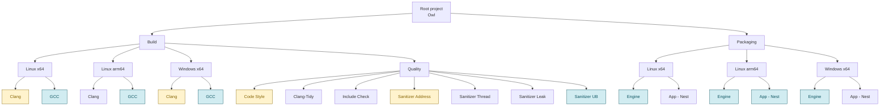
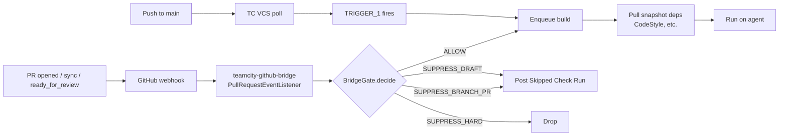
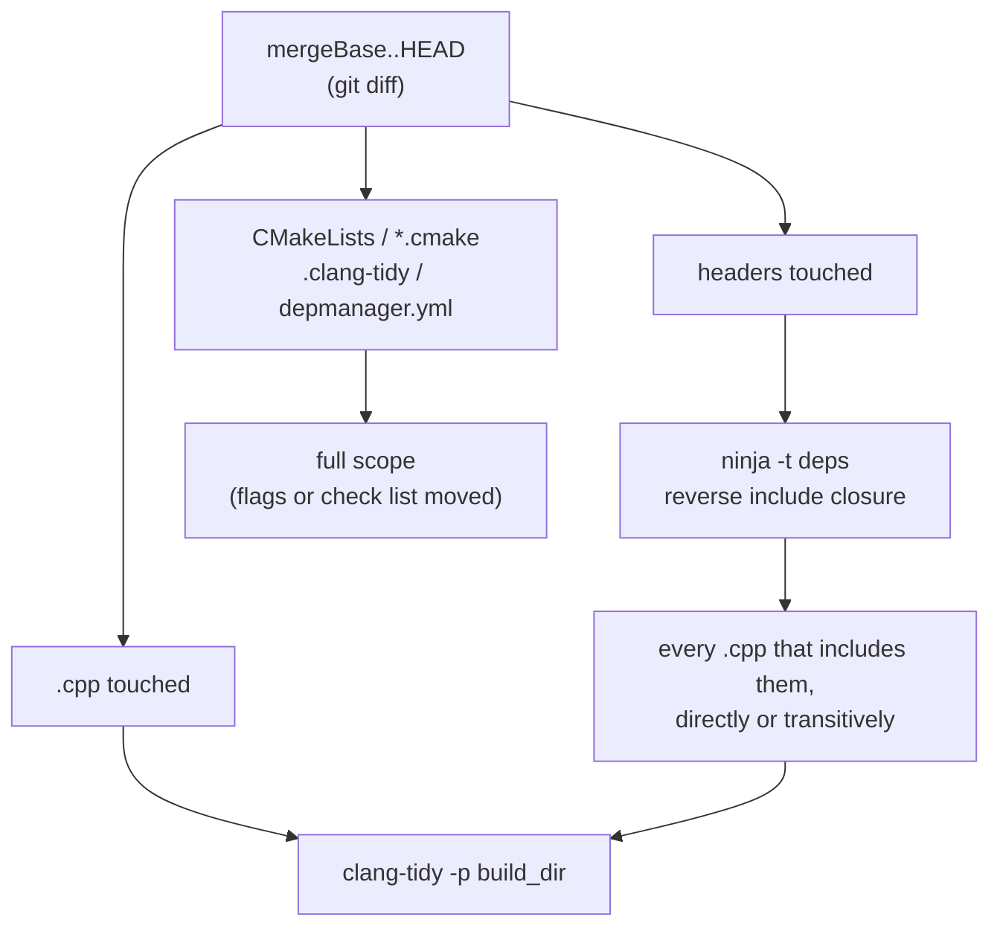

# Continuous Integration {#page-ci}

[TOC]

This page documents the Owl Continuous Integration pipeline: how TeamCity is
configured, how builds get triggered, how the Kotlin DSL is structured, and
how to extend or validate it. For local build instructions see
[Building Owl](building.md); for contribution conventions see
[Contributing](contributing.md).

## Overview

Owl is built and tested by a self-hosted **TeamCity 2026.1+** server at
[builder.argawaen.net](https://builder.argawaen.net). The full server
configuration lives in the repository under [`.teamcity/`](../../.teamcity)
as a **Kotlin DSL** — every project, build configuration, template, trigger,
parameter and snapshot dependency is code, reviewed in PRs, and applied to
the server when `main` advances.

The CI surface covers:

| Area               | Coverage                                                                                    |
|--------------------|---------------------------------------------------------------------------------------------|
| Build / Test       | Linux x64, Linux ARM64 (Docker-emulated), Windows x64 — Clang + GCC each                    |
| Quality            | clang-tidy, 4 sanitizers (Address, Thread, Leak, UB), Code Style aggregator                 |
| Packaging          | Engine + Owl Nest, per platform — only on `main`                                            |
| GitHub integration | Draft PR suppression, Check Runs (tests, timings, diff annotations), ready_for_review reuse |

## Project tree


```mermaid
flowchart TD
    Root[Root project<br/>Owl] --> Build[Build]
    Root --> Pkg[Packaging]
    Build --> Lx[Linux x64]
    Build --> La[Linux arm64]
    Build --> Wx[Windows x64]
    Build --> Q[Quality]
    Lx --> LxC[Clang]
    Lx --> LxG[GCC]
    La --> LaC[Clang]
    La --> LaG[GCC]
    Wx --> WxC[Clang]
    Wx --> WxG[GCC]
    Q --> CS[Code Style]
    Q --> CT[Clang-Tidy]
    Q --> IC[Include Check]
    Q --> SA[Sanitizer Address]
    Q --> ST[Sanitizer Thread]
    Q --> SL[Sanitizer Leak]
    Q --> SU[Sanitizer UB]
    Pkg --> PLx[Linux x64]
    Pkg --> PLa[Linux arm64]
    Pkg --> PWx[Windows x64]
    PLx --> PLxE[Engine]
    PLx --> PLxN[App - Nest]
    PLa --> PLaE[Engine]
    PLa --> PLaN[App - Nest]
    PWx --> PWxE[Engine]
    PWx --> PWxN[App - Nest]

    classDef draft fill:#fff3cd,stroke:#856404,color:#856404
    classDef mainOnly fill:#d1ecf1,stroke:#0c5460,color:#0c5460
    class LxC,WxC,CS,SA draft
    class LxG,LaG,WxG,SU,PLxE,PLaE,PLaN,PWxE mainOnly
```

Legend:
- **Yellow**: draft-friendly — auto-run on draft PRs too (fast feedback subset).
- **Blue**: main-only — auto-run on `main` pushes only; PRs get a "Skipped:
  branch out of scope" GitHub Check Run; a reviewer can still ask for them with
  the `/ci full` comment, and manual triggers always work.
- Uncoloured: standard — auto-run on `main` pushes and on non-draft PRs.

Orthogonal to the colours, a PR that changes **only** documentation
(`doc/`, `*.md`, `.claude/`, `LICENSE`) runs just Code Style and Windows x64
Clang — see [Doc-only pull requests](#doc-only-pull-requests).

Source files:
- `.teamcity/settings.kts` — entry point, registers `_Self.Project`.
- `.teamcity/_Self/Project.kt` — root project, VCS root, project-level params.
- `.teamcity/_Self/Github.kt` — GitHub App connection ID constant.
- `.teamcity/_Self/BridgeHelpers.kt` — the `github-bridge` feature builder and
  the per-BT overrides (see [Per-BT bridge gates](#per-bt-bridge-gates)).
- `.teamcity/_Self/buildTypes/GlobalBuild.kt` — main build/test template.
- `.teamcity/_Self/buildTypes/CodeStylingCheck.kt` — code style template.
- `.teamcity/_Self/vcsRoots/HttpsGithubComSilmaenOwlGitRefsHeadsMain.kt` — VCS root.
- `.teamcity/Build/Build.kt` — Build sub-project + 12 BTs.
- `.teamcity/Packaging/Packaging.kt` — Packaging sub-project + 6 BTs.

## VCS root

A single Git VCS root (`HttpsGithubComSilmaenOwlGitRefsHeadsMain`) points at
[Silmaen/Owl](https://github.com/Silmaen/Owl). The default branch is
parameterised via `owl_git_branch` (default `main`). The root pulls a
restricted set of refs only:

```
+:refs/heads/(%owl_git_branch%)
+:refs/(pull/*)/head
```

Concretely: TC sees only `main` and open-PR head refs. A push to a feature
branch **without an open PR** is invisible to TC — no builds run. This is
intentional: gating CI behind a PR avoids burning CI minutes on
work-in-progress branches.

## Templates

Two templates carry the per-BT-shared configuration.

### GlobalBuild (`_Self.buildTypes.GlobalBuild`)

The canonical build-and-test template used by every BT in `Build/` (except
Code Style) and every BT in `Packaging/`.

Pipeline (each step is a `ci_action.py` sub-action invoked through Docker
except the first, which sets `docker_image` from the preset metadata):

| Step                      | Condition                                      |
|---------------------------|------------------------------------------------|
| Determine docker (native) | always                                         |
| Define Remote             | always — configures DepManager remote          |
| Clean output              | always                                         |
| Clean release             | `release_preset` non-empty                     |
| Build                     | always                                         |
| Test                      | `run_tests == true`                            |
| Code Coverage             | `run_coverage == true`                         |
| Build Release             | `release_preset` non-empty                     |
| Test Release              | `release_preset` non-empty + `run_tests`       |
| Documentation             | `run_documentation == true`                    |
| Package                   | `run_package == true`                          |
| Publish Package           | `run_package` + on default branch              |
| Publish Documentation     | `run_package` + default branch + `publish_doc` |

Each Dockerised step uses the image set by step 1 (`%docker_image%`, derived
from the CMake preset's `vendor.silmaen` block).

One BT adds a step of its own on top of this pipeline: `Build/Quality/Clang-Tidy`
appends a `ClangTidy` step (BT steps run after inherited ones, so it lands right
after Build for that preset). It stays on that BT rather than moving into this
template — a template step would be inherited by all eleven configurations just
to be skipped by ten. See [Clang-tidy scoping](#clang-tidy-scoping).

Key inherited properties:
- **Trigger**: a single VCS trigger (`TRIGGER_1`) on `+:main`.
- **Snapshot dependency on `QualityCodeStyle`** with `FAIL_TO_START` —
  every dependent waits for Code Style and fails fast if it fails.
- **Build feature** `BRIDGE_GITHUB` (`type = github-bridge`) — opts the BT
  into the [teamcity-github-bridge plugin](#teamcity-github-bridge-plugin).
  Template defaults: no draft PRs, no doc-only PRs, no diff annotations,
  reuse a verdict already produced for the same commit.
- **Failure conditions**: Google Test XML report ingestion, performance
  monitor.
- **Requirement**: `teamcity.agent.jvm.os.name contains %platform%`.

### CodeStylingCheck (`_Self.buildTypes.CodeStylingCheck`)

Lightweight template for the Code Style aggregator only. It runs
`ci_action.py CodeStyle` which bundles clang-format dry-run + codespell +
comment-quality + private-member doc audit + cpp-style audit + structural
audit + std-includes audit (see [Include check](#include-check)). Inherits the same VCS root and runs in a single Docker step.

Its bridge gates differ from `GlobalBuild` on all three axes: it runs on draft
PRs, it runs on doc-only PRs (codespell and the markdown checks are exactly
what such a PR changes), and it **annotates the diff** — every finding
`ci/actions/code_style.py` reports is emitted as a compiler-style diagnostic
for that reason, see [Diff annotations](#diff-annotations).

## Build matrix

| BT                              | Template         | Preset                                | Trigger profile  |
|---------------------------------|------------------|---------------------------------------|------------------|
| Build/LinuxX64/Clang            | GlobalBuild      | `linux-clang-debug`                   | draft + ready    |
| Build/LinuxX64/GCC              | GlobalBuild      | `linux-gcc-debug`                     | main only        |
| Build/LinuxArm64/Clang          | GlobalBuild      | `linux-clang-debug` (ARM64 emulation) | ready (no draft) |
| Build/LinuxArm64/GCC            | GlobalBuild      | `linux-gcc-debug` (ARM64 emulation)   | main only        |
| Build/WindowsX64/Clang          | GlobalBuild      | `windows-clang-debug`                 | draft + ready    |
| Build/WindowsX64/GCC            | GlobalBuild      | `windows-gcc-debug`                   | main only        |
| Build/Quality/Code Style        | CodeStylingCheck | `linux-clang-debug`                   | draft + ready    |
| Build/Quality/Clang-Tidy        | GlobalBuild      | `linux-clang-tidy`                    | ready (no draft) |
| Build/Quality/Include Check     | GlobalBuild      | `linux-include-check`                 | ready (no draft) |
| Build/Quality/Sanitizer Address | GlobalBuild      | `linux-sanitizer-address`             | draft + ready    |
| Build/Quality/Sanitizer thread  | GlobalBuild      | `linux-sanitizer-thread`              | ready (no draft) |
| Build/Quality/Sanitizer leak    | GlobalBuild      | `linux-sanitizer-leak`                | ready (no draft) |
| Build/Quality/Sanitizer UB      | GlobalBuild      | `linux-sanitizer-undefined-behavior`  | main only        |
| Packaging/LinuxX64/Engine       | GlobalBuild      | `package-engine-linux`                | main only        |
| Packaging/LinuxX64/AppNest      | GlobalBuild      | `package-app-nest-linux`              | ready (no draft) |
| Packaging/LinuxArm64/Engine     | GlobalBuild      | `package-engine-linux` (arm64)        | main only        |
| Packaging/LinuxArm64/AppNest    | GlobalBuild      | `package-app-nest-linux` (arm64)      | main only        |
| Packaging/WindowsX64/Engine     | GlobalBuild      | `package-engine-windows`              | main only        |
| Packaging/WindowsX64/AppNest    | GlobalBuild      | `package-app-nest-windows`            | ready (no draft) |

**Trigger profiles** above map to:

| Profile          | Call                                | Auto on `main` push | Auto on ready PR | Auto on draft PR |
|------------------|-------------------------------------|---------------------|------------------|------------------|
| draft + ready    | `bridgeOverride(runOnDraftPr=true)` | ✅                   | ✅                | ✅                |
| ready (no draft) | _(template default)_                | ✅                   | ✅                | ❌ (Skipped CR)   |
| main only        | `skipAutoPRs()`                     | ✅                   | ❌ (Skipped CR)   | ❌ (Skipped CR)   |

Manual triggers from the TeamCity UI **always** run regardless of profile —
the gate short-circuits to `ALLOW` for any operator-initiated build. So does an
explicit GitHub command: a build asked for by a PR comment, by *Re-run* in the
Checks UI or through the plugin's API is stamped `triggerSource=command` and
gated like a manual Run, which is what makes the `/ci full` escape hatch work
on a "main only" BT.

Two more ways to keep the matrix off a pull request, both read from the PR
itself and both bypassed by a manual Run:

- `[skip ci]` in the PR **title or body** — nothing is triggered at all
  (`skipPhrase`, set on every bridge feature).
- a PR that changes only documentation — see
  [Doc-only pull requests](#doc-only-pull-requests).

## Triggering

Two trigger paths coexist by design. Each owns a disjoint event class.


```mermaid
flowchart LR
    push[Push to main] --> tc[TC VCS poll]
    tc --> trig[TRIGGER_1 fires]
    trig --> q[Enqueue build]

    pr[PR opened / sync / ready_for_review] --> gh[GitHub webhook]
    gh --> plg[teamcity-github-bridge<br/>PullRequestEventListener]
    plg --> gate{BridgeGate.decide}
    gate -->|ALLOW| q
    gate -->|SUPPRESS_DRAFT| sk[Post Skipped Check Run]
    gate -->|SUPPRESS_BRANCH_PR| sk
    gate -->|SUPPRESS_HARD| nil[Drop]

    q --> dep[Pull snapshot deps<br/>CodeStyle, etc.]
    dep --> run[Run on agent]
```

**Path A — VCS trigger** (`TRIGGER_1` on GlobalBuild, `TRIGGER_4` on
CodeStylingCheck): fires only on pushes to `main`. Every BT inheriting a
template gets this trigger automatically. There is **no** VCS trigger for
feature-branch or PR-ref pushes — the second path handles those.

The plugin has been able to trigger on plain branches since v1.9.0, which would
make it a second enqueue path for the same push. It is therefore switched off
project-wide (`teamcity.github.bridge.branchTrigger.enabled = false`), so this
trigger stays the only thing that builds `main`. That kill switch is about
*triggering* only: a `main` build still publishes its Check Run like any other.

**Path B — GitHub webhook**: GitHub posts to the plugin's `/webhook`
endpoint on `pull_request` events (`opened`, `synchronize`,
`ready_for_review`). The plugin iterates every BT that carries the
`github-bridge` build feature, calls `BridgeGate.decide` with the BT's
config and the PR's draft state, and enqueues the matching ones. The smart
skip (`findExistingBuildReason`) prevents duplicates when the same
`(branch, head SHA)` already has a build queued, running, or recently
finished.

Why two paths? The VCS trigger has no way to suppress draft PRs (TeamCity's
built-in `pullRequests { ignoreDrafts = true }` is silently ignored under
GitHub App auth, which is the safety bug that motivated the plugin), and the
plugin's branch path would only duplicate a trigger TeamCity already owns.
Splitting the responsibility eliminates duplication and gives each kind of
event its purpose-built handler.

### Per-BT bridge gates

`.teamcity/_Self/BridgeHelpers.kt` holds one builder, `githubBridge()`, used by
both templates, plus `bridgeOverride()` for a BT that needs different gates. An
override cannot edit an inherited feature's params, so it disables the
template's feature (`disableSettings("BRIDGE_GITHUB")`) and attaches a fresh
one (`BRIDGE_GITHUB_LOCAL`) with the **full** set — which is why the builder
takes every knob with the template's own default, and why **one call per BT**
is the rule: the plugin honours a single `github-bridge` feature.

| Argument        | Template default  | Effect when changed                                                                         |
|-----------------|-------------------|---------------------------------------------------------------------------------------------|
| `runOnDraftPr`  | `false`           | `true` puts the BT in the draft-friendly subset                                             |
| `autoPrTrigger` | `true`            | `false` sets `prTriggerBranchesOverride = -:*` (main only) + the `/ci full` comment trigger |
| `annotateDiff`  | `false`           | `true` lets this BT pin its diagnostics to the PR diff                                      |
| `pathFilter`    | `CODE_ONLY_PATHS` | `""` makes the BT run on a doc-only PR as well                                              |

Fixed for every BT: `skipIfCommitPassed = true` and `skipPhrase = [skip ci]`.

Who overrides what today:

| BT                              | Call                                                                        | Why                                                   |
|---------------------------------|-----------------------------------------------------------------------------|-------------------------------------------------------|
| Build/LinuxX64/Clang            | `bridgeOverride(runOnDraftPr = true, annotateDiff = true)`                  | fast feedback; reference Clang diagnostics            |
| Build/WindowsX64/Clang          | `bridgeOverride(runOnDraftPr = true, annotateDiff = true, pathFilter = "")` | fast feedback; MinGW-only diagnostics; builds Doxygen |
| Build/Quality/Clang-Tidy        | `bridgeOverride(annotateDiff = true)`                                       | tidy findings belong to no other BT                   |
| Build/Quality/Include Check     | `bridgeOverride(annotateDiff = true)`                                       | strict-libc++ errors belong to no other BT            |
| Build/Quality/Sanitizer Address | `bridgeOverride(runOnDraftPr = true)`                                       | fast feedback                                         |
| GCC ×3, Sanitizer UB, packagers | `skipAutoPRs()`                                                             | too expensive to run on every PR push                 |

### Doc-only pull requests

Every BT on `GlobalBuild` carries a `pathFilter` excluding `doc/*`, `*.md`,
`.claude/*` and `LICENSE`. The plugin keeps a BT as soon as **one** file changed
by the PR matches, so a PR touching only those paths matches nothing and is
dropped with a *"Skipped: paths out of scope"* Check Run instead of running the
whole matrix.

Two configurations deliberately have **no** filter, because those paths are
their input:

- **Code Style** — codespell and the markdown checks read `doc/` and the root
  markdown files.
- **Windows x64 Clang** — the only PR-side BT whose preset sets
  `OWL_ENABLE_DOCUMENTATION=ON`, so Doxygen runs there with `WARN_AS_ERROR=YES`
  over `doc/`, `README.md`, `CHANGELOG.md`, `ROADMAP.md` and `CONTRIBUTING.md`.

A doc-only PR is therefore still gated — by the two configurations that can
actually fail on it.

## Include check

A recent libstdc++ (MSYS2 MinGW) no longer includes `<cstdint>`, `<mutex>`, … transitively, so a file that
names `uint32_t` or `std::mutex` without including the header breaks the Windows build while every Linux
configuration stays green — the precompiled header `owlpch.h` hides the gap. Two complementary gates catch it
on Linux:

- **`std-includes` (Code Style)** — a lexical audit (`ci/utils/std_includes.py`): every file under `source/`,
  `test/` and `bench/` must include the standard header of each `std::` symbol, `uint*_t` and `size_t` it names.
  A `.cpp` may rely on its own header and on `owlpch.h`. Fast, runs on every PR, any platform.
- **Include Check (`linux-include-check`)** — `ci_action.py IncludeCheck` configures the preset (it sets
  `OWL_INCLUDE_CHECK=ON`) and builds `owl_include_check`, defined in `cmake/IncludeCheck.cmake`:
  - `owl_header_check` compiles every header of `source/owl/{public,private}`, `source/owlnest/{sources,runner}`,
    `test/test_helper` and `bench/` alone in a generated translation unit;
  - `owl_source_check` compiles every `.cpp` of the engine, the editor, the runner, the tests and the bench again;
  - both with the flags of the real target, **without the PCH**, against libc++ with
    `_LIBCPP_REMOVE_TRANSITIVE_INCLUDES` (`-Wno-everything`: only the hard errors matter). Nothing is linked, so
    the libstdc++-built dependencies are no obstacle.

Run it locally (the build image ships libc++):

```bash
docker/run.sh poetry run python ci_action.py IncludeCheck linux-include-check
docker/run.sh cmake --build output/build/linux-include-check --target owl_header_check   # headers only
```

The compile check catches project headers that are not self-contained too (a missing `core/Macros.h`), which
the lexical audit cannot see; the lexical audit catches what libc++ happens to provide transitively.

## Code Style serialisation

Code Style sits in the snapshot-dependency chain of every other BT. When
multiple downstream BTs queue at the same time (e.g. three idle agents
each grab a different BT), they each request a Code Style execution. To
avoid running it three times in parallel:

1. **`maxRunningBuilds = 1`** on `QualityCodeStyle` — TC caps concurrent
   executions to one. Subsequent requests wait in the queue.
2. **Default `reuseBuilds = ReuseBuilds.SUCCESSFUL`** on the snapshot
   dependency — once the running Code Style finishes successfully, the
   waiting dependents reuse its result instead of spawning a new
   execution.

Combined, the worst-case three-agents-idle-at-once scenario produces
exactly one Code Style execution serving all three dependents.

## teamcity-github-bridge plugin

The pipeline relies on a custom server-side plugin —
[teamcity-github-bridge](https://github.com/dlachouette/teamcity-github-bridge)
— that closes the gaps between TeamCity 2026.1's bundled GitHub
integration and what a real pipeline needs.

Owl tracks the plugin's **1.10.0** line. What it provides, in roles relevant
to Owl:

| Role                  | Mechanism                                                                                  |
|-----------------------|--------------------------------------------------------------------------------------------|
| Draft PR suppression  | `DraftAwareBuildFilter` (StartBuildPrecondition) — holds builds with a visible wait reason |
| Draft cancellation    | `DraftBuildQueueCleaner` — removes inappropriate queued builds                             |
| Auto-trigger on PR    | `PullRequestEventListener` reacts to `opened`/`synchronize`/`ready_for_review`/`labeled`/… |
| Obsolete-build stop   | A push to a PR, or closing it, stops the builds still running on the previous head         |
| Check Run publishing  | `BuildStatusCheckRunPublisher` — rich GitHub Check Runs at every lifecycle transition      |
| Visual pill tagging   | `PrPromotionTagger` + `SimplePageExtension` — `draft` / `ready` pills in TC UI             |
| PR context on a build | A *Pull request* tab on the build page, and 16 published `…pullRequest.*` parameters       |
| Webhook endpoint      | `/app/teamcity-github-bridge/webhook` with HMAC-SHA256 verification                        |

Project-level params consumed by the plugin (set in `Project.kt`):

| Parameter                                      | Value               | Purpose                                                      |
|------------------------------------------------|---------------------|--------------------------------------------------------------|
| `teamcity.github.bridge.repo`                  | `Silmaen/Owl`       | Webhook → BT routing (case-insensitive match)                |
| `teamcity.github.bridge.connectionId`          | (CID constant)      | Used by the plugin to mint installation tokens               |
| `teamcity.github.bridge.branchTrigger.enabled` | `false`             | `main` belongs to `TRIGGER_1`; the bridge must not double it |
| `teamcity.github.bridge.checkName.stripPrefix` | `TeamCity / Owl / ` | Shortens the Check Run names GitHub shows in the merge box   |

`prTrigger.enabled` / `prTrigger.branches` are left unset (enabled, all
branches); the per-BT gates described above carry the constraints.

### What a Check Run says

Server-side settings, not DSL — listed here because they are what a reviewer
actually reads on a pull request. All are plugin defaults except where noted:

- **the verdict, with test counts** — *"Build failed — 3 of 1046 tests failed
  (2 new)"*, then the failing tests in the body, new ones first. Read from
  TeamCity's own statistics, which Owl feeds through the `xmlReport` feature on
  both templates (Google Test XML at `output/build/**/test/*_Report.xml`).
- **timings** — total, working time and the wait split (dependencies / free
  agent / other). The Code Style snapshot dependency shows up as the dependency
  share.
- **an infrastructure failure is named** — a lost checkout or an unresolvable
  artifact dependency reads *"Infrastructure failure: …"* instead of looking
  like a failing test. It still concludes `failure` and still blocks the merge
  (`checkRun.infraNeutral` is off).
- **artifact links** — direct downloads, which for the packaging BTs is the
  installer itself.
- **name** — `Build / Linux x64 / Clang` rather than
  `TeamCity / Owl / Build / Linux x64 / Clang`, since GitHub truncates the end
  of the name, which is the part that identifies the build. Renaming a check
  starts a new row on GitHub: safe today because the repository's
  *main merging* ruleset requires no status check by name, and any rule added
  later must use the stripped name.

### Diff annotations

The plugin turns compiler diagnostics into Check Run **annotations**, pinned to
the file and line in the pull request's diff. For a **Command Line** runner —
which is how every `ci_action.py` step is wired — TeamCity reports a single
build problem (*"Process exited with code 1"*) and the real diagnostics only
ever exist in the build log, so the plugin scans the log of a failed build for
GNU/clang (`file:42:7: error: …`) and MSVC shapes.

Two consequences for this repository:

1. **Annotations are enabled on five configurations only** — Linux x64 Clang,
   Windows x64 Clang, Clang-Tidy, Include Check and Code Style. The same compile
   error reported by six configurations would otherwise be annotated six times
   on the same line; these five are the ones whose findings are distinct.
2. **`ci/actions/code_style.py` prints in that shape on purpose.** Every
   finding goes through its `_diag()` helper as
   `<repo-relative path>:<line>:<column>: error: <check>: <message>`, and the
   clang-format / codespell outputs are re-emitted through it too (their own
   paths are absolute, which GitHub rejects). A finding printed in any other
   shape stays in the build log and never reaches the diff — so keep new
   sub-checks going through `_diag()`.

## Clang-tidy scoping

`Build/Quality/Clang-Tidy` is the only configuration this concerns. On a pull
request it analyses only the translation units that pull request can change the
verdict of. On `main`, on a manual run, and whenever the narrowing cannot be
trusted, it analyses all of them — the behaviour every run had before.

The analysis is **not** hooked into the compiler. `cmake/Sanitizers.cmake`
deliberately leaves `CMAKE_CXX_CLANG_TIDY` unset (for the two `*-clang-tidy`
presets, the only ones that set `OWL_ENABLE_CLANG_TIDY`) and only turns on
`CMAKE_EXPORT_COMPILE_COMMANDS`; the BT's own `ClangTidy` step then drives
clang-tidy from `compile_commands.json` once Build is done. The compiler hook
has no way to skip a file, so selecting a subset is only possible from outside
it.

### How the subset is built


```mermaid
flowchart TD
    MB["mergeBase..HEAD<br/>(git diff)"] --> CPP[".cpp touched"]
    MB --> HDR["headers touched"]
    MB --> CFG["CMakeLists / *.cmake<br/>.clang-tidy / depmanager.yml"]
    HDR --> DEPS["ninja -t deps<br/>reverse include closure"]
    DEPS --> TU["every .cpp that includes them,<br/>directly or transitively"]
    CPP --> RUN["clang-tidy -p build_dir"]
    TU --> RUN
    CFG --> FULL["full scope<br/>(flags or check list moved)"]
```

The header step is the one that matters: a `.cpp` outside the diff still gets
analysed when it includes a header the pull request touched. The closure comes
from ninja's own dependency database, which holds the complete include list the
compiler recorded for every object file — so an indirect include, several
headers deep, is covered too. In practice a change to a core header
(`math/matrices.h`) selects nearly every unit, and a change confined to an
editor panel selects a handful.

### Diff base

The base is the pull request's **merge base**, read from
`teamcity.github.bridge.pullRequest.mergeBase` and passed to the step as
`--merge_base`. Not `baseSha`, and not `origin/main`: the target branch's head
also carries everything that landed on `main` since the branch started, so
diffing against it would report other contributors' findings on this pull
request. When the parameter is empty (the bridge's `mergeBase.enabled` off, or
the GitHub lookup failed) the action derives the merge base locally from
`--target_branch` using git's three-dot form, which is the same comparison.

### Falling back to the full scope

Narrowing is an optimisation; missing a finding is not an acceptable failure
mode. Any of these analyses everything:

| Situation                                                           | Why                                    |
|---------------------------------------------------------------------|----------------------------------------|
| not a pull request (`main`, manual run)                             | nothing to narrow against              |
| no usable diff base                                                 | the range would be a guess             |
| the diff is empty against the base                                  | a real PR changes something — bad base |
| `CMakeLists.txt`, `*.cmake`, `CMakePresets*.json`, `depmanager.yml` | compiler flags or dependencies moved   |
| `.clang-tidy`                                                       | the check list itself changed          |
| git, ninja or `.ninja_deps` unavailable                             | the mapping cannot be built            |

Every fallback is logged with its reason, so a run that looks unexpectedly long
says why in the build log.

### Running it locally

```bash
poetry run python ci_action.py Build linux-clang-tidy      # produces the two databases
poetry run python ci_action.py ClangTidy linux-clang-tidy  # full scope

# What would a PR against main analyse? (--dry_run stops before the analysis)
poetry run python ci_action.py ClangTidy linux-clang-tidy -- --diff_base=main --dry_run
```

`--full` forces the full scope, `--jobs=N` caps the parallel clang-tidy
processes (default: CPU count).

## Project parameters

Set on the root project (`Project.kt`) and inherited by every BT:

| Parameter                                      | Type  | Default             | Purpose                                                     |
|------------------------------------------------|-------|---------------------|-------------------------------------------------------------|
| `owl_git_branch`                               | param | `main`              | Default branch name used in branch_specification + VCS root |
| `branch_specification`                         | param | (multi-line)        | Refs TC pulls (main + open PR heads only)                   |
| `teamcity.github.bridge.repo`                  | param | `Silmaen/Owl`       | Plugin: webhook → BT routing                                |
| `teamcity.github.bridge.connectionId`          | param | CID constant        | Plugin: GitHub App installation token mint                  |
| `teamcity.github.bridge.branchTrigger.enabled` | param | `false`             | Plugin: leave `main` to the VCS trigger                     |
| `teamcity.github.bridge.checkName.stripPrefix` | param | `TeamCity / Owl / ` | Plugin: shorten Check Run names                             |

The plugin also **publishes** 16 read-only `teamcity.github.bridge.*`
parameters into every build (`isPullRequest`, `isDraft`,
`pullRequest.number` / `title` / `author` / `sourceBranch` / `targetBranch` /
`headSha` / `url` / `baseSha` / `mergeBase` / `changedFiles` / `additions` /
`deletions` / `commits` / `labels`). They are empty on a non-PR branch, so a
step or a DSL condition can read them unconditionally. `mergeBase` is the one
to diff against when a check should look at the pull request's own change
(`git diff <mergeBase>..<headSha>`); diffing against `main` would also pick up
everything that landed on it since the branch started. The Clang-Tidy step is
the one that consumes them today — `isPullRequest`, `mergeBase` and
`targetBranch`, see [Clang-tidy scoping](#clang-tidy-scoping).

Template-level parameters live on `GlobalBuild` and `CodeStylingCheck`:
preset name (`cmake_preset`), checkboxes (`run_tests`, `run_coverage`,
`run_documentation`, `run_package`, `publish_doc`), Docker plumbing
(`docker_image`, `docker_parameters`, `extra_tc_vars`), publishing
credentials (`deploy_url`, `deploy_login`, `deploy_passwd`). Most are
populated at runtime by the first build step
(`ci_action.py DefineTeamCityVariables`) from the CMake preset's
`vendor.silmaen` block, so they need no manual upkeep when a preset
changes.

## DSL development workflow

### Edit

Open `.teamcity/` in any Kotlin-aware IDE (IntelliJ IDEA picks up the
`pom.xml` and offers full completion against the TeamCity DSL APIs).
The file layout is described in [Project tree](#project-tree); every
build configuration lives in either `Build/` or `Packaging/`. To add a
new BT, follow one of the existing patterns:

- **Cross-platform standard build**: extend `Build.kt`'s `StdVariant`
  list, or call `stdPlatform(...)` for a brand-new platform.
- **Quality / sanitizer-style one-off**: add to the `sanitizers` list
  in `Build.kt`.
- **Packaging build**: extend the `kinds` list in `Packaging.kt`, or
  call `packagePlatform(...)` for a new platform.

### Validate locally

`mvn` is not installed on most workstations but is available via Docker.
A throw-away cache directory avoids permission conflicts with the host
`~/.m2`:

```bash
mkdir -p /tmp/m2-claude
docker run --rm -u "$(id -u):$(id -g)" \
  -v "$PWD/.teamcity:/work" \
  -v "/tmp/m2-claude:/var/maven/.m2" \
  -e MAVEN_CONFIG=/var/maven/.m2 \
  -w /work \
  maven:3.9.9-eclipse-temurin-21 \
  mvn -Duser.home=/var/maven -B teamcity-configs:generate
```

A successful run prints `BUILD SUCCESS` and writes the generated XML
config tree to `.teamcity/target/generated-configs/`. That directory is
gitignored — feel free to inspect, but never commit. The generated
project-config.xml files mirror what TeamCity will produce server-side,
so spot-checking them after a non-trivial DSL change is a fast
sanity check.

The first run from a cold cache takes ~2–3 minutes (Maven downloads
~150 MB of JetBrains DSL jars). Subsequent runs complete in ~9 seconds.

### Sync to server

The TeamCity server tracks `.teamcity/` from the VCS root. Pushing to
`main` triggers a server-side reload that applies the new configuration
within seconds. Failed DSL compiles surface in the server's
"Administration → Versioned settings" page and as a notification on the
affected project's main page.

For draft / WIP DSL changes that aren't ready to merge, the server can
optionally apply the DSL from a feature branch via the "Use settings
from VCS" override, but the default workflow is push-to-`main`.

## Cross-references

- [Building Owl](building.md) — local CMake invocations and CI action wrappers
- [Contributing](contributing.md) — coding conventions and PR workflow
- [Roadmap](roadmap.md) — ongoing-quality priorities and per-release goals
- [teamcity-github-bridge](https://github.com/dlachouette/teamcity-github-bridge)
  — upstream plugin source and architecture documentation
