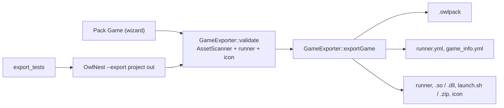

# Game export {#page-design-game-export}

[TOC]

Design page for exporting a game authored in Owl Nest, summarised in the [Roadmap](../roadmap.md).

## v0.3.0 — export that works end to end (correctness)

Phase A of [Foundations](foundations.md). **Done**: the export has one implementation, a command line, and a test
that plays the exported sample project.

### One export path

`data::assets::pack::GameExporter` (engine) does the whole export; Owl Nest *Pack Game*, `OwlNest --export` and the
tests call it:

- `validate()` scans the project from its first scene (`AssetScanner::scanProject`) and lists missing references,
  a missing runner and a missing icon; the editor shows them before packing.
- `exportGame()` writes the pack, rewrites absolute `pat:` texture paths of scenes, tilesets, tilemaps and prefabs to
  the packed `nam:` entry, writes `runner.yml` / `game_info.yml` with a YAML emitter, copies the icon (searched in
  the project, then the asset directories), the runner and every shared library next to it (replacing older
  copies), then writes `launch.sh` (Linux) or the `.zip` (Windows). Failures return an `ExportError`.
- `OwlNest --export <project dir or owl_project.yml> <output dir>` runs it headless (Null backends) from the
  executable folder, so the engine assets are found whatever the current directory; exit code 0 on success.

### Headless runner

- `--headless` starts the runner on the Null window, renderer and sound backends.
- `--smoke-test [frames]` plays the first scene, then every other scene of the pack, `frames` frames each (60 by
  default); `scene.quit()` moves to the next scene. The runner exits with code 1 if any error was logged or a scene
  failed to load (`LogBuffer::getErrorCount`, `Application::setExitCode`).
- The runner also exits with code 1 when `runner.yml` or the first scene is missing.

### Automated test

`test/export_tests` (CTest label `export`, about one second):

- unit tests of `GameExporter` on a synthetic project: file layout, `runner.yml` round trip with `:` in the name,
  `pat:` relocation, stale library replacement, every `ExportError`;
- end to end: `OwlNest --export sample_project`, check that every scene, tileset, tilemap and script is in the
  pack without absolute path, move the game folder elsewhere, run `launch.sh --headless --smoke-test 60` from
  another directory, and fail on a non-zero exit code or any warning / error in `Owl.log`.

### Defects found by the first real export

| Defect                                                                                          | Fix                                                       |
|-------------------------------------------------------------------------------------------------|-----------------------------------------------------------|
| 71 sprite textures of `raycast_demo.owl` saved as absolute `pat:` paths of a developer checkout | `Texture` saves files inside an asset directory as `nam:` |
| Same paths absent from the pack                                                                 | Export rewrites absolute `pat:` to the packed entry       |
| `VoxelWorld` tileset and its atlas not scanned: voxel scene untextured in the game              | `AssetScanner` follows `VoxelWorld.Tileset`               |
| Project icon only searched in the project folder (`logo/logo_owl.png` is an engine asset)       | Icon also searched in the asset directories               |
| `runner.yml` written by hand: a `:` or `#` in the game name corrupts it                         | YAML emitter                                              |
| Re-export kept the stale `.so` of the previous export                                           | Libraries always replaced                                 |
| `launch.sh` added the current directory to `LD_LIBRARY_PATH` when it was empty                  | Separator only when the variable is set                   |
| Runner returned 0 on a fatal error; missing tilemap / tileset silently ignored                  | Exit code 1, warning on missing tilemap / tileset         |

### Still open

- Headless runs prove that every asset is found and loaded, not that it renders: image tests come with Phase B
  (lavapipe / llvmpipe). A manual Vulkan run in Docker played seven scenes, then lost the device on
  `world_map.owl` (GPU in a container, to be confirmed on a host).
- Shaders are compiled at first run from the packed `.slang` sources; precompiled SPIR-V in the pack is still to do.
- The exported binaries keep the build-tree RPATH after `$ORIGIN`; harmless (`$ORIGIN` comes first) but not clean.

## v0.10.0 — cross-platform packaging

- Cross-compile packaging from any host
    - Package a Linux game from Windows and a Windows game from Linux
    - Pre-built runner binaries per target platform (downloaded or bundled)
    - Cross-platform shared library bundling (resolve target-platform `.so`/`.dll`)
- Target platform selector in Pack Game
    - Choose target: Linux x64, Windows x64, Web (independently of host)
    - Automatic runner binary selection for target platform
    - Platform-specific post-processing (launcher script for Linux, .zip for Windows, HTML template for the Web)
