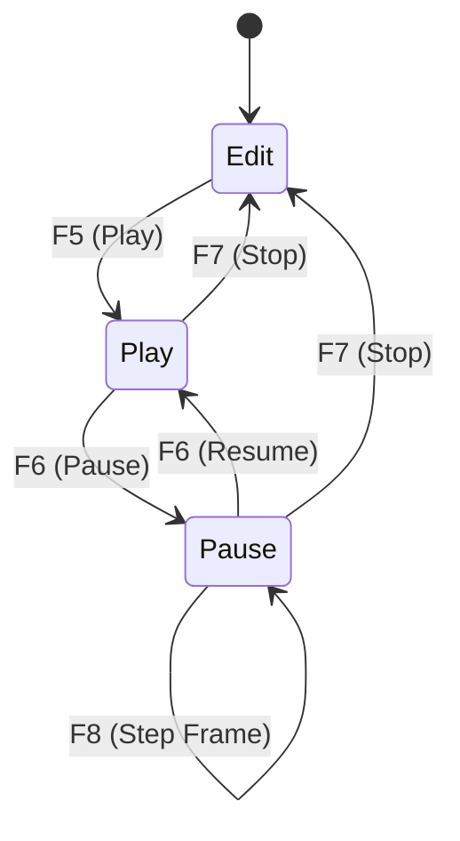
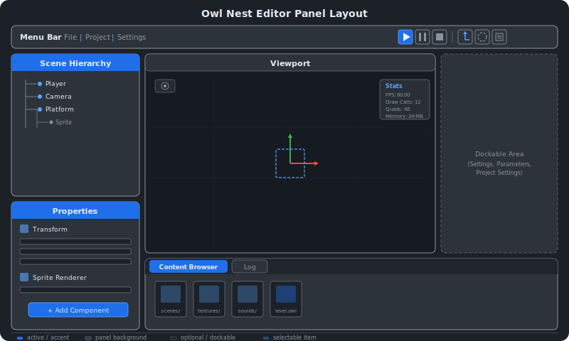

# Editor (Owl Nest) {#page-editor}

[TOC]

This page describes Owl Nest, the scene editor for the Owl engine: its panel layout,
project management workflow, and playback controls.

## Overview

Owl Nest is the primary development tool for the Owl engine. It provides a fully
dockable panel interface built on ImGui and ImGuizmo, allowing developers to compose
scenes, inspect entities, browse project assets, and test gameplay in real time.

The editor ships as two executables:

| Executable   | Purpose                                                        |
|--------------|----------------------------------------------------------------|
| `owl_nest`   | Scene editor with full docking UI, gizmos, and project tools   |
| `owl_runner` | Standalone game runner that loads a packed or unpacked project |

Both executables share the same scene runtime. The editor adds the editing chrome
(panels, gizmos, toolbar) while the runner provides a clean playback environment.

The editor operates as a state machine with three states:



| State     | Description                                                     |
|-----------|-----------------------------------------------------------------|
| **Edit**  | Editor camera active, no simulation, scene is directly editable |
| **Play**  | Scene copy is simulated, runtime camera active, physics running |
| **Pause** | Simulation frozen, render-only mode with step-frame support     |

## Panel Layout



The default arrangement uses ImGui docking to organize the workspace into four
major zones:

- **Left column** -- Scene Hierarchy (top) and Properties (bottom), stacked
  vertically
- **Center** -- Viewport, the main rendering area with an overlaid toolbar
  and optional Stats window
- **Bottom strip** -- Content Browser and Log as tabbed panels spanning the
  center and right regions
- **Right / floating** -- Additional panels (Settings, Parameters, Project
  Settings) appear as dockable windows or modal dialogs

All panels can be rearranged, resized, and tabbed together freely through
the ImGui docking system. The layout is initialized by `EditorLayer::onAttach()`
and persists via the ImGui `imgui.ini` file.

## Documents

Owl Nest is multi-document: each open scene (and, in future versions, each Lua
script or node graph) lives in its own tab. Internally the editor owns a
`DocumentManager` that holds the open documents and tracks which one is
**active**. Global panels (Scene Hierarchy, Properties, Viewport) always
reflect the active document.

- **Document tab bar** — rendered inside the Viewport header; lists every open
  document. Click a tab to make it active. A `*` marks unsaved changes, a ▶ /
  ❙❙ badge marks the document currently in Play / Pause mode.
- **Close** — the tab's `x` closes it immediately when clean; a "Discard
  changes / Cancel" modal appears if the document has unsaved edits.
- **Shortcuts** — `Ctrl+W` close active document, `Ctrl+Tab` / `Ctrl+Shift+Tab`
  cycle forward/backward.
- **Play scope** — only one document can run at a time. When a document is in
  Play or Pause and the user switches to a different tab, the toolbar
  (Play/Pause/Stop/Step) and gizmo controls are hidden; the playing document
  keeps running in the background (physics/scripts advance without rendering)
  and its tab badge makes its state visible.
- **Per-document state** — each document owns its own undo stack, dirty flag,
  selection, and playback state.

Key types live in `source/owlnest/sources/document/`: `Document` (interface),
`DocumentManager`, `SceneDocument`, `DocumentTabBar`.

## Panels Reference

### Viewport

The viewport is the main rendering surface. It draws the active scene into an
off-screen `Framebuffer` with two color attachments:

| Attachment | Format          | Purpose                     |
|------------|-----------------|-----------------------------|
| 0          | Surface (RGBA8) | Visible color output        |
| 1          | RedInteger      | Entity ID for mouse picking |

**Editor camera.** In Edit mode the viewport uses a `CameraEditor` (orbit
camera) controlled by mouse drag and scroll. The camera updates only when the
viewport is hovered, preventing accidental movement while interacting with other
panels.

**Gizmos.** When an entity is selected, ImGuizmo renders a manipulator gizmo in
the viewport. The gizmo type is controlled by the toolbar buttons or keyboard
shortcuts (Q/W/E/R/T):

| Type        | Key | Description                         |
|-------------|-----|-------------------------------------|
| None        | Q   | No gizmo, click-to-select only      |
| Translation | W   | Move the entity along axes          |
| Rotation    | E   | Rotate the entity around axes       |
| Scale       | R   | Scale the entity along axes         |
| All         | T   | Combined translate + rotate + scale |

**Entity picking.** Clicking in the viewport reads the RedInteger attachment at the
mouse position. If the value is a valid entity ID (not -1), the corresponding entity
is selected in the Scene Hierarchy and Properties panels.

**Overlays.** During Edit mode the viewport renders additional debug overlays:

- Physics collider wireframes (box and circle shapes)
- Camera frustum visualization for non-primary cameras
- Trigger zone icons (victory, death, target, teleport, timer, interaction, lua callback)

### Scene Hierarchy

The Scene Hierarchy panel displays all entities in the active scene as a tree view.
Entities with children (via the `Hierarchy` component) expand to show nested items.
Root entities have `parentId == 0` and appear at the top level.

**Selection.** Clicking an entity selects it. The selection is shared with the
Properties panel and the viewport gizmo.

**Drag-drop reparenting.** Drag an entity node onto another entity to make it a
child. The engine calls `Scene::setParent()` which checks for circular references
and recomputes the local transform to preserve the entity's world position.

**Context menu.** Right-clicking an entity (or the panel background) opens a context
menu with the following actions:

| Action               | Description                                               |
|----------------------|-----------------------------------------------------------|
| Create Root Entity   | Add a new entity at the root level                        |
| Create Child Entity  | Add a new entity as a child of the selected entity        |
| Duplicate            | Shallow-copy the selected entity (root copy)              |
| Duplicate Subtree    | Recursively duplicate the entity and all descendants      |
| Create Prefab...     | Save the entity subtree as a `.owlprefab` file            |
| Update from Prefab   | Refresh non-overridden components from the prefab file    |
| Revert to Prefab     | Reset all overrides, making the instance match the prefab |
| Unlink Prefab        | Remove the PrefabLink, turning it into a regular entity   |
| Unparent             | Move the entity to root level, preserving world transform |
| Delete               | Remove the entity, reparenting children to grandparent    |
| Delete with Children | Cascade-delete the entity and all descendants             |

Prefab-related actions only appear when the selected entity is a prefab instance (has a
`PrefabLink` component). Prefab instance entities are displayed with a blue text tint in
the hierarchy tree.

### Properties

The Properties panel shows all components attached to the currently selected entity.
Each component has a collapsible header with a dedicated editor widget:

- **Transform** -- Position, rotation, and scale drag-float fields (local space)
- **Sprite Renderer** -- Color picker, texture picker (drag from Content Browser)
- **Animated Sprite** -- Sprite sheet configuration with frame timing
- **Circle Renderer** -- Color, thickness, and fade controls
- **Text Renderer** -- Text content, font selection, color, line spacing
- **Camera** -- Projection type dropdown, field-of-view / ortho size sliders
- **Rigidbody 2D** -- Body type dropdown (static / dynamic / kinematic)
- **Box Collider 2D** -- Size, offset, density, friction, restitution
- **Circle Collider 2D** -- Radius, offset, density, friction, restitution
- **Native Script** -- Script class name
- **Sound Source** -- Sound asset picker, volume, pitch, loop, spatial, play-on-start
- **Sound Listener** -- Primary listener toggle
- **Trigger** -- Trigger type dropdown (Victory, Death, Target, Teleport, Timer, Interaction,
  LuaCallback), configurable callback name, type-specific fields (duration, range, level name)
- **Player** -- Player tag configuration
- **Link** -- External entity reference
- **Background** -- Background layer settings
- **Visibility** -- Per-entity visibility toggle (inherited by children)
- **Lua Script** -- Script asset path, editable property list
- **Canvas** -- UI container for screen-space overlay elements
- **UI Rect / Text / Image / Panel / Button / Slider / Progress Bar** -- In-game UI elements
- **Prefab Link** -- Read-only display: source asset path, synced version, mapped entity count

**Add Component.** The "Add Component" button at the bottom opens a dropdown listing
all optional component types that the entity does not already have.

**Remove Component.** Right-clicking a component header shows a "Remove Component"
option (except for mandatory components like Transform and Hierarchy).

### Content Browser

The Content Browser provides a file grid view of the project's asset directory. It
supports navigation, file operations, and drag-drop integration with other panels.

**Navigation toolbar.** A breadcrumb-style path bar at the top with a back button.
The browser roots at the project's asset directory and prevents navigation above it.

**File type icons.** Files are displayed with type-specific icons loaded from the
icon bank. Each icon shares the same file-frame template, carries an extension ribbon
label (e.g. `WAV`, `CPP`) and a central type glyph:

| Category  | Extensions                           | Central glyph            |
|-----------|--------------------------------------|--------------------------|
| Scene     | `.owl`                               | Isometric scene floor    |
| Prefab    | `.owlprefab`                         | Puzzle-piece "P" badge   |
| Image     | `.png`, `.jpg`, `.svg`               | Frame with sun + peaks   |
| Font      | `.ttf`                               | "Aa" sample              |
| Config    | `.yml`, `.json`                      | Gear / curly braces      |
| Shader    | `.glsl`                              | GPU chip with pins       |
| Script    | `.lua`                               | Crescent moon + star     |
| Sound     | `.wav`, `.mp3`, `.ogg`, `.flac`      | Speaker with waves       |
| Mesh      | `.obj`, `.gltf`, `.glb`, `.fbx`      | Isometric cube wireframe |
| Source    | `.py`, `.cpp`/`.cxx`, `.h`/`.hpp`, `.c` | Language-specific glyph  |
| Doc       | `.md`                                | Markdown mark + arrow    |
| Fallback  | plain text                           | Text lines               |

Folders use a distinct folder icon. The secondary accent (amber `#ffc726`) highlights
glyph details; the primary color follows the active ImGui theme text color.

**Interactions:**

| Action                        | Effect                                        |
|-------------------------------|-----------------------------------------------|
| Double-click folder           | Navigate into the folder                      |
| Double-click `.owl` file      | Open the scene in the editor                  |
| Drag `.owlprefab` to Viewport | Instantiate the prefab into the scene         |
| Drag texture to Properties    | Assign the texture to a Sprite Renderer field |
| Drag sound to Properties      | Assign the sound to a Sound Source field      |
| Right-click background        | Context menu: New Folder, Import File/Folder  |
| Right-click file/folder       | Context menu: Rename, Delete                  |
| OS file drop                  | Copy dropped files into the current directory |

### Log Panel

The Log panel displays a scrolling view of engine and application log messages. It
supports filtering by log level and logger source.

**Level filters.** Toggle buttons for each severity level: Trace, Debug, Info,
Warning, Error, Critical. Disabled levels are hidden from the output.

**Logger filters.** Separate toggles for Core (engine) and App (application) loggers.

**Text search.** A search field filters visible messages by substring match.

**Auto-scroll.** Enabled by default, the panel automatically scrolls to the newest
message. Scrolling up manually disables auto-scroll until re-enabled.

### Stats

The Stats panel is a small overlay window that displays real-time performance
information. It can be toggled via the **Show Stats Panel** checkbox in
**Edit > Editor Settings** (General section).

Displayed metrics:

| Metric               | Source                                  |
|----------------------|-----------------------------------------|
| FPS                  | `Timestep::getFps()`                    |
| Current memory       | `TrackerAPI::globals().allocatedMemory` |
| Peak memory          | `TrackerAPI::globals().memoryPeek`      |
| Allocation calls     | Per-frame allocation count              |
| Deallocation calls   | Per-frame deallocation count            |
| Hovered entity       | Entity name under the mouse cursor      |
| Draw calls           | `Renderer2D::Statistics::drawCalls`     |
| Quad count           | `Renderer2D::Statistics::quadCount`     |
| Vertex / index count | Derived from quad count                 |
| Viewport size        | Current framebuffer dimensions          |

### Settings

The Settings panel is a dockable window opened via **Edit > Editor Settings**.
It contains three sections:

**General.** Toggles like the Show Stats Panel checkbox.

**Theme selection.** A dropdown listing built-in theme presets (e.g. "Dark"). Changing
the theme calls `UiLayer::setTheme()` and triggers `IconBank::rebuild()` to re-rasterize
all SVG icons with the new theme colors. The primary color follows the theme text color;
the secondary accent is a fixed amber/gold (`#ffc726`) matching the Owl Nest brand.

**Icon buttons.** Dialog and panel buttons use `IconBank::iconButton(name, label, size)`
to render an icon-prefixed button that falls back to a plain button when the icon is
missing. `IconBank::menuItem(name, label, shortcut)` does the equivalent for menu
entries.

**Keybinding editor.** A table listing all registered actions with their current
shortcuts. Each row shows the action name, default shortcut, and current binding.
Click a binding cell to enter key-capture mode: press any key combination to rebind.
The panel detects conflicts (two actions sharing the same shortcut) and displays a
warning. A "Reset to Defaults" button restores all factory bindings.

Keybinding overrides and recent projects are persisted in `OwlNest_settings.yml`
alongside other editor settings.

### Project Settings

The Project Settings dialog is opened via **Project > Project Settings**. It edits the
active project's configuration:

| Field        | Description                                             |
|--------------|---------------------------------------------------------|
| Project Name | Display name shown in the window title bar              |
| First Scene  | Dropdown of `.owl` files found in the project directory |
| Version      | Freeform version string (e.g., "1.0.0")                 |
| Author       | Author or studio name                                   |
| Description  | Short project description                               |
| Icon         | Relative path to a PNG icon for the game window         |
| Width        | Default window width in pixels (320–7680)               |
| Height       | Default window height in pixels (240–4320)              |
| Fullscreen   | Whether the game starts in fullscreen mode              |
| Resizable    | Whether the game window can be resized                  |

Changes are applied on confirmation and saved to `owl_project.yml`. The window settings
are also written to `runner.yml` during game export (`Project > Pack Game`) and applied
by the Runner at startup.

## Editor State Machine

The editor maintains a `State` enum (`Edit`, `Play`, `Pause`) that governs which
systems are active and how the scene is presented.

### Edit

The default state. The editor camera is active, physics and scripts are not running,
and the scene can be freely modified. All editing operations (entity creation, deletion,
reparenting, component editing, gizmo manipulation) are available.

### Play

Entered by pressing Play (or the configured shortcut). The editor:

1. Copies the current scene (`m_editorScene`) into `m_activeScene`
2. Calls `onStartRuntime()` on the copy, which initializes physics bodies and starts
   sounds with `playOnStart=true`
3. Switches to the runtime camera (the scene's primary camera entity)

Each frame calls `onUpdateRuntime()` which steps the physics simulation, updates
spatial sound positions, and invokes native scripts.

### Pause

Entered by pressing Pause during Play. The simulation freezes: `onUpdateRuntime()` is
skipped, but the scene continues to render. The Step Frame action advances the
simulation by exactly one frame, useful for debugging physics or animation timing.

### Stop

Pressing Stop discards the runtime copy and restores the original `m_editorScene`.
All runtime handles (physics bodies, sound sources) are cleaned up by `onEndRuntime()`.
The editor returns to Edit state.

**Cross-level teleport.** When a teleport trigger fires during Play, the editor loads
the target scene into `m_activeScene` (which enters Editing status). On the next frame
the editor detects this state mismatch, calls `onStartRuntime()` on the new scene, and
applies the pending velocity to the player at the target spawn point. Stopping always
restores the original `m_editorScene`.

## Project Workflow

Owl Nest organizes assets and scenes through a project system. A project is a directory
containing an `owl_project.yml` configuration file and asset subdirectories.

### Project Structure

```
my_game/
  owl_project.yml
  game_settings.yml
  scenes/
    main.owl
    level_2.owl
  textures/
    player.png
  sounds/
    jump.wav
  fonts/
    main.ttf
  scripts/
    player.lua
```

The optional `game_settings.yml` file defines default game settings (player speed, volumes,
etc.) as key-value pairs. These defaults are loaded by the Runner at startup and can be
overridden by the player via the Lua `settings` API. See
[Lua Scripting > settings](scripting.md) for details.

### owl_project.yml

```yaml
name: "My Game"
firstScene: "scenes/main.owl"
```

The `Project` class (`source/owlnest/sources/Project.h`) holds three fields: `name`,
`firstScene`, and `projectDirectory`. The configuration is loaded and saved via
`loadFromFile()` / `saveToFile()`.

### Workflow Operations

The editor menus are organized around three axes: **File** (project), **Edit**
(history + settings), and **Current** (active scene).

**File** — project operations:

| Operation     | Menu Path             | Description                                          |
|---------------|-----------------------|------------------------------------------------------|
| New Project   | File > New Project    | Create a directory and blank `owl_project.yml`       |
| Open Project  | File > Open Project   | Select a directory containing `owl_project.yml`      |
| Open Recent   | File > Open Recent    | Sub-menu of recently opened projects (up to 10)      |
| Save Project  | File > Save Project   | Write current project settings to YAML               |
| Close Project | File > Close Project  | Unload the project and clear the asset browser       |
| Pack Game     | File > Pack Game      | Scan and pack all project assets (async, see below)  |
| Welcome       | File > Welcome Screen | Re-open the welcome screen when no project is loaded |

**Edit** — history and settings:

| Operation        | Menu Path               | Description                                     |
|------------------|-------------------------|-------------------------------------------------|
| Undo             | Edit > Undo             | Reverse the most recent editing action (Ctrl+Z) |
| Redo             | Edit > Redo             | Re-apply an undone action (Ctrl+Y)              |
| Engine Settings  | Edit > Engine Settings  | Engine parameters dialog                        |
| Editor Settings  | Edit > Editor Settings  | Theme, stats toggle, keybindings                |
| Project Settings | Edit > Project Settings | Edit the active project's metadata              |

**Current** — active scene operations (disabled if no project is loaded):

| Operation     | Menu Path                 | Description                                             |
|---------------|---------------------------|---------------------------------------------------------|
| New Scene     | Current > New Scene       | Clear the viewport and start a fresh scene              |
| Open Scene    | Current > Open Scene      | Load a `.owl` file (async read + deserialize)           |
| Save Scene    | Current > Save Scene      | Save to the current path (async write)                  |
| Save Scene as | Current > Save Scene as.. | Save to a new path                                      |
| Import Scene  | Current > Import Scene    | Copy an external `.owl` file into the project           |
| Pack Scene    | Current > Pack Scene      | Pack the current scene's assets into `.owlpack` (async) |

**Welcome screen.** When the editor starts without a loaded project, a Welcome modal is
shown with **New Project**, **Open Project**, and a list of recent projects (double-click
to open, `x` to remove). The modal is closable via its `×` button and can be reopened
from **File > Welcome Screen**.

**Async operations.** Pack Game, Pack Scene, Open Scene, and Save Scene all run off the
main thread via a progress modal (`AsyncProgressModal`). Pack Game additionally runs a
**pre-packaging validation** step that lists missing references (textures, sounds,
scripts, scenes) before proceeding — the user can either cancel or confirm to pack anyway.

The Edit menu labels dynamically show the description of the next undo/redo action
(e.g., "Undo Delete 'Player'").

**Window title.** The editor window title reflects the active project name and current
scene, updated by `updateWindowTitle()`. An asterisk (`*`) suffix indicates unsaved
changes (based on the undo history dirty state).

## Prefab Workflow

Prefabs are reusable entity subtree templates stored as `.owlprefab` files. They allow
creating complex entity hierarchies once and reusing them across scenes.

### Creating a Prefab

Right-click any entity in the Scene Hierarchy and select **Create Prefab...**. A file save
dialog opens; the entity and all its descendants are serialized to the chosen `.owlprefab`
file. The current entity UUIDs become the canonical UUIDs for the prefab.

### Instantiating a Prefab

Drag a `.owlprefab` file from the Content Browser into the Viewport. The engine creates
new entities with fresh UUIDs and adds a `PrefabLink` component to the root entity. The
link stores the source asset path and a UUID mapping connecting each instance entity to its
canonical prefab counterpart.

### Updating Instances

When the source `.owlprefab` file is edited (e.g., by modifying the original entity and
re-creating the prefab), instances can be updated:

- **Update from Prefab** -- Refreshes all components that have not been locally overridden.
  Components that were modified on the instance are preserved.
- **Revert to Prefab** -- Clears all local overrides and resets the instance to match the
  prefab exactly.
- **Unlink Prefab** -- Removes the `PrefabLink` component, turning the instance into a
  standalone entity subtree with no connection to the source file.

All prefab operations are fully undoable.

## Toolbar

The toolbar is rendered as a frameless overlay window centered at the top of the viewport.
Its contents change depending on the editor state.

### Playback Controls

| State | Buttons Available        |
|-------|--------------------------|
| Edit  | Play                     |
| Play  | Pause, Stop              |
| Pause | Resume, Stop, Step Frame |

### Gizmo Controls

In Edit mode a secondary button bar appears in the top-right corner of the viewport.
It contains toggle buttons for Translation, Rotation, and Scale gizmo modes. Clicking
an active gizmo button deactivates it (returning to None mode).

## Keyboard Shortcuts

All shortcuts are managed by the `ActionRegistry` class and can be rebound via the
Settings panel. The table below lists factory defaults.

### Scene Operations

| Action        | Default Shortcut | Action ID      |
|---------------|------------------|----------------|
| New Scene     | Ctrl+N           | `scene.new`    |
| Open Scene    | Ctrl+O           | `scene.open`   |
| Save Scene    | Ctrl+S           | `scene.save`   |
| Save Scene As | Ctrl+Shift+S     | `scene.saveAs` |

### Edit Operations

| Action | Default Shortcut | Action ID   |
|--------|------------------|-------------|
| Undo   | Ctrl+Z           | `edit.undo` |
| Redo   | Ctrl+Y           | `edit.redo` |

All entity, component, hierarchy, and gizmo editing operations are undoable. Rapid
consecutive edits on the same property (e.g. dragging a slider) are automatically
coalesced into a single undo step.

### Entity Operations

| Action           | Default Shortcut | Action ID          |
|------------------|------------------|--------------------|
| Duplicate Entity | Ctrl+D           | `entity.duplicate` |
| Delete Entity    | Delete           | `entity.delete`    |

### Gizmo Modes

| Action           | Default Shortcut | Action ID          |
|------------------|------------------|--------------------|
| Gizmo: None      | Q                | `guizmo.none`      |
| Gizmo: Translate | W                | `guizmo.translate` |
| Gizmo: Rotate    | E                | `guizmo.rotate`    |
| Gizmo: Scale     | R                | `guizmo.scale`     |
| Gizmo: All       | T                | `guizmo.all`       |

Gizmo shortcuts are only active when the viewport is focused or hovered, and no
gizmo manipulation is in progress.

### Playback

| Action      | Default Shortcut | Action ID     |
|-------------|------------------|---------------|
| Play/Resume | F5               | `scene.play`  |
| Pause       | F6               | `scene.pause` |
| Stop        | F7               | `scene.stop`  |
| Step Frame  | F8               | `scene.step`  |

### Rebinding

All shortcuts can be rebound through the **Editor Settings** panel (Settings >
Editor Settings). The `ActionRegistry` stores factory defaults alongside current
bindings. Non-default overrides are persisted in `OwlNest_settings.yml` under the
`keybindingOverrides` key.

The registry provides conflict detection: when a new binding collides with an existing
action, a warning is displayed showing the conflicting action name. Dispatch can be
temporarily suspended (e.g. during key capture) via `ActionRegistry::setSuspended()`.

See [Architecture](architecture.md) for the overall engine structure and
[Sound](sound.md) for the audio system integrated with the editor.
