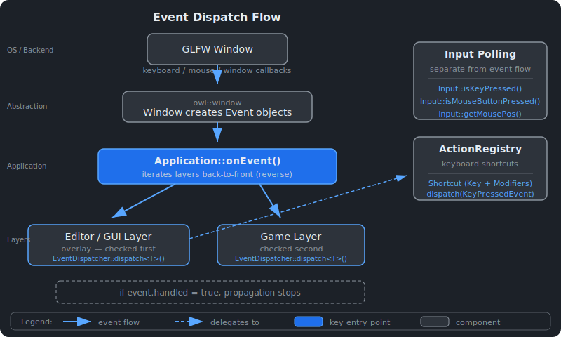

# Event and Input System {#page-event-input}

[TOC]

This page covers the Owl event system, input polling, and editor keybindings.

## Overview

Owl uses a synchronous event model. GLFW callbacks generate `owl::event::Event`
objects which are dispatched through `Application::onEvent()` to the layer stack
in reverse order (overlays first, then regular layers). Each layer can mark an
event as handled to stop further propagation. In parallel, the `Input` class
provides frame-by-frame polling for key and mouse state.

## Event System



### Event Base Class

Every event derives from `owl::event::Event` (declared in `event/Event.h`):

| Method              | Return Type | Description                              |
|---------------------|-------------|------------------------------------------|
| `getType()`         | `Type`      | Runtime event type enum value            |
| `getCategoryFlags()`| `uint8_t`   | Bitmask of categories this event belongs to |
| `getName()`         | `std::string` | Human-readable event name              |
| `toString()`        | `std::string` | Detailed string for logging            |
| `isInCategory(cat)` | `bool`      | Test against a `Category` bitmask        |

The `handled` flag (`bool`, default `false`) is public. Set it to `true` in a
dispatch callback to prevent layers below from seeing the event.

### Event Types

The `event::Type` enum lists all 17 event types:

| Group       | Type                  | Class                     |
|-------------|-----------------------|---------------------------|
| Window      | `WindowClose`         | `WindowCloseEvent`        |
| Window      | `WindowResize`        | `WindowResizeEvent`       |
| Window      | `WindowFocus`         | (reserved)                |
| Window      | `WindowLostFocus`     | (reserved)                |
| Window      | `WindowMoved`         | (reserved)                |
| Application | `AppTick`             | `AppTickEvent`            |
| Application | `AppUpdate`           | `AppUpdateEvent`          |
| Application | `AppRender`           | `AppRenderEvent`          |
| Keyboard    | `KeyPressed`          | `KeyPressedEvent`         |
| Keyboard    | `KeyReleased`         | `KeyReleasedEvent`        |
| Keyboard    | `KeyTyped`            | `KeyTypedEvent`           |
| Mouse       | `MouseButtonPressed`  | `MouseButtonPressedEvent` |
| Mouse       | `MouseButtonReleased` | `MouseButtonReleasedEvent`|
| Mouse       | `MouseMoved`          | `MouseMovedEvent`         |
| Mouse       | `MouseScrolled`       | `MouseScrolledEvent`      |
| File        | `FileDrop`            | `FileDropEvent`           |

### Category Bitmask

Categories allow testing multiple event types at once via `isInCategory()`:

| Category      | Value | Description                     |
|---------------|-------|---------------------------------|
| `Application` | 1     | Window and application events   |
| `Input`       | 2     | Any user input event            |
| `Keyboard`    | 4     | Keyboard events                 |
| `Mouse`       | 8     | Mouse movement and scroll       |
| `MouseButton` | 16    | Mouse button press/release      |

A single event can belong to multiple categories. For example, `MouseButtonPressedEvent`
has flags `Input | Mouse | MouseButton` (value `2 | 8 | 16 = 26`).

## EventDispatcher

The `EventDispatcher` pattern provides type-safe event handling. Create a
dispatcher from an `Event&`, then call `dispatch<T>()` with a callback for each
event type you care about:

```cpp
void EditorLayer::onEvent(event::Event& ioEvent) {
    event::EventDispatcher dispatcher(ioEvent);
    dispatcher.dispatch<event::WindowResizeEvent>(
        [this](event::WindowResizeEvent& iEvent) -> bool {
            onWindowResize(iEvent);
            return false; // allow further propagation
        });
    dispatcher.dispatch<event::KeyPressedEvent>(
        [this](event::KeyPressedEvent& iEvent) -> bool {
            return onKeyPressed(iEvent); // true = handled
        });
    dispatcher.dispatch<event::MouseScrolledEvent>(
        [this](event::MouseScrolledEvent& iEvent) -> bool {
            return onMouseScrolled(iEvent);
        });
}
```

`dispatch<T>()` compares `event.getType()` against `T::getStaticType()`. If they
match, it casts the event to `T&` and calls the callback. The return value is
OR-ed into `event.handled`.

## Event Classes

### KeyEvent (base for keyboard events)

| Method          | Return Type        | Description           |
|-----------------|--------------------|-----------------------|
| `getKeyCode()`  | `input::KeyCode`   | GLFW-compatible key code |

### KeyPressedEvent

| Method            | Return Type | Description                         |
|-------------------|-------------|-------------------------------------|
| `getRepeatCount()`| `uint16_t`  | 0 for initial press, >0 for repeats |

### KeyReleasedEvent / KeyTypedEvent

No additional accessors beyond `getKeyCode()`. `KeyTypedEvent` is emitted for
character input (distinct from physical key presses).

### MouseMovedEvent

| Method   | Return Type | Description              |
|----------|-------------|--------------------------|
| `getX()` | `float`     | Mouse X position (pixels)|
| `getY()` | `float`     | Mouse Y position (pixels)|

### MouseScrolledEvent

| Method     | Return Type | Description              |
|------------|-------------|--------------------------|
| `getXOff()`| `float`     | Horizontal scroll offset |
| `getYOff()`| `float`     | Vertical scroll offset   |

### MouseButtonPressedEvent / MouseButtonReleasedEvent

Both inherit from `MouseButtonEvent`:

| Method             | Return Type        | Description    |
|--------------------|--------------------|----------------|
| `getMouseButton()` | `input::MouseCode` | Button code    |

### WindowResizeEvent

| Method        | Return Type          | Description        |
|---------------|----------------------|--------------------|
| `getWidth()`  | `uint32_t`           | New window width   |
| `getHeight()` | `uint32_t`           | New window height  |
| `getSize()`   | `const math::vec2ui&`| Width and height   |

### FileDropEvent

| Method       | Return Type                              | Description            |
|--------------|------------------------------------------|------------------------|
| `getPaths()` | `const std::vector<std::filesystem::path>&` | Dropped file paths  |

Emitted when the user drags files from the OS file manager onto the application
window. The editor uses this to import assets.

## Input Polling

The `owl::input::Input` static class provides per-frame state queries,
independent of the event dispatch flow. Initialize it once with
`Input::init(windowType)` (called automatically by `Application`).

| Method                               | Return Type  | Description                          |
|--------------------------------------|--------------|--------------------------------------|
| `isKeyPressed(KeyCode)`              | `bool`       | True if the key is currently held    |
| `isMouseButtonPressed(MouseCode)`    | `bool`       | True if the mouse button is held     |
| `getMouseX()`                        | `float`      | Current mouse X position             |
| `getMouseY()`                        | `float`      | Current mouse Y position             |
| `getMousePos()`                      | `math::vec2` | Current mouse position as a vector   |
| `injectKey(KeyCode)`                 | `void`       | Simulate a key toggle (for testing)  |
| `injectMouseButton(MouseCode)`       | `void`       | Simulate a mouse button toggle       |
| `injectMousePos(const math::vec2&)`  | `void`       | Simulate mouse movement              |
| `resetInjection()`                   | `void`       | Clear all injected state             |

**Type aliases:** `KeyCode` is `uint16_t` (GLFW-compatible values defined in
`input/KeyCodes.h`). `MouseCode` is `uint8_t` (values in `input/MouseCode.h`,
e.g. `mouse::ButtonLeft`, `mouse::ButtonRight`, `mouse::ButtonMiddle`).

The `inject*` and `resetInjection` methods exist for automated testing with the
Null input backend, allowing tests to simulate user input without a real window.

## CameraOrthoController

`owl::input::CameraOrthoController` wraps a `CameraOrtho` with keyboard and
mouse controls suitable for 2D scene editing or gameplay:

```cpp
// Create with aspect ratio; enable rotation with second parameter
input::CameraOrthoController controller(16.0f / 9.0f, true);

// Each frame:
controller.onUpdate(timeStep);

// Forward events:
controller.onEvent(event);
```

### Controls

| Input         | Action                                   |
|---------------|------------------------------------------|
| W / A / S / D | Translate camera up / left / down / right|
| Mouse scroll  | Zoom in / out (adjusts zoom level)       |
| Q / E         | Rotate counter-clockwise / clockwise (if rotation enabled) |

### Properties

| Property             | Type    | Default | Description                          |
|----------------------|---------|---------|--------------------------------------|
| `translationSpeed`   | `float` | 5.0     | Camera movement speed (units/second) |
| `rotationSpeed`      | `float` | 180.0   | Rotation speed (degrees/second)      |
| `zoomLevel`          | `float` | 1.0     | Current zoom (affects ortho bounds)  |

Translation speed scales with the current zoom level so that movement feels
consistent regardless of zoom. The controller also handles `WindowResizeEvent`
to update the camera's aspect ratio.

## Action Registry

The `ActionRegistry` (in `owl::nest`) is the editor keybinding system used by
Owl Nest. It maps `Shortcut` objects (a `KeyCode` plus `Modifiers` bitmask)
to named actions with callbacks.

### Modifiers

| Value       | Description              |
|-------------|--------------------------|
| `None`      | No modifier              |
| `Ctrl`      | Control key              |
| `Shift`     | Shift key                |
| `Alt`       | Alt key                  |
| `CtrlShift` | Control + Shift          |
| `CtrlAlt`   | Control + Alt            |
| `ShiftAlt`  | Shift + Alt              |
| `CtrlShiftAlt` | Control + Shift + Alt |

### API

| Method                                          | Description                                |
|-------------------------------------------------|--------------------------------------------|
| `registerAction(id, displayName, shortcut, cb)` | Register an action with its default binding|
| `dispatch(KeyPressedEvent)`                     | Match event to an action and invoke it     |
| `rebind(id, newShortcut)`                       | Change an action's shortcut at runtime     |
| `findConflict(shortcut, excludeId)`             | Check if a shortcut is already in use      |
| `resetToDefaults()`                             | Restore all shortcuts to factory defaults  |
| `getShortcutString(id)`                         | Display string like "Ctrl+S"               |
| `loadOverrides(map)` / `getOverrides()`         | Persist custom bindings across sessions    |
| `setSuspended(bool)`                            | Pause dispatching during key capture UI    |

### Usage

Actions are registered during editor initialization in `EditorLayer`. The
settings panel (`SettingsPanel`) provides a UI for viewing and rebinding
shortcuts, including conflict detection.

```cpp
m_actionRegistry.registerAction(
    "scene.save", "Save Scene",
    {input::key::S, Modifiers::Ctrl},
    [this]() { saveScene(); });
```

When a `KeyPressedEvent` reaches the editor layer, it is forwarded to the
registry:

```cpp
auto EditorLayer::onKeyPressed(const event::KeyPressedEvent& iEvent) -> bool {
    if (iEvent.getRepeatCount() > 0)
        return false;
    return m_actionRegistry.dispatch(iEvent);
}
```

See [Architecture](architecture.md) for the overall engine structure,
[Editor](editor.md) for the Owl Nest application, and [Scene](scene.md) for
the entity-component system.
