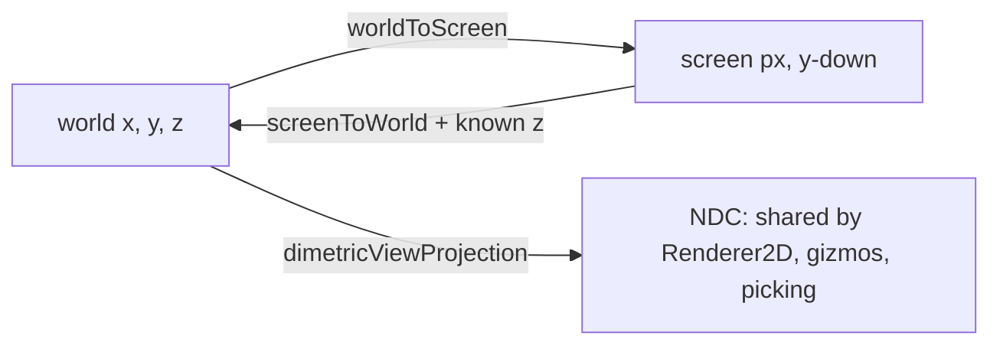

# Isometric Renderer {#page-isometric}

[TOC]

The isometric renderer (introduced in v0.2.2) is a third non-2D rendering mode in the **Transport Tycoon Deluxe**
tradition: a fixed 2:1 dimetric projection with no free-look camera, slotted into the composable renderer stack
alongside the 2D, raycast, and voxel modes. This page documents the **projection foundation**; flat-tile rendering,
the heightmap-aware tileset, and the in-editor authoring tools are layered on top in later v0.2.2 work and are
documented as they land.

## Projection

World axes map to screen pixels through a fixed dimetric basis. Screen Y grows downward, so a larger `worldX + worldY`
lands lower on screen (further "into" the scene) and a larger `worldZ` lifts the point upward:

```
screen.x = origin.x + (worldX - worldY) * tileWidth  / 2
screen.y = origin.y + (worldX + worldY) * tileHeight / 2 - worldZ * zStep
```

Tile sprites are 64x32 px by default — the 2:1 width-to-height ratio sets the dimetric angle. The mapping is configured
per layer through `IsometricConfig`:

| Field      | Meaning                                                                  | Default   |
|------------|--------------------------------------------------------------------------|-----------|
| `tileSize` | Tile sprite footprint in pixels; the X:Y ratio sets the dimetric angle   | `{64, 32}`|
| `zStep`    | Vertical pixels added per world Z unit (elevation of stacked tiles)      | `16`      |
| `origin`   | Screen-space pixel offset where world origin `(0, 0, 0)` projects        | `{0, 0}`  |



`worldToScreen` / `screenToWorld` are exposed for gameplay and editor code; `dimetricViewProjection` builds the
equivalent world-to-NDC matrix the layer binds, so `Renderer2D`, the editor gizmos, and mouse picking all share the
same isometric basis. The matrix is a pure affine mapping (no perspective divide).

## Layer

`RendererIsometric` (factory key `"RendererIsometric"`) registers like the other render layers. A scene opts in by
listing it in the project `RendererStack` / per-scene `EnabledRenderers` and tagging entities with the matching
`RendererTag`:

```yaml
EnabledRenderers:
  - Name: iso
    Type: RendererIsometric
    Overrides:
      TileWidth: 64
      TileHeight: 32
      ZStep: 16
      Origin: [640, 80]
```

The layer ignores the active scene camera: the projection is a fixed screen-space mapping driven entirely by the
configuration and the viewport size.
