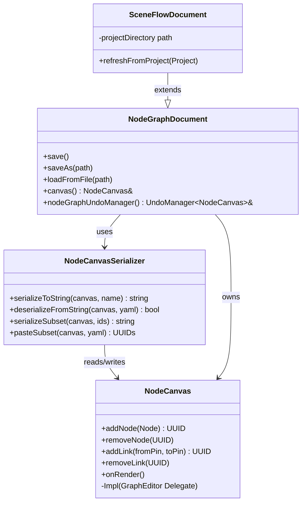
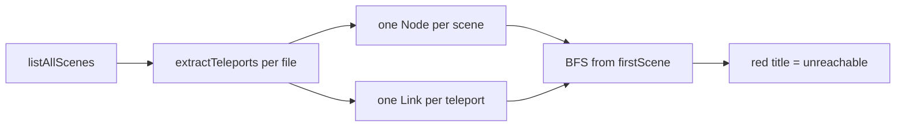

# Node Graph Framework {#page-node-graph}

[TOC]

This page documents Owl's generic node-graph widget and the editor subsystems
built on top of it. The framework is designed to be **reusable**: the Scene
Flow view is the first consumer; future releases reuse the same canvas for
animation graphs, behavior trees and dialogue trees.

## Current status

| Piece                                  | Status       |
|----------------------------------------|--------------|
| `gui::widgets::NodeCanvas` widget      | Done         |
| `UndoCommand<T>` / `UndoManager<T>`    | Done         |
| `NodeCanvasSerializer` (YAML round-trip + copy/paste) | Done |
| `NodeGraphDocument` (third tab kind)   | Done         |
| Node-graph undo commands               | Done         |
| `SceneFlowDocument` (first consumer)   | Done (read-only + navigation) |
| Scene Flow **link editing**            | Planned (composite undo)      |

## Architecture



## `gui::widgets::NodeCanvas`

Location: `source/owl/public/gui/widgets/NodeCanvas.h` +
`source/owl/private/gui/widgets/NodeCanvas.cpp`.

The canvas is a **data container**: it holds nodes and links, routes user
events to callbacks, and draws itself. It never touches scene, physics or
any business data — domain side effects (e.g. creating a teleport trigger
when the user connects two scenes) belong to the callbacks the client
installs.

### Types

| Type          | Role                                                                 |
|---------------|----------------------------------------------------------------------|
| `PinKind`     | `Input` / `Output` — side of the node the pin sits on                |
| `NodePin`     | UUID + label + `typeTag` (opaque string for client-side validation)  |
| `Node`        | UUID + title + 2D position + input/output pins + `customData` + color|
| `Link`        | UUID + source output pin UUID + destination input pin UUID           |

`customData` is an opaque YAML blob owned by the client — it travels
through copy/paste and serialization unchanged. The Scene Flow view stores
the relative scene path there.

### Callbacks

Every callback is optional. Install them with `setOn*` methods before the
first `onRender()` call.

| Callback                 | Fires when                                                         |
|--------------------------|--------------------------------------------------------------------|
| `setLinkValidator`       | User attempts to draw a link — return false to veto                |
| `setOnLinkCreated`       | After a link was accepted and added to the canvas                  |
| `setOnLinkDeleted`       | User deleted a link (keyboard / context menu)                      |
| `setOnNodeMoved`         | User dragged a node — receives the new top-left position           |
| `setOnNodeSelected`      | Single click on a node                                             |
| `setOnNodeDoubleClicked` | Double click on the same node within 300 ms (detected in wrapper)  |
| `setOnContextMenu`       | Right click; `std::optional<UUID>` set when a specific node was hit|

### Backend

The pimpl wraps **`GraphEditor`** from the `imguizmo` DepManager package
(version 1.92.7). Since ImGuizmo is distributed as a bundle, the same
package also ships `ImSequencer`, `ImCurveEdit`, `ImGradient`,
`ImZoomSlider` and `ImLightRig` — available for future asset editors
without any new dependency.

GraphEditor exposes an index-based `Delegate` interface. The wrapper
maintains the UUID↔index mapping so the public API stays UUID-based and
any future swap to a different node-graph library only touches the `.cpp`.

### Double-click detection

`GraphEditor` has no native double-click signal — only
`SelectNode(index, selected)`. The wrapper tracks the last clicked node UUID
and timestamp; if the same node is re-selected within 300 ms the double-click
callback fires instead of the single-click one.

## `gui::widgets::NodeCanvasSerializer`

YAML round-trip for a canvas. Format is domain-agnostic — each client
(Scene Flow, future animation graphs…) puts its own schema into node
`customData`.

```yaml
NodeGraph: MyFlow
Version: 1
Nodes:
  - id: 12345
    title: "Level 1"
    position: [100, 50]
    titleColor: [1.0, 1.0, 1.0, 1.0]
    inputs:
      - {id: 1, label: "entry", typeTag: "scene_entry"}
    outputs:
      - {id: 2, label: "→ Level 2", typeTag: "scene_exit"}
    customData: |
      scenePath: scenes/level1.owl
Links:
  - {id: 10, from: 2, to: 11}
```

Copy/paste use `serializeSubset(canvas, selectedIds)` to emit a YAML
document for just the selected nodes, then `pasteSubset(canvas, yaml)`
to inject a copy with fresh UUIDs for every node, pin and link. The
paste preserves internal link topology (links whose endpoints are both
inside the subset) and discards the rest.

## Templated undo system

The undo stack is parameterized over its **target type** so scene edits
and node-graph edits coexist with full type safety.

- `UndoCommand<Target>` — abstract base for all reversible actions
- `UndoManager<Target>` — per-target stack with merge coalescing and dirty tracking
- `SceneUndoCommand` / `SceneUndoManager` — aliases for `Target = scene::Scene`
  (the default editor case)
- `NodeGraphUndoManager` — alias for `UndoManager<gui::widgets::NodeCanvas>`,
  owned by every `NodeGraphDocument`

Every existing editor command (`CreateEntityCommand`, `ModifyEntityCommand`,
`ReparentCommand`, `InstantiatePrefabCommand`, ...) inherits from
`SceneUndoCommand` with no behaviour change.

The concrete node-graph commands live in
`source/owlnest/sources/commands/NodeGraphCommands.{h,cpp}`:

| Command              | Behaviour                                                                   |
|----------------------|-----------------------------------------------------------------------------|
| `AddNodeCommand`     | Adds a node; undo removes it                                                |
| `RemoveNodeCommand`  | Removes a node AND captures its attached links; undo restores both         |
| `MoveNodeCommand`    | Moves a node; merges rapid successive moves on the same node into one step |
| `AddLinkCommand`     | Adds a link between two pins                                                |
| `RemoveLinkCommand`  | Removes a link; undo re-creates it (new UUID is reused on redo)             |

## `NodeGraphDocument`

Third concrete `DocumentType` (alongside `Scene` and `Code`). Owns a
`NodeCanvas` and a `NodeGraphUndoManager`. `save()`/`saveAs()` use
`NodeCanvasSerializer`; dirty is a full YAML diff against the snapshot
captured at the last save.

Integration surface:

- `EditorLayer::openNodeGraphFile(path)` — loads a `.owlflow` and adds a tab
  (or activates an existing tab pointing at the same path).
- `ContentBrowser` — double-clicking a `.owlflow` file routes to the
  handler above; drag-drop targets also call it.
- Ribbon — the contextual "Graph" tab exposes Save / Close for the active
  node-graph document.

## `SceneFlowDocument`

First consumer of the framework. Specialises `NodeGraphDocument` by
populating the canvas from the active project.



Behaviour in this first slice:

- **Scan** — walks the project directory recursively for `.owl` files.
- **Parse** — for each scene:
  - extracts every entity with a `Trigger` component of type `Teleport`,
    `Death` or `Victory` (all three serialize a `LevelName`) and uses the
    entity's `Tag.tag` as the source name when available;
  - resolves every `LuaScript.scriptPath` against the project directory and
    runs a best-effort regex scan (`scene\.load_scene\(["']…["']\)`) for
    Lua-driven transitions. Detected destinations become extra output pins
    tagged `scene_lua_exit` and labelled `[lua:SCRIPT] → DEST`.
- **Auto-size** — every node's bounding box is computed from its title and
  pin labels (`NodeCanvas::measureNode`), so long entity / scene names stay
  readable. Titles drop the implicit `.owl` extension. The grid layout
  uses the actual per-column max width and per-row max height so wide
  nodes never overlap their neighbours.
- **Pin styling** — labels are rendered inside the node frame
  (`NodeCanvas::CustomDraw`); GraphEditor receives `nullptr` for slot
  names so nothing leaks outside the rect. Each pin can carry its own
  `NodePin::labelColor`. Pin labels are compact — just the source
  identifier with a single-glyph kind hint. Teleport pins are white
  with the bare scene name (e.g. `LevelPortal`); Death pins are red
  and prefix the entity name with `[X]`; Victory pins are green with
  a `[*]` prefix; Lua transitions are blue with a `[l]` prefix
  followed by the script slug.
- **Layered layout** — `refreshFromProject` runs a BFS from the project's
  first scene to assign each scene its column = depth. Orphans go to a
  "limbo" column past the reachable graph. Within a column, scenes are
  sorted alphabetically. Replaces a fixed 4-column grid that left links
  crossing all over the place.
- **Orphan detection** — BFS from `Project::firstScene` through the
  resolved teleport destinations; any node not reached is drawn with a
  red title.
- **Navigation** — double-click a scene node opens that scene through
  `EditorLayer::openScene`.
- **Right-click menu** — on a node: **Edit scene** (opens it as a new tab)
  and **Delete scene** (confirmation modal, removes the file from disk,
  rescans). On empty space: **Add new scene...** — typed name is appended
  `.owl` if missing and put under `scenes/` if no slash; the new file is
  opened as a tab and the canvas rescans.
- **Hierarchy + Properties integration** — while the SceneFlow document is
  active, the global Scene Hierarchy and Properties panels host SceneFlow
  content (no separate floating overlay). The hierarchy lists every scene
  with its title color (red = orphan); single-click selects in the canvas,
  double-click opens. The properties panel shows the selected scene's path,
  outgoing transitions (color-coded by kind), and an **Open this scene**
  button. This is wired through three new generic virtuals on `Document`:
  `overridesGlobalPanels()`, `renderHierarchyPanel()`,
  `renderPropertiesPanel()`. Future node-graph documents (animation,
    behavior tree...) can reuse the same hook.

Opened from **File → Views → Scene Flow** in the ribbon. The document
persists for the editor session and can be refreshed by re-opening the
ribbon entry.

### Deferred (link editing)

Creating/deleting links from the canvas should translate to writing new
`Trigger` entities into the source scene YAML (link create) or removing
them (link delete). This requires a composite undo command that holds a
`SceneUndoCommand` (scene side) and a `NodeGraphUndoCommand` (canvas side)
and runs both in sync. The infrastructure is in place; the composite
command is planned as a follow-up.

## Planned consumers

| Document type           | Target type                      | Extension   |
|-------------------------|----------------------------------|-------------|
| `SceneFlowDocument`     | Scene graph overview             | (derived)   |
| Animation graph (v0.3)  | Anim state machine               | `.owlanim`  |
| Behavior tree (v0.4)    | AI behavior trees                | `.owlbt`    |
| Dialogue tree (v0.4)    | Branching conversations          | `.owldlg`   |

The node canvas is free of domain knowledge so all of these can share a
single widget and the single YAML serialization format above.
