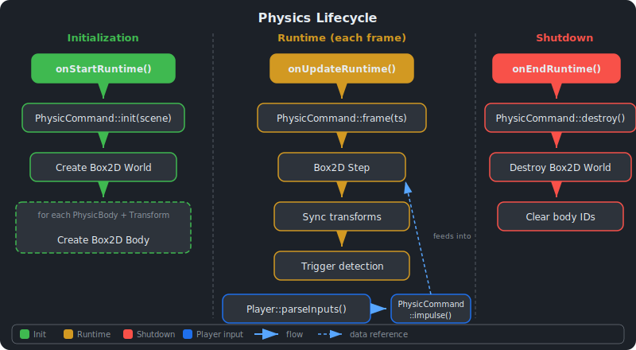

# Physics System {#page-physics}

[TOC]

This page describes the Owl physics system: how rigid bodies work, how the
simulation integrates with the scene lifecycle, and how to drive physics from
gameplay code.

## Overview

Owl provides 2D rigid-body physics via [Box2D](https://box2d.org/), controlled
through the `PhysicCommand` static facade and the `PhysicBody` ECS component.
All physics simulation operates in **world space**, independent of the scene
hierarchy (see [Physics and Hierarchy](#hierarchy) below). Physics is only
active during **Play mode** -- entities are not simulated while editing.

## Architecture



The physics module follows the same facade + pimpl pattern used by the sound and
renderer modules (see [Architecture](architecture.md)):

| Class                   | Role                                                                               |
|-------------------------|------------------------------------------------------------------------------------|
| `PhysicCommand`         | Static facade: `init` / `destroy` / `frame` / `impulse` / `velocity` / `transform` |
| `PhysicCommand::Impl`   | Pimpl class wrapping the Box2D `b2WorldId` and a body-id map                       |
| `SceneBody`             | Data class holding physics properties (type, density, friction, ...)               |
| `component::PhysicBody` | ECS component wrapping a single `SceneBody` instance                               |

`PhysicCommand` holds a `shared<Impl>` pointer and a raw `Scene*` that are set
during `init()` and cleared during `destroy()`. All public methods are static
and delegate to the implementation through these two members.

## PhysicBody Component

The `PhysicBody` component wraps a `SceneBody` data class with the following
fields:

| Field         | Type       | Default     | Description                                         |
|---------------|------------|-------------|-----------------------------------------------------|
| type          | `BodyType` | `Dynamic`   | How Box2D treats the body (see table below)         |
| fixedRotation | `bool`     | `false`     | Lock rotation so the body cannot spin               |
| colliderSize  | `vec3f`    | `{1, 1, 1}` | Half-extents of the box collider (x, y used for 2D) |
| density       | `float`    | `1.0`       | Material density, affects mass                      |
| restitution   | `float`    | `0.0`       | Bounciness coefficient (0 = no bounce, 1 = full)    |
| friction      | `float`    | `0.5`       | Surface friction coefficient                        |
| bodyId        | `uint64_t` | `0`         | Runtime-only internal id (not serialized)           |

The `bodyId` field is assigned during `PhysicCommand::init()` and maps to the
corresponding `b2BodyId` in the implementation's body table.

### BodyType

| Value       | Description                                                        |
|-------------|--------------------------------------------------------------------|
| `Static`    | Immovable body, participates in collision but never moves          |
| `Dynamic`   | Fully simulated body, affected by forces, impulses, and gravity    |
| `Kinematic` | Moved programmatically, not affected by forces but can push others |

The resulting scene YAML looks like:

```yaml
PhysicBody:
  type: Dynamic
  fixedRotation: false
  colliderSize: [1.0, 1.0, 1.0]
  density: 1.0
  restitution: 0.0
  friction: 0.5
```

## Physics Lifecycle

The physics system hooks into the three scene lifecycle methods. The full
lifecycle is shown in the diagram above.

### init(scene)

Called from `Scene::onStartRuntime()`. Creates the Box2D world with default
gravity `(0, -9.81)`, then iterates every entity that has both a `PhysicBody`
and a `Transform` component. For each entity:

1. Reads the **world transform** via `Scene::getWorldTransform()` (not the
   local transform) to compute the initial body position and rotation.
2. Creates a `b2BodyId` with the appropriate body type, position, rotation,
   and `fixedRotation` flag.
3. Creates a box-shaped polygon collider scaled by `colliderSize * worldScale`.
4. Applies the `density`, `friction`, and `restitution` material properties.
5. Stores the mapping from an internal `bodyId` to the Box2D `b2BodyId`.

### frame(timestep)

Called from `Scene::onUpdateRuntime()` once per frame. Performs two steps:

1. **Box2D step** -- advances the simulation by the frame timestep with 4
   sub-steps (`b2World_Step`).
2. **Sync transforms** -- for each entity with a `PhysicBody`, reads the
   body position and rotation from Box2D and writes them back to the entity's
   `Transform` component. If the entity has a parent in the hierarchy, the
   world position is converted back to **local space** using the inverse of
   the parent's world transform.

### destroy()

Called from `Scene::onEndRuntime()`. Destroys the Box2D world, clears the
body-id map, and resets the `Impl` pointer and scene pointer. After this call,
`isInitialized()` returns `false`.

## Physics API

`PhysicCommand` exposes the following static methods for gameplay code:

| Method                                     | Description                                   |
|--------------------------------------------|-----------------------------------------------|
| `init(scene)`                              | Create Box2D world and bodies from scene      |
| `destroy()`                                | Destroy Box2D world and clear all bodies      |
| `isInitialized()`                          | Check if the physics world is active          |
| `frame(timestep)`                          | Step the simulation and sync transforms       |
| `impulse(entity, vec2f)`                   | Apply a linear impulse to the entity's center |
| `getVelocity(entity) -> vec2f`             | Read the entity's current linear velocity     |
| `setVelocity(entity, vec2f)`               | Override the entity's linear velocity         |
| `setTransform(entity, position, rotation)` | Teleport the body to a new position and angle |

All methods silently return if the physics world is not initialized or if the
entity does not have a `PhysicBody` component. `impulse`, `getVelocity`, and
`setVelocity` also skip static bodies, which cannot move.

### Example: applying an impulse from a NativeScript

```cpp
#include <physic/PhysicCommand.h>

void MyScript::onUpdate(const owl::core::Timestep& iTimeStep) {
    if (owl::input::Input::isKeyPressed(owl::input::key::Right)) {
        owl::physic::PhysicCommand::impulse(entity, {0.5f, 0.0f});
    }
    if (owl::input::Input::isKeyPressed(owl::input::key::Up)) {
        const auto vel = owl::physic::PhysicCommand::getVelocity(entity);
        if (std::abs(vel.y()) < 0.001f) {
            owl::physic::PhysicCommand::impulse(entity, {0.0f, 1.0f});
        }
    }
}
```

## Player Integration

The `Player` component provides a built-in input handler that drives physics
through `ScenePlayer::parseInputs()`. Each frame during runtime the scene
finds the primary `Player` entity and calls `parseInputs`, which reads
keyboard state and applies impulses via `PhysicCommand`:

| Field         | Type    | Default | Description                            |
|---------------|---------|---------|----------------------------------------|
| linearImpulse | `float` | `0.1`   | Horizontal impulse applied on A/D keys |
| jumpImpulse   | `float` | `0.2`   | Vertical impulse applied on Space      |
| canJump       | `bool`  | `true`  | Whether jumping is allowed             |

Jump is only applied when the entity's vertical velocity is near zero (i.e. the
player is on the ground). The `Player` component requires a `PhysicBody` on the
same entity.

See [Scene System](scene.md) for more details on the entity component model.

## Trigger Collision

Triggers are special entities that react when the player overlaps them.
Trigger detection runs after the physics step in `onUpdateRuntime()`: for each
entity with a `Trigger` component, the scene computes the axis-aligned bounding
boxes of both the trigger and the primary player and checks for intersection.

| Trigger Type | Effect                                                   |
|--------------|----------------------------------------------------------|
| `Victory`    | Sets scene status to `Victory`, displays win screen      |
| `Death`      | Sets scene status to `Death`, displays loss screen       |
| `Teleport`   | Queues a level load (optionally cross-level) to a target |
| `Target`     | Passive position marker, no action on collision          |

Teleport triggers use `levelName` (scene file to load, empty = same level) and
`targetName` (entity to teleport to). The player's velocity is preserved across
the teleport.

## Physics and Hierarchy {#hierarchy}

Physics bodies operate in **world space** and are independent of the scene
hierarchy. The table below summarizes the interaction between parent-child
relationships and physics:

| Parent      | Child       | Behavior                                                                                                   |
|-------------|-------------|------------------------------------------------------------------------------------------------------------|
| Non-physics | Physics     | Moving the parent does **not** move the physics child -- the child stays in its Box2D position             |
| Physics     | Physics     | Both bodies move **independently** -- Box2D simulates each body on its own regardless of parent-child link |
| Physics     | Non-physics | The non-physics child **follows** the parent via the normal hierarchy transform chain                      |

During `frame()`, world positions read from Box2D are converted back to local
space when the entity has a parent, using the inverse of the parent's world
transform. This ensures the local `Transform` component stays consistent with
the hierarchy while Box2D remains the authority on world position.

See [Scene System](scene.md) for details on the hierarchy system, world
transform computation, and reparenting behavior.
