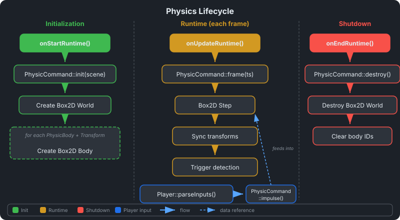
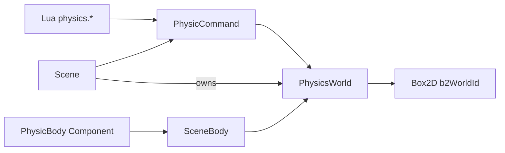
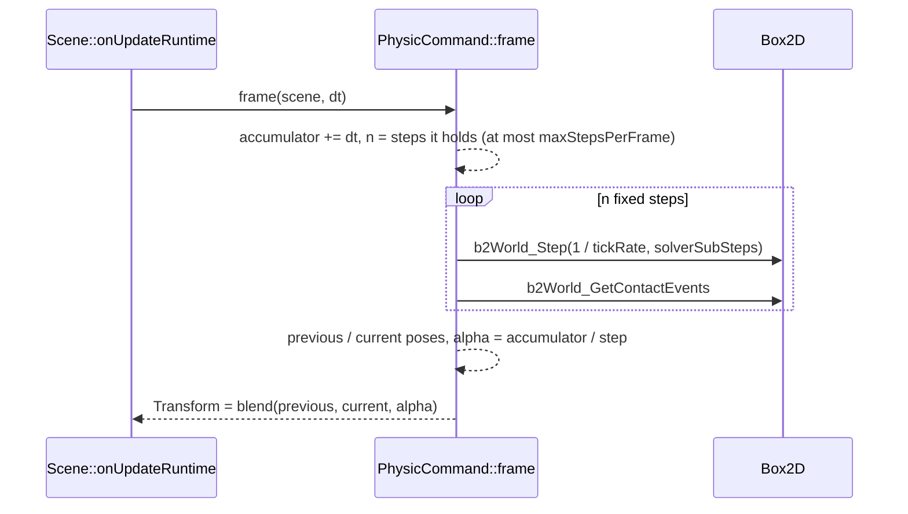
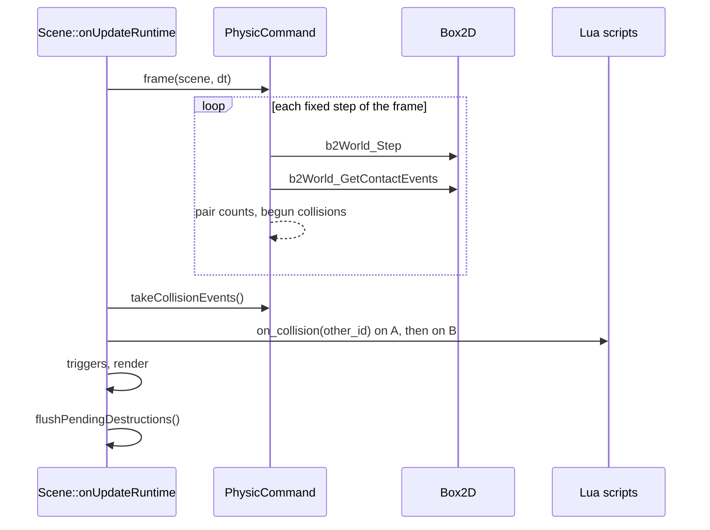

# Physics System {#page-physics}

[TOC]

This page describes the Owl physics system: how rigid bodies work, how the
simulation integrates with the scene lifecycle, and how to drive physics from
gameplay code.

## Overview

Owl provides 2D rigid-body physics via [Box2D](https://box2d.org/), controlled
through the `PhysicCommand` static facade and the `PhysicBody` ECS component. Each scene owns its own
Box2D world, so several scenes simulate side by side.
All physics simulation operates in **world space**, independent of the scene
hierarchy (see [Physics and Hierarchy](#hierarchy) below). Physics is only
active during **Play mode** -- entities are not simulated while editing.

## Architecture



The physics module follows the same facade + pimpl pattern used by the sound and
renderer modules (see [Architecture](architecture.md)):


```mermaid
flowchart LR
    Lua["Lua physics.*"] --> PC[PhysicCommand]
    Scene --> PC
    Scene -- owns --> World[PhysicsWorld]
    PC --> World
    World --> B2[Box2D b2WorldId]
    PB[PhysicBody Component] --> SB[SceneBody]
    SB --> World
```

| Class                   | Role                                                                               |
|-------------------------|------------------------------------------------------------------------------------|
| `PhysicCommand`         | Static facade: `init` / `destroy` / `frame` / `impulse` / `velocity` / `transform` |
| `PhysicsWorld`          | Private class of one scene: the Box2D `b2WorldId`, its body map and solver pool    |
| `SceneBody`             | Data class holding physics properties (type, density, friction, ...)               |
| `component::PhysicBody` | ECS component wrapping a single `SceneBody` instance                               |

`PhysicCommand` holds no state. `init(scene)` creates the scene's `PhysicsWorld`, which the scene keeps
(`Scene::getPhysicsWorld()`) until `destroy(scene)`, `onEndRuntime()` or its destructor. The scene-level calls
(`frame`, `takeCollisionEvents`, `getSettings`...) take the scene; the body calls (`impulse`, `getVelocity`...)
take an entity and act on the world of its scene. A scene destroyed while simulated takes its world with it,
so nothing dangles.

## PhysicBody Component

The `PhysicBody` component wraps a `SceneBody` data class with the following
fields:

| Field         | Type       | Default     | Description                                         |
|---------------|------------|-------------|-----------------------------------------------------|
| type          | `BodyType` | `Dynamic`   | How Box2D treats the body (see table below)         |
| fixedRotation | `bool`     | `false`     | Lock rotation so the body cannot spin               |
| colliderSize  | `vec3f`    | `{1, 1, 1}` | Half-extents of the box collider (x, y used for 2D) |
| density       | `float`    | `1.0`       | Material density, affects mass                      |
| restitution   | `float`    | `0.0`       | Bounciness coefficient (0 = no bounce, 1 = full)    |
| friction      | `float`    | `0.5`       | Surface friction coefficient                        |
| bodyId        | `uint64_t` | `0`         | Runtime-only internal id (not serialized)           |

The `bodyId` field is assigned during `PhysicCommand::init()` and maps to the
corresponding `b2BodyId` in the implementation's body table.

### BodyType

| Value       | Description                                                        |
|-------------|--------------------------------------------------------------------|
| `Static`    | Immovable body, participates in collision but never moves          |
| `Dynamic`   | Fully simulated body, affected by forces, impulses, and gravity    |
| `Kinematic` | Moved programmatically, not affected by forces but can push others |

The resulting scene YAML looks like:

```yaml
PhysicBody:
  type: Dynamic
  fixedRotation: false
  colliderSize: [1.0, 1.0, 1.0]
  density: 1.0
  restitution: 0.0
  friction: 0.5
```

## Physics Lifecycle

The physics system hooks into the three scene lifecycle methods. The full
lifecycle is shown in the diagram above.

### init(scene)

Called from `Scene::onStartRuntime()`. Reads the scene's [physics settings](#fixed-step), creates the Box2D
world with default gravity `(0, -9.81)` and, when several solver threads are used, the task callbacks of the
[multi-threaded solver](#multi-threaded-solver), then iterates every entity that has both a `PhysicBody` and a
`Transform` component. For each entity:

1. Reads the **world transform** via `Scene::getWorldTransform()` (not the
   local transform) to compute the initial body position and rotation.
2. Creates a `b2BodyId` with the appropriate body type, position, rotation,
   and `fixedRotation` flag.
3. Creates a box-shaped polygon collider scaled by `colliderSize * worldScale`.
4. Applies the `density`, `friction`, and `restitution` material properties, and enables Box2D contact events
   on the shape.
5. Stores the mapping from an internal `bodyId` to the Box2D `b2BodyId`, and from the Box2D body to the owning
   entity's UUID.

Collidable tilemaps, raycast doors and pushwalls get their bodies the same way, owned by their entity.

From then on the bodies follow their components: a `PhysicBody` added while running gets its body at the next
`frame()` (once its transform and parent are set), a copied one never shares the source's body, and removing a
`PhysicBody`, `Tilemap`, door or pushwall component, or its entity, destroys the body. A door or pushwall added
while running gets no body.

### frame(timestep)

Called from `Scene::onUpdateRuntime()` once per rendered frame. Performs four steps:

1. **Fixed steps** -- adds the frame duration to an accumulator and runs as many Box2D steps of
   `1 / tickRate` seconds as it holds (`b2World_Step`, `solverSubSteps` sub-steps each), at most
   `maxStepsPerFrame` (see [Fixed Step](#fixed-step)).
2. **Contact events** -- after each step, reads the begin / end touch events (`b2World_GetContactEvents`) and
   records the collisions that began (see [Collision Events](#collision-events)).
3. **Capture** -- keeps the body poses of the last two steps.
4. **Sync transforms** -- for each entity with a `PhysicBody`, writes the body position and rotation (blended
   between the last two steps when interpolation is on) to the entity's `Transform` component. If the entity has
   a parent in the hierarchy, the world position is converted back to **local space** using the inverse of the
   parent's world transform.

### destroy()

Called from `Scene::onEndRuntime()`. Destroys the Box2D world, clears the
body-id map, and resets the `Impl` pointer and scene pointer. After this call,
`isInitialized()` returns `false`.

## Fixed Step {#fixed-step}

The world advances at a fixed rate, whatever the frame rate: the result of a simulation depends only on the
number of steps, not on how frames are cut. A frame of 40 ms at 60 Hz runs two steps and keeps 6.7 ms in the
accumulator; a frame of 4 ms runs none and only moves the interpolated transforms.

| Setting            | Default | Range     | Meaning                                                    |
|--------------------|---------|-----------|------------------------------------------------------------|
| `tickRate`         | `60`    | 1 to 1000 | Fixed steps per second                                     |
| `maxStepsPerFrame` | `8`     | 1 to 64   | Steps run by one frame at most; the time beyond is dropped |
| `solverSubSteps`   | `4`     | 1 to 16   | Box2D sub-steps inside one step                            |
| `interpolate`      | `true`  |           | Draw the transforms blended between the last two steps     |
| `workerCount`      | `0`     | 0 to 32   | Solver threads: 0 automatic, 1 single-threaded (see below) |

The settings belong to the scene (`Scene::getPhysicsSettings()`, `physics::PhysicsSettings`) and are saved in the
scene file only when they differ from the defaults:

```yaml
Scene: untitled
Physics:
  tickRate: 120
  maxStepsPerFrame: 8
  solverSubSteps: 4
  interpolate: true
  workerCount: 0
Entities: ...
```

In Owl Nest they are edited in the **Physics** section of the *Scene Settings* panel (undoable); they are read
when Play starts.

- **Step bound.** A long frame (synchronous load, window drag) runs `maxStepsPerFrame` steps and drops the rest:
  the game slows down for that frame instead of stalling under an ever larger backlog (spiral of death), and no
  single step grows large enough to tunnel or explode contacts.
- **Interpolation.** With `interpolate` on, `Transform` shows the pose between the last two steps, by the
  fraction of a step left in the accumulator (`PhysicCommand::getInterpolationAlpha(scene)`): motion is smooth at
  any frame rate, at the cost of up to one step of display latency. Box2D stays the authority: velocities, impulses
  and `getVelocity` act on the simulated state. `setTransform` (teleport) snaps both poses, so a teleport is never
  blended. `SaveManager::save` calls `PhysicCommand::syncSimulatedTransforms(scene)` first, so a save stores the
  simulated positions that match its velocity snapshots.
- **Per-frame input.** Scripts and `Player::parseInputs` still run once per frame: an impulse applied in
  `on_update` lands before the frame's first step.


```mermaid
sequenceDiagram
    participant S as Scene::onUpdateRuntime
    participant P as PhysicCommand::frame
    participant B as Box2D
    S->>P: frame(scene, dt)
    P-->>P: accumulator += dt, n = steps it holds (at most maxStepsPerFrame)
    loop n fixed steps
        P->>B: b2World_Step(1 / tickRate, solverSubSteps)
        P->>B: b2World_GetContactEvents
    end
    P-->>P: previous / current poses, alpha = accumulator / step
    P-->>S: Transform = blend(previous, current, alpha)
```

## Multi-threaded Solver {#multi-threaded-solver}

Box2D 3 runs its collision, solver and body-finalisation passes as parallel tasks handed to the host through
`b2WorldDef.enqueueTask` / `finishTask`. Owl backs them with a Taskflow executor (`SolverTaskPool`, private to
the engine), owned by each multi-threaded world and destroyed with it.

- **Worker count.** `workerCount = 1` keeps Box2D's single-threaded path (no task pool). `0` (automatic) uses
  half the hardware threads, at most 4, but only for worlds of at least 2 000 dynamic bodies counted at `init()`:
  below that, dispatching the tasks costs more than it saves. `PhysicCommand::getWorkerCount(scene)` reports the
  count in use.
- **Dedicated executor.** The pool does not share the `core::task::Scheduler` threads: within a step, Box2D's
  solver tasks spin-wait on each other, so they must all run at once, and a long Scheduler job holding a worker
  would stall the step.
- **Reproducibility.** Each task is split into at most `workerCount` ranges, and Box2D receives the range index
  as its worker index. A given worker count therefore gives the same result on every run; different counts
  differ slightly (Box2D merges per-worker state, such as the island-split candidate, in an order that depends
  on how bodies were partitioned).

Measured on the 5 000-box pile of `bench/` (i9-13950HX, loaded machine, five physical cores): 5.1 ms per
step single-threaded, 3.9 ms with 2 workers, 3.2 ms with 4, 2.9 ms with 8. The Box2D 3.1.1 package is built
with SSE2, not AVX2 (`BOX2D_AVX2`); the AVX2 build is left to the package migration.

## Physics API

`PhysicCommand` exposes the following static methods for gameplay code:

| Method                                     | Description                                   |
|--------------------------------------------|-----------------------------------------------|
| `init(scene)`                              | Create Box2D world and bodies from scene      |
| `destroy()`                                | Destroy Box2D world and clear all bodies      |
| `isInitialized()`                          | Check if the physics world is active          |
| `frame(timestep)`                          | Run the fixed steps due and sync transforms   |
| `getSettings()`                            | Settings of the running world                 |
| `getLastFrameStepCount()`                  | Fixed steps run by the last `frame()`         |
| `getWorkerCount()`                         | Solver threads in use (1 = single-threaded)   |
| `getInterpolationAlpha()`                  | Blend factor of the last `frame()`            |
| `syncSimulatedTransforms()`                | Write the last step's poses, not blended ones |
| `takeCollisionEvents()`                    | Hand over and clear the collisions begun      |
| `destroyBody(entity)`                      | Remove the entity's Box2D bodies              |
| `impulse(entity, vec2f)`                   | Apply a linear impulse to the entity's centre |
| `getVelocity(entity) -> vec2f`             | Read the entity's current linear velocity     |
| `setVelocity(entity, vec2f)`               | Override the entity's linear velocity         |
| `setTransform(entity, position, rotation)` | Teleport the body to a new position and angle |

All methods silently return if the physics world is not initialized or if the
entity does not have a `PhysicBody` component. `impulse`, `getVelocity`, and
`setVelocity` also skip static bodies, which cannot move.

### Example: applying an impulse from a NativeScript

```c++
#include <physics/PhysicCommand.h>

void MyScript::onUpdate(const owl::core::Timestep& iTimeStep) {
    if (owl::input::Input::isKeyPressed(owl::input::key::Right)) {
        owl::physics::PhysicCommand::impulse(entity, {0.5f, 0.0f});
    }
    if (owl::input::Input::isKeyPressed(owl::input::key::Up)) {
        const auto vel = owl::physics::PhysicCommand::getVelocity(entity);
        if (std::abs(vel.y()) < 0.001f) {
            owl::physics::PhysicCommand::impulse(entity, {0.0f, 1.0f});
        }
    }
}
```

## Collision Events {#collision-events}

`frame()` turns Box2D contact events into entity-level collisions. Each begin-touch event is resolved to the two
owning entities; Owl counts the touching shape pairs of every entity pair and records a `CollisionEvent`
(`entityA`, `entityB` UUIDs) only when the count goes from 0 to 1. The events of all the fixed steps of a frame
are gathered, and a pair is recorded at most once per frame even if it touches, separates and touches again
within that frame's steps. End-touch events decrement the count, so a body
resting on the ground, or a player crossing the cells of a tilemap (one Box2D shape per cell), yields one collision,
not one per frame or per cell. `destroyBody()` forgets every pair of the destroyed entity.

`Scene::onUpdateRuntime()` calls `PhysicCommand::takeCollisionEvents(scene)` right after `frame()`, and
`Scene::dispatchCollisionEvents()` calls Lua `on_collision(other_id)` on both entities (see
[Lua Scripting](scripting.md)). Entities that are hidden or queued for destruction (`Scene::isPendingDestructionInTree()`)
are skipped, and the check is redone before each call. The events are read from a vector owned by the caller, not
from an EnTT view, and destruction from a callback is deferred to the end of the frame, so a callback cannot
invalidate the dispatch.


```mermaid
sequenceDiagram
    participant S as Scene::onUpdateRuntime
    participant P as PhysicCommand
    participant B as Box2D
    participant L as Lua scripts
    S->>P: frame(scene, dt)
    loop each fixed step of the frame
        P->>B: b2World_Step
        P->>B: b2World_GetContactEvents
        P-->>P: pair counts, begun collisions
    end
    S->>P: takeCollisionEvents()
    S->>L: on_collision(other_id) on A, then on B
    S->>S: triggers, render
    S->>S: flushPendingDestructions()
```

## Player Integration

The `Player` component provides a built-in input handler that drives physics
through `ScenePlayer::parseInputs()`. Each frame during runtime the scene
finds the primary `Player` entity and calls `parseInputs`, which reads
keyboard state and applies impulses via `PhysicCommand`:

| Field         | Type    | Default | Description                            |
|---------------|---------|---------|----------------------------------------|
| linearImpulse | `float` | `0.1`   | Horizontal impulse applied on A/D keys |
| jumpImpulse   | `float` | `0.2`   | Vertical impulse applied on Space      |
| canJump       | `bool`  | `true`  | Whether jumping is allowed             |

Jump is only applied when the entity's vertical velocity is near zero (i.e. the
player is on the ground). The `Player` component requires a `PhysicBody` on the
same entity.

See [Scene System](scene.md) for more details on the entity component model.

## Trigger Collision

Triggers are special entities that react when the player overlaps them.
Trigger detection runs after the physics step in `onUpdateRuntime()`: for each
entity with a `Trigger` component, the scene computes the axis-aligned bounding
boxes of both the trigger and the primary player and checks for intersection.

| Trigger Type | Effect                                                   |
|--------------|----------------------------------------------------------|
| `Victory`    | Sets scene status to `Victory`, displays win screen      |
| `Death`      | Sets scene status to `Death`, displays loss screen       |
| `Teleport`   | Queues a level load (optionally cross-level) to a target |
| `Target`     | Passive position marker, no action on collision          |

Teleport triggers use `levelName` (scene file to load, empty = same level) and
`targetName` (entity to teleport to). The player's velocity is preserved across
the teleport.

## Physics and Hierarchy {#hierarchy}

Physics bodies operate in **world space** and are independent of the scene
hierarchy. The table below summarizes the interaction between parent-child
relationships and physics:

| Parent      | Child       | Behaviour                                                                                                  |
|-------------|-------------|------------------------------------------------------------------------------------------------------------|
| Non-physics | Physics     | Moving the parent does **not** move the physics child -- the child stays in its Box2D position             |
| Physics     | Physics     | Both bodies move **independently** -- Box2D simulates each body on its own regardless of parent-child link |
| Physics     | Non-physics | The non-physics child **follows** the parent via the normal hierarchy transform chain                      |

During `frame()`, world positions read from Box2D are converted back to local
space when the entity has a parent, using the inverse of the parent's world
transform. This ensures the local `Transform` component stays consistent with
the hierarchy while Box2D remains the authority on world position.

See [Scene System](scene.md) for details on the hierarchy system, world
transform computation, and reparenting behaviour.
