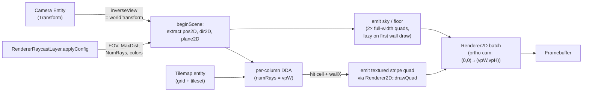

# Raycaster Method (v0.2.0) {#page-raycaster-method}

[TOC]

This page describes **exactly** the algorithm used by `RendererRaycast` in v0.2.0 — math, data flow, conventions, and
the known limitations of the current implementation. It is intentionally low-level so the rendering path can be reasoned
about, debugged, and replaced piece by piece.

## High-level pipeline



Everything happens on the **CPU**. Each draw is emitted through the existing
`Renderer2D` static facade — the raycaster does not own its own GPU pipeline.

## Lifecycle of one frame

1. `Scene::renderWithStack` iterates the active stack. For the raycast layer:
2. `RendererRaycastLayer::onBeginFrame(camera)`:
    - Calls `Renderer2D::resetStats()` and
      `Renderer2D::beginScene(orthoCam)` where `orthoCam = CameraOrtho(0,
      vpW, 0, vpH)` (pixel-space, Y-up). Every quad we emit afterwards is interpreted in pixel coordinates with origin
      at the bottom-left.
    - Calls `RendererRaycast::beginScene(camera, viewport, config)`:
        - `cameraPos2D = inverseView * (0,0,0,1).xy`
        - `cameraDir2D = inverseView * (0,1,0,0).xy` (normalised)
        - `cameraPlane2D = inverseView * (1,0,0,0).xy * tan(fov/2) * aspect`
3. `Scene::render()` iterates entities. For each `Tilemap` accepted by the current layer, the dispatcher in
   `Scene::render` notices the active layer's type key is `"RendererRaycast"` and calls
   `RendererRaycast::drawTilemapWalls(tilemap, worldTransform, entityId)`
   instead of the normal per-cell quad loop.
4. `RendererRaycast::drawTilemapWalls` runs the per-column DDA (see below).
5. `Scene::renderUI(camera)` runs after `render()` — UI canvases tagged with the raycast layer's name would render here.
   The sample's HUD is tagged `"ui"` and falls into the next 2D layer instead.
6. `RendererRaycastLayer::onEndFrame()`:
    - `RendererRaycast::endScene()` (clears the lazy-backdrop flag, no GPU work).
    - `Renderer2D::endScene()` flushes the batch — the actual GPU draw call happens here, with the ortho camera
      projection.

## Camera pose extraction

Convention chosen so that an entity with `rotation: [0, 0, 0]` produces a sensible 2D pose:

| Quantity        | Source                                          | Notes                                                        |
|-----------------|-------------------------------------------------|--------------------------------------------------------------|
| `cameraPos2D`   | `inverseView * (0, 0, 0, 1)` → take `.xy`       | World position of the camera entity                          |
| `cameraDir2D`   | `inverseView * (0, 1, 0, 0)` → `.xy`, normalise | Local +Y mapped to world XY = forward                        |
| right           | `inverseView * (1, 0, 0, 0)` → `.xy`, normalise | World-frame right axis                                       |
| `cameraPlane2D` | `right * tan(fov/2)`                            | Encodes FOV. Aspect is **not** folded in — see "Ray formula" |

`inverseView` is the entity's world transform mat4 (because Owl's `Camera`
class stores `m_view = inverse(transform)`). Local +Y is used (rather than local –Z which 3D engines usually pick)
because Owl's 2D ortho cameras have no meaningful –Z axis in the XY plane.

For an entity with rotation = (0, 0, θ) in **radians**:

- forward = (-sin θ, cos θ)  — θ = 0 ⇒ +Y, θ = π/2 ⇒ -X (CCW turn).
- right = (cos θ, sin θ)

The Lua script `raycast_player.lua` in the sample mirrors this exact formula.

## Ray formula

For column index `col ∈ [0, numRays)`, the camera-X coordinate is

    cameraX = 2 · (col + 0.5) / numRays − 1     ∈ [-1 + 1/numRays, 1 - 1/numRays]

The world-frame ray direction for that column is

    rayDir = cameraDir2D + cameraPlane2D · cameraX

Note this is **not** normalized. That's intentional — the DDA below uses
`1/|rayDir.x|` and `1/|rayDir.y|` for the deltaDist values, and the magnitude cancels out in the perpendicular-distance
computation. Normalizing first would only add work.

`fovDegrees` is the **horizontal** FOV at the actual viewport. Folding aspect into the plane (which the very first cut
did) over-stretches the view cone on wide displays — a 75° configured FOV would become ~107° at 16:9. The classical
Wolfenstein formula is `plane = perp · tan(fov/2)`
and we follow it.

## Cell-coordinate space

The Tilemap is centred at world origin (matching the existing 2D path):

| Cell index | World-space centre X                     |
|------------|------------------------------------------|
| col 0      | `-(W − 1) / 2 · cellSize`                |
| col c      | `-(W − 1) / 2 · cellSize + c · cellSize` |
| col W − 1  | `+(W − 1) / 2 · cellSize`                |

Cell `c` occupies world X **range** `[(c − W/2) · cellSize, (c + 1 − W/2) ·
cellSize)` — i.e. the cell's centre is offset by `cellSize/2` from each of its boundaries.

DDA needs a **cell-coordinate** space where cell `c` occupies the integer range `[c, c + 1)`. The conversion is

    cellX = worldX / cellSize + W / 2
    cellY = H / 2 − worldY / cellSize           # Y is flipped: storage rows go top-down

The DDA ray direction in cell space is

    cellDir = (rayDir.x, −rayDir.y)             # only Y is flipped

(This Y flip is the only place the algorithm cares that storage rows grow *downward* while world Y grows *upward*.)

> **Half-cell offset bug (fixed):** the very first cut of `drawTilemapWalls`
> used `(W − 1) / 2` for the half-extent — that's the correct value for
> picking the *world centre of cell `c`* (which is what the 2D path uses to
> place each cell's transform), but it's the **wrong** value for the
> world-to-cellCoord conversion DDA expects. The fix uses `W / 2`, so
> world X = 0.5 maps to cellCoord 8.5 (the centre of cell 8) rather than
> cellCoord 8.0 (the edge between cells 7 and 8). Likewise on Y.

## DDA traversal

Standard Amanatides-Woo grid traversal, one ray per column:

```text
deltaDist.x = abs(1 / cellDir.x)        # cells traversed when crossing one full X cell
deltaDist.y = abs(1 / cellDir.y)

mapX = floor(cellX); mapY = floor(cellY)
stepX = (cellDir.x < 0) ? -1 : +1
stepY = (cellDir.y < 0) ? -1 : +1

# Distance to the FIRST x/y boundary, in ray lengths
sideDist.x = (cellDir.x < 0) ? (cellX - mapX) * deltaDist.x
                             : (mapX + 1 - cellX) * deltaDist.x
sideDist.y = same idea on Y

side = 0  # 0 = X-edge hit, 1 = Y-edge hit
for step in 1 .. maxSteps:
    if sideDist.x < sideDist.y:
        sideDist.x += deltaDist.x
        mapX += stepX
        side = 0
    else:
        sideDist.y += deltaDist.y
        mapY += stepY
        side = 1
    if cellAt(mapX, mapY) > 0:                 # non-empty == wall
        hit; break
```

`maxSteps = ceil(maxDistance · 2)` gives enough budget for axis-aligned and diagonal rays alike.

### Perpendicular distance

The naive Euclidean distance from camera to hit produces the **fish-eye**
distortion: rays at the edges of the FOV travel further to reach the same plane, so walls bow outward at the screen
edges. The fix (Wolfenstein's trick) is to project the hit distance onto the camera's forward axis:

    perpDist = (side == 0) ? sideDist.x - deltaDist.x
                           : sideDist.y - deltaDist.y

This subtracts the last side-step we took (which is what `sideDist` overshot by) so it returns the distance along the
ray *up to the cell-edge that was hit*, not all the way to the next intersection. Because `cellDir` is *not*
normalized but is `cameraDir + cameraPlane · cameraX`, this distance is already projected onto the forward axis — the
magnitude factor cancels.

## Stripe rendering

For each ray hit, we emit one textured quad (a "stripe"):

```text
lineHeight = viewport.y / max(perpDist, 1e-4)     # in pixels
stripeY    = viewport.y * 0.5                      # always centred on horizon
stripeX    = (col + 0.5) · viewport.x / numRays    # column centre, in pixels
stripeW    = viewport.x / numRays · 1.015          # +1.5 % overlap to hide seams

quad.transform.translation = (stripeX, stripeY, 0)
quad.transform.scale       = (stripeW, lineHeight, 1)
```

### Texture U coordinate

`wallX` is the fractional position along the wall where the ray hit:

    wallX = (side == 0) ? cellY + perpDist · cellDir.y
                        : cellX + perpDist · cellDir.x
    wallX -= floor(wallX)                          # ∈ [0, 1)

A standard convention flip ensures adjacent wall faces show continuous texture without mirroring at corners:

    if (side == 0 and rayDir.x > 0) wallX = 1 - wallX
    if (side == 1 and rayDir.y < 0) wallX = 1 - wallX

The atlas UV for the hit cell is read from `Tileset::getTileUv(tileIdx)`
which returns the four corners `(BL, BR, TR, TL)` for that tile. We compute the column inside the tile:

    uHit = lerp(BL.u, BR.u, wallX)

The stripe is **one atlas column wide** (BL.u == BR.u == uHit), so the GPU samples a single vertical line of the atlas
tile, stretched vertically over the stripe's pixel height. The four texture coordinates emitted with the quad are:

    BL = (uHit, BL.v)        # bottom of screen ↔ visual bottom of tile
    BR = (uHit, BL.v)
    TR = (uHit, TL.v)
    TL = (uHit, TL.v)        # top of screen ↔ visual top of tile

`Tileset::getTileUv` already returns V values such that the visual top of the tile carries the **larger** V, so the
stripe is right-side up.

### Side darkening

Y-side hits are tinted by a constant factor (0.7) before being emitted — walls struck on a Y-edge appear darker than
walls struck on an X-edge. This is the cheapest possible "lighting" cue and reads as expected to anyone familiar with
Wolfenstein 3D.

### Sky / floor backdrop

Lazily emitted on the first wall / sprite draw of the scene so a raycast layer that ends up routing no content stays a
genuine no-op. Two paths:

- **Solid colour (default)** — one full-height quad per half of the viewport, tinted with
  `RaycastConfig::ceilingColor` /
  `floorColor`. Same shape as the v0.2.0 first cut.
- **Textured per-scanline** — when `RaycastConfig::floorTexture` /
  `ceilingTexture` are populated (via the layer's `FloorTileset` /
  `FloorTileIndex` / `CeilingTileset` / `CeilingTileIndex` YAML keys), the renderer emits one 1-pixel-tall quad per
  screen row. For row `Y`
  below the horizon:

  ```text
  p          = horizonY − Y − 0.5            # pixels below the horizon
  floorDist  = horizonY / p                  # perpendicular world distance
  worldL     = camPos + floorDist · (camDir − camPlane)
  worldR     = camPos + floorDist · (camDir + camPlane)
  ```

  `worldL` and `worldR` are the floor positions the leftmost (`cameraX = −1`)
  and rightmost (`cameraX = +1`) rays would hit on this row. The quad's UVs interpolate linearly between them; the
  texture's `REPEAT` wrap takes care of tiling. Ceiling rows mirror the formula with
  `p = Y − horizonY + 0.5`.

  Stats: `backdropScanlineCount` reports the per-frame quad budget — at 720p that's ~720 quads for both halves combined,
  easily within the 2D batch's 20k budget.

### Distance fog

`RaycastConfig` carries `fogColor` + `fogStart` + `fogEnd`. The renderer lerps every emitted stripe (walls, dynamic
walls, doors, sprites, and both backdrop halves) toward `fogColor` as its perpendicular distance crosses the
`fogStart`..`fogEnd` range:

```text
t        = clamp((perpDist − fogStart) / (fogEnd − fogStart), 0, 1)
finalRgb = lerp(naturalRgb, fogColor.rgb, t)
```

Set `fogEnd ≤ fogStart` (the default) to disable fog entirely — scenes authored before v0.2.0's lighting PR keep their
natural tint. A black
`fogColor` plus a finite range gives classical Wolf3D distance darkening; pointing it at the ceiling colour fakes a
cheap sky-bleed haze. The single `applyFog` helper is shared across every stripe emitter so a wall pixel and the floor
pixel directly below it converge to the same colour at `fogEnd` — no visible seam.

## Why this is a v1, not the canonical Wolfenstein 3D

The user-facing API and the algorithm are both "Wolfenstein-style" in the classical sense (per-column DDA, vertical
textured stripes, no fish-eye via perpendicular distance). The implementation differences from a pixel-perfect 1992
Wolfenstein 3D port:

1. **Drawing path** — Wolfenstein 3D wrote pixels directly to a 320×200 VGA buffer. We instead emit **one textured quad
   per stripe** via the existing `Renderer2D` batch, and the GPU rasterizes them on the framebuffer. Functionally
   equivalent for stationary frames; for a 1920-wide viewport this means up to 1920 quads per frame (the 2D batcher caps
   at 20 000, so we stay within budget).
2. **No floor / ceiling casting** — we paint solid colours rather than sampling a floor / ceiling texture per pixel.
   Roadmap item *Floors and ceilings* (planned for v0.2.0 follow-up) lifts this.
3. **No sprites / billboards** — entities are not visible from the raycast view yet. Roadmap item *Sprites (
   billboards)*.
4. **No doors, thin walls, transparent walls** — every non-empty cell is a full opaque cube. Roadmap item *Map
   features*.
5. **CPU-side DDA** — Wolfenstein 3D ran on a 386, but a modern GPU could do the entire frame in a single fragment
   shader. The CPU path is kept for v0.2.0 because it's testable, debuggable, and reuses the existing Slang quad shader.
   A future PR can swap the inner loop for a dedicated shader without touching the public API.

## Dynamic walls (doors + pushwalls)

Doors and pushwalls share an activation pattern (proximity-and-key with a Lua override) and a state-machine spine, but
their geometry is different enough that they ship as separate renderer payloads:

- **`RaycastPushWall`** is a **full-cell cube** that slides one shot and stays. A single tileset+index pair covers every
  face; the entity's
  `Transform` translates with the wall (its world position is the cube centre). State machine: Idle → Moving → Final.

  Pushwalls route through
  `RendererRaycast::drawDynamicWalls(std::span<const RaycastDynamicWallData>)`.

- **`RaycastDoor`** is a **1×1 cell** whose internal **plate** slides exactly one cell (plus 1 pixel for hermetic
  closure) along one of the four cardinal directions (`OpeningDirection::{North, South, East,
  West}`). Visually the cell decomposes into:
    - Two **laterals**, applied as **zero-thickness textures** on the cube's two inside faces *perpendicular to the
      opening direction*
      (the cell's N and S inside faces for N/S openings, E and W for E/W). They never move; they're what the player sees
      through the open doorway.
    - One **plate**, also zero-thickness. The plate's surface normal is **perpendicular to the opening direction** (an
      N-opening door has plate surfaces facing east and west), so the player approaches the door head-on along the axis
      perpendicular to the opening direction. The plate extends along the slide axis, slides exactly one cell into the
      pocket when open, and is hidden behind the pocket-side wall at the fully-open pose.

  `faceTexture`'s U=1 always sits on the **opening-direction side** of the cell — the renderer flips U appropriately so
  both sides of the plate (east-side view and west-side view of an N-opening door, for example) display the texture with
  that orientation. State machine:
  Idle → Opening → Open (`holdTime` seconds) → Closing → Idle.

  Doors route through
  `RendererRaycast::drawDoors(std::span<const RaycastDoorData>)`. The entity's `Transform.translation` stays put at the
  cell centre — only the internal plate offset animates. The entity's `Transform.scale` is ignored; the cell is always
  one tile.

Both passes run after `drawTilemapWalls` and before `drawSprites`:

```text
beginScene → drawTilemapWalls → drawDynamicWalls → drawDoors → drawSprites → endScene
```

### Texture sourcing — shared tilesets

Both door and pushwall components reference textures through a **tileset + tile index** pair (`tilesetPath` +
`tileIndex` /
`faceTileIndex` / `lateralTileIndex`) rather than carrying their own PNG. At scene resolve a per-scene cache keyed by
the tileset path deduplicates loads, so a door whose `tilesetPath` matches the world tilemap's tileset path shares the
*same* `shared<Tileset>` (and its atlas texture) — no double-load on the GPU. The renderer payloads (`RaycastDoorData`,
`RaycastDynamicWallData`) carry the atlas texture plus a `uvRect` (minU, minV, maxU, maxV) that the stripe emitter
remaps the local `[0,1]` U/V into.

### Slab-method intersection

`castRayAabb` is shared between both paths. Per screen column:

1. Build the world-space ray `cameraPos + t · (cameraDir + cameraPlane · cameraX)`.
2. Run the slab method against the cube AABB:
   `tx1 = (minX − origin.x) / dir.x` etc., then
   `tNear = max(tEnterX, tEnterY)`, `tFar = min(tExitX, tExitY)`.
3. Reject the column if `tNear > tFar` or `tFar < 0` (miss) or `tNear`
   exceeds `RaycastConfig::maxDistance`.
4. Skip columns where the static-tilemap zBuffer already holds a closer wall (`perpDist >= zBuffer[col]`), so a static
   wall in front of an open door still wins.

For pushwalls one cube hit closes the work for that column.

For doors:

5. **Plate test** — solve for the t where the ray crosses the plate's plane (`x = cx` for N/S openings, `y = cy` for E/W
   openings) and check that the hit point is within the plate's extent along the slide axis. The plate's `plateOffset`
   is multiplied by
   `(1 + 1/64)` so the closed pose (`offset = 0`) sits *exactly* at the cell centre — without the scaled margin a
   1-pixel gap leaked on the side opposite to the opening direction.
6. **Lateral test** — when the cube's exit face is on the slide axis (N/S face for Y-slide, E/W face for X-slide), the
   lateral is at
   `tFar`. A small depth bias (1 mm in cell units) is subtracted so the lateral always wins the z-test against the
   pocket-side wall sitting at the exact same depth in the static tilemap pass.
7. The closest of `{plate, lateral}` that beats the zBuffer wins for that column; both register their `perpDist` in the
   zBuffer so sprites afterwards occlude correctly.

### U convention on the plate

The U=1-on-opening-direction rule is implemented without the standard slab view-direction flip — we compute U directly
from the hit point and flip only based on the opening sign:

```text
u = (slideAlongY ? (hitY − minY) : (hitX − minX))
if (slideSign < 0)   // South or West opening
    u = 1 − u
```

That gives U=1 at the maximum-axis side (N/E) for positive openings and U=1 at the minimum-axis side (S/W) for negative
openings, regardless of which side the player views the plate from. Both passes (and the static tilemap pass) inset by
half a texel to avoid bilinear-filter wrap with the engine's default `REPEAT` wrap mode.

Because `cameraDir` is unit length and `cameraPlane` is perpendicular to it, `tNear` is already a
perpendicular-to-camera-plane distance — no extra projection required.

### Physics — hermetic when closed

`PhysicCommand::init` auto-creates a **kinematic Box2D body** for any
`RaycastDoor` / `RaycastPushWall` entity that doesn't already carry an explicit `PhysicBody` component. The body's
collider matches the moving surface:

- Door: thin box, `0.1` cell thick perpendicular to the slide axis,
  `1.0` cell along the slide axis — exactly the plate footprint.
- Pushwall: full `1×1×1` cube — matches the rendered surface.

`Scene::updateRaycastDynamicWalls` mirrors the plate position onto the body each tick via `PhysicCommand::setTransform`,
so:

- **Closed door = not traversable.** The plate is at the cell centre, the kinematic body is at the cell centre, the
  player collides with it.
- **Mid-slide door** = body tracks the plate, so the player gets pushed if a closing door catches them.
- **Open door** = body sits inside the pocket (where the plate is hidden), the cell is clear, the player walks through.

### State machine and activation

| Door state | Pushwall state | Tick behaviour                                                                       |
|------------|----------------|--------------------------------------------------------------------------------------|
| Idle       | Idle           | Wait for activation (built-in key or Lua call).                                      |
| Opening    | Moving         | `currentOffset += slideSpeed · dt`; transition when `currentOffset ≥ slideDistance`. |
| Open       | —              | `holdTimer -= dt`; transition to Closing when `holdTimer ≤ 0`.                       |
| Closing    | —              | `currentOffset -= closeSpeed · dt`; back to Idle when `currentOffset ≤ 0`.           |
| —          | Final          | Stay forever.                                                                        |

Each tick `Scene::updateRaycastDynamicWalls` advances the state machine, shifts the entity's local
`Transform.translation` along `slideDirection` by the offset delta, and — if the entity carries a `PhysicBody` — mirrors
the new world position onto the Box2D body via
`PhysicCommand::setTransform`. Kinematic bodies respect `setTransform`, so the player collider sees the door's actual
current position.

Built-in activation runs *before* the physics step:

- Detect player presence via `Scene::getPrimaryPlayer()`.
- If `interactionKey != 0` and the player centre is within
  `interactionRange` cells of the entity centre, and `interactionKey`
  transitioned from released to held this tick, kick the state machine out of Idle.
- Setting `interactionKey = 0` disables the built-in path entirely; Lua scripts drive activation through the `door` and
  `pushwall` API tables.

### Lua API

```lua
-- door (open / hold / close cycle)
door.activate(entity_id)    -- Idle  → Opening
door.close(entity_id)       -- Opening / Open → Closing (and clears holdTimer)
door.is_open(entity_id)     -> boolean (true when state == "open")
door.get_state(entity_id)   -> "idle" | "opening" | "open" | "closing"

-- pushwall (one-shot slide)
pushwall.activate(entity_id)  -- Idle → Moving
pushwall.has_moved(entity_id) -> boolean (true when state == "final")
pushwall.get_state(entity_id) -> "idle" | "moving" | "final"
```

All bindings are sandbox-safe: they take a UUID (the same value Trigger bindings use) and silently no-op on missing
entities or missing components.

### Authoring a door in Owl Nest

A Wolf3D-style door occupies one full cell — the engine draws the laterals (cell-side jambs) and the moving plate for
you.

1. **Empty the underlying tile.** Pick the cell where the door should sit and clear the tilemap entry in the
   `TilemapDocument` — the door entity replaces the static wall.
2. **Create the entity.** In the scene hierarchy, `Add Entity ▸ Empty`
   and place its `Transform.translation` at the cell's world centre.
   `Transform.scale` is ignored — the cell is always 1×1.
3. **Add the component.** `Add Component ▸ Raycast Door`. The menu only surfaces this entry when the entity's renderer
   layer (resolved via
   `RendererTag`) is a `RendererRaycast` layer.
4. **Pick the tileset and the tiles.** In the inspector:
    - **Tileset**: drag-drop the `.owltileset` asset that backs the world tilemap (or any other tileset). The engine
      reuses the same `shared<Tileset>` if the world tilemap loaded that path, so no double-load on the GPU.
    - **Face Tile**: click the thumbnail and pick the door face from the tile grid (Wolf3D atlas: tile 24 = steel door,
      tile 25 = lift).
    - **Lateral Tile**: pick the jamb / track (Wolf3D atlas: tiles 98–105 — pick the variant whose colour matches the
      surrounding walls).
    - **Opening Direction**: combo with North / South / East / West. The door slides exactly one cell along this
      direction.
5. **Test.** Switch to Play mode, approach the door, press `E`. The plate slides into the pocket, holds open for
   `holdTime`, then slides back. The kinematic body is auto-created — the closed door physically blocks the player
   without any additional setup.

In the editor 2D view, the door is rendered as a thin strip with the face tile, oriented along the slide axis (a
vertical strip opens horizontally, a horizontal strip opens vertically). When the door is selected, a yellow destination
line with a circle endpoint shows where the plate will end up when fully open.

### Authoring a pushwall

Pushwalls are full-block secret passages — one texture covers every face.

1. Choose a wall cell in the tilemap. Clear the static tile (or leave it; the pushwall will render on top while it sits
   at rest).
2. `Add Entity ▸ Empty` at the cell centre, leave `Transform.scale` at
   `(1, 1, 1)`.
3. `Add Component ▸ Raycast PushWall` (menu-gated to raycast layers).
4. In the inspector, drag the tileset asset and pick a tile index from the grid popup. Set `Slide Direction` along the
   axis the wall should retreat when triggered (often into the room behind it) and `Slide Distance` for how many cells
   it slides.
5. In Play mode, walk up to the pushwall and press `E` — it slides once and stays there, opening a passage. The
   kinematic body is auto-created.

In the editor 2D view, every pushwall is drawn with a **green outline**
so they're easy to spot among the static walls. The selected pushwall additionally shows a yellow destination line +
endpoint circle pointing at its final position.

To drive either object from a Lua script instead of the built-in key, set the component's `Interaction Key` to
`(disabled)` and call
`door.activate(entity_id)` or `pushwall.activate(entity_id)` from your script.

## Known limitations of the current code

- **Tilemap world transform is ignored** — the cast assumes the tilemap is centred at world origin (matching the 2D
  path's default). Translating / rotating / scaling the `Tilemap` entity does not move the wall world. A TODO is in
  `RendererRaycast::drawTilemapWalls` to invert
  `iTilemapWorldTransform` and project the camera into tilemap-local space before the cast.
- **Single-layer tilemap** — only the first non-empty `TilemapLayer` of the component is read. Multi-layer tilemaps
  don't stack walls.
- **No collision integration** — the raycast walls don't generate Box2D fixtures, so a `PhysicBody` player will walk
  through them. The physics generation in the 2D Tilemap path uses per-tile `collidable` flags from the tileset; reusing
  it for the raycast scene is a one-line change but hasn't been wired yet.
- **No depth buffer** — the wall stripe quads draw in submission order (back-to-front by ray column). Foreground
  geometry on the same `RenderLayer`
  pass would draw on top regardless of distance, but this isn't an issue yet because nothing else draws on the raycast
  layer.

## File map

| File                                                                | Role                                                  |
|---------------------------------------------------------------------|-------------------------------------------------------|
| `source/owl/public/renderer/RendererRaycast.h`                      | Public static-facade API + payload structs            |
| `source/owl/private/renderer/RendererRaycast.cpp`                   | Implementation: pose, DDA, stripes, dynamic-wall AABB |
| `source/owl/private/renderer/RendererRaycastLayer.h/cpp`            | `RenderLayer` adapter + YAML config parsing           |
| `source/owl/public/scene/component/RaycastDoor.h`                   | Door component (open / hold / close cycle)            |
| `source/owl/public/scene/component/RaycastPushWall.h`               | Pushwall component (one-shot slide)                   |
| `source/owl/private/scene/component/RaycastDoor.cpp`                | Door YAML serialize / deserialize                     |
| `source/owl/private/scene/component/RaycastPushWall.cpp`            | Pushwall YAML serialize / deserialize                 |
| `source/owl/private/scene/Scene.cpp` (`Scene::render` tilemap loop) | Dispatch by active-layer type key + dynamic-wall tick |
| `source/owl/private/script/LuaBindings.cpp` (`door` + `pushwall`)   | Lua API tables                                        |
| `test/renderer_tests/RendererRaycast_test.cpp`                      | Renderer-level unit tests                             |
| `test/scene_tests/RaycastDynamicWalls_test.cpp`                     | Door / pushwall state-machine + serializer tests      |
| `sample_project/scenes/raycast_demo.owl`                            | Wolfenstein-inspired demo scene                       |
| `sample_project/scripts/raycast_player.lua`                         | Player input matching the pose convention             |
