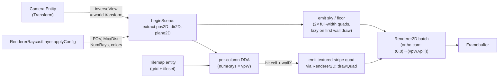

# Raycaster Method (v0.2.0) {#page-raycaster-method}

[TOC]

This page describes **exactly** the algorithm used by `RendererRaycast` in
v0.2.0 — math, data flow, conventions, and the known limitations of the
current implementation. It is intentionally low-level so the rendering path
can be reasoned about, debugged, and replaced piece by piece.

## High-level pipeline



Everything happens on the **CPU**. Each draw is emitted through the existing
`Renderer2D` static facade — the raycaster does not own its own GPU pipeline.

## Lifecycle of one frame

1. `Scene::renderWithStack` iterates the active stack. For the raycast layer:
2. `RendererRaycastLayer::onBeginFrame(camera)`:
    - Calls `Renderer2D::resetStats()` and
      `Renderer2D::beginScene(orthoCam)` where `orthoCam = CameraOrtho(0,
      vpW, 0, vpH)` (pixel-space, Y-up). Every quad we emit afterwards is
      interpreted in pixel coordinates with origin at the bottom-left.
    - Calls `RendererRaycast::beginScene(camera, viewport, config)`:
        - `cameraPos2D = inverseView * (0,0,0,1).xy`
        - `cameraDir2D = inverseView * (0,1,0,0).xy` (normalised)
        - `cameraPlane2D = inverseView * (1,0,0,0).xy * tan(fov/2) * aspect`
3. `Scene::render()` iterates entities. For each `Tilemap` accepted by the
    current layer, the dispatcher in `Scene::render` notices the active
    layer's type key is `"RendererRaycast"` and calls
    `RendererRaycast::drawTilemapWalls(tilemap, worldTransform, entityId)`
    instead of the normal per-cell quad loop.
4. `RendererRaycast::drawTilemapWalls` runs the per-column DDA (see below).
5. `Scene::renderUI(camera)` runs after `render()` — UI canvases tagged
    with the raycast layer's name would render here. The sample's HUD is
    tagged `"ui"` and falls into the next 2D layer instead.
6. `RendererRaycastLayer::onEndFrame()`:
    - `RendererRaycast::endScene()` (clears the lazy-backdrop flag, no GPU
      work).
    - `Renderer2D::endScene()` flushes the batch — the actual GPU draw call
      happens here, with the ortho camera projection.

## Camera pose extraction

Convention chosen so that an entity with `rotation: [0, 0, 0]` produces a
sensible 2D pose:

| Quantity      | Source                                          | Notes                                                |
|---------------|-------------------------------------------------|------------------------------------------------------|
| `cameraPos2D` | `inverseView * (0, 0, 0, 1)` → take `.xy`       | World position of the camera entity                  |
| `cameraDir2D` | `inverseView * (0, 1, 0, 0)` → `.xy`, normalise | Local +Y mapped to world XY = forward                |
| right         | `inverseView * (1, 0, 0, 0)` → `.xy`, normalise | World-frame right axis                               |
| `cameraPlane2D` | `right * tan(fov/2)`                          | Encodes FOV. Aspect is **not** folded in — see "Ray formula" |

`inverseView` is the entity's world transform mat4 (because Owl's `Camera`
class stores `m_view = inverse(transform)`). Local +Y is used (rather than
local –Z which 3D engines usually pick) because Owl's 2D ortho cameras have
no meaningful –Z axis in the XY plane.

For an entity with rotation = (0, 0, θ) in **radians**:
- forward = (-sin θ, cos θ)  — θ = 0 ⇒ +Y, θ = π/2 ⇒ -X (CCW turn).
- right   = ( cos θ, sin θ)

The Lua script `raycast_player.lua` in the sample mirrors this exact
formula.

## Ray formula

For column index `col ∈ [0, numRays)`, the camera-X coordinate is

    cameraX = 2 · (col + 0.5) / numRays − 1     ∈ [-1 + 1/numRays, 1 - 1/numRays]

The world-frame ray direction for that column is

    rayDir = cameraDir2D + cameraPlane2D · cameraX

Note this is **not** normalised. That's intentional — the DDA below uses
`1/|rayDir.x|` and `1/|rayDir.y|` for the deltaDist values, and the magnitude
cancels out in the perpendicular-distance computation. Normalising first
would only add work.

`fovDegrees` is the **horizontal** FOV at the actual viewport. Folding
aspect into the plane (which the very first cut did) over-stretches the
view cone on wide displays — a 75° configured FOV would become ~107° at
16:9. The classical Wolfenstein formula is `plane = perp · tan(fov/2)`
and we follow it.

## Cell-coordinate space

The Tilemap is centred at world origin (matching the existing 2D path):

| Cell index   | World-space centre X                        |
|--------------|---------------------------------------------|
| col 0        | `-(W − 1) / 2 · cellSize`                   |
| col c        | `-(W − 1) / 2 · cellSize + c · cellSize`    |
| col W − 1    | `+(W − 1) / 2 · cellSize`                   |

Cell `c` occupies world X **range** `[(c − W/2) · cellSize, (c + 1 − W/2) ·
cellSize)` — i.e. the cell's center is offset by `cellSize/2` from each of
its boundaries.

DDA needs a **cell-coordinate** space where cell `c` occupies the integer
range `[c, c + 1)`. The conversion is

    cellX = worldX / cellSize + W / 2
    cellY = H / 2 − worldY / cellSize           # Y is flipped: storage rows go top-down

The DDA ray direction in cell space is

    cellDir = (rayDir.x, −rayDir.y)             # only Y is flipped

(This Y flip is the only place the algorithm cares that storage rows grow
*downward* while world Y grows *upward*.)

> **Half-cell offset bug (fixed):** the very first cut of `drawTilemapWalls`
> used `(W − 1) / 2` for the half-extent — that's the correct value for
> picking the *world centre of cell `c`* (which is what the 2D path uses to
> place each cell's transform), but it's the **wrong** value for the
> world-to-cellCoord conversion DDA expects. The fix uses `W / 2`, so
> world X = 0.5 maps to cellCoord 8.5 (the centre of cell 8) rather than
> cellCoord 8.0 (the edge between cells 7 and 8). Likewise on Y.

## DDA traversal

Standard Amanatides-Woo grid traversal, one ray per column:

```text
deltaDist.x = abs(1 / cellDir.x)        # cells traversed when crossing one full X cell
deltaDist.y = abs(1 / cellDir.y)

mapX = floor(cellX); mapY = floor(cellY)
stepX = (cellDir.x < 0) ? -1 : +1
stepY = (cellDir.y < 0) ? -1 : +1

# Distance to the FIRST x/y boundary, in raylengths
sideDist.x = (cellDir.x < 0) ? (cellX - mapX) * deltaDist.x
                             : (mapX + 1 - cellX) * deltaDist.x
sideDist.y = same idea on Y

side = 0  # 0 = X-edge hit, 1 = Y-edge hit
for step in 1 .. maxSteps:
    if sideDist.x < sideDist.y:
        sideDist.x += deltaDist.x
        mapX += stepX
        side = 0
    else:
        sideDist.y += deltaDist.y
        mapY += stepY
        side = 1
    if cellAt(mapX, mapY) > 0:                 # non-empty == wall
        hit; break
```

`maxSteps = ceil(maxDistance · 2)` gives enough budget for axis-aligned and
diagonal rays alike.

### Perpendicular distance

The naive Euclidean distance from camera to hit produces the **fish-eye**
distortion: rays at the edges of the FOV travel further to reach the same
plane, so walls bow outward at the screen edges. The fix (Wolfenstein's
trick) is to project the hit distance onto the camera's forward axis:

    perpDist = (side == 0) ? sideDist.x - deltaDist.x
                           : sideDist.y - deltaDist.y

This subtracts the last side-step we took (which is what `sideDist` overshot
by) so it returns the distance along the ray *up to the cell-edge that was
hit*, not all the way to the next intersection. Because `cellDir` is *not*
normalised but is `cameraDir + cameraPlane · cameraX`, this distance is
already projected onto the forward axis — the magnitude factor cancels.

## Stripe rendering

For each ray hit, we emit one textured quad (a "stripe"):

```text
lineHeight = viewport.y / max(perpDist, 1e-4)     # in pixels
stripeY    = viewport.y * 0.5                      # always centred on horizon
stripeX    = (col + 0.5) · viewport.x / numRays    # column centre, in pixels
stripeW    = viewport.x / numRays · 1.015          # +1.5 % overlap to hide seams

quad.transform.translation = (stripeX, stripeY, 0)
quad.transform.scale       = (stripeW, lineHeight, 1)
```

### Texture U coordinate

`wallX` is the fractional position along the wall where the ray hit:

    wallX = (side == 0) ? cellY + perpDist · cellDir.y
                        : cellX + perpDist · cellDir.x
    wallX -= floor(wallX)                          # ∈ [0, 1)

A standard convention flip ensures adjacent wall faces show continuous
texture without mirroring at corners:

    if (side == 0 and rayDir.x > 0) wallX = 1 - wallX
    if (side == 1 and rayDir.y < 0) wallX = 1 - wallX

The atlas UV for the hit cell is read from `Tileset::getTileUv(tileIdx)`
which returns the four corners `(BL, BR, TR, TL)` for that tile. We
compute the column inside the tile:

    uHit = lerp(BL.u, BR.u, wallX)

The stripe is **one atlas column wide** (BL.u == BR.u == uHit), so the GPU
samples a single vertical line of the atlas tile, stretched vertically over
the stripe's pixel height. The four texture coordinates emitted with the
quad are:

    BL = (uHit, BL.v)        # bottom of screen ↔ visual bottom of tile
    BR = (uHit, BL.v)
    TR = (uHit, TL.v)
    TL = (uHit, TL.v)        # top of screen ↔ visual top of tile

`Tileset::getTileUv` already returns V values such that the visual top of
the tile carries the **larger** V, so the stripe is right-side up.

### Side darkening

Y-side hits are tinted by a constant factor (0.7) before being emitted —
walls struck on a Y-edge appear darker than walls struck on an X-edge. This
is the cheapest possible "lighting" cue and reads as expected to anyone
familiar with Wolfenstein 3D.

### Sky / floor backdrop

Two solid-colour quads spanning each half of the viewport (`(vpW, vpH/2)`,
centred at vpH × {0.25, 0.75}) are drawn **before** the wall stripes. They
are emitted **lazily** — only on the first wall draw of the scene — so a
raycast layer that ends up not routing any tilemap (e.g. enabled in the
project but skipped by `EnabledRenderers` or `RendererTag` in a particular
scene) stays a genuine no-op and doesn't paint over the layer underneath.

## Why this is a v1, not the canonical Wolfenstein 3D

The user-facing API and the algorithm are both "Wolfenstein-style" in the
classical sense (per-column DDA, vertical textured stripes, no fish-eye via
perpendicular distance). The implementation differences from a pixel-perfect
1992 Wolfenstein 3D port:

1. **Drawing path** — Wolfenstein 3D wrote pixels directly to a 320×200 VGA
    buffer. We instead emit **one textured quad per stripe** via the
    existing `Renderer2D` batch, and the GPU rasterises them on the
    framebuffer. Functionally equivalent for stationary frames; for a
    1920-wide viewport this means up to 1920 quads per frame (the 2D
    batcher caps at 20 000, so we stay within budget).
2. **No floor / ceiling casting** — we paint solid colours rather than
    sampling a floor / ceiling texture per pixel. Roadmap item *Floors and
    ceilings* (planned for v0.2.0 follow-up) lifts this.
3. **No sprites / billboards** — entities are not visible from the raycast
    view yet. Roadmap item *Sprites (billboards)*.
4. **No doors, thin walls, transparent walls** — every non-empty cell is a
    full opaque cube. Roadmap item *Map features*.
5. **CPU-side DDA** — Wolfenstein 3D ran on a 386, but a modern GPU could
    do the entire frame in a single fragment shader. The CPU path is kept
    for v0.2.0 because it's testable, debuggable, and re-uses the existing
    Slang quad shader. A future PR can swap the inner loop for a dedicated
    shader without touching the public API.

## Known limitations of the current code

- **Tilemap world transform is ignored** — the cast assumes the tilemap is
  centred at world origin (matching the 2D path's default). Translating /
  rotating / scaling the `Tilemap` entity does not move the wall world. A
  TODO is in `RendererRaycast::drawTilemapWalls` to invert
  `iTilemapWorldTransform` and project the camera into tilemap-local space
  before the cast.
- **Single-layer tilemap** — only the first non-empty `TilemapLayer` of the
  component is read. Multi-layer tilemaps don't stack walls.
- **No collision integration** — the raycast walls don't generate Box2D
  fixtures, so a `PhysicBody` player will walk through them. The physics
  generation in the 2D Tilemap path uses per-tile `collidable` flags from
  the tileset; reusing it for the raycast scene is a one-line change but
  hasn't been wired yet.
- **No depth buffer** — the wall stripe quads draw in submission order
  (back-to-front by ray column). Foreground geometry on the same `RenderLayer`
  pass would draw on top regardless of distance, but this isn't an issue
  yet because nothing else draws on the raycast layer.

## File map

| File                                                                | Role                                          |
|---------------------------------------------------------------------|-----------------------------------------------|
| `source/owl/public/renderer/RendererRaycast.h`                      | Public static-facade API                      |
| `source/owl/private/renderer/RendererRaycast.cpp`                   | Implementation: pose extraction, DDA, stripes |
| `source/owl/private/renderer/RendererRaycastLayer.h/cpp`            | `RenderLayer` adapter + YAML config parsing   |
| `source/owl/private/scene/Scene.cpp` (`Scene::render` tilemap loop) | Dispatch by active-layer type key             |
| `test/renderer_tests/RendererRaycast_test.cpp`                      | 7 unit tests                                  |
| `sample_project/scenes/raycast_demo.owl`                            | Wolfenstein-inspired demo scene               |
| `sample_project/scripts/raycast_player.lua`                         | Player input matching the pose convention     |
