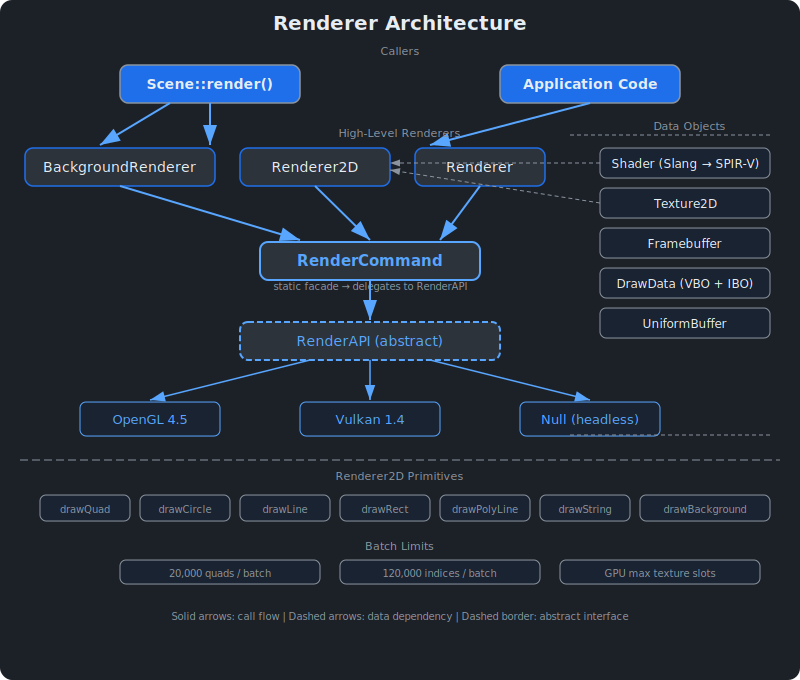
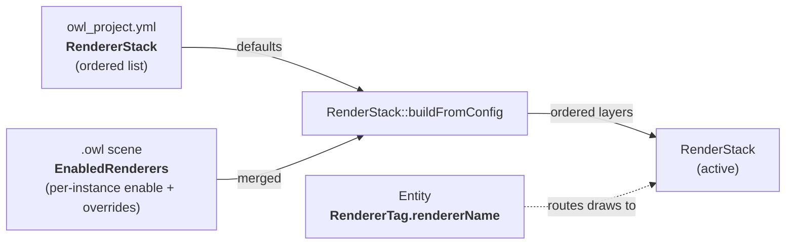
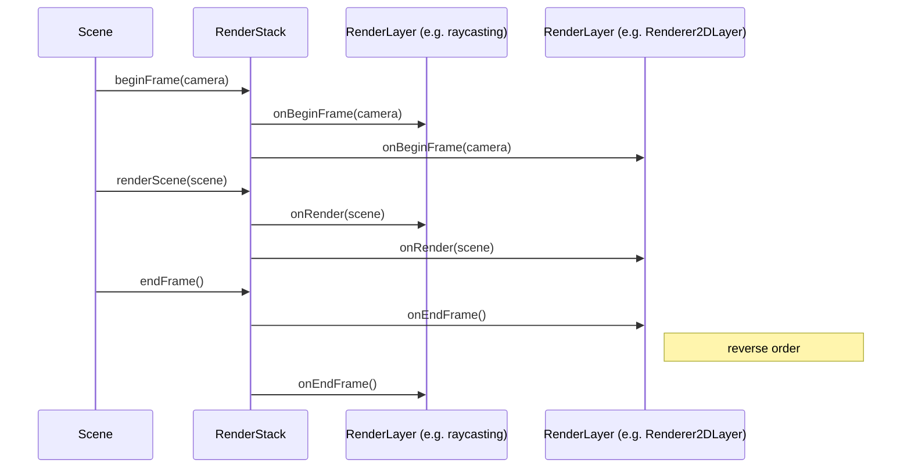
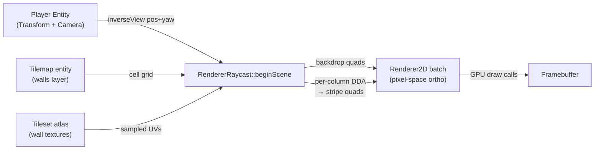
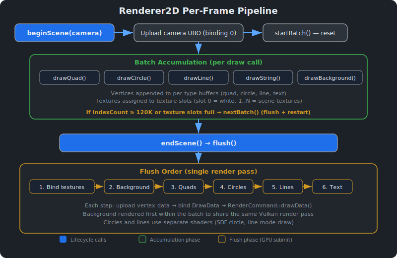
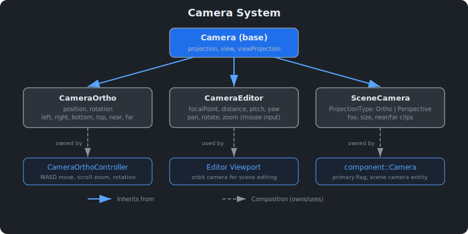

# Renderer System {#page-renderer}

[TOC]

This page documents Owl's rendering system: the 2D batch renderer, texture and shader
management, cameras, framebuffers, and backend abstraction.

## Overview

Owl provides a 2D batch renderer built on an abstract backend layer (OpenGL 4.5,
Vulkan 1.4, or Null for headless). All rendering goes through static facade classes:
`RenderCommand` for low-level GPU operations, `Renderer2D` for batched 2D primitives
(quads, circles, lines, text), and `BackgroundRenderer` for fullscreen backgrounds.

The renderer supports up to **20,000 quads per batch** with automatic batch splitting
and GPU-managed texture slot allocation.

## Architecture



The renderer module is split into sub-namespaces / sub-folders by renderer
kind: `owl::renderer::stack` (orchestration), `owl::renderer::renderer2d`
(2D batch), `owl::renderer::rendererraycast` (raycaster). The base building
blocks (`Camera`, `Texture`, `Shader`, `Buffer`, `Framebuffer`, `RenderAPI`,
`RenderCommand`) stay in `owl::renderer` because they're shared by every
renderer kind.

| Class                                            | Role                                                                       |
|--------------------------------------------------|----------------------------------------------------------------------------|
| `Renderer`                                       | Lifecycle (init/shutdown/reset), owns `ShaderLibrary` and `TextureLibrary` |
| `stack::RenderStack`                             | Ordered list of active `RenderLayer` instances for the current scene       |
| `stack::RenderLayer`                             | Abstract interface for one renderer in the stack (begin/render/end)        |
| `stack::RenderLayerFactory`                      | String-keyed registry of layer constructors (`"Renderer2D"`, ...)          |
| `renderer2d::Renderer2D`                         | Static 2D batch renderer: quads, circles, lines, text                      |
| `renderer2d::Renderer2DLayer`                    | `RenderLayer` adapter wrapping `Renderer2D` (registered at engine init)    |
| `rendererraycast::RendererRaycast`               | Static facade for the CPU-DDA raycaster                                    |
| `rendererraycast::RendererRaycastLayer`          | `RenderLayer` adapter for the raycaster (factory key `"RendererRaycast"`)  |
| `BackgroundRenderer`                             | Deferred fullscreen background/skybox rendering                            |
| `RenderCommand`                                  | Static facade delegating to the active `RenderAPI`                         |
| `RenderAPI`                                      | Abstract interface (OpenGL, Vulkan, Null)                                  |
| `GraphContext`                                   | Graphics context abstraction (init, buffer swapping)                       |
| `Camera`                                         | Base class: projection, view, viewProjection matrices                      |
| `CameraOrtho`                                    | Standalone orthographic camera with position/rotation                      |
| `CameraEditor`                                   | Editor orbit camera (focal point, pan, zoom, rotate)                       |
| `SceneCamera`                                    | Scene camera supporting both orthographic and perspective                  |
| `Framebuffer`                                    | Off-screen render target with typed attachments                            |
| `DrawData`                                       | Vertex/index buffer + shader binding for a draw call                       |
| `Shader`                                         | Abstract shader (Slang source, SPIR-V compiled)                            |
| `Texture` / `Texture2D`                          | Abstract texture, 2D texture with file/spec creation                       |
| `UniformBuffer`                                  | GPU-side uniform data block                                                |

## Renderer Stack {#renderer-stack}

The renderer stack lets a single scene compose **multiple ordered renderers**
into the same frame — for example a raycasting layer for the world plus a
`Renderer2D` layer on top for a HUD. The stack is defined at the project level
(in `owl_project.yml`), filtered and configured per scene (in `.owl` files),
and routed per entity via the optional `RendererTag` component.

In v0.2.0 the foundation ships with the runtime now wired end-to-end:
`EditorLayer::syncActiveDocumentPanels` (and the runner equivalent) builds the
`RenderStack` from `Project::rendererStack` + `Scene::getEnabledRenderers()` and
installs it via `Renderer::setRenderStack`. `Scene::renderWithStack` then runs
one pass per layer (`onBeginFrame` → `render` → `renderUI` → `onEndFrame`),
filtering entities by their `RendererTag` so each layer only sees the entities
that opt into it. Untagged entities default to the first layer and backgrounds
draw only on the first pass to preserve the legacy z-order. A project with no
`RendererStack:` entry falls back to a single implicit `Renderer2D` and behaves
identically to the legacy single-pass path.

### Configuration model



**Project YAML** (`owl_project.yml`):

```yaml
RendererStack:
  - Type: Renderer2D       # factory key — must match a registered type
    Name: world            # unique instance name within the stack
    DefaultConfig: {}      # optional, layer-specific knobs
  - Type: Renderer2D
    Name: hud
```

The list order is the back-to-front render order. A project with no
`RendererStack:` entry is treated as `[{Type: Renderer2D, Name: default}]`.

**Scene YAML** (`.owl`):

```yaml
EnabledRenderers:
  - Name: world
    Enabled: true
    Overrides: {}
  - Name: hud
    Enabled: true
```

A scene with no `EnabledRenderers:` activates **every** project layer with its
project default config. `Overrides` is deep-merged on top of `DefaultConfig`
(override wins on key collision).

**Entity component** (`RendererTag`):

```yaml
- Entity:
    Components:
      RendererTag:
        Name: hud
      UiText:
        ...
```

| Tag state                                    | Routing                                                  |
|----------------------------------------------|----------------------------------------------------------|
| Component absent                             | First layer of the active stack (legacy `Renderer2D`)    |
| Component present, name matches a layer      | That layer renders the entity                            |
| Component present, name unknown to the stack | Entity skipped, one-shot warning per scene activation    |

This is fully backward compatible: existing `.owl` files and `owl_project.yml`
load unchanged — none of these blocks are required.

### Frame flow



`onBeginFrame` and `onRender` walk the stack in declaration order; `onEndFrame`
walks in reverse so layers can flush nested resources cleanly.

### Adding a new layer type

1. Subclass `RenderLayer` and implement the four virtuals
   (`onBeginFrame`, `onRender`, `onEndFrame`, `applyConfig`).
2. Provide a `static void registerWithFactory()` that calls
   `RenderLayerFactory::registerType("MyType", ...)` exactly once.
3. Invoke `MyLayer::registerWithFactory()` from `Renderer::initShaders` so the
   type is available before any project loads.
4. Bump the project YAML to reference the new `Type: MyType` and any
   `DefaultConfig` keys your `applyConfig` consumes.

The factory pattern keeps the engine extensible: third-party code (mods, tests)
can register layer types without touching engine sources.

### Per-renderer descriptor blocks (Vulkan)

Each high-level renderer (`Renderer2D`, `RendererTilemap`, future renderers)
owns its own Vulkan `VkDescriptorSetLayout` + descriptor pool + per-frame
descriptor sets, matching exactly the bindings its shaders declare. The
pattern lives behind a backend-neutral API so OpenGL and the headless `Null`
backend can no-op every call:

```c++
// In MyRenderer::init(), declare the bindings the shaders use:
const std::array<gpu::BindingDecl, 2> myBindings{
    gpu::BindingDecl{.binding = 0, .type = gpu::BindingType::UniformBuffer,
                     .count = 1, .stages = gpu::ShaderStage::Vertex},
    gpu::BindingDecl{.binding = 1, .type = gpu::BindingType::CombinedImageSampler,
                     .count = 32, .stages = gpu::ShaderStage::Fragment},
};
gpu::RendererDescriptors::declare("MyRenderer", myBindings);

// Then scope `ScopedActive` around every operation that touches the
// renderer's GPU state — pipeline creation, UBO upload, texture binding,
// the draw itself:
const gpu::RendererDescriptors::ScopedActive scoped{"MyRenderer"};
// ... drawData->init(), UniformBuffer::create(), texture->bind(),
// drawDataInstanced(), …

// And in MyRenderer::shutdown():
gpu::RendererDescriptors::release("MyRenderer");
```

While a `ScopedActive` is alive on the current thread, `vulkan::UniformBuffer`,
`vulkan::Texture2D::bind`, `VulkanHandler::pushPipeline` and
`VulkanHandler::bindPipeline` all route through the matching descriptor
block. Outside any scope they fall back to the legacy global `Descriptors`
singleton, which is still used by the `Texture2D` storage table and a
handful of pre-modernization call sites — that path will retire as the
remaining renderers migrate.

This pattern fixes two pre-existing pathologies:

- **NVIDIA `vkCmdBindPipeline` crash on the instanced-tilemap path.** The
  shared global layout previously declared bindings the calling shader
  didn't sample, which NVIDIA's strict validation rejects.
- **Per-pass UBO race.** Two `Renderer2D` layers using different VPs in the
  same frame used to memcpy into the same `VkBuffer` for binding 0,
  producing visible flicker. Per-renderer UBOs scope each pass cleanly.

The same machinery also supports `BindingType::StorageBuffer` slots —
the instanced `Renderer2D` rewrite (v0.2.0 Phase 1) declares binding 2
as an SSBO and attaches its `vulkan::StorageBuffer` via
`bindStorageBuffer` so the per-frame descriptor set picks up the
correct `VkBuffer` automatically.

### Raycast wall stripes on the GPU (Phase 3)

`RendererRaycast::drawTilemapWalls` runs the per-column DDA on the GPU and
emits every wall stripe in a single instanced drawcall:

```mermaid
flowchart LR
    Tilemap["Tilemap grid +<br/>tile metadata"] -->|cache miss| DDA["RaycastDDAPass<br/>(raycast_dda.slang)"]
    Camera["Camera params<br/>(cell-space)"] --> DDA
    DDA -->|hitCount[]<br/>columnHits[]<br/>zBuffer[]| Stripe["raycast_stripe.slang<br/>(vertex + fragment)"]
    Tileset["Tileset atlas +<br/>per-tile UV rects"] --> Stripe
    Stripe -->|drawDataInstanced<br/>numRays × kMaxHits| FB["Framebuffer"]
```

- The DDA compute pass writes `hitCount[col]` + `columnHits[col × maxHits + k]`
  + `zBuffer[col]` once per frame (one thread per screen column).
- The stripe shader fires `numRays × kMaxHits` instances. Each vertex
  unpacks `(col, localK)` from `SV_InstanceID`, indexes the hit array
  back-to-front so painter's order is implicit, computes the stripe
  rectangle from `perpDist` + `wallHeight` + the cached pixel-space
  viewProjection, fetches `tileUvRects[tileIndex]` for the atlas UV strip,
  and emits the corner. Slots past `hitCount[col]` emit a zero-area
  off-screen quad — the rasteriser drops them cheaply.
- Per-tile UV rects + tilemap grid + tile meta upload only on cache miss
  (`(tilemap, tileset, layer)` key) — static scenes pay zero per-frame
  upload cost.
- `zBuffer[]` is read back into the renderer's CPU mirror so the legacy
  CPU sprite / door / pushwall occlusion paths keep working. A future PR
  can move those consumers to GPU-side `zBuffer[]` indexing to drop the
  readback.
- The Null backend keeps a CPU walk fallback so headless tests stay green
  and the visual output is byte-identical.

### Scene world matrices on the GPU (Phase 2)

Phase 2 of the renderer modernisation moved per-entity world matrices
from per-instance CPU upload to a GPU-resident SSBO populated by the
compute pre-pass `renderer::utils::WorldTransformPass`. Each instance
record in the quad / circle / text batches now carries a small
`int32_t worldIndex` instead of a 64-byte `mat4 transform`:

```mermaid
flowchart LR
    Scene["Scene::prepareWorldTransforms"] -->|topo-sorted entries| WT["WorldTransformPass<br/>(compute shader)"]
    WT -->|worlds[] SSBO| Bind3["Renderer2D binding 3<br/>sceneWorlds"]
    Renderer2D -->|appended per draw| TW["transientWorlds[]<br/>(per-batch scratch)"]
    TW --> Bind4["Renderer2D binding 4<br/>transientWorlds"]
    Bind3 -->|positive worldIndex| VS["Vertex shader<br/>resolveWorldMatrix"]
    Bind4 -->|negative worldIndex| VS
    VS --> Draw["Instanced drawcall"]
```

- Entity draws (sprites, animated sprites, circles, text entities in
  `Scene::render`) pass `Scene::getWorldIndex(entity)` — a positive slot
  into the GPU `sceneWorlds[]` SSBO.
- Non-entity draws (UI canvas widgets, gizmo / debug overlays, the
  per-glyph layout in `drawString`) leave `worldIndex` at its default `-1`.
  Renderer2D appends each requested `math::Transform` to a per-batch
  `transientWorlds[]` SSBO and emits a negative `worldIndex` that
  points into it.
- `gpu::StorageBuffer::bind(uint32_t iBinding)` lets the same SSBO be
  bound at different slot numbers across descriptor blocks
  (`WorldTransformPass` writes at slot 2 of the compute descriptor;
  Renderer2D consumes at slot 3 of its own descriptor).
- Per-instance footprint dropped: `QuadInstance` 128 → 80 bytes,
  `CircleInstance` 96 → 48 bytes, `TextInstance` 128 → 80 bytes. `Scene`
  pre-fills `m_worldTransformCache` in the same linear walk so the CPU
  consumers that genuinely need a world matrix (raycast DDA, physics sync,
  `EntityLink`, the editor inspector / gizmo) keep their O(1) cache hit
  without a GPU readback.

### Canonical instanced pipeline & clean-up (Phase 5)

The SSBO-indexed instanced pattern proven by Phases 1–3 is the **canonical
draw path** for every renderer going forward — a compute pre-pass writes an
SSBO, the graphics pass is instanced and indexes into the SSBO via the
instance id, and the CPU performs zero per-vertex transform. New renderers
(the v0.3.0 mesh / 3D pipeline, the deferred GPU sprite stripes) build on
this same shape rather than the retired Hazel-style CPU-vertex batch.

Clean-ups in Phase 5:

- **Tilemap rendering routes through the instanced `RendererTilemap`.**
  `Scene::renderTilemaps` queues each non-raycast 2D tilemap via
  `RendererTilemap::drawTilemap`; the draw is **deferred**, not immediate.
  `Renderer2D::flush` drains the queue with `RendererTilemap::flushPending`
  from inside its own `beginBatch`/`endBatch` render pass — after the
  background, before the sprites — so the tilemap composites in the same
  painter's order as the retired per-cell `Renderer2D::drawQuad` path.
  Issuing the draw immediately (mid-`Scene::render`, before the batch opens)
  recorded a `vkCmdDrawIndexed` with no active render pass and hung the GPU;
  deferring into the active batch fixes it. The whole scene's tilemaps — every
  entity, every layer — combine into **one instanced drawcall**
  (`tilemap_instanced.slang`): `layerZ`, `cellSize`, the atlas grid, the
  half-texel inset and a `textureSlot` are all per-instance attributes, and
  distinct tilesets bind to distinct slots of the shader's `gTextures[32]`
  array. There is no per-draw UBO: that was the thing that could not be pooled
  (one descriptor set per frame per block, undefined to update between
  recorded draws), so folding every per-draw datum into the instance stream —
  the same pattern `Renderer2D` uses for its 32-texture batch — sidesteps the
  descriptor race entirely. Cap: 32 distinct tilesets per batch.
- **No redundant `getWorldTransform` on the 2D entity draws.** The quad /
  circle / animated-sprite loops in `Scene::render` pass
  `Scene::getWorldIndex(entity)`; when that slot is valid (the normal case
  after `prepareWorldTransforms`) the vertex shader reads `sceneWorlds[]` and
  the CPU `math::Transform` is never used, so it is no longer computed.
  `getWorldTransform()` is only evaluated on the transient fallback path
  (sentinel index) and for the consumers listed above.

### Measuring the instanced pipeline

The modernisation targets throughput, so validate changes against the three
reference scenes rather than micro-benchmarks:

- a **5 000-quad** flat scene (Renderer2D instanced batch),
- a **deep-hierarchy** scene (exercises `WorldTransformPass` topo-sort + the
  `sceneWorlds[]` SSBO), and
- the **`raycast_demo`** scene (DDA compute pre-pass + wall stripe shader).

Capture frame time with the in-editor profiler (`Window > Profiler`) or an
`OWL_PROFILE_SCOPE` around the render pass, on a real GL / Vulkan backend —
the Null backend executes no GPU work and is only an API-contract oracle (see
*Testing*). Compare a release build before/after the change on the same GPU;
record the GPU model alongside the numbers, since the instanced path is
bandwidth- rather than CPU-bound. There is no automated perf gate in CI —
the headless suite asserts correctness (stats, SSBO round-trip), not timing.

## Raycaster {#renderer-raycaster}

`RendererRaycast` (in `renderer/rendererraycast/`) is the first non-2D
renderer to ride on the stack. It synthesises a Wolfenstein-style first-person
view from a top-down 2D `scene::component::Tilemap`: each non-empty cell is a
wall, each empty cell is walkable space.

### Pipeline (v0.2.0)



The raycaster's `RenderLayer` switches `Renderer2D` to a pixel-space ortho
camera in `onBeginFrame`, lets `Scene::render` dispatch every accepted
tilemap into `RendererRaycast::drawTilemapWalls`, then closes the
`Renderer2D` batch in `onEndFrame`. The DDA traversal runs on the CPU per
screen column, producing one textured `Renderer2D::drawQuad` per stripe; the
sky / floor backdrop is emitted lazily on the first wall draw so empty
passes (no tilemap routed) stay genuinely no-op.

### Configuration

In `owl_project.yml`:

```yaml
RendererStack:
  - Type: Renderer2D
    Name: world
  - Type: RendererRaycast
    Name: raycast_world
    DefaultConfig:
      Fov: 75.0                       # horizontal field of view, degrees
      MaxDistance: 32.0               # max DDA budget, in cells
      CeilingColor: [0.18, 0.20, 0.30, 1.0]
      FloorColor:   [0.20, 0.16, 0.12, 1.0]
      NumRays: 0                      # 0 = derive from viewport width
  - Type: Renderer2D
    Name: ui
```

A scene that wants a raycast world disables the 2D `world` layer:

```yaml
EnabledRenderers:
  - Name: world
    Enabled: false
  - Name: raycast_world
    Enabled: true
  - Name: ui
    Enabled: true
```

Tag the wall tilemap with `RendererTag: { Name: raycast_world }` to route it
to the raycaster.

### Player pose convention

The raycaster extracts the camera's 2D pose from the inverse view matrix
(i.e. the camera entity's world transform):

| 2D quantity   | Source                                                                          |
|---------------|---------------------------------------------------------------------------------|
| Position      | `inverseView * (0, 0, 0, 1)` — the entity's world `(x, y)`                      |
| Forward       | `inverseView * (0, 1, 0, 0)` — the entity's local +Y mapped to world XY         |
| Right (× FOV) | `inverseView * (1, 0, 0, 0)` scaled by `tan(fov/2) * aspect` — the FOV "plane"  |

Convention:
- An entity with `rotation: [0, 0, 0]` faces world **+Y** (forward = `(0, 1)`).
- Increasing the entity's Z rotation rotates the facing **counter-clockwise**
  in world XY — `rotation: [0, 0, π/2]` faces world **−X** (forward = `(−1, 0)`).
- Rotation values are stored in **radians** in the `Transform` component
  (matching the rest of Owl's transform pipeline).

The accompanying `scripts/raycast_player.lua` in the sample project
implements WASD strafing + Q/E turning following this convention.

## 3D Forward Renderer {#renderer3d}

`Renderer3D` is the engine's first true 3D draw path — a generic, depth-tested, textured forward renderer with a
single directional light. It is the reusable base for `RendererVoxel` (and future static-mesh renderers); unlike
`Renderer2D` (a unit quad + per-instance SSBO) it draws **real per-vertex geometry**.

- **Vertex** (`renderer::Mesh3DVertex`, 36 bytes, tightly packed): object-space `position`, `normal`, `uv`, and a
  `textureIndex` selecting a slot in the bound texture array.
- **Shader** (`engine_assets/shaders/renderer3D/slang/mesh3d.slang`): vertex transforms position by a per-draw model
  matrix then the per-frame view-projection (both `column_major`, supplied through one scene UBO at binding 0);
  fragment samples `gTextures[texIndex]` (binding 1) and applies `ambient + max(dot(N, -sunDir), 0)`. Outputs colour
  + entity id to match the scene framebuffer.
- **API**: `init` / `shutdown`, `beginScene(camera)` (enables depth test/write), `endScene()` (restores 2D depth
  state), `setLighting(sunDir, ambient)`, `createMesh(vertices, indices) -> MeshHandle` (one-time GPU upload), and
  `drawMesh(handle, model, textures)` (immediate-mode draw; textures bind to slots `1..N`, slot `0` is white).

```c++
const auto mesh = renderer::Renderer3D::createMesh(vertices, indices);// once, on geometry change
renderer::Renderer3D::beginScene(camera);
renderer::Renderer3D::drawMesh(mesh, modelMatrix, {atlasTexture});
renderer::Renderer3D::endScene();
```

It owns its own per-renderer descriptor block (`RendererDescriptors`, no-op on Null / OpenGL) like the other
renderers, so Vulkan per-draw descriptor selection routes correctly.

## Backend Abstraction

The `RenderAPI` class defines a platform-independent interface. A concrete implementation
is selected at startup via `RenderCommand::create(Type)`.

| Backend  | API         | Notes                                         |
|----------|-------------|-----------------------------------------------|
| `OpenGL` | OpenGL 4.5  | Widely supported on desktop; limited on ARM64 |
| `Vulkan` | Vulkan 1.4+ | Modern low-level API; full desktop support    |
| `Null`   | None        | Headless mode for servers or testing          |

**Key `RenderAPI` methods:**

| Method                        | Description                              |
|-------------------------------|------------------------------------------|
| `init()`                      | Initialize the graphics backend          |
| `setViewport(x,y,w,h)`        | Set render viewport                      |
| `setClearColor(vec4)`         | Set screen clear colour                  |
| `clear()`                     | Clear the screen                         |
| `drawData(data, cnt)`         | Issue a draw call with vertex/index data |
| `drawLine(data, cnt)`         | Issue a line-mode draw call              |
| `getMaxTextureSlots()`        | Query GPU texture slot limit             |
| `beginFrame()` / `endFrame()` | Frame lifecycle (Vulkan swap chain)      |
| `beginBatch()` / `endBatch()` | Batch render pass (Vulkan subpass)       |

See [Architecture](architecture.md) for the backend selection and application startup flow.

## Renderer2D: The Batch Renderer {#renderer2d}



### Lifecycle

| Method               | Description                                       |
|----------------------|---------------------------------------------------|
| `init()`             | Create shaders, allocate draw data, white texture |
| `shutdown()`         | Release GPU resources                             |
| `beginScene(camera)` | Upload camera UBO, start first batch              |
| `endScene()`         | Flush the batch and end the frame                 |
| `flush()`            | Bind textures, draw all primitives, end batch     |
| `nextBatch()`        | Flush current batch and start a new one           |

### Draw Primitives

| Method         | Input Struct   | Description                                |
|----------------|----------------|--------------------------------------------|
| `drawQuad`     | `Quad2DData`   | Textured/coloured quad with UV and tiling  |
| `drawCircle`   | `CircleData`   | SDF circle with thickness and fade         |
| `drawLine`     | `LineData`     | Single line segment                        |
| `drawRect`     | `RectData`     | Wireframe rectangle (4 lines)              |
| `drawPolyLine` | `PolyLineData` | Connected line segments, optionally closed |
| `drawString`   | `StringData`   | MSDF text rendering with font atlas        |

### Quad2DData

| Field           | Type                        | Default                     | Description                    |
|-----------------|-----------------------------|-----------------------------|--------------------------------|
| `transform`     | `math::Transform`           | —                           | Quad transformation            |
| `color`         | `math::vec4`                | `{1, 1, 1, 1}`              | Colour tint                    |
| `texture`       | `shared<Texture>`           | `nullptr`                   | Texture (plain colour if null) |
| `tilingFactor`  | `float`                     | `1.0`                       | Texture repetition factor      |
| `textureCoords` | `std::array<math::vec2, 4>` | `{(0,0),(1,0),(1,1),(0,1)}` | Per-vertex UV coordinates      |
| `entityId`      | `int`                       | `-1`                        | Entity ID for mouse picking    |

The `textureCoords` field defaults to full-texture UVs. Custom UVs are used by the
`AnimatedSpriteRenderer` to display individual frames from a spritesheet.

### CircleData

| Field       | Type              | Default        | Description           |
|-------------|-------------------|----------------|-----------------------|
| `transform` | `math::Transform` | —              | Circle transformation |
| `color`     | `math::vec4`      | `{1, 1, 1, 1}` | Circle colour         |
| `thickness` | `float`           | `1.0`          | Ring thickness (0–1)  |
| `fade`      | `float`           | `0.005`        | Edge fade amount      |
| `entityId`  | `int`             | `-1`           | Entity ID for picking |

### LineData

| Field      | Type         | Default        | Description |
|------------|--------------|----------------|-------------|
| `point1`   | `math::vec3` | —              | Start point |
| `point2`   | `math::vec3` | —              | End point   |
| `color`    | `math::vec4` | `{1, 1, 1, 1}` | Line colour |
| `entityId` | `int`        | `-1`           | Entity ID   |

### StringData

| Field         | Type              | Default        | Description          |
|---------------|-------------------|----------------|----------------------|
| `transform`   | `math::Transform` | —              | Text transformation  |
| `text`        | `std::string`     | —              | Text content         |
| `font`        | `shared<Font>`    | `nullptr`      | Font (or default)    |
| `color`       | `math::vec4`      | `{1, 1, 1, 1}` | Text colour          |
| `kerning`     | `float`           | `0.0`          | Extra letter spacing |
| `lineSpacing` | `float`           | `0.0`          | Extra line spacing   |
| `entityId`    | `int`             | `-1`           | Entity ID            |

**Text encoding.** `text` is consumed as UTF-8. The MSDF atlas covers Latin-1 codepoints
(`0x20`-`0xFF`); `Renderer2D::drawString` decodes UTF-8 input into single-byte Latin-1 up
front, mapping accented glyphs (`éàüÇ`…) to their atlas codepoint and substituting
`?` for codepoints beyond `U+00FF`.

### Batching Internals

Each draw primitive emits one `XxxInstance` struct into a CPU-side
`std::vector`. At `flush()` the vector is uploaded to a per-batch
`StorageBuffer` and the renderer issues a single instanced drawcall —
`glDrawElementsInstanced` / `vkCmdDrawIndexed` for quads / circles /
text (shared 4-vertex unit quad VBO + `{0,1,2, 2,3,0}` index buffer)
and `RenderAPI::drawLineInstanced` for lines (2-vertex unit segment +
`{0, 1}` index buffer, LINE_LIST topology selected via the `"line"`
shader name). The vertex shader transforms the unit quad / line by
`gInstances[gl_InstanceID].transform`; no CPU vertex math.

**Instance layouts (std430):**

| Struct           | Size  | Members                                                                                                 |
|------------------|-------|---------------------------------------------------------------------------------------------------------|
| `QuadInstance`   | 128 B | `mat4 transform`, `vec4 color`, `vec2 uv[4]`, `uint texIndex`, `int entityId`, `vec2 tilingFactor`      |
| `CircleInstance` | 96 B  | `mat4 transform`, `vec4 color`, `float thickness`, `float fade`, `int entityId`, `uint _pad`            |
| `LineInstance`   | 64 B  | `vec3 point1`, `vec3 point2`, `vec4 color`, `int entityId` (with explicit pads to align fields to 16 B) |
| `TextInstance`   | 128 B | Same as `QuadInstance` minus `tilingFactor`; fragment shader runs the MSDF screenPxRange path           |

The 4 explicit per-corner UVs (instead of a `uvRect`) preserve the
non-rectangular UV trapezoids produced by the raycaster's floor /
ceiling / wall stripe paths.

**Capacity limits:**

| Constant                    | Value         | Description                                  |
|-----------------------------|---------------|----------------------------------------------|
| `g_maxQuadsPerBatch`        | 20,000        | `nextBatch()` rolls over when reached        |
| `g_maxCirclesPerBatch`      | 20,000        | Same trigger                                 |
| `g_maxLinesPerBatch`        | 20,000        | Same trigger                                 |
| `g_maxTextGlyphsPerBatch`   | 20,000        | Counted per glyph, not per `drawString` call |
| `g_MaxTextureSlots`         | GPU-dependent | Queried via `getMaxTextureSlots()`           |

**Texture slot management** is unchanged from the legacy path: slot 0
is the 1×1 white texture, slots 1..N hold unique textures; rolling
over when full triggers `nextBatch()` (flush + restart).

**Flush order** (within a single render pass):

1. Bind all texture slots
2. Background (via `BackgroundRenderer::flushPending()`)
3. Quads (`RenderCommand::drawDataInstanced`, 6 indices × N instances)
4. Circles (`RenderCommand::drawDataInstanced`)
5. Lines (`RenderCommand::drawLineInstanced`, 2 indices × N instances)
6. Text (`RenderCommand::drawDataInstanced`)

**Per-batch descriptor layout** declared in `Renderer2D::init`:

| Binding | Type                   | Stage         |
|---------|------------------------|---------------|
| 0       | UBO (`Camera`)         | Vertex        |
| 1       | `Sampler2D[32]`        | Fragment      |
| 2       | SSBO (`XxxInstance[]`) | Vertex        |

The SSBO at binding 2 is swapped before each instanced drawcall via
`gpu::StorageBuffer::bind()` — on OpenGL this calls
`glBindBufferBase(GL_SHADER_STORAGE_BUFFER, 2, ...)`; on Vulkan it
calls `internal::RendererDescriptors::bindStorageBuffer` which
updates the per-frame descriptor set.

### Statistics

`Renderer2D::Statistics` tracks per-frame performance:

| Field                   | Description                                                            |
|-------------------------|------------------------------------------------------------------------|
| `drawCalls`             | Number of GPU drawcalls submitted (one per non-empty batch at `flush`) |
| `quadCount`             | Quads drawn (includes circles and per-glyph text instances)            |
| `lineCount`             | Line segments drawn                                                    |
| `getTotalVertexCount()` | `quadCount * 4 + lineCount * 2`                                        |
| `getTotalIndexCount()`  | `quadCount * 6 + lineCount * 2`                                        |

Reset with `Renderer2D::resetStats()` at the start of each frame.

## Background and Skybox Rendering

The `BackgroundRenderer` is **deferred**: `drawBackground(data)` stores a pending draw
command; the actual GPU draw happens during `Renderer2D::flush()` to share the same
render pass (critical for Vulkan's `DONT_CARE` loadOp).

### BackgroundData

| Field                 | Type                | Default              | Description                              |
|-----------------------|---------------------|----------------------|------------------------------------------|
| `mode`                | `int`               | `0`                  | 0=Solid, 1=Gradient, 2=Texture, 3=Skybox |
| `color`               | `math::vec4`        | `{0.2, 0.3, 0.8, 1}` | Main/bottom colour                       |
| `topColor`            | `math::vec4`        | `{0.8, 0.9, 1, 1}`   | Top colour (gradient mode)               |
| `inverseViewRotation` | `math::mat4`        | identity             | Inverse view-rotation (skybox)           |
| `texture`             | `shared<Texture2D>` | `nullptr`            | Background or equirectangular texture    |

## Texture System

### Texture2D

`Texture2D` represents a 2D image on the GPU. Factory methods dispatch to the active backend.

| Factory Method                              | Description                                                              |
|---------------------------------------------|--------------------------------------------------------------------------|
| `create(path)`                              | Load from image file (`.png`, `.jpg`), blocking                          |
| `create(spec)`                              | Create from `Specification` (size, format)                               |
| `createFromSerialized(string)`              | Deserialize from scene YAML string, blocking                             |
| `createFromSerializedAsync(string, sched)`  | Same, but decodes on a worker; placeholder visible while state `Pending` |
| `createFromSerializedForDeserialize(str)`   | Wrapper used by scene components: async when an `Application` is alive   |

### Specification

| Field          | Type           | Default  | Description        |
|----------------|----------------|----------|--------------------|
| `size`         | `math::vec2ui` | `{0, 0}` | Texture dimensions |
| `format`       | `ImageFormat`  | `Rgba8`  | Pixel format       |
| `generateMips` | `bool`         | `true`   | Generate mipmaps   |

### ImageFormat

| Format    | Channels | Bits/pixel | Typical use            |
|-----------|----------|------------|------------------------|
| `R8`      | 1        | 8          | Masks, heightmaps      |
| `Rgb8`    | 3        | 24         | Non-transparent images |
| `Rgba8`   | 4        | 32         | Standard textures      |
| `Rgba32F` | 4        | 128        | HDR / floating-point   |

### Serialization Format

Textures serialize to a prefixed string via `getSerializeString()`:

| Prefix  | Example                   | Description                   |
|---------|---------------------------|-------------------------------|
| `emp:`  | `emp:`                    | Empty texture                 |
| `nam:`  | `nam:player_sprite`       | Named asset (asset directory) |
| `pat:`  | `pat:textures/ground.png` | Path-based                    |
| `spec:` | `spec:64x64_Rgba8_mips`   | Specification-based           |

`createFromSerialized()` reverses this process, resolving `nam:` assets through the
asset directories (or pack file if one is open).

### Async Texture Loading

For `nam:`/`pat:` references, `createFromSerializedAsync()` decodes image bytes on a
worker thread instead of blocking the caller. It keeps the runtime smooth during scene
transitions that pull many textures at once (no frame hitch on decode).

The flow:

```mermaid
sequenceDiagram
    participant Caller as Scene component::deserialize
    participant Texture as Texture2D::createFromSerializedAsync
    participant Decoder as TextureDecoder (main thread)
    participant Worker as Scheduler worker
    participant GPU as GPU upload
    Caller->>Texture: createFromSerializedAsync(name, sched)
    Texture->>Decoder: resolve bytes + peek size
    Decoder-->>Texture: (width, height) from PNG/JPG header
    Texture->>GPU: allocate Rgba8 texture, setData(white)
    Texture->>Worker: Scheduler::pushTask(decode + terminate)
    Texture-->>Caller: shared<Texture2D>, state = Pending
    Note over Caller,GPU: Frame continues rendering; texture shows white
    Worker->>Worker: decodeImageBytes(bytes, Rgba8)
    Worker->>GPU: termination callback: setData(decoded pixels)
    Note over GPU: state → Ready (or Failed; placeholder stays visible)
```

Key properties:

- **Placeholder-sized, not 1×1:** the texture is created at the real image dimensions
  (peeked from the PNG/JPG header, microseconds) so binding code, UV coords, and atlas
  math are correct from frame 0.
- **Always `Rgba8`:** the worker decodes with `desired_channels = 4`, so the placeholder
  size and the final `setData` size always match.
- **Thread-safe decode:** `stbi_set_flip_vertically_on_load_thread()` ensures per-thread
  flip state; multiple textures can decode concurrently.
- **Fallback paths:** `emp:`/`siz:` and unresolvable `nam:` delegate to the synchronous
  factory. Unit tests and `PackWriter` that run without an `Application` still use the
  blocking path.

Query `Texture2D::getLoadState()` to distinguish `Pending` / `Ready` / `Failed`. The
runner logs the number of still-pending textures after each scene transition as a
diagnostic aid.

### Texture Library

`Renderer::getTextureLibrary()` returns an `AssetLibrary<Texture2D>` that caches
loaded textures by name, avoiding duplicate GPU uploads.

## Framebuffer

A `Framebuffer` represents an off-screen render target with one or more typed attachments.

### Attachment Formats

| Format            | Description                  | Typical Use         |
|-------------------|------------------------------|---------------------|
| `Rgba8`           | 8-bit RGBA colour            | Scene colour output |
| `RedInteger`      | Single integer per pixel     | Entity ID picking   |
| `Depth24Stencil8` | 24-bit depth + 8-bit stencil | Depth testing       |
| `Surface`         | Swap chain surface (Vulkan)  | Final presentation  |

### FramebufferSpecification

| Field             | Type                              | Default  | Description              |
|-------------------|-----------------------------------|----------|--------------------------|
| `size`            | `math::vec2ui`                    | `{0, 0}` | Render target dimensions |
| `attachments`     | `vector<AttachmentSpecification>` | —        | List of attachments      |
| `samples`         | `uint32_t`                        | `1`      | MSAA sample count        |
| `swapChainTarget` | `bool`                            | `false`  | Vulkan swap chain target |
| `debugName`       | `string`                          | `"main"` | Debug identifier         |

### Key Methods

| Method                      | Description                                |
|-----------------------------|--------------------------------------------|
| `bind()` / `unbind()`       | Activate/deactivate the framebuffer        |
| `resize(size)`              | Recreate attachments at new size           |
| `readPixel(index, x, y)`    | Read integer pixel (entity ID picking)     |
| `clearAttachment(index, v)` | Clear an attachment to a value             |
| `isUpsideDown()`            | Backend-specific Y-flip (Vulkan vs OpenGL) |

The editor viewport uses a framebuffer with `Rgba8` + `RedInteger` + `Depth24Stencil8`
to render the scene and support mouse-based entity picking.

## Shader System

Shaders are written in **Slang** and compiled to SPIR-V at runtime.
See [Architecture > Shader Pipeline](architecture.md) for the
compilation, reflection, and caching pipeline.

### Shader API

| Method                          | Description                    |
|---------------------------------|--------------------------------|
| `bind()` / `unbind()`           | Activate/deactivate the shader |
| `setInt(name, val)`             | Set integer uniform            |
| `setFloat(name, val)`           | Set float uniform              |
| `setFloat2/3/4(name, v)`        | Set vector uniform             |
| `setMat4(name, mat)`            | Set 4×4 matrix uniform         |
| `setIntArray(name, arr, count)` | Set integer array uniform      |

### Shader Library

`Renderer::getShaderLibrary()` caches compiled shaders by name. Shader names follow
the format `"renderer/name"` (e.g., `"renderer2D/quad"`), composed and decomposed via
`Shader::composeName()` and `Shader::decomposeName()`.

## DrawData and Buffer Layout

`DrawData` binds vertex data, index data, and a shader into a single drawable unit.

### ShaderDataType

| Type     | Size (bytes) | Components |
|----------|--------------|------------|
| `Float`  | 4            | 1          |
| `Float2` | 8            | 2          |
| `Float3` | 12           | 3          |
| `Float4` | 16           | 4          |
| `Mat3`   | 36           | 9          |
| `Mat4`   | 64           | 16         |
| `Int`    | 4            | 1          |
| `Int2`   | 8            | 2          |
| `Int3`   | 12           | 3          |
| `Int4`   | 16           | 4          |
| `Bool`   | 1            | 1          |

A `BufferLayout` is an initializer list of `BufferElement{name, type}` entries. Offsets
and stride are computed automatically. For example, the quad vertex layout:

```c++
BufferLayout{{
    {"i_Position", ShaderDataType::Float3},
    {"i_Color", ShaderDataType::Float4},
    {"i_TexCoord", ShaderDataType::Float2},
    {"i_TexIndex", ShaderDataType::Float},
    {"i_TilingFactor", ShaderDataType::Float},
    {"i_EntityID", ShaderDataType::Int}
}}
```

## Camera System {#camera-system}



### Camera (base class)

Stores `projection`, `view`, and `viewProjection` matrices. The view matrix is computed
as the inverse of the transform set via `setTransform(mat4)`.

### CameraOrtho

Standalone orthographic camera with explicit bounds (left, right, bottom, top, near, far)
and position/rotation. Used by `CameraOrthoController` which adds WASD movement,
scroll-wheel zoom, and optional rotation via Q/E keys.

### CameraEditor

Orbit camera used in the editor viewport. Controls:

| Property     | Type         | Default     | Description        |
|--------------|--------------|-------------|--------------------|
| `focalPoint` | `math::vec3` | `{0, 0, 0}` | Orbit centre       |
| `distance`   | `float`      | `10.0`      | Distance to focal  |
| `pitch`      | `float`      | `0.0`       | Vertical angle     |
| `yaw`        | `float`      | `0.0`       | Horizontal angle   |
| `fov`        | `float`      | `45.0`      | Field of view      |
| `nearClip`   | `float`      | `0.1`       | Near clip distance |
| `farClip`    | `float`      | `1000.0`    | Far clip distance  |

Supports mouse pan (middle button), rotate (alt + left button), and zoom (scroll wheel).

### SceneCamera

Attached to entities via the `Camera` component. Supports switchable projection:

**Orthographic mode:**

| Property           | Default | Description         |
|--------------------|---------|---------------------|
| `orthographicSize` | `10.0`  | Visible half-height |
| `nearClip`         | `-1.0`  | Near clip           |
| `farClip`          | `1.0`   | Far clip            |

**Perspective mode:**

| Property      | Default  | Description            |
|---------------|----------|------------------------|
| `verticalFov` | `45°`    | Vertical field of view |
| `nearClip`    | `0.01`   | Near clip              |
| `farClip`     | `1000.0` | Far clip               |

`setViewportSize(size)` recalculates the projection with the correct aspect ratio.
Only the entity with `Camera::primary = true` is used for rendering.

## Animated Sprite Rendering {#animated-sprites}

The `AnimatedSpriteRenderer` component renders a single frame from a spritesheet texture
atlas, advancing frames over time to produce animation.

### Spritesheet Layout

The spritesheet is a texture divided into a regular grid of `columns × rows` cells.
Frames are numbered in **row-major order** starting from the top-left (frame 0).

### Properties

| Field            | Type          | Default | Serialized               | Description                              |
|------------------|---------------|---------|--------------------------|------------------------------------------|
| `color`          | `vec4`        | white   | Yes                      | Tint colour                              |
| `texture`        | `Texture2D`   | null    | Yes                      | Spritesheet texture                      |
| `columns`        | `uint32_t`    | `1`     | Yes                      | Grid columns                             |
| `rows`           | `uint32_t`    | `1`     | Yes                      | Grid rows                                |
| `firstFrame`     | `uint32_t`    | `0`     | Yes                      | Animation start frame (inclusive)        |
| `lastFrame`      | `uint32_t`    | `0`     | Yes                      | Animation end frame (inclusive)          |
| `frameDuration`  | `float`       | `0.1`   | Yes                      | Seconds per frame                        |
| `loop`           | `bool`        | `true`  | Yes                      | Whether to loop                          |
| `speedCurve`     | `math::Curve` | empty   | Yes (omitted when empty) | Speed multiplier vs. normalized progress |
| `m_currentFrame` | `uint32_t`    | `0`     | No                       | Currently displayed frame                |
| `m_elapsedTime`  | `float`       | `0.0`   | No                       | Time accumulator                         |
| `m_playing`      | `bool`        | `true`  | No                       | Playing state                            |

### UV Computation

At render time, the current frame index is converted to UV coordinates:

```
col = frame % columns
row = frame / columns
uMin = col / columns          uMax = (col + 1) / columns
vMin = 1 - (row + 1) / rows   vMax = 1 - row / rows
```

The resulting UV rect is passed as `textureCoords` to `Renderer2D::drawQuad()`.
This formula is purely UV-based and does not depend on pixel dimensions.

### Runtime Behaviour

- **On Play:** `m_currentFrame` resets to `firstFrame`, `m_elapsedTime` to 0
- **Each frame:** accumulate `iTimeStep.getSeconds()`, advance frame(s) when threshold met
- **Loop mode:** modular wrap-around within `[firstFrame, lastFrame]`
- **Non-loop:** clamp to `lastFrame`, set `m_playing = false`
- **Editor mode:** animation does not advance (consistent with physics/scripts)

## Uniform Buffer

`UniformBuffer::create(size, binding, renderer)` allocates a GPU-side constant buffer
at the specified binding point. `setData(ptr, size, offset)` streams data each frame.

Renderer2D uses a single uniform buffer at binding 0 for the camera view-projection
matrix, and four `StorageBuffer`s at binding 2 (one per batch family — quad / circle /
line / text). Each `flush()` swaps the right SSBO into binding 2 before issuing its
instanced drawcall (see [Batching Internals](#renderer2d) above).

## Code Example

Drawing primitives manually (outside the ECS):

```c++
renderer::Renderer2D::resetStats();
renderer::Renderer2D::beginScene(camera);

// Colored quad
renderer::Renderer2D::drawQuad({
    .transform = myTransform,
    .color = {1.0f, 0.0f, 0.0f, 1.0f}
});

// Textured quad with custom UVs (top-left quarter of texture)
renderer::Renderer2D::drawQuad({
    .transform = spriteTransform,
    .texture = myTexture,
    .textureCoords = {
        math::vec2{0.0f, 0.5f}, math::vec2{0.5f, 0.5f},
        math::vec2{0.5f, 1.0f}, math::vec2{0.0f, 1.0f}
    }
});

// Circle with thin outline
renderer::Renderer2D::drawCircle({
    .transform = circleTransform,
    .color = {0.0f, 1.0f, 0.0f, 1.0f},
    .thickness = 0.1f
});

renderer::Renderer2D::endScene();
```
