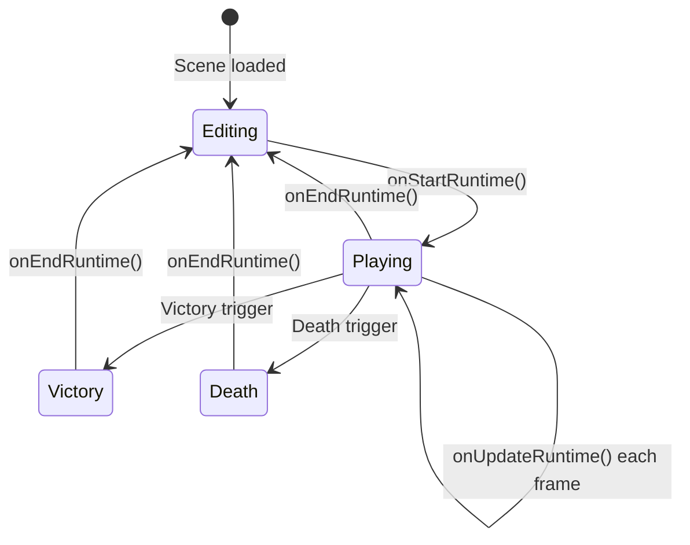
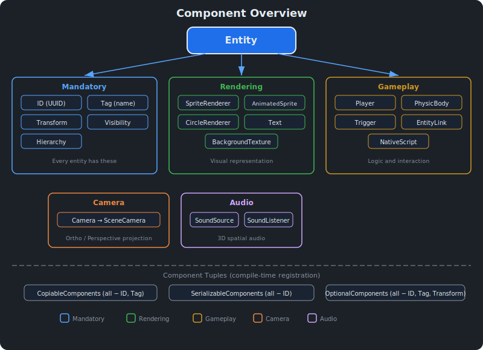

# Scene and Component System {#page-scene}

[TOC]

This page documents the Entity-Component-System (ECS), scene lifecycle, component
reference, and serialization.

## Overview

Owl uses an ECS built on [EnTT](https://github.com/skypjack/entt). A `Scene` owns an
`entt::registry` containing all entities and their components. Entities are lightweight
handles (`Entity` wraps `entt::entity` + `Scene*`). Each entity automatically receives
five mandatory components: `ID`, `Tag`, `Transform`, `Visibility`, and `Hierarchy`.

Scenes are serialized to and from YAML files (`.owl` extension).

## Entity Lifecycle

### Creation

| Method                                    | Description                            |
|-------------------------------------------|----------------------------------------|
| `Scene::createEntity(name)`               | Create entity with auto-generated UUID |
| `Scene::createEntityWithUUID(uuid, name)` | Create with explicit UUID              |

### Destruction

| Method                                     | Behaviour                                                     |
|--------------------------------------------|--------------------------------------------------------------|
| `Scene::destroyEntity(entity)`             | Children reparented to grandparent; world position preserved |
| `Scene::destroyEntityWithChildren(entity)` | Cascade delete of entire subtree                             |

### Component API

| Method                                  | Description                |
|-----------------------------------------|----------------------------|
| `entity.addComponent<T>(args)`          | Attach a new component     |
| `entity.addOrReplaceComponent<T>(args)` | Attach or overwrite        |
| `entity.getComponent<T>()`              | Get reference to component |
| `entity.hasComponent<T>()`              | Check if component exists  |
| `entity.removeComponent<T>()`           | Detach a component         |

### Queries

| Method                   | Returns                             |
|--------------------------|-------------------------------------|
| `getAllEntities()`       | All entities as `vector<Entity>`    |
| `getRootEntities()`      | Entities with `parentId == 0`       |
| `getChildren(entity)`    | Direct children as `vector<Entity>` |
| `findEntityByUUID(uuid)` | Entity matching UUID, or null       |
| `getEntityCount()`       | Total entity count                  |

### Duplication

| Method                     | Behaviour                                                 |
|----------------------------|----------------------------------------------------------|
| `duplicateEntity(entity)`  | Create root copy with new UUID, no children              |
| `duplicateSubtree(entity)` | Recursive duplicate with new UUIDs and correct hierarchy |

## Scene Lifecycle




### Status

| Status    | Description                         |
|-----------|-------------------------------------|
| `Editing` | Editor mode, no simulation          |
| `Playing` | Runtime: physics, scripts, triggers |
| `Victory` | Victory overlay displayed           |
| `Death`   | Death overlay displayed             |

### Lifecycle Methods

| Method                             | When Called        | What It Does                                                                           |
|------------------------------------|--------------------|----------------------------------------------------------------------------------------|
| `onStartRuntime()`                 | Play pressed       | Initialize physics, start sounds with `playOnStart`, reset animated sprites            |
| `onUpdateRuntime(timestep)`        | Each frame (Play)  | Scripts, input, physics, entity links, sounds, animated sprites, triggers, then render |
| `onRenderRuntime()`                | Each frame (Pause) | Render only, no simulation                                                             |
| `onUpdateEditor(timestep, camera)` | Each frame (Edit)  | Render with editor camera                                                              |
| `onEndRuntime()`                   | Stop pressed       | Stop sounds, destroy physics                                                           |
| `onViewportResize(size)`           | Viewport resized   | Resize all cameras                                                                     |

## Component Reference {#components}



### Mandatory Components

These are automatically added to every entity and cannot be removed.

#### ID

| Field | Type   | Description       |
|-------|--------|-------------------|
| `id`  | `UUID` | Unique identifier |

Serialized directly as the entity key in YAML (`Entity: <uuid>`).

#### Tag

| Field | Type     | YAML Key | Description  |
|-------|----------|----------|--------------|
| `tag` | `string` | `Tag`    | Display name |

#### Transform

| Field       | Type              | YAML Key    | Description                         |
|-------------|-------------------|-------------|-------------------------------------|
| `transform` | `math::Transform` | `Transform` | Local position, rotation, and scale |

Stores the **local** transform relative to the parent. World transform is computed
on demand via `Scene::getWorldTransform(entity)`.

#### Visibility

| Field           | Type   | YAML Key     | Serialized | Description                              |
|-----------------|--------|--------------|------------|------------------------------------------|
| `gameVisible`   | `bool` | `Visibility` | Yes        | Rendered during gameplay                 |
| `editorVisible` | `bool` | —            | No         | Rendered in editor (always true on load) |

#### Hierarchy

| Field         | Type           | YAML Key    | Description                        |
|---------------|----------------|-------------|------------------------------------|
| `parentId`    | `UUID`         | `Hierarchy` | Parent UUID (0 = root)             |
| `childrenIds` | `vector<UUID>` | —           | Rebuilt from `parentId` after load |

### Rendering Components

#### SpriteRenderer

| Field          | Type         | Default        | Description        |
|----------------|--------------|----------------|--------------------|
| `color`        | `math::vec4` | `{1, 1, 1, 1}` | Tint colour         |
| `texture`      | `Texture2D`  | `nullptr`      | Sprite texture     |
| `tilingFactor` | `float`      | `1.0`          | Texture repetition |

YAML key: `SpriteRenderer`

#### AnimatedSpriteRenderer

| Field           | Type          | Default | Description                                              |
|-----------------|---------------|---------|----------------------------------------------------------|
| `color`         | `vec4`        | white   | Tint colour                                               |
| `texture`       | `Texture2D`   | null    | Spritesheet                                              |
| `columns`       | `uint32_t`    | `1`     | Grid columns                                             |
| `rows`          | `uint32_t`    | `1`     | Grid rows                                                |
| `firstFrame`    | `uint32_t`    | `0`     | Start frame                                              |
| `lastFrame`     | `uint32_t`    | `0`     | End frame                                                |
| `frameDuration` | `float`       | `0.1`   | Seconds per frame                                        |
| `loop`          | `bool`        | `true`  | Loop animation                                           |
| `speedCurve`    | `math::Curve` | empty   | Optional speed remap sampled by normalized progress      |

YAML key: `AnimatedSpriteRenderer`. When `speedCurve` is empty (default) the field is
omitted from serialized scenes — older `.owl` files round-trip byte-identical. When set,
each frame's `dt` is multiplied by `speedCurve.evaluate(progress)` where `progress` is the
normalized position inside `[firstFrame, lastFrame]`. See
[Renderer > Animated Sprites](renderer.md) for UV computation details.

#### CircleRenderer

| Field       | Type         | Default        | Description          |
|-------------|--------------|----------------|----------------------|
| `color`     | `math::vec4` | `{1, 1, 1, 1}` | Circle colour         |
| `thickness` | `float`      | `1.0`          | Ring thickness (0–1) |
| `fade`      | `float`      | `0.005`        | Edge fade amount     |

YAML key: `CircleRenderer`

#### Text

| Field         | Type     | Default        | Description          |
|---------------|----------|----------------|----------------------|
| `text`        | `string` | `""`           | Text content         |
| `font`        | `Font`   | default font   | MSDF font            |
| `color`       | `vec4`   | `{1, 1, 1, 1}` | Text colour           |
| `kerning`     | `float`  | `0.0`          | Extra letter spacing |
| `lineSpacing` | `float`  | `0.0`          | Extra line spacing   |

YAML key: `TextRenderer`

#### Tilemap

| Field          | Type             | Default      | Description                                                |
|----------------|------------------|--------------|------------------------------------------------------------|
| `tilesetPath`  | `path`           | `""`         | Relative path (project root) to a `.owltileset` asset      |
| `width`        | `uint32`         | `16`         | Grid width in cells                                        |
| `height`       | `uint32`         | `16`         | Grid height in cells                                       |
| `cellSize`     | `float`          | `1.0`        | World-space size of one cell                               |
| `layers`       | `vector<Layer>`  | `[]`         | Ordered back-to-front layers (see below)                   |

Each layer carries its own grid + parallax:

| Layer field    | Type             | Default        | Description                                              |
|----------------|------------------|----------------|----------------------------------------------------------|
| `name`         | `string`         | `""`           | Designer-friendly layer name                             |
| `visible`      | `bool`           | `true`         | Whether the layer is rendered                            |
| `parallax`     | `vec2`           | `{1, 1}`       | Per-axis camera multiplier (1 = world, 0 = camera-locked)|
| `tiles`        | flat `int32` row-major | all `-1` | Per-cell tile index (`-1` = empty), encoded as comma-separated string in YAML |

YAML key: `Tilemap`. The grid is centred on the entity origin (rows extend downward
along Y). Tiles index the asset's atlas in row-major order; collidable tiles
(declared in the tileset) emit one static Box2D fixture per occurrence at
`onStartRuntime`. The tileset is lazily resolved against
`Application::getAssetDirectories()` on first render.

The companion **`Tileset`** asset (`.owltileset`) holds the atlas texture +
`tileWidth`/`tileHeight` + `columns × rows` + sparse per-tile metadata
(`collidable`, `name`). See `scene::Tileset` and the Tile Palette panel for
authoring.

#### BackgroundTexture

| Field      | Type        | Default              | Description                         |
|------------|-------------|----------------------|-------------------------------------|
| `mode`     | `Mode`      | `Background`         | `Background` or `Skybox`            |
| `type`     | `Type`      | `SolidColor`         | `SolidColor`, `Gradient`, `Texture` |
| `color`    | `vec4`      | `{0.2, 0.3, 0.8, 1}` | Main / bottom colour                 |
| `topColor` | `vec4`      | `{0.8, 0.9, 1, 1}`   | Top colour (gradient)                |
| `texture`  | `Texture2D` | `nullptr`            | Background or equirectangular       |

YAML key: `BackgroundTexture`. Only the first entity with this component is rendered.

### Camera Component

| Field              | Type          | Default | Description                 |
|--------------------|---------------|---------|-----------------------------|
| `primary`          | `bool`        | `true`  | Active camera for rendering |
| `fixedAspectRatio` | `bool`        | `false` | Lock aspect ratio           |
| `camera`           | `SceneCamera` | —       | Orthographic or perspective |

YAML key: `Camera`. See [Renderer > Camera System](renderer.md).

### Gameplay Components

#### Player

| Field           | Type    | Default | Description                |
|-----------------|---------|---------|----------------------------|
| `primary`       | `bool`  | `true`  | Active player              |
| `linearImpulse` | `float` | `0.1`   | Horizontal movement force  |
| `jumpImpulse`   | `float` | `0.2`   | Vertical jump force        |
| `canJump`       | `bool`  | `true`  | Whether jumping is allowed |

YAML key: `Player`. Input is parsed from keyboard each frame via `parseInputs()`.

#### PhysicBody

| Field           | Type       | Default   | Description                      |
|-----------------|------------|-----------|----------------------------------|
| `type`          | `BodyType` | `Dynamic` | `Static`, `Dynamic`, `Kinematic` |
| `fixedRotation` | `bool`     | `false`   | Prevent body rotation            |
| `colliderSize`  | `vec3f`    | `{1,1,1}` | Box collider dimensions          |
| `density`       | `float`    | `1.0`     | Material density                 |
| `restitution`   | `float`    | `0.0`     | Bounciness (0–1)                 |
| `friction`      | `float`    | `0.5`     | Surface friction                 |

YAML key: `PhysicBody`. See [Physics](physics.md) for the full physics guide.

#### Trigger

| Field              | Type          | Default   | Description                                                                     |
|--------------------|---------------|-----------|---------------------------------------------------------------------------------|
| `type`             | `TriggerType` | `Victory` | `Victory`, `Death`, `Target`, `Teleport`, `Timer`, `Interaction`, `LuaCallback` |
| `levelName`        | `string`      | `""`      | Target scene (Teleport type)                                                    |
| `targetName`       | `string`      | `""`      | Target entity name (Teleport type)                                              |
| `timerDuration`    | `float`       | `1.0`     | Duration in seconds (Timer type)                                                |
| `timerRepeating`   | `bool`        | `false`   | Whether the timer repeats (Timer type)                                          |
| `interactionRange` | `float`       | `1.5`     | Range multiplier (Interaction type)                                             |
| `callbackName`     | `string`      | `""`      | Custom Lua callback name (empty = type default)                                 |

YAML key: `Trigger`. Overlap-based triggers detect player collision and fire Lua callbacks.
All overlap triggers also dispatch `on_trigger_enter` / `on_trigger_exit` edge events.
See [Lua Scripting > Trigger System](scripting.md) for callback details and examples.

#### EntityLink

| Field              | Type     | Default | Description                  |
|--------------------|----------|---------|------------------------------|
| `linkedEntityName` | `string` | `""`    | Name of the entity to follow |

YAML key: `EntityLink`. The linked entity's world position is copied to this entity
each frame, converting to local space when parented.

#### NativeScript

Enables C++ scripting via `ScriptableEntity`. Use `bind<T>()` to associate a script
class that implements `onCreate()`, `onUpdate(timestep)`, and `onDestroy()`.

YAML key: `NativeScript` (not typically serialized in scenes).

### Audio Components

See [Sound System](sound.md) for the full audio guide.

- **SoundSource** (YAML: `SoundSource`): audio playback with 3D spatial support
- **SoundListener** (YAML: `SoundListener`): marks the entity as the audio "ear"

### Scripting Components

See [Scripting](scripting.md) for the full Lua API reference.

#### LuaScript

| Field        | Type                     | YAML Key    | Description                                    |
|--------------|--------------------------|-------------|------------------------------------------------|
| `scriptPath` | `string`                 | `LuaScript` | Relative path to the `.lua` script file        |
| `properties` | `vector<ScriptProperty>` | —           | Typed property list declared in the Lua script |

Each script instance runs in an isolated `lua_State`. Lifecycle callbacks: `on_create`,
`on_update(dt)`, `on_destroy`. Properties are parsed from the Lua `properties` table and
injected as globals before `on_create`.

### UI Components

UI elements render in screen space via a **Canvas** parent entity. All UI entities must be
children (direct or nested) of an entity with a `Canvas` component.

#### Canvas

| Field | Type | YAML Key | Description                   |
|-------|------|----------|-------------------------------|
| —     | —    | `Canvas` | Marks the entity as a UI root |

#### UiRect

| Field    | Type   | YAML Key | Description                                    |
|----------|--------|----------|------------------------------------------------|
| `anchor` | `vec4` | `UiRect` | Normalized anchor rectangle (min x/y, max x/y) |
| `pivot`  | `vec2` | —        | Normalized pivot point                         |
| `size`   | `vec2` | —        | Size in pixels                                 |
| `offset` | `vec2` | —        | Offset from anchored position                  |

#### UiText

| Field       | Type     | Description       |
|-------------|----------|-------------------|
| `text`      | `string` | Display text      |
| `fontAsset` | `string` | Font file path    |
| `fontSize`  | `float`  | Size in pixels    |
| `color`     | `vec4`   | Text colour (RGBA) |

#### UiImage

| Field        | Type     | Description           |
|--------------|----------|-----------------------|
| `imageAsset` | `string` | Texture file path     |
| `tint`       | `vec4`   | Tint colour multiplier |

#### UiPanel

| Field   | Type   | Description      |
|---------|--------|------------------|
| `color` | `vec4` | Background colour |

#### UiButton

| Field         | Type     | Description              |
|---------------|----------|--------------------------|
| `label`       | `string` | Button text              |
| `normalColor` | `vec4`   | Default background colour |
| `hoverColor`  | `vec4`   | Colour when hovered       |
| `pressColor`  | `vec4`   | Colour when pressed       |
| `action`      | `string` | Lua callback on click    |

#### UiSlider

| Field      | Type    | Description   |
|------------|---------|---------------|
| `value`    | `float` | Current value |
| `minValue` | `float` | Minimum value |
| `maxValue` | `float` | Maximum value |

#### UiProgressBar

| Field             | Type    | Description         |
|-------------------|---------|---------------------|
| `value`           | `float` | Current value (0–1) |
| `backgroundColor` | `vec4`  | Track colour         |
| `fillColor`       | `vec4`  | Fill bar colour      |

### Prefab Components

#### PrefabLink

| Field                  | Type                   | YAML Key     | Description                                     |
|------------------------|------------------------|--------------|-------------------------------------------------|
| `prefabAssetPath`      | `string`               | `PrefabLink` | Relative path to the `.owlprefab` source file   |
| `syncedVersion`        | `uint32_t`             | —            | Prefab version when last synced                 |
| `uuidMapping`          | `vector<UuidMapEntry>` | —            | Instance UUID ↔ canonical UUID pairs            |
| `overriddenComponents` | `vector<string>`       | —            | Per-component override keys preserved on update |

Placed only on the root entity of a prefab instance. Children are tracked via the
`uuidMapping`. See [Editor Prefab Workflow](editor.md) for usage details.

## Transform Hierarchy


Entities support parent-child relationships via the `Hierarchy` component.

### World Transform

Each entity's `Transform` stores a **local** transform. The world transform is computed
by walking the parent chain:

```
worldTransform = parentWorldTransform * localTransform
```

Root entities (`parentId == 0`) have local = world (no overhead).

### Visibility Inheritance

If any ancestor is hidden, the entity is effectively hidden.
`Scene::isEffectivelyVisible()` walks the parent chain to check.

### Hierarchy Operations

| Operation                | Behaviour                                                                        |
|--------------------------|---------------------------------------------------------------------------------|
| **Set parent**           | Circular reference check, local transform recomputed to preserve world position |
| **Unparent**             | Entity becomes root, world transform stored as new local                        |
| **Delete entity**        | Children reparented to grandparent; world position preserved                    |
| **Delete with children** | Cascade delete of entire subtree                                                |
| **Duplicate entity**     | Duplicate is a root entity with no children                                     |
| **Duplicate subtree**    | Recursive duplicate with new UUIDs and correct parent references                |

### Physics and Hierarchy

Physics bodies (Box2D) operate in **world space** independently of the scene hierarchy.
See [Physics > Hierarchy Interaction](physics.md) for details.

## Scene Serialization

`SceneSerializer` handles YAML I/O:

| Method                              | Description                  |
|-------------------------------------|------------------------------|
| `serialize(path)`                   | Write scene to `.owl` file   |
| `deserialize(path)`                 | Read scene from file         |
| `deserializeFromBuffer(data, name)` | Read from memory (pack file) |

### YAML Format

```yaml
Scene: My Scene
Entities:
  - Entity: 12345678
    Tag:
      tag: Platform
    Transform:
      translation: [0, -2, 0]
      rotation: [0, 0, 0]
      scale: [10, 0.5, 1]
    SpriteRenderer:
      color: [0.5, 0.5, 0.5, 1]
      tilingFactor: 1
      texture: nam:platform_texture
    PhysicBody:
      type: Static
      fixedRotation: false
      colliderSize: [1, 1, 1]
      density: 1
      restitution: 0
      friction: 0.5
    Hierarchy:
      parentId: 0
```

Components are serialized in the order defined by `SerializableComponents`. The
`Hierarchy` component only stores `parentId`; children lists are rebuilt after
deserialization via `Scene::rebuildHierarchyChildren()`.

## Teleport System

Cross-scene teleportation uses a `TeleportRequest` on the Scene:

1. Player collides with a Teleport trigger
2. `SceneTrigger::onTriggered()` fills the `TeleportRequest` with `levelName`, `targetName`, and player velocity
3. The editor/runner detects the request and loads the target scene
4. The next frame, the target scene starts runtime and applies the initial velocity to the player at the target entity position

The `levelName` field accepts `test_level`, `test_level.owl`, or `scenes/test_level.owl` —
the engine auto-appends `.owl` and searches asset directories including a `scenes/` subdirectory.

## Render Pipeline

`Scene::render()` iterates component groups in this order:

1. **BackgroundTexture** — first entity only
2. **SpriteRenderer** — `drawQuad()` with texture/colour/tiling
3. **AnimatedSpriteRenderer** — `drawQuad()` with computed UV coordinates
4. **CircleRenderer** — `drawCircle()` with thickness/fade
5. **Text** — `drawString()` with font/colour/kerning

Each entity is checked for visibility via `isEffectivelyVisible()` and rendered
using its world transform from `getWorldTransform()`.
