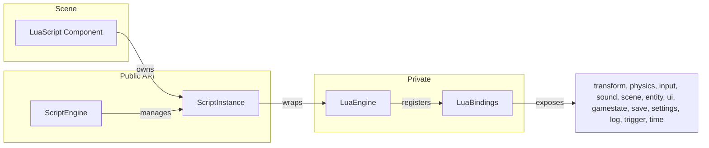

# Lua Scripting {#page-scripting}

[TOC]

This page describes the Owl Lua scripting system: how to attach scripts to entities,
write Lua callbacks, use the engine API from Lua, and manage script properties.

## Overview

Owl embeds Lua 5.5 as its gameplay scripting language. Scripts are attached to entities
via the `LuaScript` component, which provides lifecycle callbacks (`on_create`,
`on_update`, `on_destroy`, `on_collision`) and a property system for exposing
configurable values in the editor inspector.

Each script instance runs in an **isolated Lua state** — global variables in one
script do not affect other scripts. The Lua environment is **sandboxed**: the `io`,
`os`, `dofile`, and `loadfile` standard functions are removed for security.

## Architecture

| Class            | Role                                                                  |
|------------------|-----------------------------------------------------------------------|
| `ScriptEngine`   | Singleton manager: init/shutdown, script loading, property extraction |
| `ScriptInstance` | Per-entity isolated Lua state with lifecycle callbacks                |
| `LuaEngine`      | Private low-level wrapper around `lua_State*` (not public)            |
| `LuaBindings`    | Registers engine API tables into Lua states (not public)              |
| `LuaScript`      | Scene component: `scriptPath`, `properties`, runtime `instance`       |

`ScriptEngine` and `ScriptInstance` are the public API (`source/owl/public/script/`).
`LuaEngine` and `LuaBindings` are engine-private (`source/owl/private/script/`).



## Adding a Script to an Entity

1. Create a `.lua` file in your project's asset directory (e.g. `scripts/player.lua`)
2. In Owl Nest, select an entity and click **Add Component > Lua Script**
3. Set the **Script Path** field to the relative path (e.g. `scripts/player.lua`)
4. Click **Refresh Properties** to detect exposed properties from the script
5. Edit property values in the inspector — they are saved with the scene

The resulting scene YAML looks like:

```yaml
LuaScript:
  scriptPath: "scripts/player.lua"
  properties:
    - name: "speed"
      type: "float"
      value: 5.0
    - name: "jumpForce"
      type: "float"
      value: 12.0
```

## Writing a Lua Script

### Basic Structure

```lua
-- Exposed properties (parsed by the editor)
properties = {
    { name = "speed",     type = "float",  default = 5.0 },
    { name = "jumpForce", type = "float",  default = 12.0 },
    { name = "label",     type = "string", default = "Player" },
    { name = "active",    type = "bool",   default = true },
}

-- Called once when the scene enters Play mode
function on_create()
    log.info("Entity " .. entity_id .. " created!")
end

-- Called every frame during Play mode
function on_update(dt)
    if input.is_key_pressed(87) then  -- W key
        local x, y, z = transform.get_position(entity_id)
        transform.set_position(entity_id, x, y + speed * dt, z)
    end
end

-- Called when the scene exits Play mode
function on_destroy()
    log.info("Entity destroyed")
end

-- Called when a collision is detected (future feature)
function on_collision(other_entity_id)
    log.info("Collided with " .. other_entity_id)
end
```

### Lifecycle Callbacks

| Callback                 | When                                   | Arguments                  |
|--------------------------|----------------------------------------|----------------------------|
| `on_create()`            | Scene enters Play mode                 | None                       |
| `on_update(dt)`          | Every frame during Play mode           | `dt`: delta time (seconds) |
| `on_destroy()`           | Scene exits Play mode                  | None                       |
| `on_collision(other_id)` | Collision detected with another entity | `other_id`: UUID           |

All callbacks are optional — missing callbacks are silently skipped.

### The `entity_id` Global

Every script instance has a global `entity_id` variable automatically set to the
owning entity's UUID. Use this to call engine API functions that require an entity
identifier.

### Properties Table

The `properties` table at the top level of a script declares configurable values.
Each entry must have:

| Field     | Type   | Description                                     |
|-----------|--------|-------------------------------------------------|
| `name`    | string | Property name (used as the Lua global variable) |
| `type`    | string | `"float"`, `"int"`, `"string"`, or `"bool"`     |
| `default` | any    | Default value matching the declared type        |

The editor reads this table to populate the inspector. When the scene enters Play mode,
the engine sets each property as a Lua global with the value configured in the inspector
(overriding the `default`).

## Engine API Reference

The following Lua tables are available in every script.

### `transform`

| Function                                        | Description                         |
|-------------------------------------------------|-------------------------------------|
| `transform.get_position(entity_id)`             | Returns `x, y, z` (local transform) |
| `transform.set_position(entity_id, x, y, z)`    | Set local position                  |
| `transform.get_rotation(entity_id)`             | Returns `rx, ry, rz` (radians)      |
| `transform.set_rotation(entity_id, rx, ry, rz)` | Set local rotation                  |
| `transform.get_scale(entity_id)`                | Returns `sx, sy, sz`                |
| `transform.set_scale(entity_id, sx, sy, sz)`    | Set local scale                     |

### `physics`

| Function                                       | Description                                    |
|------------------------------------------------|------------------------------------------------|
| `physics.impulse(entity_id, fx, fy)`           | Apply an impulse force                         |
| `physics.get_velocity(entity_id)`              | Returns `vx, vy`                               |
| `physics.set_velocity(entity_id, vx, vy)`      | Set linear velocity                            |
| `physics.set_transform(entity_id, x, y, rot)`  | Set body position and rotation                 |
| `physics.set_gravity_scale(entity_id, scale)`  | Scale world gravity for this body (0 = none)   |

### `input`

| Function                                | Description                          |
|-----------------------------------------|--------------------------------------|
| `input.is_key_pressed(keycode)`         | Returns `true` if the key is pressed |
| `input.is_mouse_button_pressed(button)` | Returns `true` if button is pressed  |
| `input.get_mouse_x()`                   | Returns mouse X position             |
| `input.get_mouse_y()`                   | Returns mouse Y position             |

Key codes match the GLFW key constants (e.g. `65` = A, `87` = W, `32` = Space).

### `sound`

| Function                        | Description                    |
|---------------------------------|--------------------------------|
| `sound.play(asset_path)`        | Play a sound, returns a handle |
| `sound.stop(handle)`            | Stop a playing sound           |
| `sound.pause(handle)`           | Pause a playing sound          |
| `sound.resume(handle)`          | Resume a paused sound          |
| `sound.set_volume(handle, vol)` | Set volume (0.0 to 2.0)        |

### `scene`

| Function                          | Description                                       |
|-----------------------------------|---------------------------------------------------|
| `scene.find_entity(name)`         | Find entity by name, returns UUID (0 = not found) |
| `scene.create_entity(name)`       | Create a new entity, returns UUID                 |
| `scene.destroy_entity(entity_id)` | Destroy an entity                                 |

### `entity`

| Function                                     | Description                   |
|----------------------------------------------|-------------------------------|
| `entity.has_component(entity_id, comp_name)` | Check for a component by name |
| `entity.get_name(entity_id)`                 | Get the entity's Tag name     |

Supported component names for `has_component`: `"Transform"`, `"PhysicBody"`,
`"SpriteRenderer"`, `"Camera"`, `"Text"`, `"SoundSource"`.

### `time`

| Function       | Description                          |
|----------------|--------------------------------------|
| `time.delta()` | Returns the current frame delta time |

### `log`

| Function         | Description          |
|------------------|----------------------|
| `log.trace(msg)` | Log at trace level   |
| `log.info(msg)`  | Log at info level    |
| `log.warn(msg)`  | Log at warning level |
| `log.error(msg)` | Log at error level   |

### `ui`

| Function                                 | Description                          |
|------------------------------------------|--------------------------------------|
| `ui.set_text(entity_id, text)`           | Set UIText content                   |
| `ui.get_text(entity_id)`                 | Get UIText content                   |
| `ui.set_visible(entity_id, bool)`        | Set entity game visibility           |
| `ui.set_progress(entity_id, value)`      | Set UIProgressBar value (0..1)       |
| `ui.get_slider_value(entity_id)`         | Get UISlider value                   |
| `ui.set_slider_value(entity_id, value)`  | Set UISlider value                   |
| `ui.set_button_enabled(entity_id, bool)` | Enable/disable a UIButton            |
| `ui.transition_fade_in(duration)`        | Start fade-in transition (seconds)   |
| `ui.transition_fade_out(duration)`       | Start fade-out transition (seconds)  |
| `ui.is_transition_active()`              | Check if a transition is in progress |

### `gamestate`

| Function                      | Description                                        |
|-------------------------------|----------------------------------------------------|
| `gamestate.set(key, value)`   | Store a value (auto-detects int/float/string/bool) |
| `gamestate.get(key)`          | Get value or nil if missing                        |
| `gamestate.get(key, default)` | Get value or default if missing                    |
| `gamestate.remove(key)`       | Remove a key                                       |
| `gamestate.clear()`           | Remove all entries                                 |

The game state persists across scene transitions and is included in save files.

### `save`

| Function                 | Description                                 |
|--------------------------|---------------------------------------------|
| `save.save_game(slot)`   | Save scene + game state to slot             |
| `save.load_game(slot)`   | Load a save (deferred to next frame)        |
| `save.has_save(slot)`    | Check if a save exists                      |
| `save.delete_save(slot)` | Delete a save file                          |
| `save.list_saves()`      | Returns table of `{slot, timestamp, scene}` |

Save files are stored in the user directory (`~/.local/share/<game>/saves/` on Linux,
`%APPDATA%/<game>/saves/` on Windows) as YAML `.owl_save` files.

### `settings`

Persistent game settings with a two-layer system: game defaults (`game_settings.yml` in
project assets) overlaid with user overrides (`settings.yml` in user directory).

| Function                   | Description                                       |
|----------------------------|---------------------------------------------------|
| `settings.get(key)`        | Get a setting (override > default > nil)          |
| `settings.get(key, def)`   | Get a setting with a fallback value               |
| `settings.set(key, value)` | Set a user override (int, float, string, or bool) |
| `settings.save()`          | Save user overrides to `settings.yml`             |
| `settings.load()`          | Reload user overrides from `settings.yml`         |
| `settings.reset(key)`      | Remove a user override (revert to default)        |
| `settings.reset_all()`     | Remove all user overrides                         |
| `settings.apply()`         | Apply built-in settings to window and sound       |

**Built-in keys** (auto-applied by `settings.apply()`):

| Key                 | Type  | Description                |
|---------------------|-------|----------------------------|
| `resolution_width`  | int   | Window width in pixels     |
| `resolution_height` | int   | Window height in pixels    |
| `fullscreen`        | bool  | Fullscreen mode            |
| `resizable`         | bool  | Window resizable           |
| `volume_master`     | float | Master volume (0.0–1.0)    |
| `volume_music`      | float | Music volume (for scripts) |
| `volume_sfx`        | float | SFX volume (for scripts)   |

Custom game-specific keys (e.g., `player_speed`, `player_jump_impulse`) can be defined in
`game_settings.yml` and read from Lua the same way.

**Game defaults file** (`game_settings.yml` in project assets):

```yaml
GameSettings:
  - key: player_speed
    type: float
    value: 8.0
  - key: volume_master
    type: float
    value: 1.0
```

**User overrides** are saved to `~/.local/share/<game>/settings.yml` (Linux) or
`%APPDATA%/<game>/settings.yml` (Windows).

### `trigger`

Control trigger entities from Lua.

| Function                   | Description                   |
|----------------------------|-------------------------------|
| `trigger.start_timer(eid)` | Start/restart a Timer trigger |
| `trigger.stop_timer(eid)`  | Stop a Timer trigger          |
| `trigger.reset_timer(eid)` | Reset elapsed time to 0       |

## Trigger System

Triggers are entities with a `Trigger` component. They detect overlap with the player
and fire events. The engine provides 7 trigger types:

| Type            | Behavior                                                        |
|-----------------|-----------------------------------------------------------------|
| **Victory**     | Sets scene status to Victory (game won)                         |
| **Death**       | Sets scene status to Death (game over)                          |
| **Target**      | Passive position marker (no action on overlap)                  |
| **Teleport**    | Teleports the player to a target entity, optionally cross-level |
| **Timer**       | Fires a Lua callback after a configurable duration              |
| **Interaction** | Fires a Lua callback when the player presses E in range         |
| **LuaCallback** | Fires a Lua callback every frame while overlapping              |

### Trigger Callbacks

All overlap-based triggers (except Victory, Death, Target) fire edge events:

```lua
-- Called once when the player enters the trigger volume
function on_trigger_enter(other_id)
    log.info("Player entered!")
end

-- Called once when the player exits the trigger volume
function on_trigger_exit(other_id)
    log.info("Player left!")
end
```

Each type also has a primary callback. The callback name is configurable in the
inspector (the **Callback** field); if left empty, the default name is used:

| Type            | Default Callback | When it fires                         |
|-----------------|------------------|---------------------------------------|
| **Timer**       | `on_timer`       | When the timer duration expires       |
| **Interaction** | `on_interact`    | When the player presses E in range    |
| **LuaCallback** | `on_triggered`   | Every frame while the player overlaps |

### Timer Example

```lua
-- Attach this script to an entity with a Timer trigger (2s, repeating).
local count = 0

function on_timer()
    count = count + 1
    log.info("Timer fired! Count: " .. count)
end
```

### Interaction Example

```lua
-- Attach this script to an entity with an Interaction trigger.
function on_interact()
    log.info("Player interacted with this object!")
    -- Open a door, pick up an item, start dialogue, etc.
end

function on_trigger_enter()
    log.info("Press E to interact")
end
```

## Screen Transitions

Use `ui.transition_fade_out()` and `ui.transition_fade_in()` to create smooth
transitions between scenes. The transitions render a full-screen black overlay
with animated alpha.

```lua
function on_start_clicked()
    ui.transition_fade_out(0.5)  -- fade to black over 0.5 seconds
end

function on_update(dt)
    -- After fade completes, load next scene
    if not ui.is_transition_active() and fading then
        scene.load_scene("game_level_1")
    end
end
```

## Scene Templates

The engine includes template scenes in `engine_assets/templates/` that provide
starting points for common game screens:

| Template         | Description                                     |
|------------------|-------------------------------------------------|
| `main_menu.owl`  | Title text, Start and Quit buttons              |
| `pause_menu.owl` | Semi-transparent panel, Resume and Quit buttons |
| `game_over.owl`  | Game Over text, Retry and Main Menu buttons     |

Copy a template into your project's assets and customize the text, colors, and
Lua callbacks to match your game.

## Scene Lifecycle Integration

### onStartRuntime

1. `ScriptEngine::init(scene)` creates the shared engine state
2. For each entity with a `LuaScript` component:
   - Creates a `ScriptInstance` (isolated Lua state)
   - Loads the script from file or `.owlpack`
   - Applies property values from the component to the Lua globals
   - Calls `on_create()`

### onUpdateRuntime (each frame)

- For each `LuaScript` with a valid instance, calls `on_update(dt)`

### onEndRuntime

- For each `LuaScript` with a valid instance, calls `on_destroy()`
- Resets all instances and calls `ScriptEngine::shutdown()`

## Sandboxing

The Lua environment is restricted for security:

| Available                                          | Removed             |
|----------------------------------------------------|---------------------|
| `base` (print, type, pairs, ipairs, tostring, ...) | `io` (file access)  |
| `table` (insert, remove, sort, ...)                | `os` (system calls) |
| `string` (format, find, sub, ...)                  | `dofile`            |
| `math` (sin, cos, sqrt, random, ...)               | `loadfile`          |
| `utf8`                                             |                     |
| `coroutine`                                        |                     |

Scripts cannot access the filesystem, execute system commands, or load external Lua files.

## Asset Packing

Lua scripts referenced by `LuaScript` components are automatically discovered by the
`AssetScanner` during game export (**Project > Pack Game** in Owl Nest).

The scanner parses scene YAML files, reads the `LuaScript.scriptPath` field, and
resolves the file path through the project's asset directories. Discovered scripts are
included in the `.owlpack` binary archive with `AssetType::Script`.

At runtime, the game runner loads scripts transparently from the pack file, falling
back to the filesystem if not found in the pack.

## Example: Moving Platform

```lua
properties = {
    { name = "speed",    type = "float", default = 2.0 },
    { name = "distance", type = "float", default = 5.0 },
}

local startY = 0
local direction = 1

function on_create()
    local x, y, z = transform.get_position(entity_id)
    startY = y
end

function on_update(dt)
    local x, y, z = transform.get_position(entity_id)
    y = y + speed * direction * dt
    if y > startY + distance then direction = -1 end
    if y < startY then direction = 1 end
    transform.set_position(entity_id, x, y, z)
end
```

## Example: Collectible Item

```lua
properties = {
    { name = "points", type = "int", default = 10 },
}

function on_collision(other_id)
    local name = entity.get_name(other_id)
    if name == "Player" then
        log.info("Collected! +" .. points .. " points")
        scene.destroy_entity(entity_id)
    end
end
```
