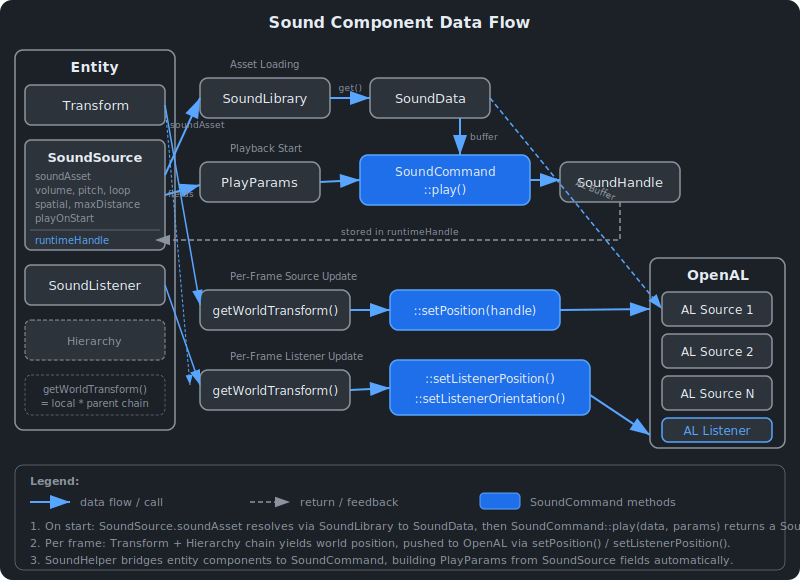

# Sound System {#page-sound}

[TOC]

This page describes the Owl sound system: how to add audio to scenes, configure
spatial sound, and trigger sounds from gameplay code.

## Overview

Owl provides a component-based sound system with 3D spatial audio, built on an
abstract backend layer (OpenAL or Null). Audio files are loaded into memory as
`SoundData` buffers, and playback is controlled through opaque `SoundHandle` values.

**Supported formats:** `.wav`, `.ogg` (Vorbis), `.flac`, `.mp3`


## Architecture

The sound system follows the same backend abstraction pattern as the renderer and
input modules (see [Architecture](@ref page-architecture)):

| Class          | Role                                                     |
|----------------|----------------------------------------------------------|
| `SoundSystem`  | Lifecycle (init / shutdown / reset), owns `SoundLibrary` |
| `SoundCommand` | Static facade: delegates to the active `SoundAPI`        |
| `SoundAPI`     | Abstract interface implemented by each backend           |
| `SoundData`    | Loaded audio buffer (PCM data in OpenAL buffer object)   |
| `SoundHandle`  | Opaque `uint64_t` handle to an active playback source    |
| `PlayParams`   | Parameters struct: volume, pitch, loop, spatial, etc.    |
| `SoundHelper`  | Gameplay convenience: play/stop an entity's sound        |

## Adding Sounds to a Scene

1. Place audio files in your project's asset directory (e.g. `sounds/explosion.wav`)
2. In Owl Nest, select an entity (or create a new one)
3. Click **Add Component** and choose **Sound Source**
4. Set the `Sound Asset` field to the relative path (e.g. `sounds/explosion.wav`)
5. Configure volume, pitch, loop, and other properties as needed
6. For spatial audio, also add a **Sound Listener** component to the camera or player entity

The resulting scene YAML looks like:

```yaml
SoundSource:
  soundAsset: "sounds/explosion.wav"
  category: "SFX"
  volume: 1.0
  pitch: 1.0
  loop: false
  spatial: true
  playOnStart: false
  maxDistance: 50.0
  rolloff: 1.0
```

## SoundSource Component

The `SoundSource` component wraps a `SceneSound` data class with the following fields:

| Field       | Type     | Default | Description                                       |
|-------------|----------|---------|---------------------------------------------------|
| soundAsset  | string   | `""`    | Relative path to the audio file in assets         |
| category    | Category | SFX     | `SFX`, `Music`, or `Ambient`                      |
| volume      | float    | 1.0     | Gain factor (0 = silent, 1 = normal, >1 = louder) |
| pitch       | float    | 1.0     | Pitch multiplier (0.1 to 3.0 in editor)           |
| loop        | bool     | false   | Whether to loop playback                          |
| spatial     | bool     | false   | Enable 3D positional audio                        |
| playOnStart | bool     | false   | Auto-play when the scene enters Play mode         |
| maxDistance | float    | 50.0    | Maximum audible distance (spatial only)           |
| rolloff     | float    | 1.0     | Distance attenuation factor (spatial only)        |

The `runtimeHandle` field is internal (not serialized) and holds the active `SoundHandle`
during playback.

## SoundListener Component

The `SoundListener` component marks an entity as the "ear" for spatial audio.

| Field   | Type | Default | Description                         |
|---------|------|---------|-------------------------------------|
| primary | bool | true    | Whether this is the active listener |

Only one primary listener should be active at a time. Attach it to the camera or
player entity. Each frame during runtime, the listener's position and orientation
are derived from the entity's world transform.

## Sound Categories

Categories help organize sounds by their typical use case. The category field is
stored for future per-category volume mixing but does not currently affect playback
behavior.

| Category | Typical Use                | Typical Settings                                  |
|----------|----------------------------|---------------------------------------------------|
| SFX      | Gunshots, footsteps, UI    | `spatial=true`, `loop=false`, `playOnStart=false` |
| Music    | Background music           | `spatial=false`, `loop=true`, `playOnStart=true`  |
| Ambient  | Wind, rain, fire crackling | `spatial=true/false`, `loop=true`                 |

**Tip:** Background music is simply a `SoundSource` with `loop=true` and `spatial=false`.
There is no separate music subsystem.

## Spatial Audio

When `spatial=true`, the OpenAL backend positions the sound source in 3D space using
the **inverse distance clamped** attenuation model:

```
gain = referenceDistance / (referenceDistance + rolloff * (distance - referenceDistance))
```

Where `referenceDistance = 1.0` and `distance` is clamped to `[0, maxDistance]`.

- **Source position** is the entity's world transform, updated every frame
- **Listener position and orientation** come from the primary `SoundListener` entity
- For 2D games, the listener's forward direction is derived from the Z-axis rotation
- **Stereo audio files** are NOT spatialized by OpenAL (only mono sources are positioned in 3D)



## Gameplay Triggers (SoundHelper)

For one-shot sounds triggered by gameplay code (e.g. from a `NativeScript`), use
the `SoundHelper` utility:

```cpp
#include <sound/SoundHelper.h>

// Play the sound configured on the entity's SoundSource component:
auto handle = owl::sound::SoundHelper::playEntitySound(entity);

// Stop it later:
owl::sound::SoundHelper::stopEntitySound(entity);
```

`SoundHelper` reads the entity's `SoundSource` fields, loads the sound data from the
`SoundLibrary`, and calls `SoundCommand::play()` with the appropriate parameters.

For more control, use `SoundCommand` directly:

```cpp
#include <sound/SoundCommand.h>
#include <sound/SoundSystem.h>

auto& library = owl::sound::SoundSystem::getSoundLibrary();
auto data = library.get("sounds/explosion.wav");

owl::sound::PlayParams params;
params.volume = 0.8f;
params.spatial = true;
params.position = {10.0f, 5.0f, 0.0f};

auto handle = owl::sound::SoundCommand::play(data, params);

// Later: adjust properties
owl::sound::SoundCommand::setVolume(handle, 0.5f);
owl::sound::SoundCommand::setPitch(handle, 1.2f);

// Stop when done
owl::sound::SoundCommand::stop(handle);
```

## Scene Lifecycle Integration


The sound system hooks into the three scene lifecycle methods:

### onStartRuntime

- Finds the primary `SoundListener` entity and sets the OpenAL listener position/orientation
  from its world transform
- Iterates all `SoundSource` components with `playOnStart=true`, loads their sound data
  from the `SoundLibrary`, and starts playback with `SoundCommand::play()`

### onUpdateRuntime (each frame)

- Updates the listener position/orientation from the primary `SoundListener` entity
- For each spatial `SoundSource` with an active handle, syncs the 3D position from the
  entity's world transform via `SoundCommand::setPosition()`

### onEndRuntime

- Stops all active sounds via `SoundCommand::stop()` and resets all `runtimeHandle` fields

## Supported Formats

| Format | Extension | Notes                                         |
|--------|-----------|-----------------------------------------------|
| WAV    | `.wav`    | Uncompressed PCM, universally supported       |
| Ogg    | `.ogg`    | Vorbis compressed, good quality-to-size ratio |
| FLAC   | `.flac`   | Lossless compressed, larger than Ogg          |
| MP3    | `.mp3`    | Lossy compressed, widely available            |

Audio loading is handled by **libsndfile**, which also supports additional sub-formats
(IMA ADPCM, MS ADPCM, ALAC, Opus) through the WAV container. The OpenAL backend
automatically detects the format and configures the appropriate buffer type.

## Asset Packing

Sound files referenced by `SoundSource` components are automatically discovered by
the `AssetScanner` during game export (**Project > Pack Game** in Owl Nest).

The scanner parses scene YAML files, reads the `SoundSource.soundAsset` field, and
resolves the file path through the project's asset directories. Discovered sound
assets are included in the `.owlpack` binary archive alongside textures, fonts,
and scene files.

At runtime, the game runner loads sound assets transparently from the pack file.

See [Architecture](@ref page-architecture) for more details on the asset packing pipeline.
