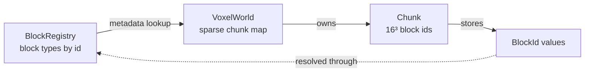
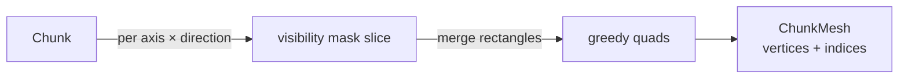

# Voxel Engine {#page-voxel}

[TOC]

The voxel engine (introduced in v0.2.1) is a block-based world subsystem in the `owl::data::voxel` module. This page
documents the **data model** — block types, chunks, and the world store. Meshing, the 3D voxel renderer, terrain
generation, block interaction, and the in-editor authoring tools are layered on top of this foundation in later
v0.2.1 work and are documented as they land.

## Overview

The data model is deliberately split into three concerns, none of which knows about the GPU:



| Type            | Responsibility                                                              |
|-----------------|-----------------------------------------------------------------------------|
| `BlockRegistry` | Ordered table of block types addressed by `BlockId`; resolves metadata.     |
| `Chunk`         | A fixed `16³` cube of `BlockId` values with dirty tracking.                 |
| `VoxelWorld`    | A sparse, unbounded map of chunks keyed by chunk coordinate.                |

A chunk stores only bare `BlockId` values; everything else (textures, opacity, collision) is looked up in the shared
`BlockRegistry`. This keeps chunk storage compact and lets the same world be re-skinned by swapping registries.

## Block Types and the Registry

A `BlockType` is pure authoring data: a name, a render kind, a collision flag, and one atlas tile index per face.

```c++
data::voxel::BlockRegistry registry;

data::voxel::BlockType stone;
stone.name = "stone";
stone.renderKind = data::voxel::BlockRenderKind::Opaque;
stone.solid = true;
stone.setAllFaces(3);// atlas tile index 3 on all six faces
const data::voxel::BlockId stoneId = registry.registerBlock(stone);

const bool opaque = registry.isOpaque(stoneId);// true
const auto maybe = registry.findByName("stone");// std::optional<BlockId>
```

The six faces follow a fixed order, used by per-face texture arrays and (later) by the mesher:

| `BlockFace` | Outward normal | Direction |
|-------------|----------------|-----------|
| `XNeg`      | -X             | west      |
| `XPos`      | +X             | east      |
| `YNeg`      | -Y             | down      |
| `YPos`      | +Y             | up        |
| `ZNeg`      | -Z             | north     |
| `ZPos`      | +Z             | south     |

The render kind drives face culling and (later) which mesh pass a block lands in:

| `BlockRenderKind` | Meaning                                                        |
|-------------------|----------------------------------------------------------------|
| `Air`             | Empty space (id `0`): never meshed, never culls a neighbour.   |
| `Opaque`          | Fully opaque: culls the shared face of an adjacent block.      |
| `Transparent`     | Alpha-blended (leaves, glass): does not cull opaque neighbours.|
| `Water`           | Translucent volume rendered with its own sorting rules.        |

Block id `0` is always the built-in air block (`data::voxel::g_AirBlock`); it is implicit and never written to disk.

### Serialization

`BlockRegistry::serializeToString` / `deserializeFromString` round-trip the table as YAML. Air is implicit:

```yaml
BlockRegistry: overworld
Version: 1
Blocks:
  - id: 1
    name: stone
    render: Opaque
    solid: true
    faces: [3, 3, 3, 3, 3, 3]
  - id: 2
    name: water
    render: Water
    solid: false
    faces: [9, 9, 9, 9, 9, 9]
```

## Chunks

A `Chunk` is a `16³` (`data::voxel::g_ChunkSize` cubed) grid of `BlockId` values laid out Y-major then Z then X, so
iterating X walks contiguous memory. Local coordinates are in `[0, 16)`; out-of-range reads return air and
out-of-range writes are ignored.

```c++
data::voxel::Chunk chunk{math::vec3i{0, 0, 0}};
chunk.setBlock(1, 2, 3, stoneId);// marks the chunk dirty
const data::voxel::BlockId id = chunk.getBlock(1, 2, 3);
const bool dirty = chunk.isDirty();// true until markClean()
```

Writes set a `dirty` flag only when the stored value actually changes — the mesher and persistence layers use it to
re-mesh or re-save just the chunks that moved. `Chunk::encode` / `decode` run-length encode the block data to a
compact string (`"<count>x<id>"` runs) for storage.

## The World

`VoxelWorld` is a sparse hash map of chunks keyed by chunk coordinate. Reads of an absent chunk return air without
allocating; writes create the containing chunk on demand.

```c++
data::voxel::VoxelWorld world;
world.setBlock(math::vec3i{40, 12, -5}, stoneId);// creates chunk (2, 0, -1)
const data::voxel::BlockId id = world.getBlock(math::vec3i{40, 12, -5});
```

World block coordinates map to chunk coordinates with **floored** division so negative coordinates tile correctly:

| World coordinate | Chunk coordinate | Local coordinate |
|------------------|------------------|------------------|
| `16`             | `1`              | `0`              |
| `-1`             | `-1`             | `15`             |
| `-16`            | `-1`             | `0`              |
| `-17`            | `-2`             | `15`             |

Use `data::voxel::worldToChunk` / `data::voxel::worldToLocal` for the conversions, and `VoxelWorld::forEachChunk` /
`chunkCoordinates` to enumerate resident chunks.

## Chunk Meshing

`ChunkMesher` turns a `Chunk` into a `ChunkMesh` — an indexed list of `VoxelVertex` (position, normal, tile-space
UV, atlas texture index) in chunk-local block space. It is **CPU-only**: uploading to a GPU buffer and placing the
chunk in the world (a model transform) are the renderer's job.

```c++
const data::voxel::ChunkMesh mesh = data::voxel::ChunkMesher::mesh(chunk, registry, neighborProvider);
```

Two techniques keep the geometry small:

- **Hidden-face culling** — a face is emitted only when it is *visible*: the neighbour across it is non-opaque
  **and** a different block. Interior faces, shared faces between identical blocks, and faces hidden by an opaque
  neighbour are skipped. Faces on the chunk border are culled against the adjacent chunk through the
  `NeighborProvider` callback (the isolated overload treats everything outside the chunk as air).
- **Greedy meshing** — coplanar visible faces of the same block type merge into the largest possible rectangle, so
  a solid 16³ chunk collapses to **6 quads** (one per outer face) instead of thousands. Merged quads carry tiled
  UVs (`(0,0)`..`(w,h)`) so the per-face texture repeats across the rectangle.



## Rendering and the Scene Component

A voxel world reaches the screen through two pieces:

- **`scene::component::VoxelWorld`** — the authored object placed on an entity: it holds the `BlockRegistry`, the
  `VoxelWorld` chunks, the per-block texture paths, and the directional-light settings, all serialized inline in the
  `.owl` scene (block list + run-length-encoded chunks). It is fully inspectable/editable in Owl Nest.
- **`RendererVoxel`** — a render-stack layer (factory key `"RendererVoxel"`) built on [Renderer3D](renderer.md). It
  greedy-meshes each chunk, caches the GPU mesh per entity (rebuilt only when the chunk is dirty), resolves the
  per-block textures (Nearest filtering), and draws them with the frac-tiled `voxel` shader so greedy-merged faces
  tile rather than stretch. The entity must carry a `RendererTag` routing it to the voxel layer; `Scene::render`
  only draws voxel worlds when the active layer is voxel-capable (mirroring the raycast path).

The sample project ships a `voxel_terrain.owl` scene — an endless seeded procedural landscape (see *Procedural
Terrain* below), textured from the dedicated `voxel_blocks` tileset (16 block faces: grass, dirt, stone, sand, wood,
leaves, … with room for future block types) — under a perspective camera, reachable from a **Voxel House** on the
world map. Voxels render in both **Play** and the **editor viewport** (the world streams around the editor camera too).

To explore the world in Play, add a `scene::component::FlyCamera` to the perspective-camera entity (the demo does
this): the scene drives the entity transform from a reusable `renderer::Camera3DController` each runtime frame —
**WASD** moves in the facing plane, **Space / E** rises, **Left-Shift / Q** descends and the **arrow keys** look
around. The move / look speeds are editable in the inspector. The same controller is designed to back the editor
viewport once the 3D editor camera overhaul lands.

## Procedural Terrain

A `VoxelWorld` can generate its blocks instead of storing them: tick **Procedural Terrain** in the inspector (or set
`ProceduralTerrain: true` in the scene) and the world is filled from a seed. `data::voxel::TerrainGenerator` builds a
2D fractal-Perlin (`math::PerlinNoise`) height field — stone with a dirt sub-layer and a grass surface, sand along the
shoreline, optional water up to a sea level — and carves caves from a 3D Perlin field; the same seed always yields the
same world. An optional low-frequency **biome** field varies the surface block (desert sand, grassy plains, snowy,
rocky mountain tops). `Scene::updateVoxelStreaming` loads chunks in and unloads them out around the camera within the
configurable radius/height; generation runs **asynchronously on the task `Scheduler`** (workers fill chunks, the main
thread installs the finished ones), and `RendererVoxel` drops the meshes of unloaded chunks. All parameters (seed,
frequency, octaves, amplitude, sea level, cave threshold, biomes, block ids, …) are editable in the inspector with a
**Regenerate** button. The `scenes/voxel_terrain.owl` demo is an endless seeded landscape you fly through, reachable
from the world-map voxel house.

## What's Next

Block interaction (raycast pick, place/destroy, Lua API),
rendering polish (ambient occlusion, transparent/water passes), and the in-editor voxel authoring tools (brush,
palette, chunk inspector).
