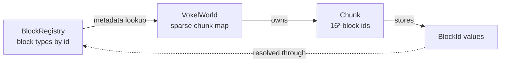
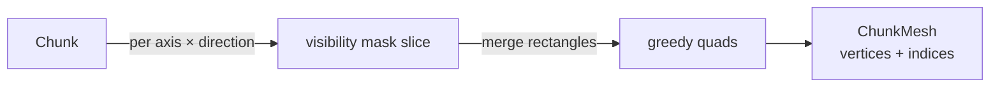
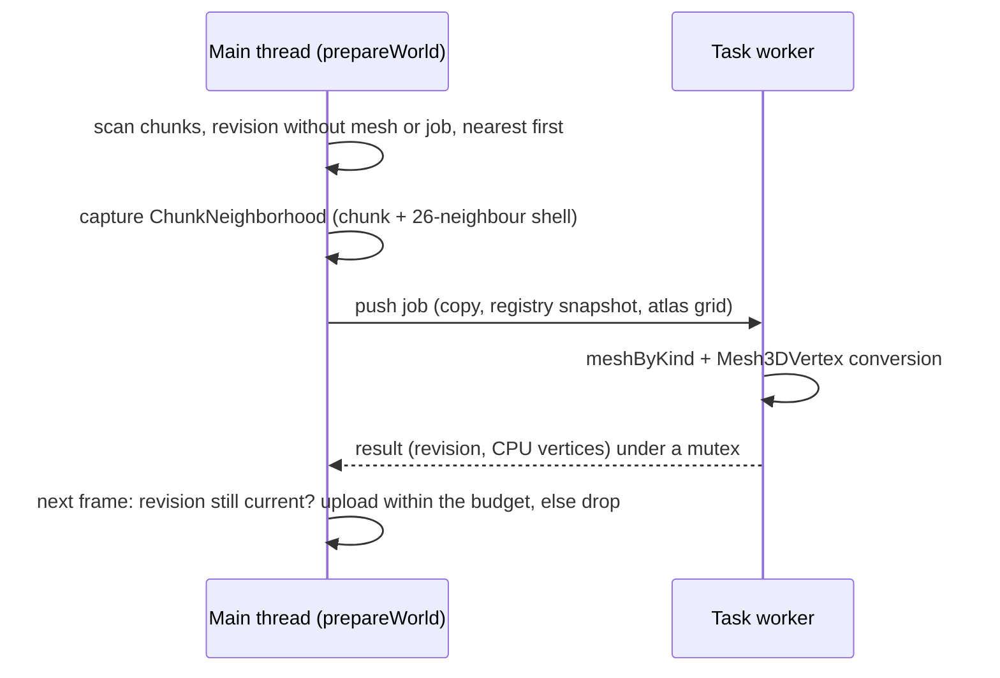

# Voxel Engine {#page-voxel}

[TOC]

The voxel engine (introduced in v0.2.1) is a block-based world subsystem in the `owl::data::voxel` module. This page
documents the **data model** — block types, chunks, and the world store. Meshing, the 3D voxel renderer, terrain
generation, block interaction, and the in-editor authoring tools are layered on top of this foundation in later
v0.2.1 work and are documented as they land.

## Overview

The data model is deliberately split into three concerns, none of which knows about the GPU:


```mermaid
flowchart LR
    Registry[BlockRegistry<br/>block types by id] -->|metadata lookup| World
    World[VoxelWorld<br/>sparse chunk map] -->|owns| Chunk[Chunk<br/>16³ block ids]
    Chunk -->|stores| Ids[BlockId values]
    Ids -.->|resolved through| Registry
```

| Type            | Responsibility                                                              |
|-----------------|-----------------------------------------------------------------------------|
| `BlockRegistry` | Ordered table of block types addressed by `BlockId`; resolves metadata.     |
| `Chunk`         | A fixed `16³` cube of `BlockId` values with dirty tracking.                 |
| `VoxelWorld`    | A sparse, unbounded map of chunks keyed by chunk coordinate.                |

A chunk stores only bare `BlockId` values; everything else (textures, opacity, collision) is looked up in the shared
`BlockRegistry`. This keeps chunk storage compact and lets the same world be re-skinned by swapping registries.

## Block Types and the Registry

A `BlockType` is pure authoring data: a name, a render kind, a collision flag, and one atlas tile index per face.

```c++
data::voxel::BlockRegistry registry;

data::voxel::BlockType stone;
stone.name = "stone";
stone.renderKind = data::voxel::BlockRenderKind::Opaque;
stone.solid = true;
stone.setAllFaces(3);// atlas tile index 3 on all six faces
const data::voxel::BlockId stoneId = registry.registerBlock(stone);

const bool opaque = registry.isOpaque(stoneId);// true
const auto maybe = registry.findByName("stone");// std::optional<BlockId>
```

The six faces follow a fixed order, used by per-face texture arrays and (later) by the mesher:

| `BlockFace` | Outward normal | Direction |
|-------------|----------------|-----------|
| `XNeg`      | -X             | west      |
| `XPos`      | +X             | east      |
| `YNeg`      | -Y             | down      |
| `YPos`      | +Y             | up        |
| `ZNeg`      | -Z             | north     |
| `ZPos`      | +Z             | south     |

The render kind drives face culling and (later) which mesh pass a block lands in:

| `BlockRenderKind` | Meaning                                                        |
|-------------------|----------------------------------------------------------------|
| `Air`             | Empty space (id `0`): never meshed, never culls a neighbour.   |
| `Opaque`          | Fully opaque: culls the shared face of an adjacent block.      |
| `Transparent`     | Alpha-blended (leaves, glass): does not cull opaque neighbours.|
| `Water`           | Translucent volume rendered with its own sorting rules.        |

Block id `0` is always the built-in air block (`data::voxel::g_AirBlock`); it is implicit and never written to disk.

### Serialization

`BlockRegistry::serializeToString` / `deserializeFromString` round-trip the table as YAML. Air is implicit:

```yaml
BlockRegistry: overworld
Version: 1
Blocks:
  - id: 1
    name: stone
    render: Opaque
    solid: true
    faces: [3, 3, 3, 3, 3, 3]
  - id: 2
    name: water
    render: Water
    solid: false
    faces: [9, 9, 9, 9, 9, 9]
```

## Chunks

A `Chunk` is a `16³` (`data::voxel::g_ChunkSize` cubed) grid of `BlockId` values laid out Y-major then Z then X, so
iterating X walks contiguous memory. Local coordinates are in `[0, 16)`; out-of-range reads return air and
out-of-range writes are ignored.

```c++
data::voxel::Chunk chunk{math::vec3i{0, 0, 0}};
chunk.setBlock(1, 2, 3, stoneId);// marks the chunk dirty
const data::voxel::BlockId id = chunk.getBlock(1, 2, 3);
const bool dirty = chunk.isDirty();// true until markClean()
```

Writes set a `dirty` flag only when the stored value actually changes, and invalidate the chunk **revision**
(`Chunk::getRevision`): a process-unique number stamped on demand from a global counter, so two different contents
never share one. A copy keeps the revision of its source (same content). The renderer keys its meshes by revision,
which is how an asynchronous mesh is recognised as stale. The chunk also counts its non-air blocks, so `isEmpty` is
constant time. `Chunk::encode` / `decode` run-length encode the block data to a compact string (`"<count>x<id>"`
runs) for storage.

## The World

`VoxelWorld` is a sparse hash map of chunks keyed by chunk coordinate. Reads of an absent chunk return air without
allocating; writes create the containing chunk on demand.

```c++
data::voxel::VoxelWorld world;
world.setBlock(math::vec3i{40, 12, -5}, stoneId);// creates chunk (2, 0, -1)
const data::voxel::BlockId id = world.getBlock(math::vec3i{40, 12, -5});
```

World block coordinates map to chunk coordinates with **floored** division so negative coordinates tile correctly:

| World coordinate | Chunk coordinate | Local coordinate |
|------------------|------------------|------------------|
| `16`             | `1`              | `0`              |
| `-1`             | `-1`             | `15`             |
| `-16`            | `-1`             | `0`              |
| `-17`            | `-2`             | `15`             |

Use `data::voxel::worldToChunk` / `data::voxel::worldToLocal` for the conversions, and `VoxelWorld::forEachChunk` /
`chunkCoordinates` to enumerate resident chunks.

## Chunk Meshing

`ChunkMesher` turns a `Chunk` into a `ChunkMesh` — an indexed list of `VoxelVertex` (position, normal, tile-space
UV, atlas texture index, per-vertex ambient occlusion) in chunk-local block space. It is **CPU-only**: uploading to a
GPU buffer and placing the chunk in the world (a model transform) are the renderer's job.

```c++
const data::voxel::ChunkMesh mesh = data::voxel::ChunkMesher::mesh(chunk, registry, neighborProvider);
// or, split into the two render passes the renderer draws:
const data::voxel::ChunkMeshSet set = data::voxel::ChunkMesher::meshByKind(chunk, registry, neighborProvider);
```

Three techniques keep the geometry small and shaded:

- **Hidden-face culling** — a face is emitted only when it is *visible*: the neighbour across it is non-opaque
  **and** a different block. Interior faces, shared faces between identical blocks, and faces hidden by an opaque
  neighbour are skipped. Faces on the chunk border are culled against the adjacent chunk through the
  `NeighborProvider` callback (the isolated overload treats everything outside the chunk as air).
- **Greedy meshing** — coplanar visible faces of the same block type merge into the largest possible rectangle, so
  a solid 16³ chunk collapses to **6 quads** (one per outer face) instead of thousands. Merged quads carry tiled
  UVs (`(0,0)`..`(w,h)`) so the per-face texture repeats across the rectangle.
- **Ambient occlusion** — each face corner is darkened by the opaque blocks touching it in the face's outer plane
  (the classic three-neighbour voxel-AO formula), baked into `VoxelVertex.ao` and multiplied into the lit colour by
  the `voxel` shader. The greedy merge is AO-aware (it only merges faces whose corner occlusion matches, so a merge
  breaks around an occluder) and the quad's split diagonal flips on asymmetric corners to avoid an interpolation
  seam.

The mesher reads one cell beyond its chunk on every side: the face neighbour for culling, the edge and corner cells
for ambient occlusion. `data::voxel::ChunkNeighborhood::capture(world, coord)` copies exactly that — the chunk with its
metadata plus the one-cell shell of its 26 neighbours (an `18³` grid) and the chunk revision — and
`ChunkMesher::meshByKind(neighborhood, registry, ao)` meshes the copy. The result is identical to meshing the live
world, but it reads nothing shared, so it runs on a worker thread while the world keeps changing.

`meshByKind` runs the same culling/merging/AO once per render pass: opaque blocks fill `ChunkMeshSet::opaque`,
transparent and water blocks fill `ChunkMeshSet::transparent`. Ambient occlusion is optional — the `VoxelWorld`
component exposes an **Ambient Occlusion** toggle (on by default); turning it off meshes every face flat-lit.


```mermaid
flowchart LR
    Chunk -->|per axis × direction| Mask[visibility mask slice]
    Mask -->|merge rectangles| Quads[greedy quads]
    Quads --> Mesh[ChunkMesh<br/>vertices + indices]
```

## Rendering and the Scene Component

A voxel world reaches the screen through two pieces:

- **`scene::component::VoxelWorld`** — the authored object placed on an entity: it holds the `BlockRegistry`, the
  `VoxelWorld` chunks, the per-block texture paths, and the directional-light settings, all serialized inline in the
  `.owl` scene (block list + run-length-encoded chunks). It is fully inspectable/editable in Owl Nest.
- **`RendererVoxel`** — a render-stack layer (factory key `"RendererVoxel"`) built on [Renderer3D](renderer.md). It
  greedy-meshes each chunk into an opaque and a transparent mesh on the task workers (see *Asynchronous Meshing*
  below), caches both per entity (rebuilt when the chunk revision changes), resolves the per-block textures (Nearest
  filtering), and draws them with the frac-tiled `voxel` shader so
  greedy-merged faces tile rather than stretch. It draws the **opaque pass first** (depth writes on), then the
  **transparent pass** (water / glass) sorted **back-to-front** by chunk distance to the camera with depth writes
  disabled, so the blend composites correctly. The entity must carry a `RendererTag` routing it to the voxel layer;
  `Scene::render` only draws voxel worlds when the active layer is voxel-capable (mirroring the raycast path).
  Finished meshes are uploaded by `Scene::renderWithStack` before the first layer draws, so the editor viewport and
  the exported game (`OwlRunner`) share the same path; `RendererVoxel::getStatistics(cache)` reports the cached and
  drawn mesh counts and the meshing counters of a `VoxelMeshCache` (one per engine context, see
  [Architecture](architecture.md#engine-context)).

The sample project ships a `voxel_terrain.owl` scene — an endless seeded procedural landscape (see *Procedural
Terrain* below), textured from the dedicated `voxel_blocks` tileset (16 block faces: grass, dirt, stone, sand, wood,
leaves, … with room for future block types) — under a perspective camera, reachable from a **Voxel House** on the
world map. Voxels render in both **Play** and the **editor viewport** (the world streams around the editor camera too).

Two camera components drive a voxel world in Play. A `scene::component::FlyCamera` is a free-fly camera (no
collision): **WASD** moves in the facing plane, **Space / E** rises, **Left-Shift / Q** descends, **arrow keys** look
— handy for inspecting a world. A `scene::component::VoxelPlayer` is a grounded first-person character: **WASD** walks
on the horizontal plane, **arrow keys** look, **Left-Shift** runs and **Space** jumps, with gravity and
**AABB-vs-voxel collision** against every `VoxelWorld` (it does not edit the world). The collision is a pure,
headless-tested `data::voxel::moveAabb` (per-axis resolution + sub-stepping for wall-sliding and no tunnelling); the
player holds still until the chunk it stands in has streamed in. Both components serialize and are fully editable in
the inspector; the same `Camera3DController` is designed to back the editor viewport once the 3D editor camera
overhaul lands.

The player also supports **mouse-look** and **flying**. Left-click the viewport (in the editor) or the window (in the
runner) to capture the cursor and steer the view with the mouse — this calls `window::Window::setCursorMode` with
`CursorMode::Disabled` to grab and hide the OS cursor (the GLFW backend also enables raw motion when available). Press
**Escape** to release the cursor back to `CursorMode::Normal`; the editor additionally releases it when the viewport
loses focus or when leaving Play. Per-player `mouseSensitivity` scales the rotation.

**Double-tap Space** toggles **fly mode**: WASD then translate horizontally without changing altitude, **Space** rises
and **Left-Shift** descends, and motion is still resolved against voxel collisions. While flying, **J** toggles a
**super-speed** multiplier. A transient on-screen toast (about three seconds) confirms each toggle ("Fly mode ON/OFF",
"Super speed ON/OFF").

Mouse-look capture is **opt-in**: the `VoxelPlayer` has a **Capture Cursor** flag (off by default) — only a player
that enables it lets clicking the viewport hide / lock the cursor (the editor and runner check
`Scene::wantsCursorCapture()`), so non-voxel scenes keep a normal cursor. With capture off, block break / place is
disabled too (it is gated on the captured cursor).

The player can also **edit the world** (when cursor capture is enabled). A centre-screen **crosshair** marks the aim point; a ray
(`data::voxel::raycastVoxel`, Amanatides & Woo grid traversal) is cast from the eye through it (along the look
direction) up to `reach` blocks. The targeted block is outlined with a wireframe **highlight** that draws only the
edges of its camera-facing faces (the hidden back edges stay invisible). **Left-click breaks** it (replaced with
air), **right-click places** the player's `placeBlock` in the empty cell against the face the ray hit — unless that
cell would intersect the player's body. Edits only fire while the cursor
is captured (so the click that captures the cursor never doubles as an edit). Because an edit near a chunk border also
affects the neighbour chunks' visible faces and ambient occlusion, the edit calls `VoxelWorld::markNeighborChunksDirty`,
which re-meshes the face, edge and corner neighbours it touches (this is kept off `VoxelWorld::setBlock` so bulk
terrain streaming does not pay for it). `reach` and
`placeBlock` are authored on the `VoxelPlayer` component.

### Asynchronous Meshing

Meshing a surface chunk costs about 350 µs, so a streaming frame that meshed every new chunk on the main thread
spiked to 9-14 ms. The main thread now only captures, uploads and draws, and stays under 0.6 ms per frame while
terrain streams in (`bench/` group `voxel/streaming`, numbers in `doc/audit/20-mesures.md` §3.10):


```mermaid
sequenceDiagram
    participant Main as Main thread (prepareWorld)
    participant Worker as Task worker
    Main->>Main: scan chunks, revision without mesh or job, nearest first
    Main->>Main: capture ChunkNeighborhood (chunk + 26-neighbour shell)
    Main->>Worker: push job (copy, registry snapshot, atlas grid)
    Worker->>Worker: meshByKind + Mesh3DVertex conversion
    Worker-->>Main: result (revision, CPU vertices) under a mutex
    Main->>Main: next frame: revision still current? upload within the budget, else drop
```

- **Revision check.** A job carries the revision it captured. When it comes back, the result is uploaded only if the
  chunk still exists and still has that revision; otherwise it is dropped (`discardedMeshCount`) and a new job is
  queued for the current content. The previous mesh stays drawn until its replacement is uploaded, so an edit never
  makes a chunk flicker.
- **Neighbours.** An edit marks the chunks across the border dirty (`VoxelWorld::markNeighborChunksDirty`: face,
  edge and corner neighbours, up to seven chunks for a corner block), from every edit path: the player's break /
  place, the editor brush and structure stamp (`VoxelEditCommand`, undo and redo included) and
  `VoxelStructure::stampInto`. A streamed chunk is installed with `VoxelWorld::insertChunk`, which dirties its 26
  neighbours unless both the new and the replaced content are all air, so their border faces and ambient occlusion
  are rebuilt against it. A chunk whose neighbour is still being generated waits for it rather than being meshed
  twice.
- **Budget.** Uploads run in `RendererVoxel::prepareWorld`, outside any render pass, within the window opened by
  `RendererVoxel::beginPrepare(cache)` once per frame. An all-air chunk drops its mesh without a job.

`RendererVoxel::setMeshingConfig` tunes it (`VoxelMeshingConfig`):

| Field                | Default | Meaning                                                                             |
|----------------------|---------|-------------------------------------------------------------------------------------|
| `async`              | `true`  | Mesh on the workers; `false` (or no `Application`) meshes and uploads in the frame. |
| `maxUploadsPerFrame` | `32`    | Chunk meshes uploaded per frame at most (at least one always goes through).         |
| `uploadBudgetMs`     | `2`     | Upload time per frame, checked between two uploads.                                 |
| `maxJobsInFlight`    | `32`    | Meshing jobs queued or running at once (bounds the copies, keeps priorities fresh). |

Generation follows the same rules: a generated chunk is installed only if it is still pending (not streamed out nor
cleared by *Regenerate*) and was generated with the current `TerrainParams`; a Play scene forgets the generation its
editor scene had in flight.

### Per-block metadata

Each cell stores, alongside its `BlockId`, a 16-bit metadata word (`data::voxel::BlockMeta`): a `BlockOrientation` plus
a free gameplay/editor `state` byte. The chunk keeps a metadata array parallel to its block array, so the storage is a
`(BlockId, PackedMeta)` pair per cell. Orientation never changes a block's geometry, collision, or opacity — it only
remaps which per-face texture appears on each world face (`orientedFace`), so a single block type can read as a pillar
laid along any axis (`AxisX` / `AxisZ`) or a horizontally-facing block (`YawCw90` / `Yaw180` / `YawCcw90`). The greedy
mesher includes orientation in its merge key, so adjacent blocks textured differently never merge into one quad. The
run-length encoding writes `<count>x<id>` for default metadata and `<count>x<id>:<meta>` otherwise, so legacy id-only
data still loads and all-default chunks serialize byte-for-byte as before.

## Procedural Terrain

A `VoxelWorld` can generate its blocks instead of storing them: tick **Procedural Terrain** in the inspector (or set
`ProceduralTerrain: true` in the scene) and the world is filled from a seed. `data::voxel::TerrainGenerator` builds a
2D fractal-Perlin (`math::PerlinNoise`) height field — stone with a dirt sub-layer and a grass surface, sand along the
shoreline, optional water up to a sea level — and carves caves from a 3D Perlin field; the same seed always yields the
same world. An optional low-frequency **biome** field varies the surface block (desert sand, grassy plains, snowy,
rocky mountain tops). `Scene::updateVoxelStreaming` loads chunks in and unloads them out around the camera within the
configurable radius/height; generation runs **asynchronously on the task `Scheduler`** (workers fill chunks, the main
thread installs the finished ones with `VoxelWorld::insertChunk`, see *Asynchronous Meshing*), and `RendererVoxel`
drops the meshes of unloaded chunks. All parameters (seed,
frequency, octaves, amplitude, sea level, cave threshold, biomes, block ids, …) are editable in the inspector with a
**Regenerate** button. The `scenes/voxel_terrain.owl` demo is an endless seeded landscape you explore as a grounded
`VoxelPlayer` (walk / run / jump with collision), reachable from the world-map voxel house.

## Editing in Owl Nest

Voxel worlds are authored directly in the editor, not just at runtime:

- **Voxel Palette** panel — pick a paint block from the active world's registry (each shown with its top-face atlas
  thumbnail), the eraser, or a saved structure. An **Orientation** dropdown and a **State** slider set the metadata
  applied to painted blocks.
  Tick **Brush active** to engage the tool: while in Edit mode the editor camera raycasts the block under the cursor
  (the impacted face is wireframe-highlighted), **left-click places** the paint block (with the chosen orientation /
  state) against that face and **right-click erases** the targeted block. Every edit is undoable —
  `commands::VoxelEditCommand` records a per-block `{before, after}` id + metadata delta and coalesces a continuous
  stroke into a single history entry, dirtying neighbour chunks at borders so the mesh rebuilds correctly.
- **Structures** — `data::voxel::VoxelStructure` is a finite block grid saved as a `.owlvoxstruct` file (YAML: a
  `Size` triple plus run-length-encoded `Blocks`). "Save" in the palette captures the current world's non-air
  bounding box; selecting a saved structure makes a left-click **stamp** it (its min corner at the targeted empty
  cell), also undoable. Stamping is additive — air cells in the structure never erase the world.
The editor sets the targeted-block highlight through `Scene::setEditorVoxelHighlight`; in Play the same highlight is
driven by the `VoxelPlayer` instead.

A procedural `VoxelWorld` streams further while editing than at runtime: `editorStreamRadius` / `editorStreamHeight`
(separate horizontal / vertical, larger defaults) are used by `Scene::updateVoxelStreaming` in Edit mode, while
`streamRadius` / `streamHeight` apply in Play. Navigate with the DCC-style editor camera (Alt / Ctrl + mouse, wheel
to zoom); a corner XYZ gizmo shows the current orientation.

## What's Next

A Lua block API, and the GPU indirect-draw adoption of the frustum-culling pre-pass (currently culled per chunk on the
CPU) — slated for the v0.3.0 3D pipeline.
